# Compute部分设计文档

## 业务流程梳理

### 端到端流程

主要分为性能数据采集和性能数据可视化。
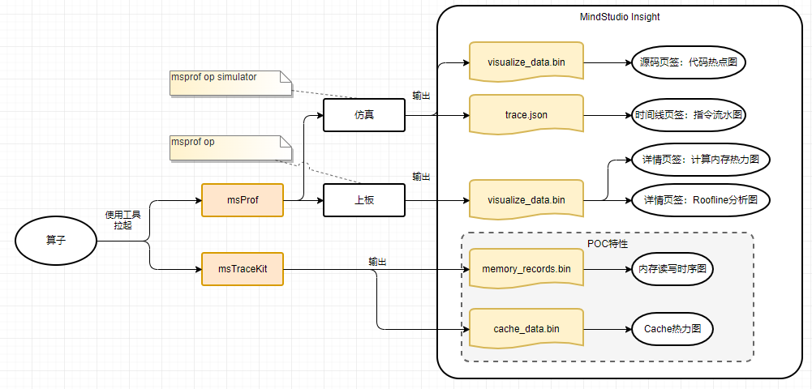

### 后端业务代码流程

#### 文件解析流程
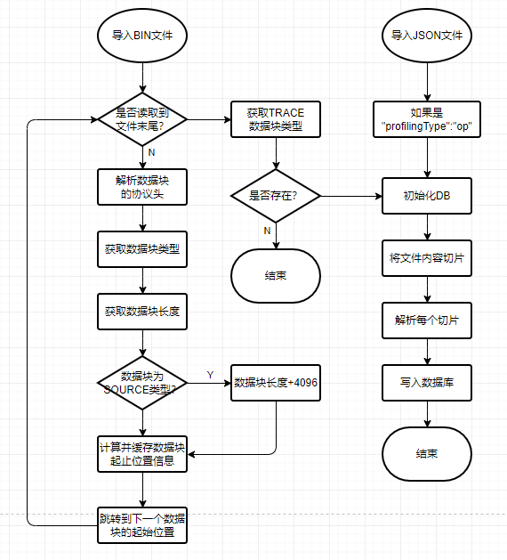

#### 数据请求流程
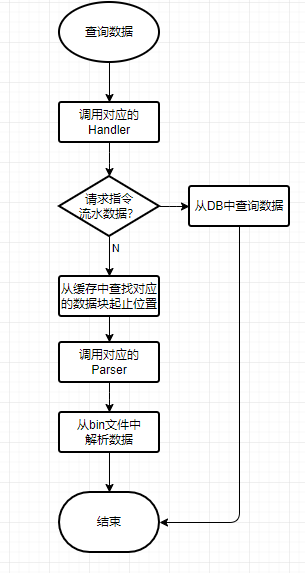

#### 代码逻辑顺序图
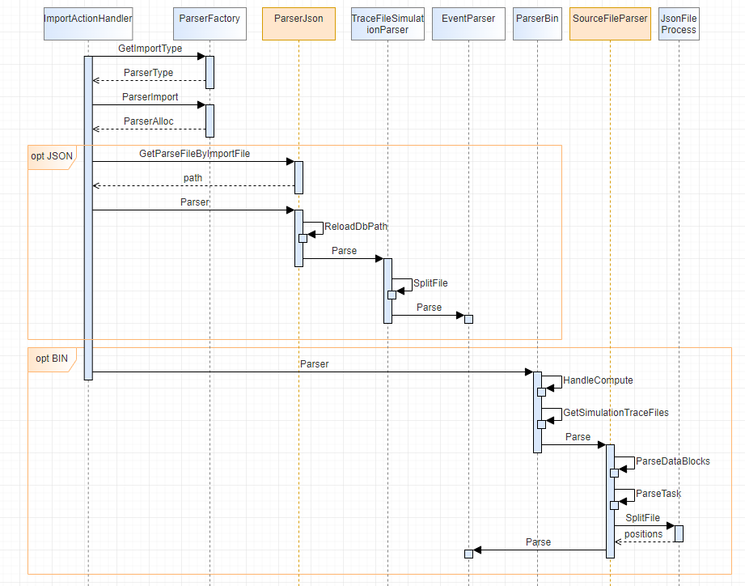
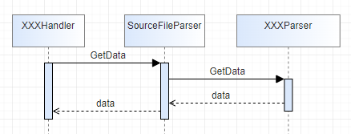

## 功能涉及与实现

### 数据文件格式

#### Json 文件

文件格式：*.json 
判断逻辑：json文件中在第一个数组开始前，包含“profilingType”和“op“
内容格式：traceEvent， 等同timeline的json文件
内容示例：
```JSON
{
    "displayTimeUnit": "ns",
    "profilingType": "op",
    "schemaVersion": 1,
    "traceEvents": [
        {
            "args": {
                "code": "/home/liuyekang/projects/samples/operator/ascendc/0_introduction/3_add_kernellaunch/AddKernelInvocationNeo/build/auto_gen/ascendc_kernels_sim/auto_gen_add_custom.cpp:22",
                "detail": "XD:X29=0x7fa0,IMM:0x7fa0,",
                "pc_addr": "0x10d0d000"
            },
            "cname": "startup",
            "dur": 0.0010000000474974513,
            "name": "MOV_XD_IMM",
            "ph": "X",
            "pid": "core2.veccore1",
            "tid": "SCALAR",
            "ts": 3.568000078201294
        },
    ]
}
```
#### Bin文件

文件格式：*.bin
判断逻辑：导入单文件&& *.bin 结尾
内容格式：
算子bin文件采用二进制格式，每个数据单元形如：
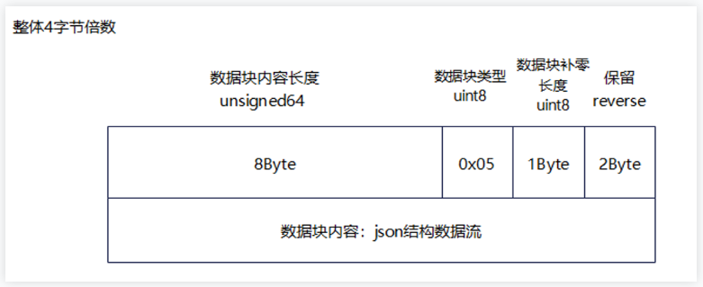
 
visualize_data.bin中各个数据块数据类型分配原则：
**后续按照每个组件一次性分配16个位置，防止不同组件开发冲突。**
 
| 数据块编码	|数据块内容	|
|---|---|
|0x00	|数据块无效|	 
|0x01	|代码文件	| 
|0x02	|流水图tracing.json。	 |
|0x03	|热点图映射文件api.json的files部分。|	 
|0x04	|热点图映射文件api.json的instructions部分。|	 
|0x05	|基本信息	 |
|0x06	|计算负载图	 |
|0x07	|计算负载表格。|	 
|0x08	|访存热力图。	| 
|0x09	|访存表格。	 |
|0x0A	|内存读写时序图(TraceKit)。	 |
|0x0B	|L2Cache图(TraceKit)。	 |
|0x0C	|核间负载。	 |
|0x0D	|roofline模型。	 |
 
json部分数据内容示例：
0x01 代码文件:
功能页面：
 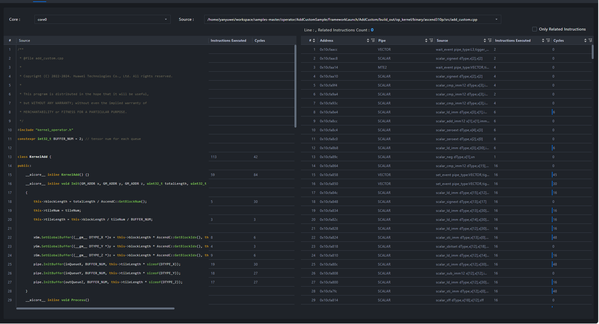

代码文件包含部分二进制内容，其结构如下
 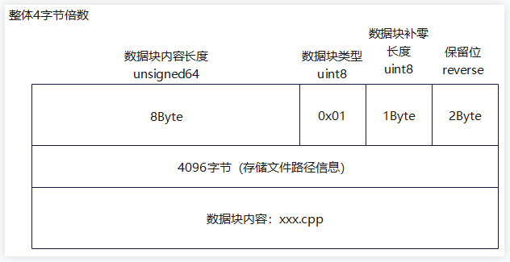

4096字节的附加数据块（存储文件路径信息）：
```JSON
/home/matmul_leakyrelu_custom.cpp
```
数据块内容说明（即cpp源码内容）：
```C++
# include "kernel_operator.h"\n# include "lib/matmul_intf.h"\n\nusing namespace ...
```
 
0x03 源码行信息
功能页面：
 

二进制结构说明：
 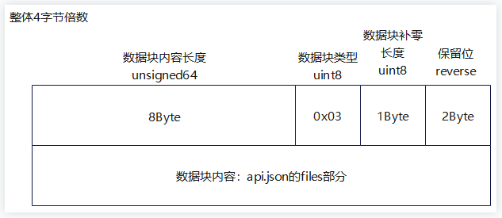

数据块内容：
```JSON
{
  "Cores": [ // 执行算子的计算核，如"core0.cubecore0"，"core0.veccore0"
    string
  ],
  "Files Dtype": { // 指定列名和数据类型
// Files Dtype->Lines对象中的键值对，用于指定后面Files->Lines数组中每个对象中键值对的键名和值的类型
// skip 0（代表不需要再界面上呈现，即界面上不会显示这一列）, int 1, float 2 , string 3
// 没有采集的数据字段，不用在这里声明
// 当前支持动态解析的键值对，值必须是单个或一维数组。如Address Range这种二维数组，不支持动态解析，需要单独约定。
        "Lines": {
            "Address Range": 0,
            "Cycles": 1,
            "Instructions Executed": 1,
            "Line": 1,
            "L2Cache Hit Rate": 3
    }
  },
  "Files": [ // 源代码文件中的代码行信息
    {
      "Lines": [ // 代码行关联的指令地址范围、消耗的时钟周期、执行指令总数
        {
          "Address Range": [ // 当前代码行关联的指令地址范围
            [
              string
            ]
          ],
          "Cycles": [ // 当前代码行在各个计算核上消耗的总时钟周期（对应顺序是？）
            int
          ],
          "Instructions Executed": [ // 当前代码行在各个计算核上执行的指令总数（对应顺序是？）
            int
          ],
          "Line": 100 // 代码行号
        }
      "Source": string // 源代码文件路径
    }
  ]
}
```

 0x04 指令信息
功能页面：
 

二进制结构：
 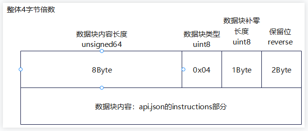

数据块内容：
```JSON
{
  "Cores": [ // 执行算子的计算核，如"core0.cubecore0"，"core0.veccore0"
    string
  ],
"Instructions Dtype": { // 指定列名和数据类型
// Instructions Dtype->Instructions对象中的键值对，用于指定后面Instructions数组中每个对象中键值对的键名和值的类型
// skip 0（代表不需要再界面上呈现，即界面上不会显示这一列）, int 1, float 2 , string 3
// 没有采集的数据字段，不用在这里声明
// 当前支持动态解析的键值对，值必须是单个或一维数组。如果是二维数组等，不支持动态解析，需要单独约定。
    "Instructions": {
        "Address": 3,
        "AscendC Inner Code": 3,
        "Cycles": 1,
        "Instructions Executed": 1,
        "Pipe": 3,
        "TheoreticalStallCycles": 1,
        "Source": 3,
        "RealStallCycles": 1，
        "L2Cache Hit Rate": 3
     }
},
  "Instructions": [
    {
      "Address": string, 			// 指令的偏移地址,如"0x1269f000"
      "AscendC Inner Code": string, // 源代码文件路径和代码行号,如"/home/xxx.cpp:23"
      "Cycles": [ 					// 指令在各个计算核上消耗的时钟周期
        int
      ],
      "Instructions Executed": [ 	// 指令在各个计算核上执行的次数
        int
      ],
      "Pipe": string, 				// 指令所属的指令队列,如"SCALAR"
      "TheoreticalStallCycles": [                    // 预期阻塞时间
        int
       ],
      "Source": string, 				// 指令内容, 如"MOV_XD_IMM XD:X29,IMM"
      "RealStallCycles": [                    // 实际阻塞时间
        int
       ]
    }
  ]
}
```

0x02 Timeline信息
功能页面：
 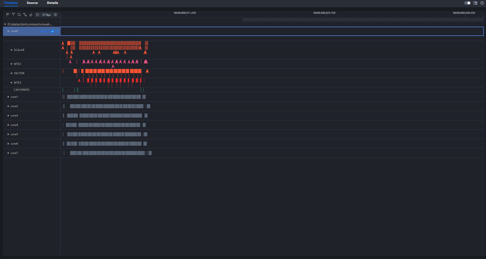

二进制结构：
 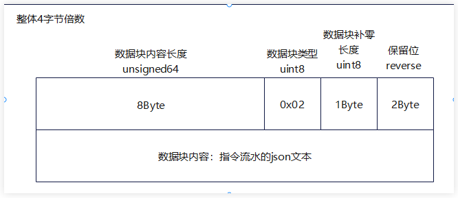

数据块内容：
```JSON
{"profilingType": "op",
    "displayTimeUnit": "ns",
    "schemaVersion": 1,
    "traceEvents": [
		{    
			"args": {
                "code": "/home/yanyuwei/workspace/samples-master/operator/AddCustomSample/FrameworkLaunch/AddCustom/build_out/op_kernel/binary/ascend310p/kernel_meta_AddCustom_1e04ee05ab491cc5ae9c3d5c9ee8950b/kernel_meta/AddCustom_1e04ee05ab491cc5ae9c3d5c9ee8950b_413903_kernel.cpp:23",
                "detail": "x[1]=0x0,imme16:0x4000",
                "pc_addr": "0x10cfa004"
            },
            "cname": "process_block0",
            "dur": 20,
            "name": "block0",
            "ph": "X",
            "pid": "process_name",
            "tid": "process_block0",
            "ts": 1
        },
        {    
			"args": {
                "code": "/home/yanyuwei/workspace/samples-master/operator/AddCustomSample/FrameworkLaunch/AddCustom/build_out/op_kernel/binary/ascend310p/kernel_meta_AddCustom_1e04ee05ab491cc5ae9c3d5c9ee8950b/kernel_meta/AddCustom_1e04ee05ab491cc5ae9c3d5c9ee8950b_413903_kernel.cpp:23",
                "detail": "x[1]=0x0,imme16:0x4000",
                "pc_addr": "0x10cfa004"
            },
            "cname": "prepare",
            "dur": 5,
            "name": "hccl::prepare",
            "ph": "X",
            "pid": "process_name",
            "tid": "process_block0",
            "ts": 2
        },
		{    
			"args": {
                "code": "/home/yanyuwei/workspace/samples-master/operator/AddCustomSample/FrameworkLaunch/AddCustom/build_out/op_kernel/binary/ascend310p/kernel_meta_AddCustom_1e04ee05ab491cc5ae9c3d5c9ee8950b/kernel_meta/AddCustom_1e04ee05ab491cc5ae9c3d5c9ee8950b_413903_kernel.cpp:23",
                "detail": "x[1]=0x0,imme16:0x4000",
                "pc_addr": "0x10cfa004"
            },
            "cname": "prepare",
            "dur": 5,
            "name": "hccl::wait",
            "ph": "X",
            "pid": "process_name",
            "tid": "process_block0",
            "ts": 10
        }
    ]
}
```
注：数据来源为tracing.json，满足Trace Event Format格式要求
 
0x05 算子基本信息

功能页面：
 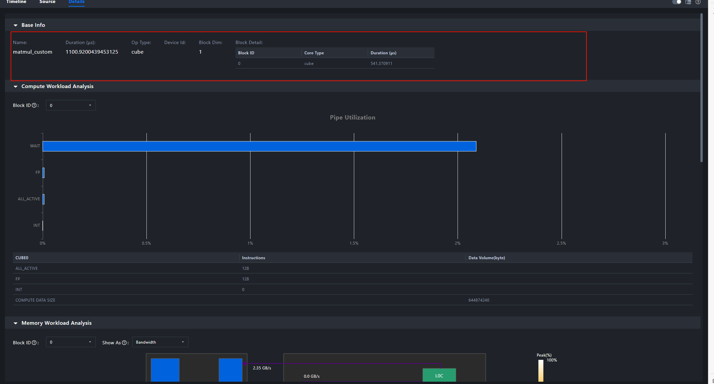

二进制结构：
 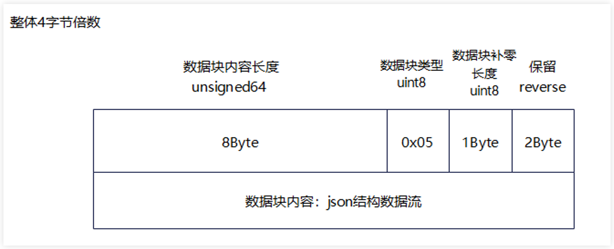

数据块内容：
```JSON
{
    "name": str,            // 算子名称
    "soc": str,             // 算子运行平台
    "op_type": enum,        // 算子类型：aic, aiv, mix
    "block_dim": uint16,    // block dim数据
    "mix_block_dim": uint16,// mix算子下从核的数量
    "duration": float32,    // 算子总耗时
    "device_id": unit16,    // 设备号
    "pid": str,                    // 进程号
    "block_detail": [       // 当op_type == aic/aiv时，有效
        {
            "block_id": uint16,     // sub block序号
            "core_type": enum,      //sub block类型：aic、aiv
            "duration": float32,    // sub block耗时
        }
    ],
    "mix_block_detail": [ // 当op_type == mix时，有效
        {
            "block_id": uint16,  // block 序号                 
            "duration": [float32, float32, float32], //sub block耗时，依次表示: aic, aiv0, aiv1
        }
    ],
    "advice": [ // 建议，目前为空，预留
        string, string, ...
    ]
}
```
注意，block_detail和mix_block_detail字段只会有一个有效。block_detail和mix_block_detail均为列表，包含0~N个dict/map
 
0x06 计算负载图

功能页面：
 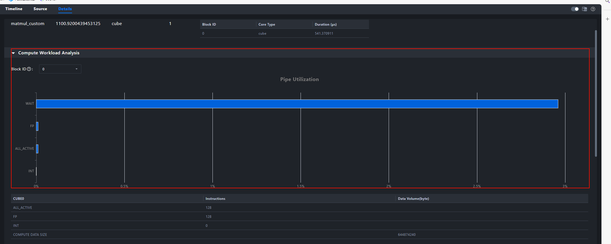

二进制结构：
 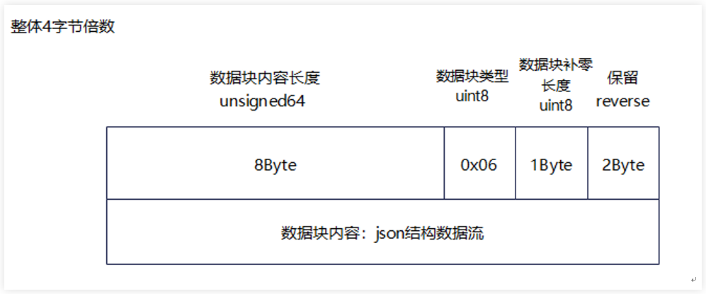

数据块内容：
```JSON
{
    "subblock_detail": [
        {
            "block_id": uint8,      // block ID，即主核序号
            "block_type": enum,     // sub block类型：aic, aiv, aiv0, aiv1
            "name": string,     // 计算负载数据名
            "unit": enum,       // 数据单位：%
            "value": float32,    // 数值
            "origin_value": float32    // 数值
        }
    ],
    "advice": [ // 建议，目前为空，预留
        string, string, ...
    ]
}
```

0x07 计算负载表：

功能页面：
 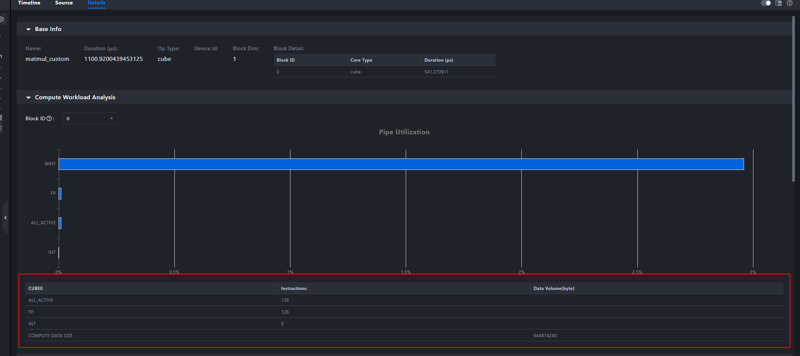

二进制结构：
 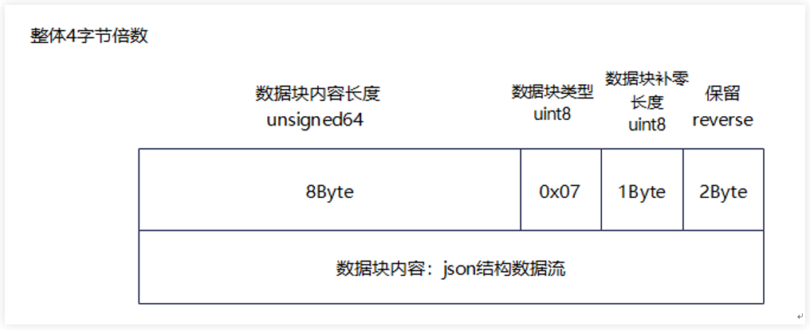

数据块内容：

```JSON
{
    "subblock_detail": [
        {
            "block_id": uint8,      // block ID，即主核序号
            "block_type": enum,     // sub block类型：aic, aiv, aiv0, aiv1
            "name": string,     // 计算负载数据名
            "unit": enum,       // 数据单位：us, instructions, 数据量(Byte)
            "value": float32,   // 数值
            "origin_value": float32   // 数值 
        }
    ],
    "advice": [ // 建议，目前为空，预留
        string, string, ...
    ]
}
```
 
0x08 访存热力图

功能页面：
 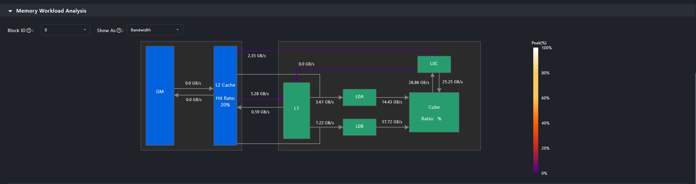

二进制结构：
 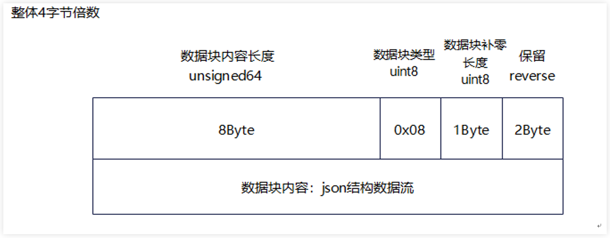

数据块内容：
```JSON
{
    "core_memory_map": [
        {
            "core_no": uint16,      // block序号
            "op_type": enum,        // 算子类型：cube, vector, mix
            "soc": str,             // 算子运行平台
            "memory_unit": [        // 通路列表
                {
                    "memory_path": enum,        // 搬运通路名
                    "request": uint64,          // 请求数量
                    "request_per_byte": uint8,  // 每次请求数据量
                    "bandwidth": float32,       // 带宽
                    "peak_ratio": float32,         // 峰值带占比：-1代表数据无效
                    "display": bool,            // 是否展示此通路
                }
            ],
            "L2cache": [
                "hit": uint64,              // 命中cache次数
                "miss": uint64,             // 未命中cache次数
                "total_request": uint64,    // cache请求总次数
                "hit_ratio": int8,          // 命中率：-1代表数据无效
            ], 
            "Cube": {
                "ratio": float32,
                "cycle": uint64,
                "total_cycles": uint64,
            },
            "Vector": {
                "ratio": float32,
                "cycle": uint64,
                "total_cycles": uint64,
            },
            "Vector1": {
                "ratio": float32,
                "cycle": uint64,
                "total_cycles": uint64,
            }
            "advice": [ // 建议
                string, string, ...
            ]
        }
    ]
}
```

0x09 访存热力表

功能页面：
 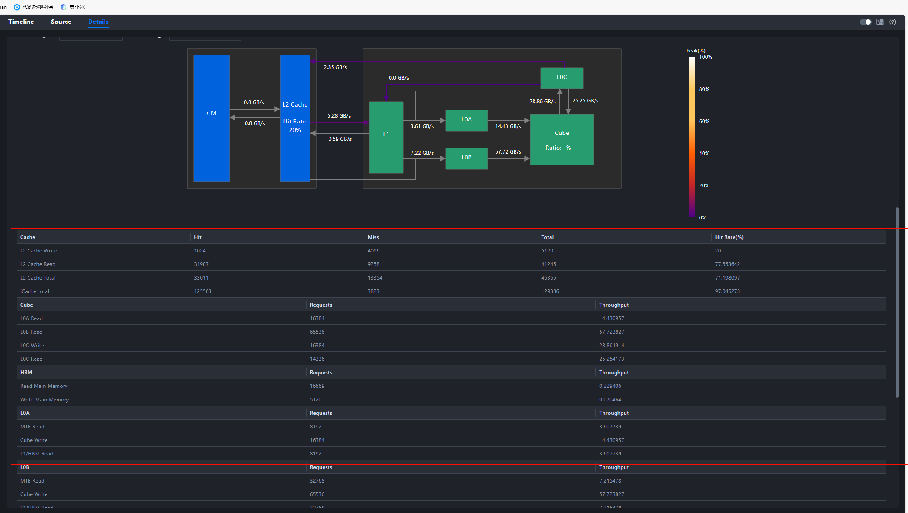
 
二进制结构：
 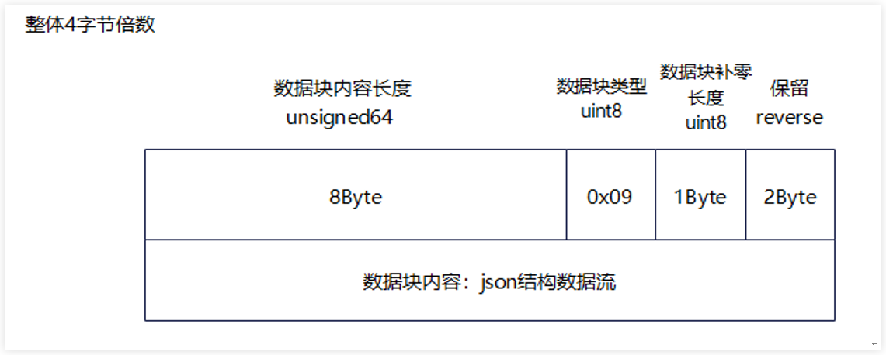

数据块内容：
```JSON
{
    "table_per_block": [
        {
            "block_id": uint,       // block id
            "table_op_type": enum,  // 表格数据类型：aic, aiv, mix
            "table_detail": [
                {
                    "table_name": string,   // 表格名
                    "size": [uint8, uint8], // 表格大小：[行数, 列数]
                    "header_name": [        // 列名(与列数一致)
                        string, string, ...
                    ],
                    "row": [                // 行数据(与行数一致)
                        "name": string,     // 行名
                        "value": [          // 行数据：长度为列数-1
                            float16, float16, ....
                        ]
                    ],
                }
            ],
            "advice": [ // 建议
                string, string, ...
             ]
        },
    ]

    "advice": [ // 建议，目前为空，预留
        string, string, ...
    ]
}
```

0x0A 内存读写时序图 （POC）

功能页面：
 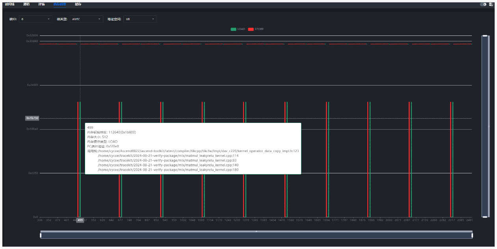

二进制结构：
 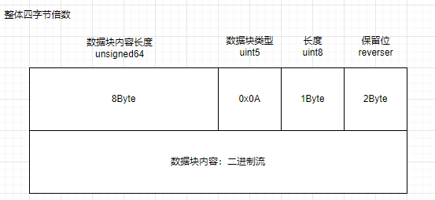

数据块内容结构：
整体二进制交付，如下图所示
 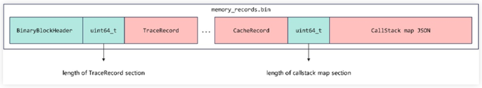

文件协议头：
```C++
struct BinaryBlockHeader {
    uint64_t contentSize = 0;
    uint8_t type = 0;
    uint8_t padding = 0;
    uint16_t reverse = 0x5a5a;
};
```

支持基于msTraceKit工具输出的内存读写序信息，构建内存读写时序图。
内存读写结构体设计：
```C++
struct TraceRecord {
    uint8_t type;
    int8_t coreId;
    int8_t space;
    uint8_t blockType;
    uint32_t recordId;
    uint64_t addr;
    uint64_t memSize;
    uint64_t pc;
};
```

TraceRecord结构体字段含义说明：
| 参数 | 说明 |
|---|---|
|type	| 内存事件 类型MALLOC=0 FREE=1 MEMCPY_BLOCKS=2 LOAD=3 STORE=4 |
|coreId	| 此内存事件发生的核 ID |
|space	| 此内存事件操作内存的地址空间类型 PRIVATE=0 GM=1 L1=2 L0A=3 L0B=4 L0C=5 UB=6 |
|blockType	| 此内存事件发生的 block 类型 AIV=0 AIC=1|
|recordId	| 此内存事件的编号 |
|addr	| 此内存事件操作的内存地址 |
|memSize	| 此内存事件操作的内存长度 |
|pc	| 此内存事件发生的代码位置对应PC地址 |

调用栈信息映射表（CallStack map）设计为JSON对象的形式，字段类型和含义说明如下：

| 字段 | 类型 | 说明 |
|---|---|---|
|<root>	|Object	内存读写记录信息JSON对象
|+<PcAddr>	|Object	|为方便查询，以PC地址作为key，对应的调用栈信息用Object表示|
|++Address	|String	|调用栈对应的PC地址|
|++ModuleName	|String	|调用栈对应的编译单元名称|
|++Symbol	|Array	|调用栈涉及的符号关系调用数组|
|+++<Symbol>	|Object	|每个符号信息用一个Object表示|
|++++Column	|Int	|调用栈符号在代码中的列号|
|++++Line	|Int	|调用栈符号在代码中的行号|
|++++FileName	|String	|调用栈符号所在的代码文件名|
|++++FunctionName	|String	|调用栈符号所在的函数名|

调用栈信息映射表示例如下：
```JSON
[
{
    "Address": "0x4004be",
    "ModuleName": "inlined.elf",
    "Symbol": [
      {
        "Column": 18,
        "Discriminator": 0,
        "FileName": "/tmp/test.cpp",
        "FunctionName": "baz()",
        "Line": 11,
        "StartAddress": "0x4004be",
        "StartFileName": "/tmp/test.cpp",
        "StartLine": 9
      },
      {
        "Column": 0,
        "Discriminator": 0,
        "FileName": "/tmp/test.cpp",
        "FunctionName": "main",
        "Line": 15,
        "StartAddress": "0x4004be",
        "StartFileName": "/tmp/test.cpp",
        "StartLine": 14
      }
    ] 
  }
]
```

0x0B L2Cache图 (POC)

功能页面：
 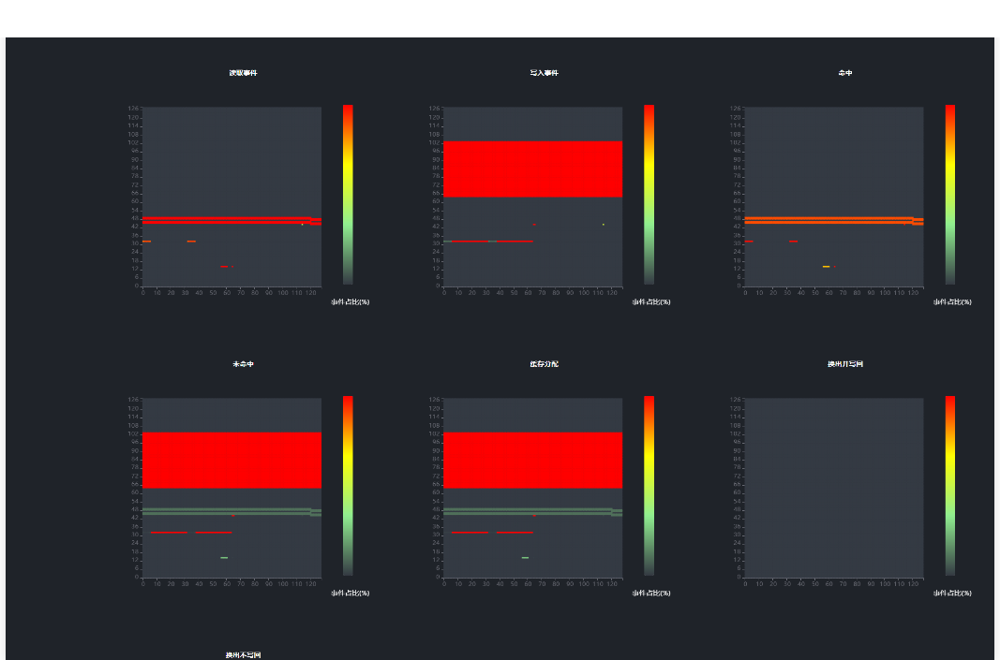

二进制结构：
 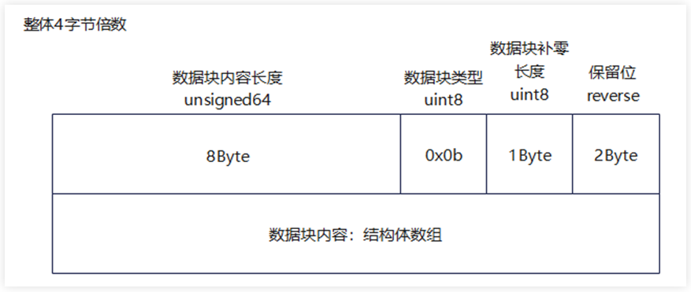
 
数据块内容：
Cache信息记录结构体设计：
```C++
struct CacheRecord {
    uint32_t loadCount{0};
    uint32_t storeCount{0};
    uint32_t cacheLineId{0};
    uint32_t hit{0};
    uint32_t miss{0};
    uint32_t allocate{0};
    uint32_t evictAndWrite{0};
    uint32_t evictWithoutWrite{0};
};
```

字段说明：

| 参数 | 说明 |
| --- | --- |
|loadCount	|当前cache set上发生的读取事件总次数|
|storeCount	|当前cache set上发生的写入事件总次数|
|hit	|当前cache set被命中的总次数|
|miss	|当前cache set未命中的总次数|
|allocate	|当前cache set因未命中导致的分配总次数|
|evictAndWrite	|当前cache set换出cacheline并写回L2的总次数|
|evictWithoutWrite	|当前cache set换出cacheline并不写回的总次数|
 
命中率计算公式：各维度次数 / (loadCount + storeCount)

0x0C 核间负载

功能页面：
 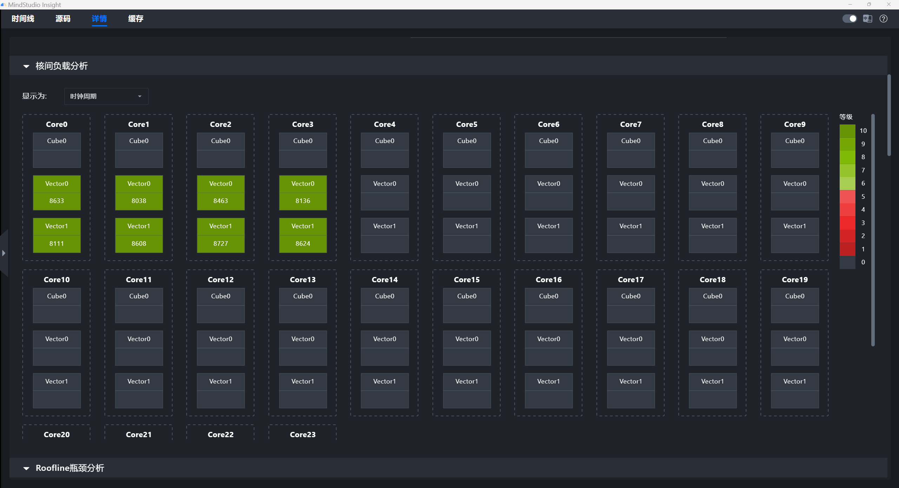

二进制结构：
 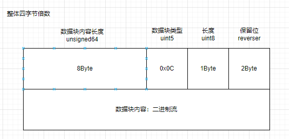

数据块内容：
```JSON
{
    "advice": "t1) core0 vector0 took more time than other vector cores.n",
    "op_detail": [
        {
            "core_detail": [
                {
                    "L2cache_hit_rate": "80.157990",
                    "cycles": "265838",
                    "subcore_id": "0",
                    "subcore_type": "vector",
                    "throughput": "2635776"
                },
                {
                    "L2cache_hit_rate": "80.165741",
                    "cycles": "139164",
                    "subcore_id": "1",
                    "subcore_type": "vector",
                    "throughput": "2635776"
                },
                {
                    "L2cache_hit_rate": "94.524757",
                    "cycles": "267206",
                    "subcore_id": "0",
                    "subcore_type": "cube",
                    "throughput": "6825472"
                }
            ],
            "core_id": 0
        }
    ],
    "op_type": "mix",
    "soc": "Ascend910B4"
}
```

0x0D roofline

功能页面：
 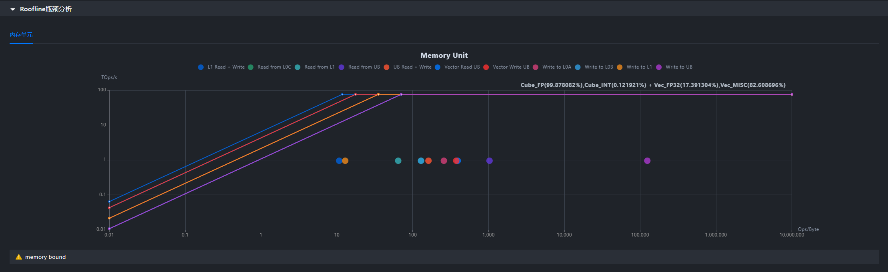

二进制结构：
 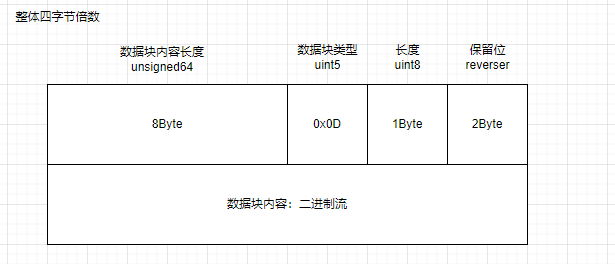

数据块内容格式：
```JSON
// roofline数据块
{
	"multiple_rooflines": [{
"title": "Memory Unit",             // 图表标题
		"rooflines": [{
			"bw": float,                   // 理论带宽 
			"computility": float,            // 屋顶算力
			"computility_name": str,       // 算力名称
			"point": [float, float]          // 对应坐标点
		}, {
			"bw": float,                      
			"computility": float,
			"computility_name": str,
			"point": [float, float]
		}]
	}]
}
```
 
### 时间线视图接口

# 接口列表总览

| 接口命令| 作用 | 类型 | 备注 |
| --- | --- | --- | --- |
| import/action | 导入bin文件 |  |  |
| unit/threadTracesSummary |  |  |  |
| unit/threadTraces |  |  |  |


## import/action

### 请求

```
{
  "id": 4769,
  "moduleName": "timeline",
  "type": "request",
  "command": "import/action",
  "params": {
    "path": [
      "D:\\visualize_data.bin"
    ]
  }
}
```

### 响应

```
{
  "type": "response",
  "id": 11925,
  "requestId": 4769,
  "result": true,
  "command": "import/action",
  "moduleName": "timeline",
  "body": {
    "isCluster": false,
    "reset": true,
    "isSimulation": true,
    "isBinary": true,
    "isIpynb": false,
    "coreList": [
      "core0.cubecore0",
      "core0.veccore0",
      "core0.veccore1"
    ],
    "sourceList": [
      "/home/xxx.cpp"
    ],
    "result": [
      {
        "cardName": "timeline和热点函数",
        "rankId": "timeline和热点函数",
        "cardPath": "Directory: timeline和热点函数",
        "result": true
      }
    ]
  }
}
```

## unit/threadTracesSummary

### 请求

```
{
  "id": 5022,
  "moduleName": "timeline",
  "type": "request",
  "command": "unit/threadTracesSummary",
  "params": {
    "cardId": "timeline和热点函数",
    "processId": "3",
    "metaType": "",
    "startTime": 0,
    "endTime": 289326,
    "dataSource": {
      "remote": "127.0.0.1",
      "port": 9000,
      "dataPath": [
        "D:\\visualize_data.bin"
      ]
    },
    "timePerPx": 335.6450116009281
  }
}
```

### 响应

```
{
  "type": "response",
  "id": 12178,
  "requestId": 5022,
  "result": true,
  "command": "unit/threadTracesSummary",
  "moduleName": "timeline",
  "body": {
    "data": [
      {
        "startTime": 18446744073709550000,
        "duration": 0
      },
      {
        "startTime": 1,
        "duration": 144677
      }
    ]
  }
}
```

## unit/threadTraces

### 请求

```
{
  "id": 5033,
  "moduleName": "timeline",
  "type": "request",
  "command": "unit/threadTraces",
  "params": {
    "cardId": "timeline和热点函数",
    "processId": "3",
    "threadId": "18",
    "metaType": "",
    "startTime": 46319,
    "endTime": 243007,
    "dataSource": {
      "remote": "127.0.0.1",
      "port": 9000,
      "dataPath": [
        "D:\\visualize_data.bin"
      ]
    },
    "timePerPx": 335.6450116009281
  }
}
```

### 响应

```
{
  "type": "response",
  "id": 12189,
  "requestId": 5033,
  "result": true,
  "command": "unit/threadTraces",
  "moduleName": "timeline",
  "body": {
    "data": [
      [
        {
          "name": "BAR",
          "duration": 1,
          "startTime": 144513,
          "endTime": 144514,
          "depth": 0,
          "threadId": "18",
          "cname": "good",
          "id": "78138"
        }
      ]
    ]
  }
}
```

## unit/flows

### 请求

```
{
  "id": 5238,
  "moduleName": "timeline",
  "type": "request",
  "command": "unit/flows",
  "params": {
    "rankId": "timeline和热点函数",
    "tid": "4",
    "pid": "1",
    "id": "6146",
    "metaType": "",
    "startTime": 107782,
    "endTime": 108381,
    "isSimulation": true
  }
}
```

### 响应

```
{
  "type": "response",
  "id": 12395,
  "requestId": 5238,
  "result": true,
  "command": "unit/flows",
  "moduleName": "timeline",
  "body": {
    "unitAllFlows": [
      {
        "cat": "MTE2ToVECTOR",
        "flows": [
          {
            "title": "flow",
            "cat": "MTE2ToVECTOR",
            "id": "770",
            "from": {
              "pid": "1",
              "tid": "7",
              "timestamp": 108380,
              "duration": 0,
              "depth": 1,
              "name": "",
              "id": "",
              "metaType": "",
              "rankId": ""
            },
            "to": {
              "pid": "1",
              "tid": "4",
              "timestamp": 108381,
              "duration": 0,
              "depth": 1,
              "name": "",
              "id": "",
              "metaType": "",
              "rankId": ""
            }
          }
        ]
      }
    ]
  }
}
```

## unit/threadDetail

### 请求

```
{
  "id": 5239,
  "moduleName": "timeline",
  "type": "request",
  "command": "unit/threadDetail",
  "params": {
    "rankId": "timeline和热点函数",
    "metaType": "",
    "pid": "1",
    "tid": "4",
    "id": "6146",
    "startTime": 107782,
    "depth": 1,
    "timePerPx": 30.116764580116918
  }
}
```

### 响应

```
{
  "type": "response",
  "id": 12396,
  "requestId": 5239,
  "result": true,
  "command": "unit/threadDetail",
  "moduleName": "timeline",
  "body": {
    "emptyFlag": false,
    "data": {
      "selfTime": 0,
      "args": "{\"code\":\"/tikcpp/tikcfw/impl/kernel_event.h:719\\n/tikcpp/tikcfw/interface/kernel_common.h:159...",\"detail\":\"PIPE:MTE2,TRIGGERPIPE:VEC,FLAGID:0,\",\"pc_addr\":\"0x126a9674\"}",
      "title": "WAIT_FLAG",
      "duration": 599,
      "cat": "",
      "inputShapes": "",
      "inputDataTypes": "",
      "inputFormats": "",
      "outputShapes": "",
      "outputDataTypes": "",
      "outputFormats": "",
      "attrInfo": ""
    }
  }
}
```
### 数据结构说明

## 数据类型

数据块的第9个字节如果是整数2，代表数据体内容为timeline的信息。

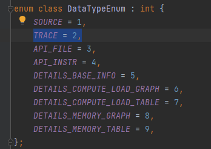

## 数据体格式

### 数据结构说明

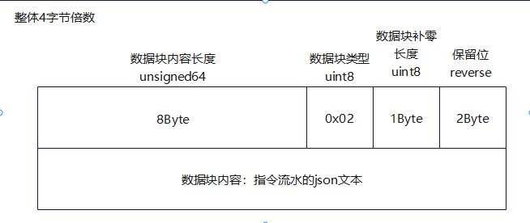

数据来源为tracing.json，满足Trace Event Format格式要求，参考以下示例：

```
{"profilingType": "op",
    "displayTimeUnit": "ns",
    "schemaVersion": 1,
    "traceEvents": [
		{    
			"args": {
                "code": "/home/yanyuwei/workspace/samples-master/operator/AddCustomSample/FrameworkLaunch/AddCustom/build_out/op_kernel/binary/ascend310p/kernel_meta_AddCustom_1e04ee05ab491cc5ae9c3d5c9ee8950b/kernel_meta/AddCustom_1e04ee05ab491cc5ae9c3d5c9ee8950b_413903_kernel.cpp:23",
                "detail": "x[1]=0x0,imme16:0x4000",
                "pc_addr": "0x10cfa004"
            },
            "cname": "process_block0",
            "dur": 20,
            "name": "block0",
            "ph": "X",
            "pid": "process_name",
            "tid": "process_block0",
            "ts": 1
        },
        {    
			"args": {
                "code": "/home/yanyuwei/workspace/samples-master/operator/AddCustomSample/FrameworkLaunch/AddCustom/build_out/op_kernel/binary/ascend310p/kernel_meta_AddCustom_1e04ee05ab491cc5ae9c3d5c9ee8950b/kernel_meta/AddCustom_1e04ee05ab491cc5ae9c3d5c9ee8950b_413903_kernel.cpp:23",
                "detail": "x[1]=0x0,imme16:0x4000",
                "pc_addr": "0x10cfa004"
            },
            "cname": "prepare",
            "dur": 5,
            "name": "hccl::prepare",
            "ph": "X",
            "pid": "process_name",
            "tid": "process_block0",
            "ts": 2
        },
		{    
			"args": {
                "code": "/home/yanyuwei/workspace/samples-master/operator/AddCustomSample/FrameworkLaunch/AddCustom/build_out/op_kernel/binary/ascend310p/kernel_meta_AddCustom_1e04ee05ab491cc5ae9c3d5c9ee8950b/kernel_meta/AddCustom_1e04ee05ab491cc5ae9c3d5c9ee8950b_413903_kernel.cpp:23",
                "detail": "x[1]=0x0,imme16:0x4000",
                "pc_addr": "0x10cfa004"
            },
            "cname": "prepare",
            "dur": 5,
            "name": "hccl::wait",
            "ph": "X",
            "pid": "process_name",
            "tid": "process_block0",
            "ts": 10
        }
    ]
}

```

# 热点指令视图

本文介绍二进制文件中，相关数据体的结构和内容。

# 数据类型

数据块的第9个字节如果是整数1、3、4，代表数据体内容为热点指令视图相关的信息。
代码中的定义：


数据类型表格

| 数据类型 | 名称 | 数据内容 |
| --- | --- | --- |
| 0x01 | SOURCE| 算子源代码 ，即cpp文件的内容|
| 0x03 | API_FILE| 源码行信息，即api.json的files部分 |
| 0x04 |  API_INSTR| 指令行信息，即api.json的instructions部分 |

# 数据体格式

## SOURCE

二进制结构说明：
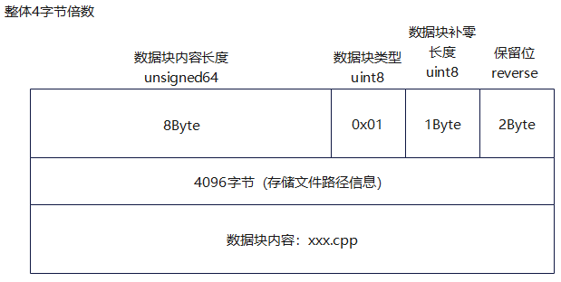
4096字节的附加数据块（存储文件路径信息）：

```
/home/matmul_leakyrelu_custom.cpp
```

数据块内容说明（即cpp源码内容）：

```
#include "kernel_operator.h"\n#include "lib/matmul_intf.h"\n\nusing namespace ...
```

## API_FILE

二进制结构说明：

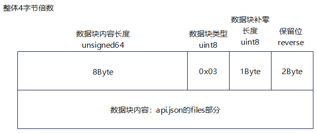
数据块内容说明（即api.json中的files部分）：

```
{
  "Cores": [ // 执行算子的计算核，如"core0.cubecore0"，"core0.veccore0"
    string
  ],
  "Files Dtype": { // 指定列名和数据类型
// Files Dtype->Lines对象中的键值对，用于指定后面Files->Lines数组中每个对象中键值对的键名和值的类型
// skip 0（代表不需要再界面上呈现，即界面上不会显示这一列）, int 1, float 2 , string 3
// 没有采集的数据字段，不用在这里声明
// 当前支持动态解析的键值对，值必须是单个或一维数组。如Address Range这种二维数组，不支持动态解析，需要单独约定。
        "Lines": {
            "Address Range": 0,
            "Cycles": 1,
            "Instructions Executed": 1,
            "Line": 1,
            "L2Cache Hit Rate": 3
    }
  },
  "Files": [ // 源代码文件中的代码行信息
    {
      "Lines": [ // 代码行关联的指令地址范围、消耗的时钟周期、执行指令总数
        {
          "Address Range": [ // 当前代码行关联的指令地址范围
            [
              string
            ]
          ],
          "Cycles": [ // 当前代码行在各个计算核上消耗的总时钟周期（对应顺序是？）
            int
          ],
          "Instructions Executed": [ // 当前代码行在各个计算核上执行的指令总数（对应顺序是？）
            int
          ],
          "Line": 100 // 代码行号
        }
      "Source": string // 源代码文件路径
    }
  ]
}
```

## API_INSTR

二进制结构说明：

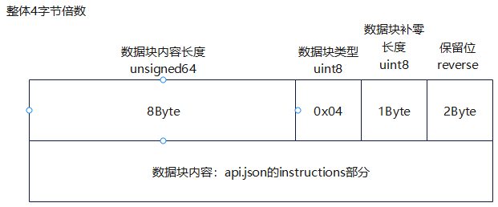
数据块内容说明（即api.json中的Instructions部分）：

```
{
  "Cores": [ // 执行算子的计算核，如"core0.cubecore0"，"core0.veccore0"
    string
  ],
"Instructions Dtype": { // 指定列名和数据类型
// Instructions Dtype->Instructions对象中的键值对，用于指定后面Instructions数组中每个对象中键值对的键名和值的类型
// skip 0（代表不需要再界面上呈现，即界面上不会显示这一列）, int 1, float 2 , string 3
// 没有采集的数据字段，不用在这里声明
// 当前支持动态解析的键值对，值必须是单个或一维数组。如果是二维数组等，不支持动态解析，需要单独约定。
    "Instructions": {
        "Address": 3,
        "AscendC Inner Code": 3,
        "Cycles": 1,
        "Instructions Executed": 1,
        "Pipe": 3,
        "TheoreticalStallCycles": 1,
        "Source": 3,
        "RealStallCycles": 1，
        "L2Cache Hit Rate": 3
     }
},
  "Instructions": [
    {
      "Address": string, 			// 指令的偏移地址,如"0x1269f000"
      "AscendC Inner Code": string, // 源代码文件路径和代码行号,如"/home/xxx.cpp:23"
      "Cycles": [ 					// 指令在各个计算核上消耗的时钟周期
        int
      ],
      "Instructions Executed": [ 	// 指令在各个计算核上执行的次数
        int
      ],
      "Pipe": string, 				// 指令所属的指令队列,如"SCALAR"
      "TheoreticalStallCycles": [                    // 预期阻塞时间
        int
       ],
      "Source": string, 				// 指令内容, 如"MOV_XD_IMM XD:X29,IMM"
      "RealStallCycles": [                    // 实际阻塞时间
        int
       ]
    }
  ]
}
```

# 热点指令接口文档

# 接口列表总览

| 接口命令| 作用 | 类型 | 备注 |
| --- | --- | --- | --- |
| source/code/file | 获取算子源代码文本 | Get |  |
| source/api/line | 获取源代码行关联的指令的信息 |  |  |
| source/api/instructions | 获取指令对应的信息 |  |  |

# 接口详细定义

## source/code/file

### 请求

```
{
  "id": 4772,
  "moduleName": "source",
  "type": "request",
  "command": "source/code/file",
  "params": {
    "sourceName": "/home/xxx.cpp"
  }
}
```

### 响应

```
{
  "type": "response",
  "id": 11928,
  "requestId": 4772,
  "result": true,
  "command": "source/code/file",
  "moduleName": "source",
  "body": {
    "fileContent": "#include \"kernel_operator.h\"\n#include \"lib/matmul_intf.h\"\n\nusing namespace AscendC;\nusing namespace matmul; ..."
  }
}
```

## source/api/line

### 请求

```
{
  "id": 4776,
  "moduleName": "source",
  "type": "request",
  "command": "source/api/line",
  "params": {
    "sourceName": "xxx.cpp",
    "coreName": "core0.cubecore0"
  }
}
```

### 响应

```
{
  "type": "response",
  "id": 11929,
  "requestId": 4773,
  "result": true,
  "command": "source/api/line",
  "moduleName": "source",
  "body": {
    "lines": [
      {
        "Line": 0,
        "Instruction Executed": 15,
        "Cycle": 15,
        "Address Range": [
          [
            "0x1269fe78",
            "0x1269feb0"
          ]
        ]
      }
    ]
  }
}
```

## source/api/instructions

### 请求

```
{
  "id": 4777,
  "moduleName": "source",
  "type": "request",
  "command": "source/api/instructions",
  "params": {
  }
}
```

### 响应

```
{
  "type": "response",
  "id": 11927,
  "requestId": 4771,
  "result": true,
  "command": "source/api/instructions",
  "moduleName": "source",
  "body": {
    "instructions": "{\"Cores\":[\"core0.cubecore0\",\"core0.veccore0\"..."
  }
}
```

# 内存负载视图接口文档

# 接口列表总览

| 接口地址 | 作用 | 类型 | 备注|
| --- | --- | --- | -- |
| source/details/baseInfo | 获取算子基本信息 | Get | |
| source/details/computeworkload | 获取计算负载图  |  | |
| source/details/memoryGraph | 获取内存热力图 | | |
| source/details/memoryTable | 获取访存表格| | |

# 获取算子基本信息

## Request

```json
{
    "id": 281,
    "moduleName": "source",
    "type": "request",
    "command": "source/details/baseInfo",
    "params": {
    }
}
```

## Response

```json
{
    "type": "response",
    "id": 603,
    "requestId": 285,
    "result": true,
    "command": "source/details/baseInfo",
    "moduleName": "source",
    "body": {
        "name": "sin_custom",
        "soc": "Ascend910B4",
        "opType": "vector",
        "blockDim": "32",
        "mixBlockDim": "-1",
        "duration": "13.15999984741211",
        "blockDetail": {
            "headerName": [
                "Block ID",
                "Core Type",
                "Duration (μs)"
            ],
            "size": [
                "33",
                "3"
            ],
            "row": [
                {
                    "value": [
                        "0",
                        "vector",
                        "5.480606"
                    ]
                }
            ]
        },
        "advice": []
    }
}
```

# source/details/computeworkload

## Request

```json
{
    "id": 286,
    "moduleName": "source",
    "type": "request",
    "command": "source/details/computeworkload",
    "params": {
    }
}
```

## Response

```json
{
    "type": "response",
    "id": 604,
    "requestId": 286,
    "result": true,
    "command": "source/details/computeworkload",
    "moduleName": "source",
    "body": {
        "blockIdList": [
            "31"
        ],
        "chartData": {
            "detailDataList": [
                {
                    "blockId": "0",
                    "blockType": "vector0",
                    "name": "ALL_ACTIVE",
                    "unit": "PRE",
                    "value": "73.6",
                    "originValue": "6656.0"
                }
            ],
            "advice": []
        },
        "tableData": {
            "detailDataList": [
                {
                    "blockId": "0",
                    "blockType": "vector0",
                    "name": "ALL_ACTIVE",
                    "unit": "Instructions",
                    "value": "3606.0"
                }
            ],
            "advice": []
        }
    }
}
```

# source/details/memoryGraph

## Request

```json
{
    "id": 287,
    "moduleName": "source",
    "type": "request",
    "command": "source/details/memoryGraph",
    "params": {
        "blockId": "0",
        "showAs": "request"
    }
}
```

## Response

```json
{
    "type": "response",
    "id": 605,
    "requestId": 287,
    "result": true,
    "command": "source/details/memoryGraph",
    "moduleName": "source",
    "body": {
        "coreMemory": [
            {
                "advice": [],
                "blockId": "0",
                "l2Cache": {
                    "hitRatio": "16.88311767578125",
                    "hit": "13",
                    "totalRequest": "77",
                    "miss": "64"
                },
                "blockType": "vector",
                "chipType": "910B",
                "memoryUnit": [
                    {
                        "request": 257,
                        "display": true,
                        "peakRatio": "4.737319",
                        "bandwidth": "3.637730836868286",
                        "memoryPath": "12"
                    }
                ],
                "vector": {
                    "cycle": "6656",
                    "totalCycles": "9043",
                    "ratio": ""
                },
                "vector1": {
                    "cycle": "",
                    "totalCycles": "",
                    "ratio": ""
                },
                "cube": {
                    "cycle": "",
                    "totalCycles": "",
                    "ratio": ""
                }
            }
        ]
    }
}
```

# source/details/memoryTable

## Request

```json
{
    "id": 288,
    "moduleName": "source",
    "type": "request",
    "command": "source/details/memoryTable",
    "params": {
        "blockId": "0",
        "showAs": "request"
    }
}
```

## Response

```
{
    "type": "response",
    "id": 606,
    "requestId": 288,
    "result": true,
    "command": "source/details/memoryTable",
    "moduleName": "source",
    "body": {
        "memoryTable": [
            {
                "advice": [],
                "blockId": "0",
                "tableOpType": "vector",
                "tableDetail": [
                    {
                        "headerName": [
                            "",
                            "hit",
                            "miss",
                            "total",
                            "hit rate(%)"
                        ],
                        "tableName": "Cache",
                        "size": [
                            "4",
                            "4"
                        ],
                        "row": [
                            {
                                "name": "L2 Cache Write",
                                "value": [
                                    "13",
                                    "64",
                                    "77",
                                    "16.883118"
                                ]
                            },
                        ]
                    },
                ]
            }
        ]
    }
}

```

# 内存视图数据结构说明

# 输入bin文件中的数据格式

## 数据类型

数据块的第9个字节如果是整数5~9，代表数据体内容为访存负载的信息。
代码中的定义：


数据类型表格

| 数据类型 | 名称 | 数据内容 |
| --- | --- | --- |
| 0x05 | DETAILS_BASE_INFO | 算子基础信息 |
| 0x06 | DETAILS_COMPUTE_LOAD_GRAPH | 计算负载图 |
| 0x07 |  DETAILS_COMPUTE_LOAD_TABLE | 计算负载图 |
| 0x08 | DETAILS_MEMORY_GRAPH | 访存热力图 |
| 0x09 | DETAILS_MEMORY_TABLE | 访存表格 |

## 数据体格式

数据来源为tracing.json，满足Trace Event Format格式要求，参考以下示例：

### DETAILS_BASE_INFO

二进制结构说明：

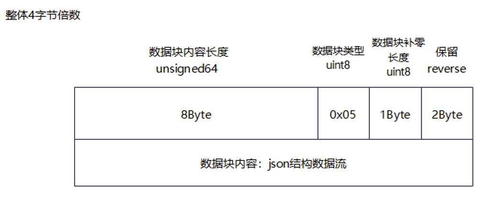

json格式说明：

```json
{
    "name": str,            // 算子名称
    "soc": str,             // 算子运行平台
    "op_type": enum,        // 算子类型：aic, aiv, mix
    "block_dim": uint16,    // block dim数据
    "mix_block_dim": uint16,// mix算子下从核的数量
    "duration": float32,    // 算子总耗时
    "device_id": unit16,    // 设备号
    "pid": str,                    // 进程号
    "block_detail": [       // 当op_type == aic/aiv时，有效
        {
            "block_id": uint16,     // sub block序号
            "core_type": enum,      //sub block类型：aic、aiv
            "duration": float32,    // sub block耗时
        }
    ],
    "mix_block_detail": [ // 当op_type == mix时，有效
        {
            "block_id": uint16,  // block 序号                 
            "duration": [float32, float32, float32], //sub block耗时，依次表示: aic, aiv0, aiv1
        }
    ],
    "advice": [ // 建议，目前为空，预留
        string, string, ...
    ]
}
```

**注意，block_detail和mix_block_detail字段只会有一个有效。block_detail和mix_block_detail均为列表，包含0~N个dict/map**
<br></br>

### DETAILS_COMPUTE_LOAD_GRAPH

二进制结构说明：

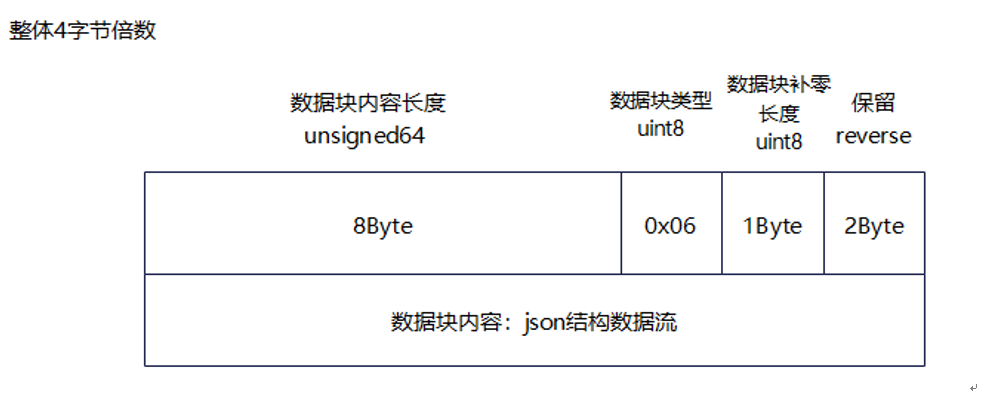
Json结构说明：

```json
{
    "subblock_detail": [
        {
            "block_id": uint8,      // block ID，即主核序号
            "block_type": enum,     // sub block类型：aic, aiv, aiv0, aiv1
            "data_detail": {
                "name": string,     // 计算负载数据名
                "unit": enum,       // 数据单位：%
                "value": float32,    // 数值
            },
           "advice": string
        }
    ],
    "advice": [ // 建议，目前为空，预留
        string, string, ...
    ]
}

```

### DETAILS_COMPUTE_LOAD_TABLE

二进制结构说明：

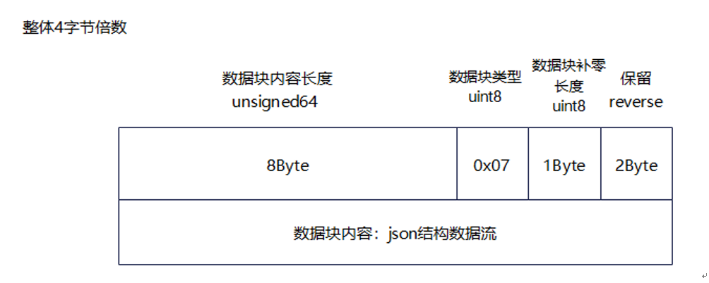

Json结构说明：

```json
{
    "subblock_detail": [
        {
            "block_id": uint8,      // block ID，即主核序号
            "block_type": enum,     // sub block类型：aic, aiv, aiv0, aiv1
            "data_detail": {
                "name": string,     // 计算负载数据名
                "unit": enum,       // 数据单位：us, instructions, 数据量(Byte)
                "value": float32,   // 数值
            },
            "advice": string
        }
    ],
    "advice": [ // 建议，目前为空，预留
        string, string, ...
    ]
}
```

<br></br>

### DETAILS_MEMORY_GRAPH

二进制结构说明：

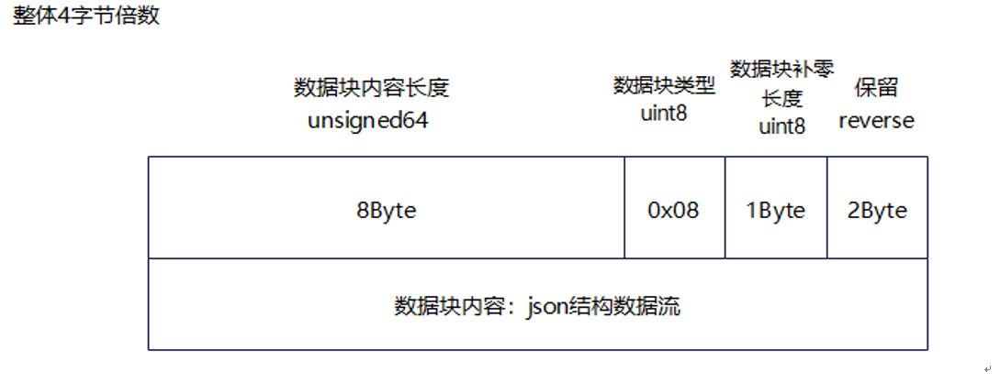

Json结构说明

```json
{
    "core_memory_map": [
        {
            "core_no": uint16,      // block序号
            "core_type": enum,      // block类型：aic, aiv, mix
            "memory_unit": [        // 通路列表
                {
                    "memory_path": enum,        // 搬运通路名
                    "request": uint64,          // 请求数量
                    "request_per_byte": uint8,  // 每次请求数据量
                    "bandwidth": float32,       // 带宽
                    "peak_ratio": float32,         // 峰值带占比：-1代表数据无效
                    "display": bool,            // 是否展示此通路
                }
            ],
            "L2cache": [
                "hit": uint64,              // 命中cache次数
                "miss": uint64,             // 未命中cache次数
                "total_request": uint64,    // cache请求总次数
                "hit_ratio": int8,          // 命中率：-1代表数据无效
            ], 
            "advice": [ // 建议
                string, string, ...
            ]
        }
    ]
}
```

<br></br>

### DETAILS_MEMORY_TABLE

二进制结构说明：

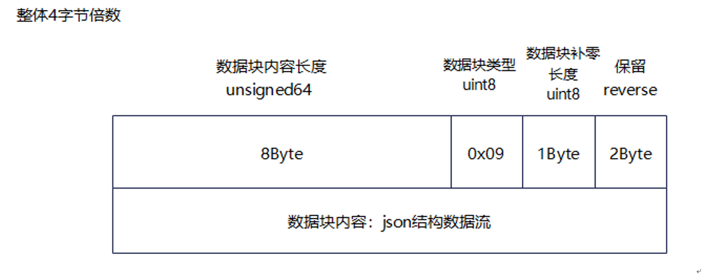

Json结构说明：

```json
{
    "table_per_block": [
        {
            "block_id": uint,       // block id
            "table_op_type": enum,  // 表格数据类型：aic, aiv, mix
            "tables_detail": [
                {
                    "table_name": string,   // 表格名
                    "size": [uint8, uint8], // 表格大小：[行数, 列数]
                    "header_name": [        // 列名(与列数一致)
                        string, string, ...
                    ],
                    "row": [                // 行数据(与行数一致)
                        "name": string,     // 行名
                        "value": [          // 行数据：长度为列数-1
                            float16, float16, ....
                        ]
                    ],
                }
            ],
            "advice": [ // 建议
                string, string, ...
             ]
        },
    ]

    "advice": [ // 建议，目前为空，预留
        string, string, ...
    ]
}
```

# 内存读写时序图数据结构（POC）

统一二进制交付件的内容格式如下：


文件协议头结构设计：

```C++
struct BinaryBlockHeader {
    uint64_t contentSize = 0;
    uint8_t type = 0;
    uint8_t padding = 0;
    uint16_t reverse = 0x5a5a;
};
```

支持基于msTraceKit工具输出的内存读写序信息，构建内存读写时序图。
内存读写记录结构体设计

```C++
struct TraceRecord {
    uint8_t type;
    int8_t coreId;
    int8_t space;
    uint8_t blockType;
    uint32_t recordId;
    uint64_t addr;
    uint64_t memSize;
    uint64_t pc;
};

```

TraceRecord结构体字段含义说明：

| 参数       | 说明                                                                 |
|------------|----------------------------------------------------------------------|
| type       | 内存事件类型：<br>- MALLOC=0<br>- FREE=1<br>- MEMCPY_BLOCKS=2<br>- LOAD=3<br>- STORE=4 |
| coreId     | 此内存事件发生的核 ID                                               |
| space      | 此内存事件操作内存的地址空间类型：<br>- PRIVATE=0<br>- GM=1<br>- L1=2<br>- L0A=3<br>- L0B=4<br>- L0C=5<br>- UB=6 |
| blockType  | 此内存事件发生的 block 类型：<br>- AIV=0<br>- AIC=1                  |
| recordId   | 此内存事件的编号                                                    |
| addr       | 此内存事件操作的内存地址                                            |
| memSize    | 此内存事件操作的内存长度（）                                        |
| pc         | 此内存事件发生的代码位置对应PC地址                                  |

调用栈信息映射表（CallStack map）设计为JSON对象的形式，字段类型和含义说明如下：.

| 字段       | 类型   | 说明                                                                 |
|------------|--------|----------------------------------------------------------------------|
| `<root>`   | Object | 内存读写记录信息JSON对象                                             |
| +`<PcAddr>` | Object | 为方便查询，以PC地址作为key，对应的调用栈信息用Object表示             |
| ++`Address` | String | 调用栈对应的PC地址                                                   |
| ++`ModuleName` | String | 调用栈对应的编译单元名称                                            |
| ++`Symbol` | Array  | 调用栈涉及的符号关系调用数组                                         |
| +++`<Symbol>` | Object | 每个符号信息用一个Object表示                                        |
| ++++`Column` | Int   | 调用栈符号在代码中的列号                                              |
| ++++`Line`   | Int   | 调用栈符号在代码中的行号                                              |
| ++++`FileName` | String | 调用栈符号所在的代码文件名                                          |
| ++++`FunctionName` | String | 调用栈符号所在的函数名                                           |

调用栈信息映射表示例如下：
```JSON
[
{
    "Address": "0x4004be",
    "ModuleName": "inlined.elf",
    "Symbol": [
      {
        "Column": 18,
        "Discriminator": 0,
        "FileName": "/tmp/test.cpp",
        "FunctionName": "baz()",
        "Line": 11,
        "StartAddress": "0x4004be",
        "StartFileName": "/tmp/test.cpp",
        "StartLine": 9
      },
      {
        "Column": 0,
        "Discriminator": 0,
        "FileName": "/tmp/test.cpp",
        "FunctionName": "main",
        "Line": 15,
        "StartAddress": "0x4004be",
        "StartFileName": "/tmp/test.cpp",
        "StartLine": 14
      }
    ] 
  }
]
```

# 缓存命中率图数据结构（POC）

二进制bin文件数据块结构：


Cache信息记录结构体设计：

```Shell
struct CacheRecord {
    uint32_t loadCount{0};
    uint32_t storeCount{0};
    uint32_t cacheLineId{0};
    uint32_t hit{0};
    uint32_t miss{0};
    uint32_t allocate{0};
    uint32_t evictAndWrite{0};
    uint32_t evictWithoutWrite{0};
};
```

字段说明：
| 参数             | 说明                                                                 |
|------------------|----------------------------------------------------------------------|
| loadCount        | 当前 cache set 上发生的读取事件总次数                                 |
| storeCount       | 当前 cache set 上发生的写入事件总次数                                 |
| hit              | 当前 cache set 被命中的总次数                                         |
| miss             | 当前 cache set 未命中的总次数                                         |
| allocate         | 当前 cache set 因未命中导致的分配总次数                               |
| evictAndWrite    | 当前 cache set 换出 cacheline 并写回 L2 的总次数                      |
| evictWithoutWrite| 当前 cache set 换出 cacheline 并不写回的总次数                        |

命中率计算公式：各维度次数 / (loadCount + storeCount)