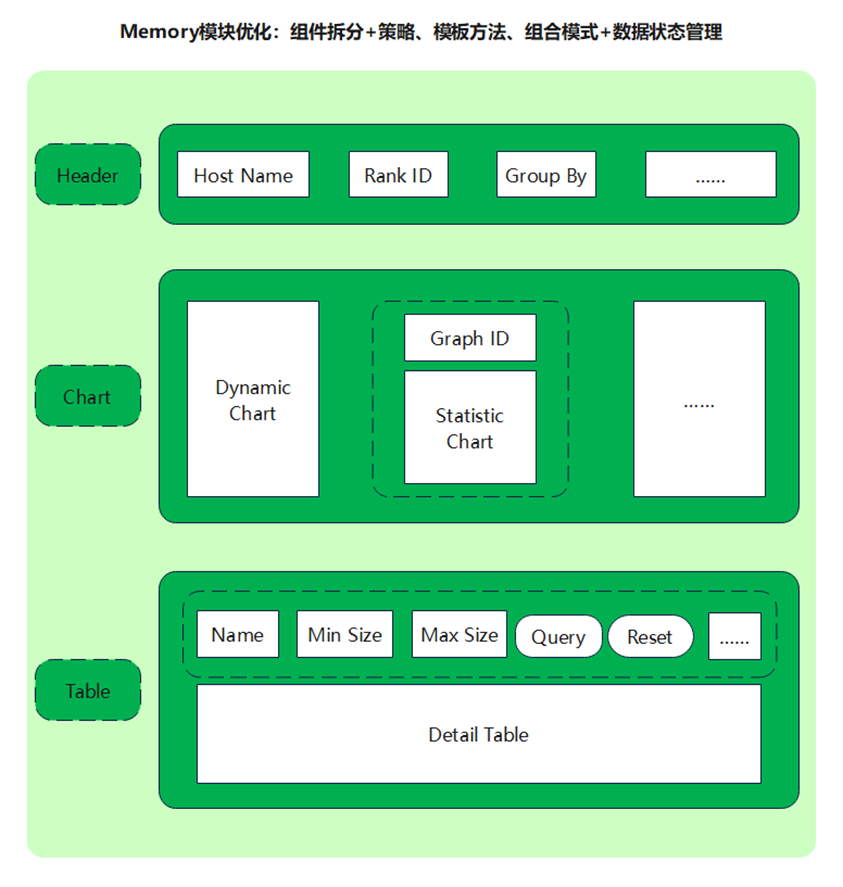
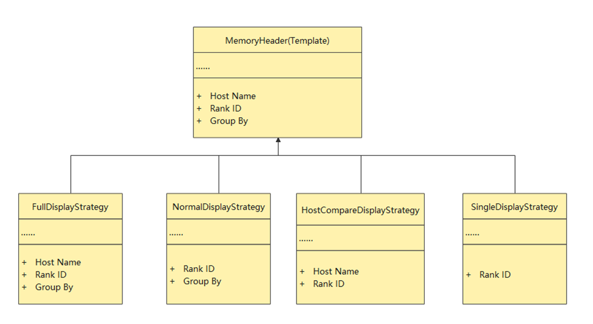
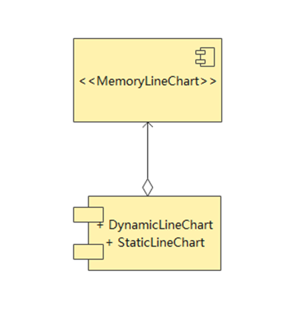
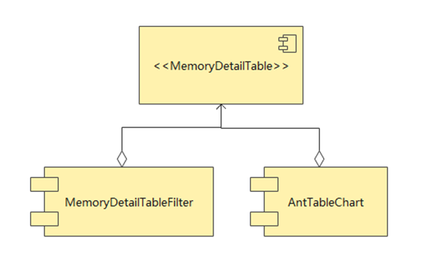
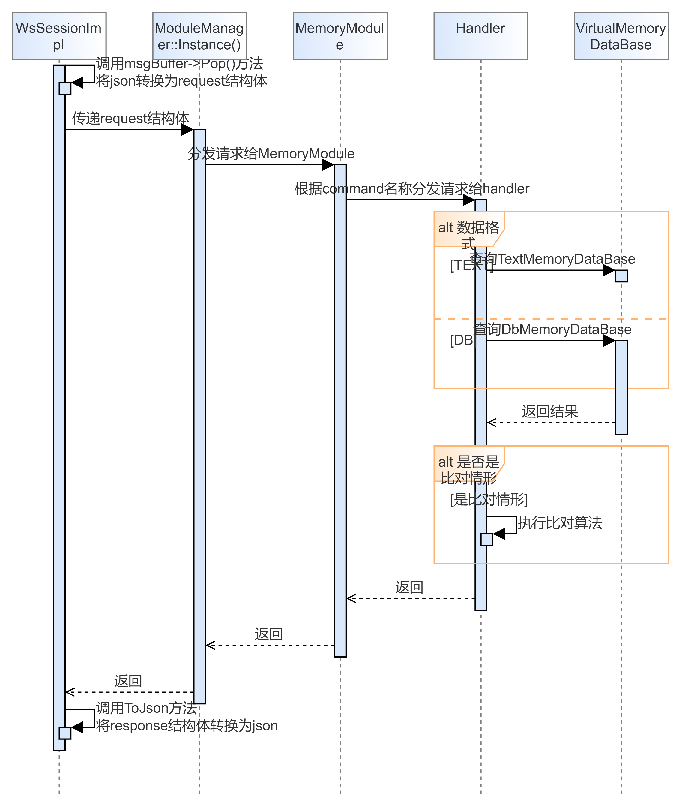
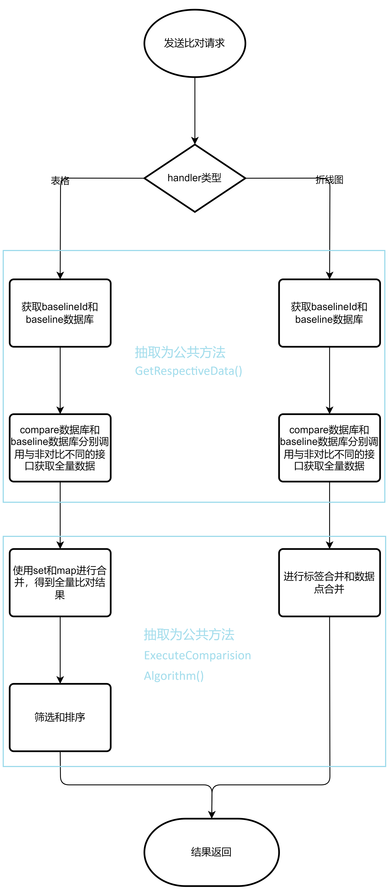

# Memory部分设计文档

## Memory前端逻辑

Memory界面优化主要思路

Memory界面主体架构

Memory界面Header具体实现

Memory界面折线图具体实现

Memory界面底部表格具体实现

## Memory界面后端代码逻辑

### 文件解析
MindStudio Insight的文件解析入口是ImportActionHandler，根据文件格式不同会调用不同的函数进行文件解析。

#### TEXT
如果是TEXT格式的文件，Memory模块的文件解析入口是Memory::MemoryParse::Instance().Parse()，顺序图如下：

server/src/modules/memory/parser处理TEXT格式文件解析并存储到数据库的过程。

#### DB
如果是DB格式的文件，Memory模块的文件解析入口是FullDb::FullDbParser::Instance().Parse()。
DB格式文件在解析时基本保持原样。

### 数据查询
查询请求从前端发起到后端返回的顺序图如下：

server/src/modules/memory/protocol处理json转换为request结构体和response结构体转换为json的任务。
server/src/modules/memory/database处理查询TextMemoryDataBase和DbMemoryDataBase的任务。
server/src/modules/memory/handler处理handler的逻辑和比对的逻辑，支持比对的有：QueryMemoryOperatorHandler动态图表格 QueryMemoryStaticOperatorListHandler静态图表格 QueryMemoryViewHandler动态图折线图 QueryMemoryStaticOperatorGraphHandler静态图折线图 QueryMemoryComponentHandler组件级表格。
接口的参数可以查看TinyMock-高效、易用、功能强大的可视化接口管理平台。

## 业务流程

一、业务流程

Memory的界面大致分为三部分，第一部分是视图选择，第二部分是折线图，第三部分是表格。
1、视图选择
视图选择部分可以在下拉框中选择rank id和分组方式，如果是全量DB格式数据还有下拉框可以选择host name。host name和rank id两者组合，可以唯一确定到一张单卡。而分组方式可以选择“全局”“流”“组件”。
“全局”和“流”的数据来源：动态图场景有一个折线图和一个表格，折线图数据来自memory_record.csv，表格数据来自operator_memory.csv。静态图场景有两个折线图和一个表格，折线图数据来自memory_record.csv和static_op_mem.csv，表格数据来自static_op_mem.csv。
“组件”的数据来源：有一个折线图和一个表格，折线图数据来自memory_record.csv，表格数据来自npu_module_mem.csv。
2、折线图
不论是动态图场景还是静态图场景，一个图还是两个图，每个图的展示逻辑是一致的。每个图由两部分组成：图例和折线。
图例的数据类型是std::vector<std::string> legends，依次存储图例的名称。
折线的数据类型是std::vector<std::vector<std::string>> lines，先看最外层的vector，对于每个固定的index，lines[index]表示折线图上的一条竖线，即折线图上固定某个横坐标时，对应的那些点。那内层的数据结构std::vector<std::string>，则是这些点的依次排列，而这些点的排列顺序，和legends的顺序是一一对应的。
3、表格
表格是对应的csv的数据展示，增加了查询功能（分组方式是“组件“时不支持）。
支持的查询条件：
名称（子串即可）
size的上界和下界
图表联动：折线图可以进行框选，动态图场景下框选后会有一个时间范围（静态图对应node index范围），

如果不勾选“Only show allocated or released within the selected interval”，上图中category 1 2 3 4的算子都会展示，如果勾选的话，只展示上图中category 2 3 4的算子。
排序
二、对比功能
