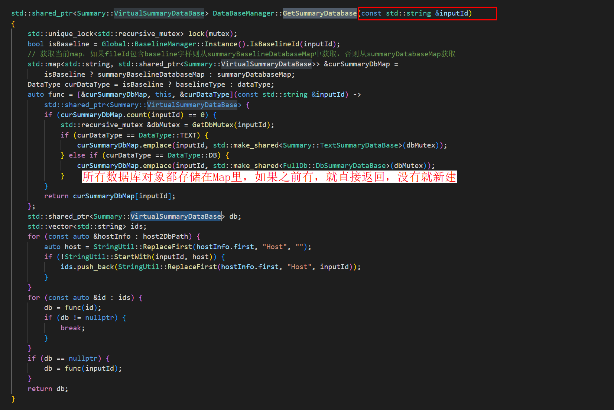
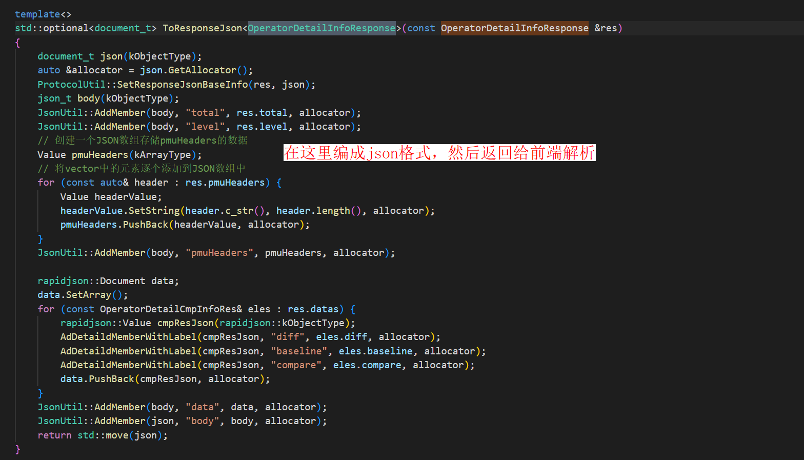

# Operator部分设计文档

## Operator界面前端代码逻辑


### 主体逻辑结构图


Operator界面前端主要分为三个部分：上方过滤条件+中间饼图+下方详情表格
其对应代码块为：Filter.tsx+DetailChart.tsx+DetailTable.tsx；同时下方表格详情的所有实现主要关注BaseTable

其余需关注项
1. operator模块与framework间通信：modules\operator\src\connection\handler.ts
2. operator模块本身前后端通信接口：modules\operator\src\components\RequestUtils.ts
3. operator模块表格详情列名配置：modules\operator\src\components\TableColumnConfig.tsx

## Operator界面后端代码逻辑

用下面的代码做例子
QueryOpDetailInfoHandler
非比对场景，获取算子详细信息的请求
算子这块的逻辑结构清晰整体流程不是很复杂，主要就是从数据库查询数据、然后返回给前端呈现。各个handler做的事情非常相似，但是需要周边组件的协助。主要在于周边组件支撑，常用的如dbManager、kernelParser以及TimelineParser等。

### 前置信息（周边组件功能支撑）
    KernelParser: 
    dbManager：
    全量DB结构：

### 1、前端发送消息
ProtocolDefs.h 这个文件里有所有的消息定义，前端会发送这个字符串类型的消息到后端，以REQ_RES_OPERATOR_DETAIL_INFO为例，看下算子详细信息的请求和回应关系
const std::string REQ_RES_OPERATOR_DETAIL_INFO = "operator/details";
前端发送消息 "operator/details"，以及这个请求的相关参数

### 2、分发消息到对应的Handler
OperatorModule.cpp里面注册了 requestHandlerMap，根据消息类型，找到"operator/details"对应的handler

### 3、调用QueryOpDetailInfoHandler函数


### 4、查询数据库拿到参数


#### 4.1  database管理

```c++
auto database = Timeline::DataBaseManager::Instance().GetSummaryDatabase(rankId);
```

database在databaseManager里面，可以详细看下为什么能获取数据库连接，查询到指定的数据库，主要是用的rankID


#### 4.2 TEXT 和 DB数据库

##### 4.2.1 TEXT场景下
当Type=TEXT时，数据存储在kernelTable里面，sql语句直接查询就可以了

pmuColumnNames 是查询算子详细信息时的表头，主要是寄存器信息。

##### 4.2.2 Type=DB场景下
需要多表联查


### 5.返回数据并转换成json给前端
