# Timeline设计文档

## 一、概念描述

在昇腾异构计算架构中，MindStudio Insight 工具以时间线（Timeline）的呈现方式将训练/推理过程中的 host、device 上的运行详细情况平铺在时间轴上，
直观呈现 host 侧的 API 耗时情况以及 device 侧的 task 耗时，并将 host 与 device 进行关联呈现，帮助用户快速识别 host 瓶颈或 device 瓶颈，
同时提供各种筛选分类、专家建议等功能，支撑用户进行深度调优。

**基础概念：**

1. 泳道（Unit）：表示一个设备、进程、线程、任务流等；
    1. CardUnit
        1. ProcessUnit、LabelUnit（主要区别在于有没有预览信息）
            1. ThreadUnit、CounterUnit（最小单元，分别对应timeline的两种数据展示模式）
2. 切片（Slice）：表示一个动作、事件、算子等；

   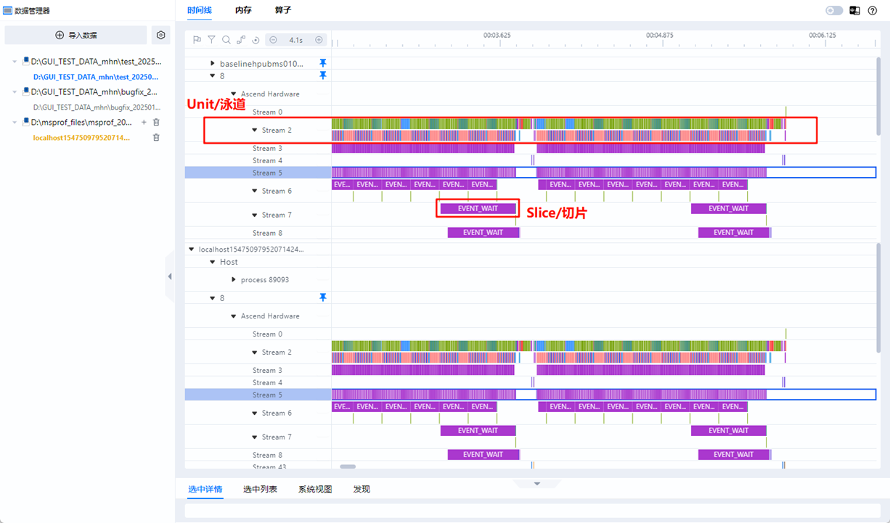

3. 数据场景：timeline 页面的数据可以来自两个场景。
    1. TEXT 场景：指数据来源 `Google Trace Format` 格式的 `json` 文件
    2. DB 场景：指数据来源 msprof 工具采集解析的 `ascend_profiler_output.db` 文件

   两个场景数据结构不同，因此后端有两份逻辑分别处理两种数据。

## 二、界面介绍

时间线（Timeline）界面包含工具栏（区域一）、时间线树状图（区域二）、图形化窗格（区域三）和数据窗格（区域四）四个部分组成。

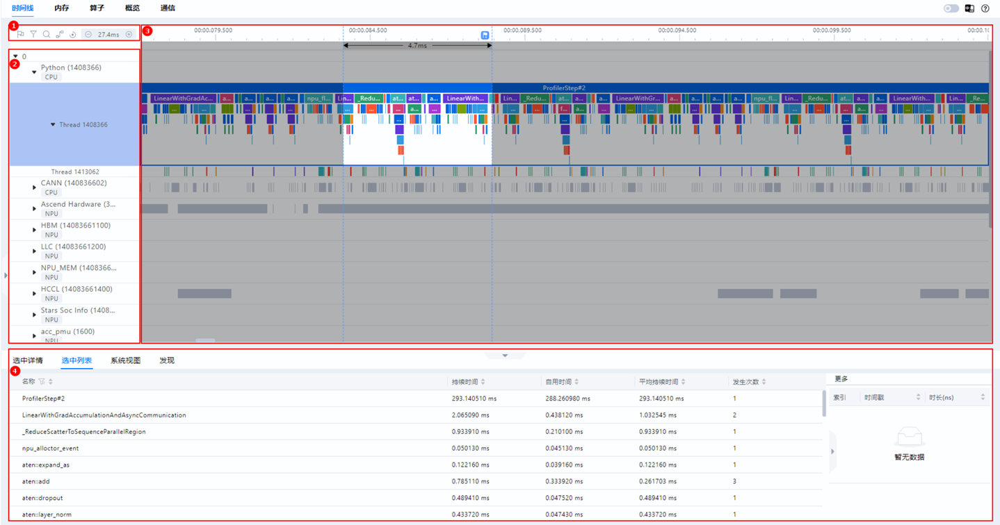

### 区域一：工具栏

包含常用快捷按钮，从左至右依次为标记列表、过滤（支持按卡或按泳道过滤展示）、搜索、连线事件、复原（页面复原）和时间轴缩小放大按钮。

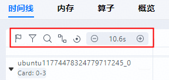

### 区域二：时间线树状图

> TEXT场景和DB场景显示会有所不同。

- TEXT场景：显示集群场景下各 “Card” 的分层信息，以 Rank 维度显示分层信息，一层级为 Rank ID，二层级为进程或专项分层，三层级为线程等名称。
- DB场景：显示各机器下的信息，一层级为机器名称，二层级为 Host 和 “Card”。

    - Host 层级是按照进程与线程级维度展示Pytorch和CANN的数据；
    - “Card”层级包括：

        - 底层数据，包含：

            - Ascend Hardware下各个 Stream 任务流的耗时数据和迭代轨迹数据
            - HCCL 和 Overlap Analysis 通信数据
            - Memory 内存数据
            - 其他昇腾硬件系统数据

        - AI Core Freq 等层级。

  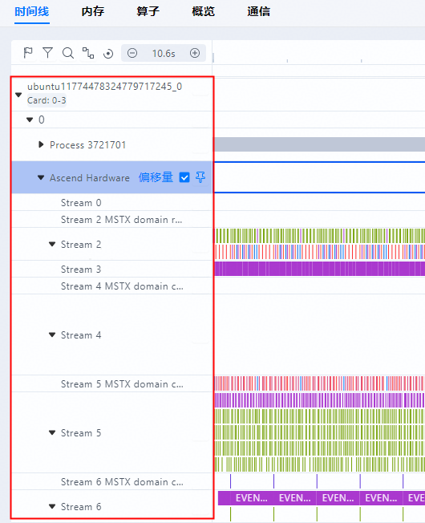

> 有置顶泳道时，会分出置顶树状图

### 区域三：图形化窗格

展示的数据是迭代内的数据，图形化窗格对应时间线树状 图，逐行对时间线进行图形化展现，包括上层应用算子、各组件及接口的执行序 列和执行时长。

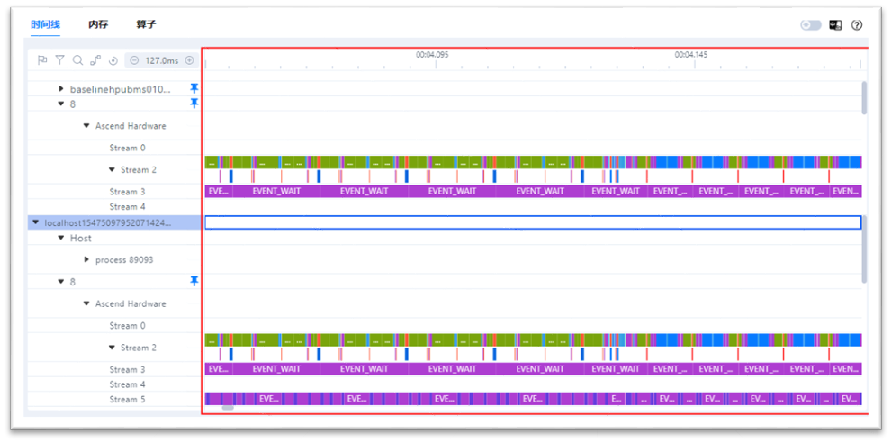

### 区域四：数据窗格

统计信息或算子详情信息展示区。

**具体包括以下 Tab:**

1. 选中详情（Slice Detail） 为选中单个算子的详细信息
2. 选中列表（Slice List）为某一行泳道选中区域的算子列表信息
3. 系统视图（System View）为某类算子的汇总信息
4. 发现（Find） 为搜索的算子信息。

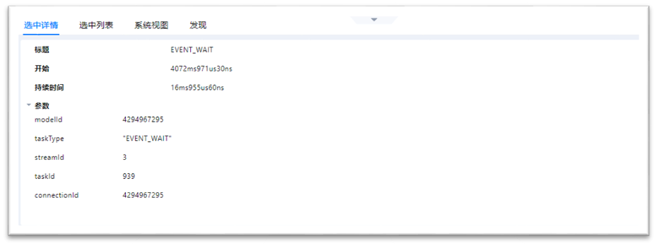

## 三、功能详解

| 序号 | 一级功能          | 二级功能              | 三级功能                       |
|:---|:--------------|:------------------|:---------------------------|
| 1  | 平铺训练/推理过程     | 展示泳道、切片           | /                          |
| 2  | 标记列表          | 将选中区域进行标记并保存      | /                          |
| 3  | 树状图过滤         | 按卡过滤              | /                          |
| 4  |               | 按泳道过滤             | /                          |
| 5  | 算子搜索          | 图形窗口选中            | /                          |
| 6  |               | 跳转数据窗口发现          | 同名算子发现                     |
| 7  |               |                   | 点击跳转图形窗口选中                 |
| 8  | 展示连线事件        | 全量展示              | /                          |
| 9  |               | 图形窗口选中单个展示        | /                          |
| 10 | 图形窗口复原        | /                 | /                          |
| 11 | 图形窗口放大缩小      | W、S键放大缩小          | /                          |
| 12 |               | Ctrl/cmd+鼠标滚轮放大缩小 | /                          |
| 13 | 树状图右键操作       | 整屏显示              | /                          |
| 14 |               | 在通信中查找            | /                          |
| 15 |               | 放大所选内容            | /                          |
| 16 |               | 控制缩放              | 撤消缩放                       |
| 17 |               |                   | 重置缩放                       |
| 18 |               | 控制置顶              | 取消置顶 (全部)                  |
| 19 |               |                   | 置顶 (按相同组)                  |
| 20 |               |                   | 取消置顶 (按相同组)                |
| 21 |               | 控制隐藏              | 隐藏                         |
| 22 |               |                   | 显示全部已隐藏泳道                  |
| 23 |               | 在事件视图中显示          | 跳转数据窗口事件视图                 |
| 24 |               | 控制python调用栈       | 显示 python 调用栈              |
| 25 |               | 控制python调用栈       | 隐藏 python 调用栈              |
| 26 | 树状图右键操作       | 控制全部子项            | 收起全部子项                     |
| 27 |               |                   | 展开全部子项                     |
| 28 |               | 控制SET/WAIT事件      | 隐藏 SET/WAIT 事件             |
| 29 |               |                   | 显示 SET/WAIT 事件             |
| 30 |               | 控制泳道高度自适应         | 开启泳道高度自适应                  |
| 31 |               |                   | 关闭泳道高度自适应                  |
| 32 |               | 恢复所有卡的默认偏移量       | /                          |
| 33 |               | 控制基准算子            | 设置基准算子                     |
| 34 |               |                   | 自定义算子**对齐至**基准算子时间         |
| 35 |               |                   | 清除基准算子                     |
| 36 | 树状图设置时间偏移量    | /                 | /                          |
| 37 | 树状图设置置顶       | /                 | /                          |
| 38 | 图形窗口拖动选择区间与泳道 | 查看选择区间与泳道         | /                          |
| 39 |               | 跳转数据窗口选中列表        | /                          |
| 40 | 图形窗口选中Slice   | 查看Slice详情         | /                          |
| 41 |               | 跳转数据窗口选中详情        | /                          |
| 42 | 数据窗口系统视图      | 统计系统视图            | 按机器名称、卡序号查看                |
| 43 |               |                   | 查看综合指标                     |
| 44 |               |                   | 查看 Python API 汇总           |
| 45 |               |                   | 查看 CANN API 汇总             |
| 46 |               |                   | 查看 Ascend Hardware Task 汇总 |
| 47 |               |                   | 查看 HCCL 汇总                 |
| 48 |               |                   | 查看覆盖分析                     |
| 49 |               |                   | 查看算子详情                     |
| 50 |               |                   | 点击跳转 Timeline 图形窗口具体算子     |
| 51 | 数据窗口系统视图      | 专家系统视图            | 按机器名称、卡序号查看                |
| 52 |               |                   | 查看亲和 API                   |
| 53 |               |                   | 查看亲和优化器                    |
| 54 |               |                   | 查看 AICPU 算子                |
| 55 |               |                   | 查看 ACLNN 算子                |
| 56 |               |                   | 查看算子融合                     |
| 57 |               |                   | 点击跳转 Timeline 图形窗口具体算子     |
| 58 |               | 事件视图              | 查看泳道所有算子详情                 |
| 59 |               |                   | 点击跳转 Timeline 图形窗口具体算子     |
| 60 | 数据对比          | 设置基准卡             | /                          |
| 61 |               | 设置对比卡             | /                          |


## 四、开发知识

### 4.1 泳道绘制设计

详情查看[链接](./TrackRender.md)

### 4.2 前端泳道操作设计

#### 4.2.1 前端跳转目标算子

在前端代码 `CategorySearch.tsx` 下的 `CategorySearchContent` 中调用了 `jumpSlice` 方法

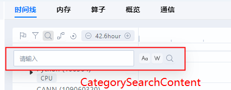

`jumpSlice` 调用 `doJumpSlice`，`doJumpSlice` 中只更新了 `session.locateUnit`.

前端使用了 React Hook。这里 `session.locateUnit` 是其他组件中某个 `use*` hook 的依赖项。

经过调查，发现前端 unit 相关的 hook 在 `modules\timeline\src\components\ChartContainer\Units\hooks` 文件夹下，而跳转目标 hook 就在文件下的 `useLocate.tsx` 中，它就是 `useJumpTarget`.

`useJumpTarget` 目前只在 `Scroller` 中使用。

```ts
// 跳转到指定泳道
useJumpTarget(session, unitsArea, supportJump, sortOptions, (ref as React.MutableRefObject<HTMLDivElement | null>).current);
```

`useJumpTarget` 的核心函数，依赖项是 `[session, dom, unitsArea, tuningScroller]`。

> 其中 `session` 太大了，很容易引起重新生成函数，消耗大量计算资源。
>
> 事实上，`session` 在这个函数中只用了 `session.units` `session.locateUnit` 两个，依赖项可以简化成 `[session.units, session.locateUnit, dom, unitsArea, tuningScroller]`

```ts
React.useEffect(() => autorun(
    () => {
        if (dom === null || !supportJump) { return; }
        if (session.locateUnit === undefined) { return; }
        const targetUnit = getTargetUnit(getRootUnit(session.units), session.locateUnit.target);
        if (targetUnit === undefined) {
            message.warn(t('NotFoundJumpTargetWarn'));
        } else {
            handleUnitSelection(targetUnit);
            session.locateUnit?.onSuccess(targetUnit);
            const scrollHResult = getNormalUnitHeight(unitsArea, orderOptions, targetUnit);
            if (scrollHResult !== undefined) {
                // 第一次 scrollToResult 到 scrollHResult，会请求后端重新绘制泳道
                scrollToResult(scrollHResult, tuningScroller);
            }
        }
        runInAction(() => {
            session.locateUnit = undefined;
        });
    },
), [session, dom, unitsArea, tuningScroller]);
```

##### 4.2.1.1 分析如何调整目标算子的左右位置

<details>
<summary>详情</summary>

上面的算法中有一句 `session.locateUnit?.onSuccess(targetUnit);`，这个 `onSuccess` 显然是 `doJumpSlice` 函数赋值的。现在我们具体看 `doJumpSlice` 的 `onSuccess` 是如何写的

```txt
const doJumpSlice = (session: Session, slice: SliceData, isGlobal: boolean): void => {
    if (slice === undefined) {
        // slice is undefined.
        return;
    }
    runInAction(() => {
        session.locateUnit = {
            target: (unit): boolean => {
                return unit instanceof ThreadUnit && (Boolean(unit.metadata.cardId.includes(slice.rankId))) &&
                    unit.metadata.processId === slice.pid && unit.metadata.threadId === slice.tid;
            },
            onSuccess: (unit): void => {
            ~~~~~~~~~
                if (isGlobal) {
                    session.domainRange = { domainStart: 0, domainEnd: session.endTimeAll ?? session.domain.defaultDuration };
                    session.selectedData = undefined;
                    session.linkFlow = undefined;
                } else {
                    const [rangeStart, rangeEnd] = calculateDomainRange(session,
                        slice.startTime - getTimeOffset(session, unit.metadata as ThreadMetaData), slice.duration);
                    session.domainRange = { domainStart: rangeStart, domainEnd: rangeEnd };
                    session.selectedData = {
                        startTime: slice.startTime - getTimeOffset(session, unit.metadata as ThreadMetaData),
                        duration: slice.duration,
                        depth: slice.depth,
                        threadId: slice.tid,
                        id: slice.id,
                        metaType: (unit.metadata as ThreadMetaData).metaType,
                    };
                    session.linkFlow = generateFlowParam(unit.metadata as ThreadMetaData, slice);
                }
            },
        };
    });
};
```

这里 `doJumpSlice` 传入的 `isGlobal` 是 `false`，先不考虑，看核心代码：

```ts
// 计算领域区间，显然是指目标算子的左右区间
const [rangeStart, rangeEnd] = calculateDomainRange(session,
    slice.startTime - getTimeOffset(session, unit.metadata as ThreadMetaData), slice.duration);
// 赋值给 session，session 将具体处理如何将左右区间更新到前端
session.domainRange = { domainStart: rangeStart, domainEnd: rangeEnd };
// 更新选中项，将具体处理如何高亮目标算子
session.selectedData = {
    startTime: slice.startTime - getTimeOffset(session, unit.metadata as ThreadMetaData),
    duration: slice.duration,
    depth: slice.depth,
    threadId: slice.tid,
    id: slice.id,
    metaType: (unit.metadata as ThreadMetaData).metaType,
};
// 更新连线，将具体处理如何显示目标算子的相关连线
session.linkFlow = generateFlowParam(unit.metadata as ThreadMetaData, slice);
```

###### 更新左右区间

调查发现在五种画布（`EventChart`,`FilledLineChart`,`StackedBarChart`,`StackStatusChart`,`StatusChart`）中都有 hook `useBatchedRender` 关注 `datasState`(来自 hook `useData` 处理 `session.domainRange` 返回的值) 的变化来重绘画布

</details>

##### 4.2.1.2 分析如何调整目标算子的上下位置

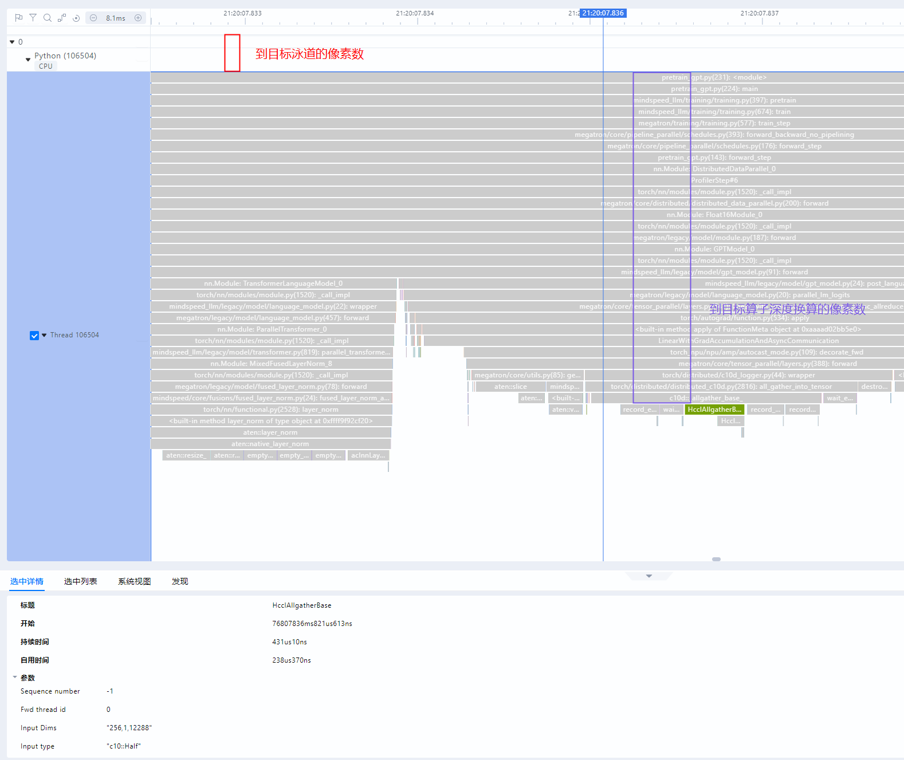

<details>
<summary>详情</summary>

`useJumpTarget` 的核心函数中修改算子上下位置的地方是：

```ts
// 选中目标泳道，打开泳道
handleUnitSelection(targetUnit);
// 处理左右的位置信息（此处与当前逻辑无关）
session.locateUnit?.onSuccess(targetUnit);
// 计算得到移动到目标泳道顶部需要的像素
const scrollHResult = getNormalUnitHeight(unitsArea, orderOptions, targetUnit);
if (scrollHResult !== undefined) {
    // 第一次 scrollToResult 到目标泳道顶部，会请求后端重新绘制泳道
    // tuningScroller 是等重新绘制泳道后再根据算子所在深度微调上下位置
    scrollToResult(scrollHResult, tuningScroller);
}
```

`tuningScroller` 函数具体是

```ts
const tuningScroller = React.useCallback((scrolled: number): void => {
    if (dom === null || !supportJump || session.selectedData === undefined) { return; }
    // UnitHeight.STANDARD 是展开的 Slice 标准高度；1 是 Slice 之间的间隔
    const relativeSliceY: number = Number.isInteger(session.selectedData.depth)
        ? (UnitHeight.STANDARD + 1) * Math.max(session.selectedData.depth as number - 1, 0)
        : 0;
    const halfScrollerHeight = dom.clientHeight / 2;
    const offset = Math.max(relativeSliceY - halfScrollerHeight, 0);
    scrollToResult(scrolled + offset);
}, [session, dom]);
```

</details>

### 4.3 useDraggableContainer 组件设计

useDraggableContainer 组件是 Timeline 中的基础组件

#### 4.3.1 参数

| 序号 | 名称            | 类型              | 说明            | 备注                                |
|:---|:--------------|:----------------|:--------------|:----------------------------------|
| 1  | dragDirection | `DragDirection` | 可拖动组件的位置      |                                   |
| 2  | draggableWH   | `number`        | 可拖动组件默认宽/高    |                                   |
| 3  | open          | `?boolean`      | 是否默认打开可拖动组件   | 默认为 `false`                       |
| 4  | minWH         | `?number`       | 可拖动组件的最小宽/高   | 默认为 `0`                           |
| 5  | sizeMethod    | `?SizeMethod`   | 可拖动组件宽/高的计算单位 | 默认是百分比，目前只有位于右边的可拖动组件可用，其他位置的都是像素 |

```ts
enum DragDirection {
    TOP = 0,
    BOTTOM = 1,
    LEFT = 2,
    RIGHT = 3,
}

enum SizeMethod {
    NUMBER = 'number',
    PERCENT = 'percent',
}
```

##### 全局常量

```ts
const RIGHT_PERCENT = 0.99; // 表示可拖动组件在右边时的最大可展开比例
```

#### 4.3.2 拖动控制

##### 4.3.2.1 拖动状态

```ts
interface MovingState {
  stat: "idle" | "movable" | "moved";
  startX: number;
  startY: number;
  screenX: number;
  screenY: number;
}
```

###### 状态说明

| 序号 | 名称        | 说明   |
|:---|:----------|:-----|
| 1  | `idle`    | 待机状态 |
| 2  | `movable` | 移动状态 |
| 3  | `moved`   | 已移动  |

- `startX` `startY` 记录开始移动时相对视口的鼠标位置，用来判断拖动行为是否有效
- `screenX` `screenY` 记录开始移动时相对窗口的鼠标位置，防止窗口被移动了

##### 4.3.2.2 mousedown

鼠标按下后触发的事件，下发是大致源码与解读：

```txt
const getHandleMouseDown = (dragDirection: DragDirection, draggable: React.RefObject<HTMLDivElement>,
    movingState: React.MutableRefObject<MovingState>, isOpen: React.MutableRefObject<boolean>) => (e: MouseEvent): void => {
    const domDrag = draggable.current; // 可移动的组件
    ...
    let offset;
    const baseMS: MovingState = { stat: 'movable', startX: 0, startY: 0, screenX: e.screenX, screenY: e.screenY };
    const domDragRect = domDrag.getBoundingClientRect();
    switch (dragDirection) { // dragDirection 指的是可拖动组件的位置
        case DragDirection.TOP: // 可拖动组件在上方
            offset = domDragRect.bottom - e.clientY; // e.clientY 指鼠标相对视口顶部的距离，domDragRect.bottom 是可拖动组件底部相对视口顶部的距离
            if (offset <= 8 && offset > 0 && isOpen.current) {
                movingState.current = {
                    ...baseMS,
                    startX: domDragRect.x,
                    startY: domDragRect.bottom,
                };
            }
            break;
        case DragDirection.BOTTOM:
            offset = e.clientY - domDragRect.top; // e.clientY 指鼠标相对视口的距离，domDragRect.top 是可拖动组件顶部相对视口顶部的距离
            if (offset <= 8 && offset > 0 && isOpen.current) {
                movingState.current = {
                    ...baseMS,
                    startX: domDragRect.x,
                    startY: domDragRect.top,
                };
            }
            break;
        case DragDirection.LEFT:
            offset = domDragRect.right - e.clientX; // e.clientX 指鼠标相对视口左边的距离，domDragRect.right 是可拖动组件右边相对视口左边的距离
            if (offset <= 8 && offset > 0 && isOpen.current) {
                movingState.current = {
                    ...baseMS,
                    startX: domDragRect.right,
                    startY: domDragRect.y,
                };
            }
            break;
        default:
            offset = e.clientX - domDragRect.left; // e.clientX 指鼠标相对视口左边的距离，domDragRect.left 是可拖动组件左边相对视口左边的距离
            if (offset <= 8 && offset > 0 && isOpen.current) {
                movingState.current = {
                    ...baseMS,
                    startX: domDragRect.left,
                    startY: domDragRect.y,
                };
            }
            break;
    }
};
```

##### 4.3.2.3 mousemove

鼠标移动时触发的事件，下发是大致源码与解读：

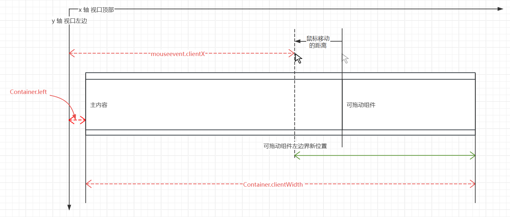

```ts
const handleMouseMove =
  (
    container: React.RefObject<HTMLDivElement>,
    draggable: React.RefObject<HTMLDivElement>,
    movingState: React.MutableRefObject<MovingState>,
    dragDirection: DragDirection,
    minDragWh: number
  ) =>
  (e: MouseEvent): void => {
    const dom = container.current; // 整个容器
    const domDrag = draggable.current; // 可拖动组件
    const moving = movingState.current; // 拖动状态
    if (e.buttons !== 1) {
      // e.buttons === 1 表示鼠标左键
      moving.stat = "idle";
      return;
    }
    if (!dom || !domDrag) {
      return;
    }
    if (moving.stat === "idle") {
      return;
    }
    if (
      Math.abs(e.screenY - moving.screenY) < 2 &&
      Math.abs(e.screenX - moving.screenX) < 2
    ) {
      return;
    }
    let offsetY: number;
    let offsetX: number;
    const domRect = dom.getBoundingClientRect();
    switch (dragDirection) {
      case DragDirection.TOP:
        offsetY = e.y - moving.startY;
        if (Math.abs(offsetY) >= 5) {
          // 计算可拖动组件的新的高度
          // 这里默认可拖动组件在顶部时是紧紧贴合视口顶部的，因此 e.y 作为鼠标相对视口顶部距离正好等于可拖动组件的高度
          // 注意： 这个默认假设不一定成立，但目前使用恰好是这样的
          domDrag.style.height = `${clamp(
            e.y,
            minDragWh,
            dom.clientHeight - minDragWh
          )}px`;
        }
        break;
      case DragDirection.BOTTOM:
        offsetY = e.y - moving.startY;
        if (Math.abs(offsetY) >= 5) {
          // 计算可拖动组件的新的高度
          // 这里默认可拖动组件在底部时是紧紧贴合视口底部的，且整个容器恰好占满这个视口高度。因此 e.y 作为鼠标相对视口顶部距离，dom.clientHeight 相当于视口高度，dom.clientHeight - e.y 正好等于可拖动组件的高度
          // 注意： 这个默认假设不一定成立，但目前使用恰好是这样的
          domDrag.style.height = `${clamp(
            dom.clientHeight - e.y,
            minDragWh,
            dom.clientHeight - minDragWh
          )}px`;
        }
        break;
      case DragDirection.LEFT:
        offsetX = e.x - moving.startX;
        if (Math.abs(offsetX) >= 5) {
          // 计算可拖动组件的新的宽度
          // 这里 e.clientX 作为鼠标相对视口左边距离，domRect.left 是整个容器左边相对视口左边距离，e.clientX - domRect.left 正好等于可拖动组件的宽度
          domDrag.style.width = `${clamp(
            e.clientX - domRect.left,
            245,
            dom.clientWidth - minDragWh
          )}px`;
        }
        break;
      default:
        offsetX = e.x - moving.startX;
        if (Math.abs(offsetX) >= 5) {
          // 计算可拖动组件的新的宽度
          // 这里 e.clientX 作为鼠标相对视口左边距离，domRect.left 是整个容器左边相对视口左边距离，dom.clientWidth 是整个容器的宽度， domRect.left + dom.clientWidth - e.clientX 正好等于可拖动组件的宽度
          domDrag.style.width = `${clamp(
            domRect.left + dom.clientWidth - e.clientX,
            minDragWh,
            dom.clientWidth * RIGHT_PERCENT
          )}px`;
        }
        break;
    }
    moving.stat = "moved"; // 状态为已移动
    e.preventDefault();
  };
```

##### 4.3.2.4 mouseup

鼠标放开时触发的事件，下发是大致源码与解读：

```ts
const handleMouseUp =
  ({
    container,
    draggable,
    movingState,
    dragDirection,
    minDragWh,
    sizeMethod,
  }: {
    container: React.RefObject<HTMLDivElement>,
    draggable: React.RefObject<HTMLDivElement>,
    movingState: React.MutableRefObject<MovingState>,
    dragDirection: DragDirection,
    minDragWh: number,
    sizeMethod?: SizeMethod,
  }) =>
  (e: MouseEvent): void => {
    recoverIframePointerEvent();
    const dom = container.current;
    const domDrag = draggable.current;
    const moving = movingState.current;
    const isDomInvalid =
      !dom || !domDrag || dom.clientHeight === 0 || dom.clientWidth === 0;
    if (moving.stat !== "moved" || isDomInvalid) {
      moving.stat = "idle";
      return;
    }
    const domRect = dom.getBoundingClientRect();
    let dragWHTmp: number;
    // 这里的算法和 mousemove 一样
    switch (dragDirection) {
      case DragDirection.TOP:
        dragWHTmp = clamp(e.y, minDragWh, dom.clientHeight - minDragWh);
        domDrag.style.height =
          sizeMethod === SizeMethod.NUMBER
            ? `${dragWHTmp}px`
            : `${(dragWHTmp / dom.clientHeight) * 100}%`;
        window.dispatchEvent(new Event("topResize"));
        break;
      case DragDirection.BOTTOM:
        dragWHTmp = clamp(
          dom.clientHeight - e.y,
          minDragWh,
          dom.clientHeight - minDragWh
        );
        domDrag.style.height =
          sizeMethod === SizeMethod.NUMBER
            ? `${dragWHTmp}px`
            : `${(dragWHTmp / dom.clientHeight) * 100}%`;
        window.dispatchEvent(new Event("bottomResize"));
        break;
      case DragDirection.LEFT:
        dragWHTmp = clamp(
          e.clientX - domRect.left,
          245,
          dom.clientWidth - minDragWh
        );
        domDrag.style.width =
          sizeMethod === SizeMethod.NUMBER
            ? `${dragWHTmp}px`
            : `${(dragWHTmp / dom.clientWidth) * 100}%`;
        window.dispatchEvent(new Event("leftResize"));
        break;
      case DragDirection.RIGHT:
        dragWHTmp = clamp(
          domRect.left + dom.clientWidth - e.clientX,
          minDragWh,
          dom.clientWidth * RIGHT_PERCENT
        );
        domDrag.style.width =
          sizeMethod === SizeMethod.NUMBER
            ? `${dragWHTmp}px`
            : `${(dragWHTmp / dom.clientWidth) * 100}%`;
        window.dispatchEvent(new Event("rightResize"));
        break;
      default:
        break;
    }
    // 恢复拖动状态为待机状态
    movingState.current = {
      stat: "idle",
      startX: 0,
      startY: 0,
      screenY: 0,
      screenX: 0,
    };
    window.dispatchEvent(new Event("resize"));
  };
```

#### 4.3.3 可拖动容器的布局特点和潜在问题

目前的 html

```react
<Container>
    <div className="topC">主内容</div>
    <div className="bottomC">可拖动组件</div>
</Container>
```

在 `DragDirection.BOTTOM` 和 `DragDirection.RIGHT` 时，可拖动组件的位置是符合文档流的排布的

而在 `DragDirection.TOP` 和 `DragDirection.LEFT` 时，使用了 `flex-direction: column-reverse;` `flex-direction: row-reverse;`

这两个 css 属性可以改变排布方式，让主内容和可拖动组件的位置变化，但是它**不实际改变主内容和可拖动组件相对视口的位置**。

以 `DragDirection.LEFT` 时为例子：

> 应用 flex-direction: row-reverse; 并不会改变子元素或父容器相对于视口的位置。也就是说，如果弹性容器原本位于页面的某个位置（比如距离顶部50像素），那么即使你改变了内部子元素的排列顺序，这个容器及其内容相对于视口的位置保持不变。

图解：
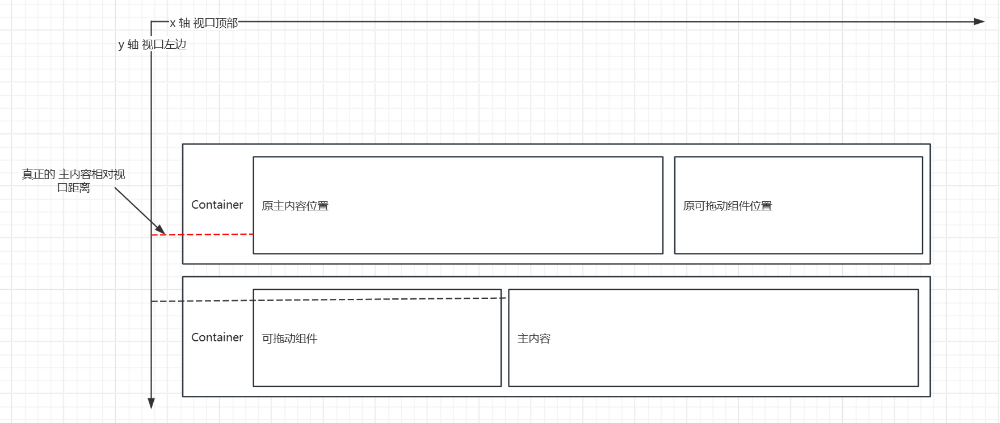


### 4.4 图形化窗格事件设计

图形化窗格事件主要控制了用户在图形化窗格上，如果框选一块矩形区域。如图所示：

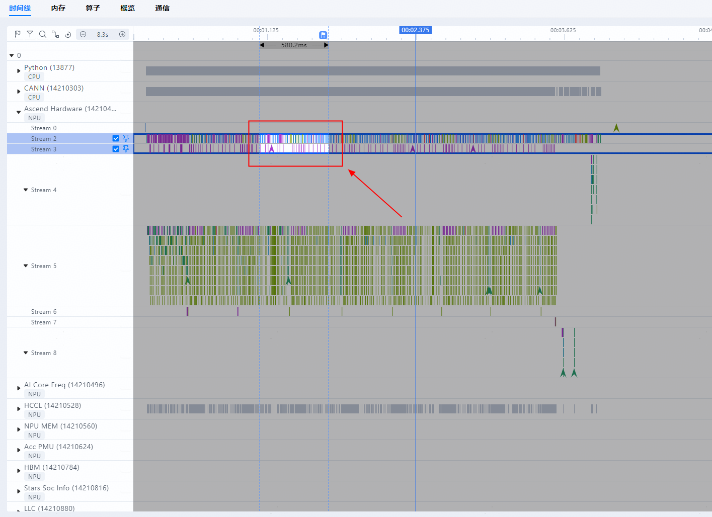

#### 4.4.1 基础概念

控制图形化窗格的数据基本存在 `session`, `ChartInteractor.ts` 中

##### 4.4.1.1 session

| 序号 | 名称            | 类型                         | 作用           |
|:---|:--------------|:---------------------------|:-------------|
| 1  | domainRange   | `DomainRange`              | 控制窗格的领域大小    |
| 2  | selectedRange | `[ TimeStamp, TimeStamp ]` | 控制窗格中选中区间的大小 |

```ts
export interface DomainRange {
    domainStart: TimeStamp;
    domainEnd: TimeStamp;
}
```

##### 4.4.1.2 ChartInteractorProps

| 序号 | 名称                   | 类型                                | 作用                    |
|---:|:---------------------|:----------------------------------|:----------------------|
|  1 | domainStart          | `number`                          | 窗格的起点                 |
|  2 | domainEnd            | `number`                          | 窗格的终点                 |
|  3 | endTimeAll           | `number`                          | 最大的结束时间               |
|  4 | session              | `Session`                         | timeline 的 session 数据 |
|  5 | interactorMouseState | `InteractorMouseState`            | 鼠标相关事件的状态             |
|  6 | onTimeStamp          | `TimeStampCallbackFunc`           | 待确定                   |
|  7 | isNsMode             | `isNsMode`                        | 是否是 NS 模式             |
|  8 | splitLineRef         | `React.RefObject<HTMLDivElement>` | 待确定                   |
|  9 | renderTrigger        | `boolean`                         | 是否渲染 trigger          |
| 10 | selectedRange        | `[ TimeStamp, TimeStamp ]`        | 窗格中选中区间的大小            |

##### 4.4.1.3 InteractorMouseState

| 序号 | 名称         | 类型                                         | 作用         |
|---:|:-----------|:-------------------------------------------|:-----------|
|  1 | clickPos   | `React.MutableRefObject<Pos \| undefined>` | 第一次鼠标点击的位置 |
|  2 | lastPos    | `React.MutableRefObject<Pos \| undefined>` | 鼠标最后移动到的位置 |
|  3 | wheelEvent | `{ ctrlKey: boolean; deltaY: number }`     | 鼠标滚轮事件参数   |

#### 4.4.2 拖动行为

拖动行为在逻辑上的事件顺序是：`点下 -> 移动 -> 放开`

但是在实际中，我们要在窗格区域鼠标点下之前，必须先将鼠标移入窗格，因此实际的事件顺序是：`移动 -> 点下 -> 移动 -> 放开`

##### 4.4.2.1 鼠标点下

触发事件：mousedown

```ts
const onMouseDown = (e: React.MouseEvent): void => {
    const disabled = !isTargetElement(e) || !chartInteractorRef.current || !interactive ||
        session.phase !== 'download' || isMouseOnScrollbar(e, scrollerRef.current);
    if (disabled) {
        interactorMouseState.lastPos.current = undefined;
        return;
    }
    const needDragOneSide = chartInteractorRef.current.mouseDownAction(interactorMouseState, e);
    if (needDragOneSide === MouseDownActionResult.NO_NEED_TO_DRAG_ONE_SIDE) {
        // 此处 interactorMouseState.lastPos.current 有值，因为在 onMouseMove 时已经赋值了
        interactorMouseState.clickPos.current = interactorMouseState.lastPos.current;
    }
};
```

##### 4.4.2.2 鼠标移动

触发事件：mousemove

```ts
const onMouseMove = (e: React.MouseEvent): void => {
    if (!chartInteractorRef.current) {
        return;
    }
    chartInteractorRef.current.mouseMoveAction(interactorMouseState, e);
    // 计算相对位置 x, y. 指的是相对窗格左上角的位置
    const rect = e.currentTarget.getBoundingClientRect();
    const offsetX = e.nativeEvent.x - rect.left - LANE_INFO_WIDTH_PX.value;
    const offsetY = e.nativeEvent.y - rect.top;
    // 以下内容是为 lastPos 赋值，当 offsetX < 0 时表示鼠标已经移出窗格，设置 x 为最小值 0
    if (offsetX <= 0) {
        interactorMouseState.lastPos.current = interactorMouseState.clickPos.current ? { x: 0, y: offsetY } : undefined;
        return;
    }
    interactorMouseState.lastPos.current = { x: offsetX, y: offsetY };
};
```

##### 4.4.2.3 鼠标放开

触发事件：mouseup

```ts
const onMouseUp = (e: MouseEvent): void => {
    if (!chartInteractorRef.current || !interactive) {
        return;
    }
    chartInteractorRef.current.mouseUpAction(interactorMouseState, e);
};
```
关于 `mouseUpAction` 函数的代码如下，目的是更新 selectedRange：

```txt
export const mouseUpAction = (interactorParams: InteractorParams, interactorMouseState: InteractorMouseState, e: MouseEvent): void => {
    const { normalCanvas: canvas, hoverCanvas, session, xReverseScaleRef, xScale, isNsMode, customRenderers, theme } = interactorParams;
    const clickPos = interactorMouseState.clickPos.current;
    const lastPos = interactorMouseState.lastPos.current;
    ...

    if (Math.abs(lastPos.x - clickPos.x) >= MIN_BRUSH_SIZE) {
        // 此处将相对位置 clickPos.x, lastPos.x 通过 xScale 转换成绝对时间 TimeStamp
        const mouseRange: [number, number] = [xScale(clickPos.x), xScale(lastPos.x)];
        const newSelected = mouseRange.sort((a, b) => a - b);

        if (newSelected[0] < session.endTimeAll && session.endTimeAll < newSelected[1]) { newSelected[1] = session.endTimeAll; }
        // 更新 selectedRange
        updateSessionStatus(e, session, newSelected);
    }

    interactorMouseState.clickPos.current = undefined;
    ...
};
```
关于 `updateSessionStatus` 函数的代码如下，描述的是如何更新 selectedRange：

```ts
const updateSessionStatus = (e: MouseEvent, session: Session, newSelected: [number, number]): void => {
    runInAction(() => {
        // 当按住 alt 键，直接将选中区间变成窗格领域区间，实现直接放大成选中区间的功能
        if (e.altKey) {
            session.domainRange = { domainStart: newSelected[0], domainEnd: newSelected[1] };
        }
        // 此处更新选中区间，传入的是：相对偏移位置x经过xScale后的时间数据
        session.selectedRange = newSelected;
        changeRangeMarkerTimestamp(session, newSelected);
        const selectedRange = session.selectedRange[1] - session.selectedRange[0];
        traceStart('selectBrushScope', {
            action: 'selectBrushScope',
            units: session.selectedUnits.map((unit) => unit?.name),
            selectedRange: session.isNsMode ? Math.ceil(selectedRange / 1e6) : selectedRange,
        });
    });
};
```

> **设计说明**
>
> ChartInteractor 上的事件中，**鼠标点下**和**鼠标移动**只更改和窗格的相对位置 x y，不会影响 `session.selectedRange`。
> 只有在**鼠标放开**时才会换算相对位置 x 为绝对时间 timestamp，再更新 `session.selectedRange`。
>
> 移动时绘制的 mask 和选中状态与放开后的 mask 和选中状态不在同一层。移动时绘制的 mask 和选中状态在 ChartInteractor，而放开后的 mask 和选中状态在 ChartContainer

#### 4.4.3 窗格领域左右移动

带动整个窗格左右移动。

触发事件：键盘 <kbd>a</kbd> <kbd>d</kbd> <kbd>&larr;</kbd> <kbd>&rarr;</kbd>

`actionPan.ts`

```ts
// 此处更新窗格领域区间
const moveDomain = (session: Session, direction: number): void => {
    const { domainRange: { domainStart, domainEnd } } = session;
    const timeDuration = domainEnd - domainStart;
    const timeOffset = direction * PAN_RATE * timeDuration;
    const newEnd = clamp(domainEnd + timeOffset, timeDuration, session.endTimeAll ?? session.domain.defaultDuration);
    runInAction(() => {
        session.domainRange = { domainStart: newEnd - timeDuration, domainEnd: newEnd };
    });
};
```

> **设计说明**
>
> 直接修改 `session.domainRange`


### 4.5 Counter 类型泳道数据设计

Counter 泳道如图所示：
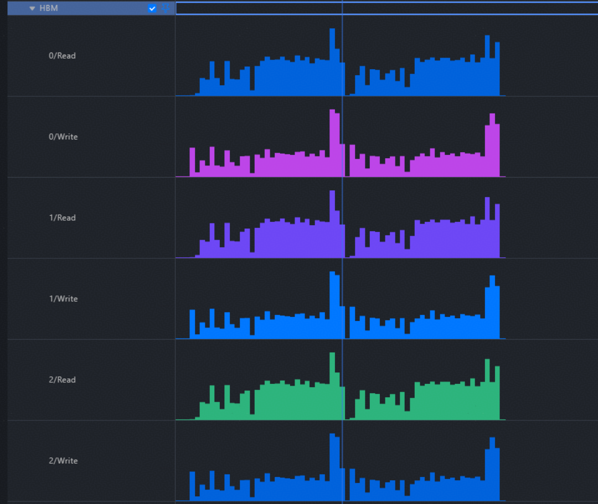

#### 4.5.1 核心接口

<details>
<summary> <code>unit/counter</code> </summary>
req:

```tson
{
  "id": 24,
  "moduleName": "timeline",
  "type": "request",
  "command": "unit/counter",
  "projectName": "D:\\GUI_TEST_DATA\\mstx_profiling_data_db",
  "params": {
    "rankId": "localhost.localdomain2187962182031548519_0 0",
    "pid": "pid",
    "threadName": "0/Read",
    "threadId": "0/Read",
    "metaType": "类型",
    "startTime": 0,
    "endTime": 3061712000,
    "dataSource": {
      "remote": "127.0.0.1",
      "port": 9000,
      "projectName": "D:\\GUI_TEST_DATA\\mstx_profiling_data_db",
      "dataPath": [
        "D:\\GUI_TEST_DATA\\mstx_profiling_data_db\\localhost.localdomain_1106947_20240905131518179_ascend_pt\\ASCEND_PROFILER_OUTPUT"
      ]
    },
    "timePerPx": 2676321.678321678
  }
}
```

resp:

```tson
{
  "type": "response",
  "id": 828,
  "requestId": 26,
  "result": true,
  "command": "unit/counter",
  "moduleName": "timeline",
  "body": {
    "data": [
      {
        "timestamp": 573090,
        "value": {
          "Read(B/s)": 0
        }
      },
      {
        "timestamp": 20534090,
        "value": {
          "Read(B/s)": 115726466
        }
      },
      ...
    ]
  }
}
```

</details> 

#### 4.5.2 DB 场景

##### 4.5.2.1 相关数据表

| #  | 类型                 | 数据表                 | 与 STRING_IDS 的属性 id join 的属性 | startTime   | processName | args                                                                                      | 搜索限制所需参数                                   |
|:---|:-------------------|:--------------------|:-----------------------------|:------------|:------------|:------------------------------------------------------------------------------------------|:-------------------------------------------|
| 1  | `HBM`              | HBM                 | type                         | timestampNs | `A*`        | value,bandwidth                                                                           | deviceId,processName,startTime,timestampNs |
| 2  | `LLC`              | LLC                 | mode                         | timestampNs | `B*`        | throughput,hitRate                                                                        | deviceId,startTime,processName             |
| 3  | `DDR`              | DDR                 | /                            | timestampNs | /           | read,write                                                                                | deviceId,startTime                         |
| 4  | `STARS_SOC`        | SOC_BANDWIDTH_LEVEL | /                            | timestampNs | /           | l2BufferBwLevel,mataBwLevel                                                               | deviceId,startTime                         |
| 5  | `ACC_PMU`          | ACC_PMU             | /                            | timestampNs | /           | readBwLevel,writeBwLevel,readOstLevel,writeOstLevel,accId                                 | deviceId,startTime                         |
| 6  | `NPU_MEM`          | NPU_MEM             | type                         | timestampNs | /           | ddr,hbm,                                                                                  | deviceId,type,startTime                    |
| 7  | `SAMPLE_PMU`       | SAMPLE_PMU_TIMELINE | coreType                     | timestampNs | `C*`        | freq,usage, totalCycle                                                                    | deviceId,value,coreId,startTime            |
| 8  | `ROCE`,`ROH`,`NIC` | RoCE,RoH,NIC        | /                            | timestampNs | `D*`        | rxByteRate,bandwidth,rxPackets,rxErrors,rxDropped,txByteRate,txPackets,txErrors,txDropped | deviceId,funcId,startTime                  |
| 9  | `HCCS`             | HCCS                | /                            | timestampNs | /           | txThroughput,rxThroughput                                                                 | deviceId,startTime                         |
| 10 | `PCIE`             | PCIE                | /                            | timestampNs | /           | txPostAvg,rxPostAvg,txNonpostAvg,rxNonpostAvg,txCplAvg,rxCplAvg,txNonpostLatencyAvg       | deviceId,startTime                         |
| 11 | `AI_CORE`          | AICORE_FREQ         | /                            | timestampNs | /           | freq                                                                                      | deviceId,startTime                         |

`A*`: "hbmId||'/'|| case when value='read' then 'Read' else 'Write' end"

- `{hbmId}/Read`
- `{hbmId}/Write`

`B*`: "glob(modeName||'\*', processName)", "format('%s %s', llcId, case when value='read' then 'Read' else 'Write' end) as modeName"

- `{llcId} Read*`
- `{llcId} Write*`

`C*`: "format('%s Core %s', value, coreId)"

`D*`: "format('Port %s/rx', funcId)"

##### 4.5.2.2 返回值

```cpp
bool DbTraceDataBase::QueryCounterMetadata(const std::string &fileId,
    std::vector<std::unique_ptr<Protocol::UnitTrack>> &metaData)

void DbTraceDataBase::GetCounterUnitsAndDataTypes(PROCESS_TYPE type, std::vector<std::string> &units,
    std::vector<std::vector<std::string>> &dataTypes, std::unique_ptr<Protocol::UnitTrack> &counter)
```

<details>
<summary> 各类型表格的返回值和对应在前端 Process 泳道的名称介绍 </summary>

###### 1. HBM 类型

```tson
{
  "timestamp": 20534090,
  "value": {
    "Read(B/s)": 115726466
  }
}

{
  "timestamp": 20534090,
  "value": {
    "Write(B/s)": 115726466
  }
}
```

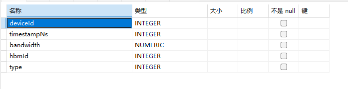

**processName:** `hbmId || '/' || case when value='read' then 'Read' else 'Write' end as processName`，用到 hbmId, type 字段

###### 2. LLC 类型

```tson
{
  "timestamp": 20534090,
  "value": {
    "Throughput(B/s)": 115726466
  }
}

{
  "timestamp": 20534090,
  "value": {
    "Hit Rate(%)": 32
  }
}
```

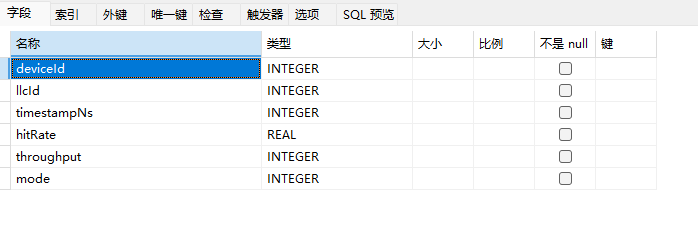

**processName:**

1. `llcId || ' ' || case when value='read' then 'Read' else 'Write' end || '/Throughput' as processName`，用到 llcId, mode 字段
2. `llcId || ' ' || case when value='read' then 'Read' else 'Write' end || '/Hit Rate' as processName`，用到 llcId, mode 字段

###### 3. DDR 类型

```tson
{
  "timestamp": 20534090,
  "value": {
    "Read(B/s)": 115726466
  }
}

{
  "timestamp": 20534090,
  "value": {
    "Write(B/s)": 115726466
  }
}
```

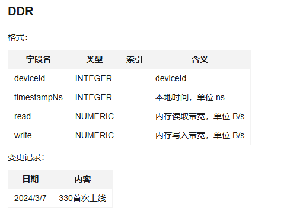

**processName:**

1. `Read`
2. `Write`

###### 4. STARS_SOC 类型

```tson
{
  "timestamp": 20534090,
  "value": {
    "L2 Buffer Bw Level": 115726466
  }
}

{
  "timestamp": 20534090,
  "value": {
    "Mata Bw Level": 115726466
  }
}
```

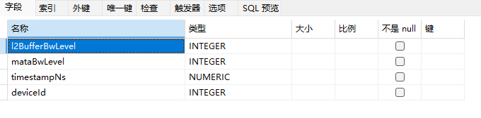

**processName:**

1. `L2 Buffer Bw Level`
2. `Mata Bw Level`

###### 5. ACC_PMU 类型

```tson
{
  "timestamp": 20534090,
  "value": {
    "value": 115726466,
    "acc_id": 12
  }
}
```

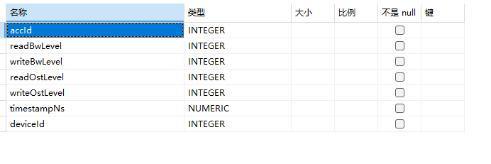

**processName:**

1. `readBwLevel`
2. `writeBwLevel`
3. `readOstLevel`
4. `writeOstLevel`

###### 6. NPU_MEM 类型

```tson
{
  "timestamp": 20534090,
  "value": {
    "B": 115726466
  }
}
```

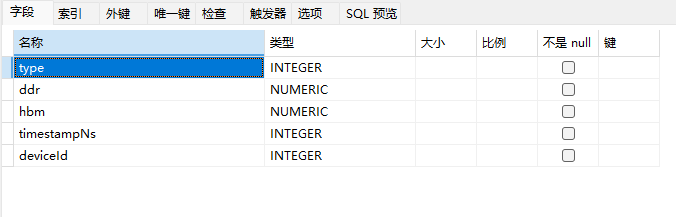

**processName:** 与 type 有关

1. `APP/DDR`
2. `APP/HBM`
3. `APP/MEMORY`
4. `Device/DDR`
5. `Device/HBM`
6. `Device/MEMORY`

###### 7. SAMPLE_PMU 类型

```tson
{
  "timestamp": 20534090,
  "value": {
    "freq(Mhz)": 115726466,
    "usage(%)": 32,
    "totalCycle": 115726466
  }
}
```

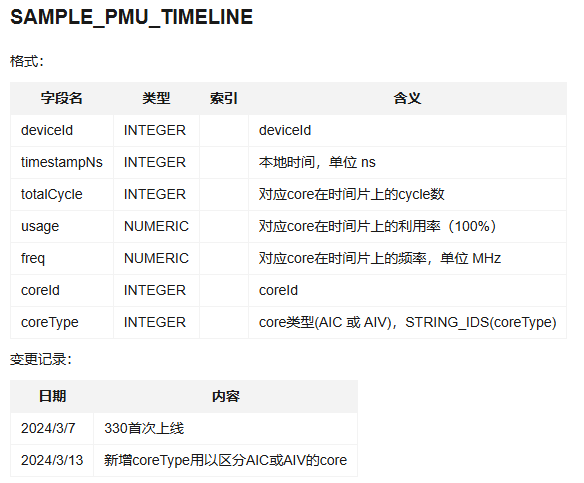

**processName:** `format('%s Core %s', value, coreId)`，用到 coreId, coreType 字段

###### 8. ROCE\ROH\NIC 类型

```tson
// 1
{
  "timestamp": 20534090,
  "value": {
    "rx_bandwidth_effciency": 11572.6466,
    "rx_packets": 11572,
    "rx_error_rate": 11572.6466,
    "rx_dropped_rate": 11572.6466
  }
}
// 2
{
  "timestamp": 20534090,
  "value": {
    "tx_bandwidth_effciency": 11572.6466,
    "tx_packets": 11572,
    "tx_error_rate": 11572.6466,
    "tx_dropped_rate": 11572.6466
  }
}
```

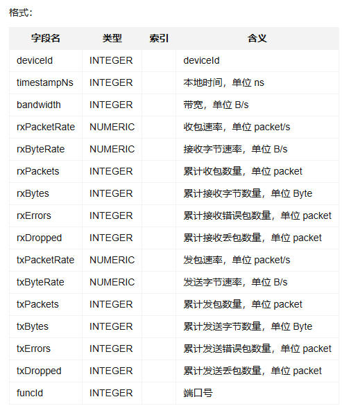

**processName:**

1. `format('Port %s/rx', funcId)`，用到 funcId 字段: 1
2. `format('Port %s/tx', funcId)`，用到 funcId 字段: 2

###### 9. HCCS 类型

```tson
{
  "timestamp": 20534090,
  "value": {
    "txThroughput(B/s)": 11572.6466,
    "rxThroughput(B/s)": 11572.6466
  }
}
```

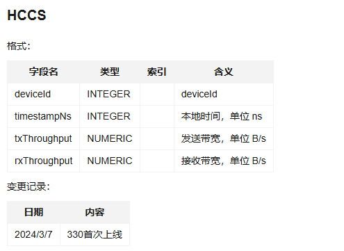

**processName:** `HCCS`

###### 10. PCIE 类型

```tson
// 1
{
  "timestamp": 20534090,
  "value": {
    "txAvg(B/s)": 11572.6466,
    "rxAvg(B/s)": 11572.6466,
  }
}
// 2
{
  "timestamp": 20534090,
  "value": {
    "txAvg(B/s)": 11572.6466
  }
}
```

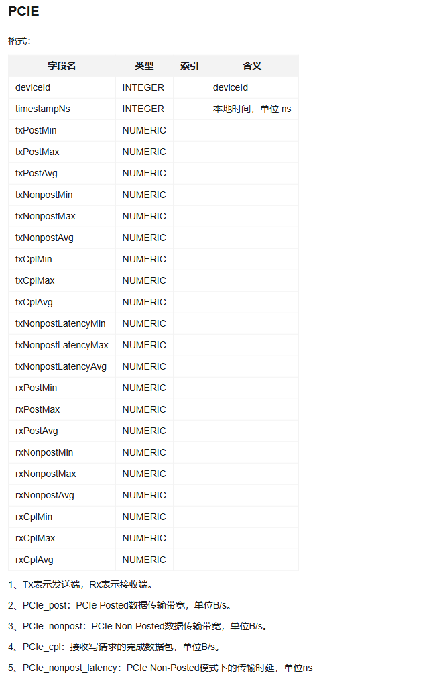

**processName:**

1. `PCIe_post`: 1
2. `PCIe_nonpost`: 1
3. `PCIe_cpl`: 1
4. `PCIe_nonpost_latency`: 2

###### 11. AI_CORE 类型

```tson
{
  "timestamp": 20534090,
  "value": {
    "Mhz": 115726466
  }
}
```

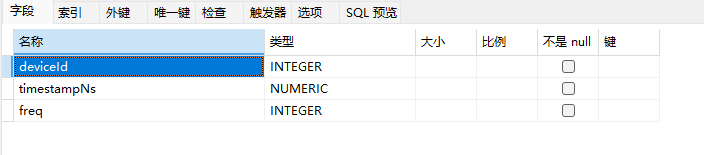

**processName:** `AI Core Freq`

---
</details>

#### 4.5.3 Text 场景

##### 4.5.3.1 相关数据表

| ### | 数据表     | startTime | args | 搜索限制所需参数                            |
|:----|:--------|:----------|:-----|:------------------------------------|
| 1   | counter | timestamp | args | pid,processName,startTime,timestamp |

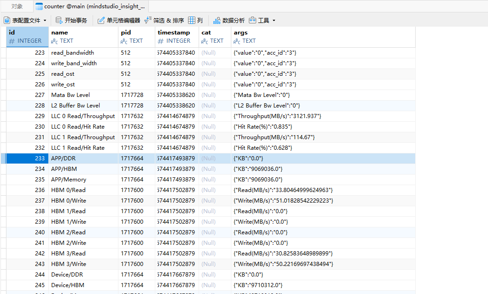

##### 4.5.3.2 解析逻辑

带着一个问题理解下面的逻辑：如何生成的 args ?

1. 运行插入 Counter 的方法

   ```cpp
   void EventParser::CounterEventsHandle(std::unique_ptr<Trace::Event> eventPtr)
   
   bool TextTraceDatabase::InsertCounter(const Trace::CounterResultDescription &event)
   
   bool TextTraceDatabase::InsertCounterList(const std::vector<Trace::CounterResultDescription> &eventList)
   ```
2. 解析 json 文件时，触发的解析逻辑

   ```cpp
   eventHandleMap.emplace("C", std::bind(&EventParser::CounterEventsHandle, this, std::placeholders::_1));
   ```
3. 例子：json 文件中关于 Counter 的片段

   ```tson
   {"processName": "APP/DDR", "ts": "1707359574357536.879", "pid": 1717664, "tid": 0, "args": {"KB": 0.0}, "ph": "C"}
   
   {"processName": "APP/HBM", "ts": "1707359574357536.879", "pid": 1717664, "tid": 0, "args": {"KB": 9069036.0}, "ph": "C"}
   
   {"processName": "write_ost", "ts": "1707359579320538.120", "pid": 512, "tid": 0, "args": {"value": 0, "acc_id": 2}, "ph": "C"}
   ```

### 4.6 Slice ID 设计

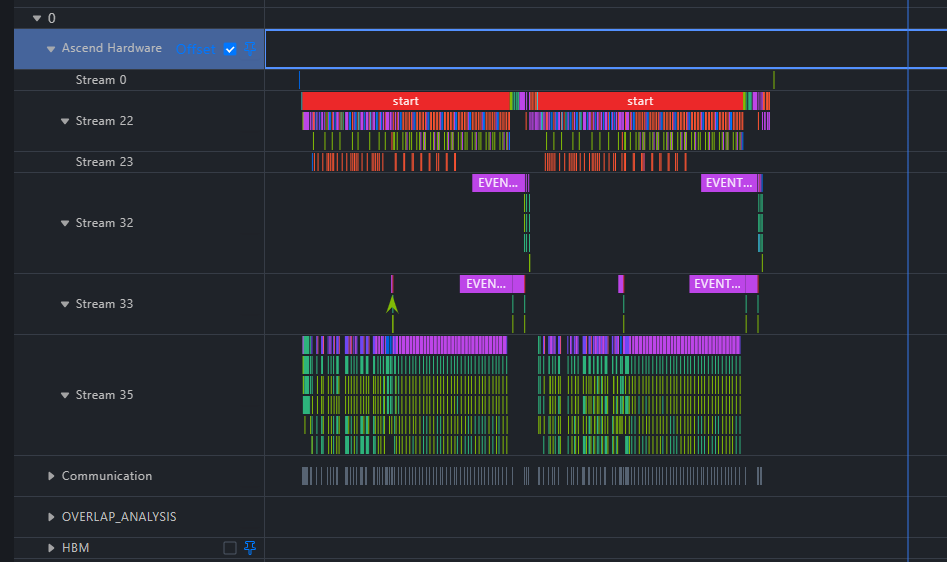

#### 4.6.1 核心接口

1. `unit/threadTraces`

   timeline 获取泳道具体的 slice 列表

   <details>
   <summary>返回值结构体</summary>

   resp:

   ```cpp
   struct ThreadTraces {
       std::string name;
       uint64_t duration = 0;
       uint64_t startTime = 0;
       uint64_t endTime = 0;
       uint32_t depth = 0;
       std::string threadId;
       std::string pid;
       std::string id;
       std::string cname;
   };
   ```

   </details>

2. `unit/one/kernelDetail`

   timeline 根据 slice name 获取 slice 的 id

   <details>
   <summary>返回值结构体</summary>

   resp:

   ```cpp
   struct OneKernelBody {
       std::string id;
       uint64_t depth = {0};
       std::string threadId;
       std::string pid;
       std::string step;
       std::string group;
       std::string rankId;
   };
   ```

   </details>

3. `query/all/same/operators/duration`

   timeline 根据 slice 和时间区间获取其中的 slice 列表

   <details>
   <summary>请求体和返回值结构体</summary>

   req:

   ```tson
   {
     "rankId": "ubuntu8438122216155992192_0 0",
     "tid": ["272_0"],
     "pid": "HCCL",
     "startTime": 1531153458,
     "endTime": 3248708207,
     "name": "Reduce_Inline",
     "wallDuration": 583860,
     "metaType": "HCCL",
     "count": 194,
     "field": "duration",
     "order": "descend",
     "total": 195,
     "current": 1,
     "pageSize": 10,
     "orderBy": "duration"
   }
   ```

   resp:

   ```cpp
   struct SameOperatorsDetails {
       uint64_t timestamp{};
       uint64_t duration{};
       // id、depth用于支持选中列表;
       std::string id;
       // name用于支持overall metric more details列表
       std::string name;
       uint64_t depth{};
       std::string tid;
   };
   ```

   </details>


#### 4.6.2 核心代码

##### 4.6.2.1 `unit/threadTraces` 相关逻辑

ID 基于 MSPROF DB 设计文档

表 1 slice 类型与对应数据表和获取 ID 的方式

| 序号 | 类型               | C++类           | 数据表              | ID             | 备注        |
|:---|:-----------------|:---------------|:-----------------|:---------------|:----------|
| 1  | CANN_API         | CannApiRepo    | CANN_API         | `connectionId` |           |
| 2  | ASCEND_HARDWARE  | HardWareRepo   | TASK             | `ROWID`        |           |
| 3  | HCCL             | HcclRepo       | TASK             | `rowid`        | plane 的类型 |
| 4  |                  |                | COMMUNICATION_OP | `opId`         | group 的类型 |
| 5  | MS_TX            | MstxRepo       | MSTX_EVENTS      | `ROWID`        |           |
| 6  | OVERLAP_ANALYSIS | OverlapAnsRepo | OVERLAP_ANALYSIS | `ROWID`        |           |
| 7  | API              | PythonApiRepo  | PYTORCH_API      | `ROWID`        |           |
| 8  | TEXT             | TextRepository | slice            | `id`           | TEXT 场景   |

###### 类型与类映射关系的定义

```cpp
RepositoryFactory::RepositoryFactory()
{
    sliceRespoMap.emplace(PROCESS_TYPE::ASCEND_HARDWARE, std::make_unique<HardWareRepo>());
    sliceRespoMap.emplace(PROCESS_TYPE::HCCL, std::make_unique<HcclRepo>());
    sliceRespoMap.emplace(PROCESS_TYPE::OVERLAP_ANALYSIS, std::make_unique<OverlapAnsRepo>());
    sliceRespoMap.emplace(PROCESS_TYPE::CANN_API, std::make_unique<CannApiRepo>());
    sliceRespoMap.emplace(PROCESS_TYPE::API, std::make_unique<PythonApiRepo>());
    sliceRespoMap.emplace(PROCESS_TYPE::MS_TX, std::make_unique<MstxRepo>());
    sliceRespoMap.emplace(PROCESS_TYPE::TEXT, std::make_unique<TextRepository>());
    ...
};
```

##### 4.6.2.2 `unit/one/kernelDetail` 相关逻辑

> 注意：HCCL Group 类型获取的 Id 是 COMMUNICATION_OP.rowId, 而不是 COMMUNICATION_OP.opId

| 序号 | 类型               | 是否查询 | 数据表              | ID             | 备注        |
|:---|:-----------------|:-----|:-----------------|:---------------|:----------|
| 1  | CANN_API         |      | CANN_API         | `connectionId` |           |
| 2  | ASCEND_HARDWARE  | 是    | TASK             | `ROWID`        |           |
| 3  | HCCL             |      | TASK             | `rowid`        | plane 的类型 |
| 4  |                  | 是    | COMMUNICATION_OP | `rowId`        | group 的类型 |
| 5  | MS_TX            | 是    | MSTX_EVENTS      | `ROWID`        |           |
| 6  | OVERLAP_ANALYSIS |      | OVERLAP_ANALYSIS | `ROWID`        |           |
| 7  | API              |      | PYTORCH_API      | `ROWID`        |           |

##### 4.6.2.3 `query/all/same/operators/duration` 相关逻辑

> 注意：HCCL Group 类型获取的 Id 是 COMMUNICATION_OP.rowId, 而不是 COMMUNICATION_OP.opId

核心逻辑： `TraceDatabaseHelper::QueryThreadSameOperatorsDetails`

| 序号 | 类型               | 是否查询 | 数据表              | ID             | 备注        |
|:---|:-----------------|:-----|:-----------------|:---------------|:----------|
| 1  | CANN_API         | 是    | CANN_API         | `connectionId` |           |
| 2  | ASCEND_HARDWARE  | 是    | TASK             | `ROWID`        |           |
| 3  | HCCL             | 是    | TASK             | `rowid`        | plane 的类型 |
| 4  |                  | 是    | COMMUNICATION_OP | `rowId`        | group 的类型 |
| 5  | MS_TX            | 是    | MSTX_EVENTS      | `ROWID`        |           |
| 6  | OVERLAP_ANALYSIS | 是    | OVERLAP_ANALYSIS | `ROWID`        |           |
| 7  | API              | 是    | PYTORCH_API      | `ROWID`        |           |


### 4.7 新增 Slice 泳道应该满足的易用性操作与相关接口

| #  | 操作                                | 接口                                  |                                                                                 |
|:---|:----------------------------------|:------------------------------------|:--------------------------------------------------------------------------------|
| 1  | 获取泳道Slice                         | `unit/threadTraces`                 | 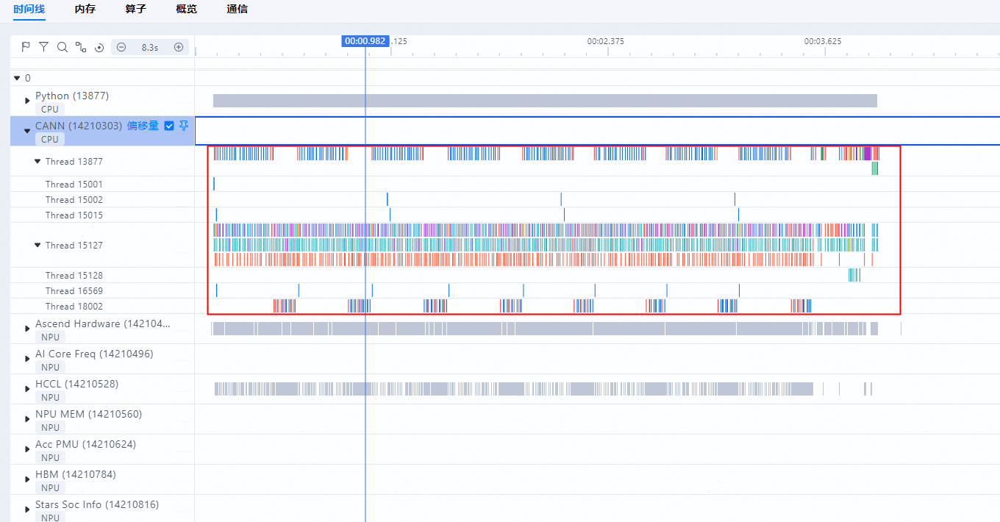                           |
| 2  | 获取泳道Slice缩略图                      | `unit/threadTracesSummary`          | 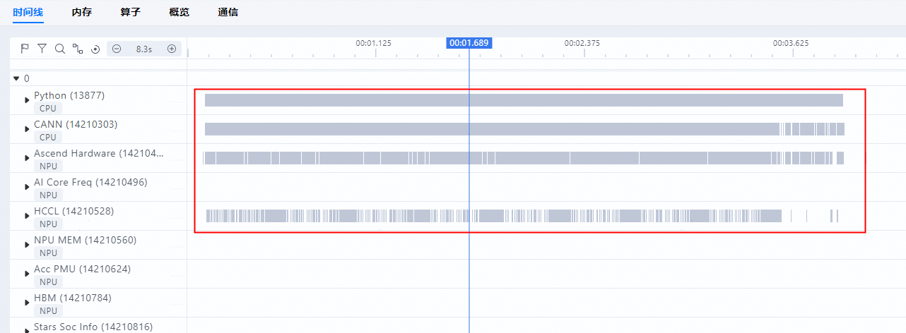                    |
| 3  | 点击算子显示选中详情                        | `unit/threadDetail`                 | 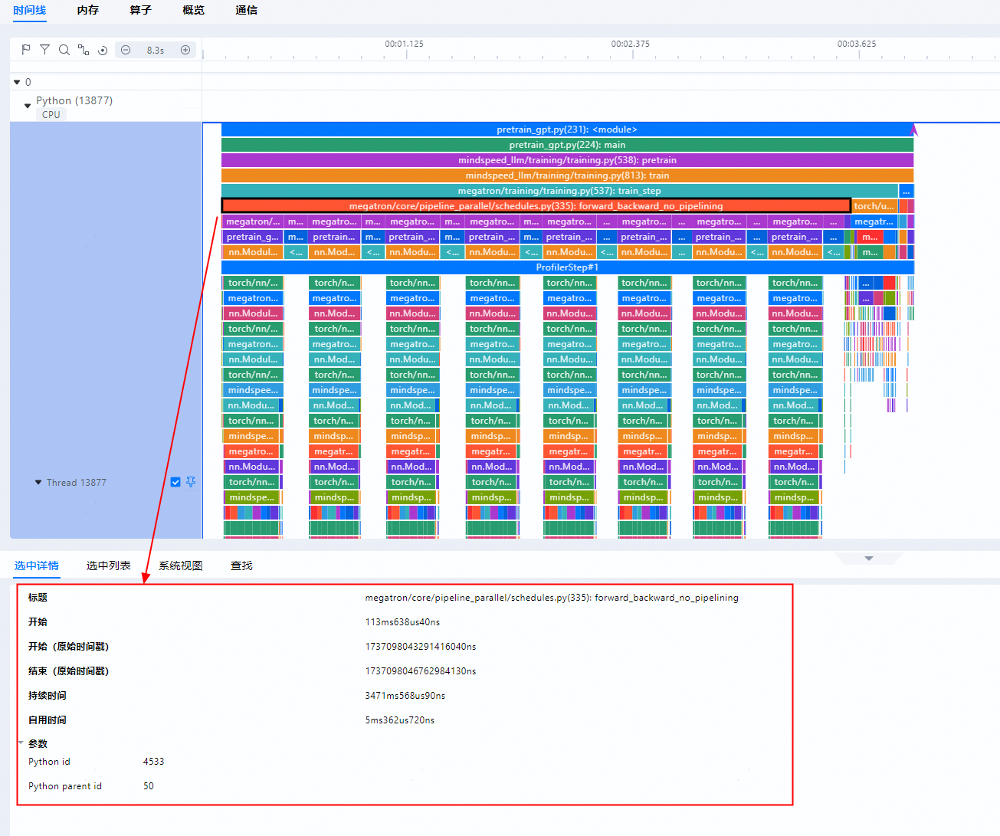                          |
| 4  | 全局搜索获取总数                          | `search/count`                      | 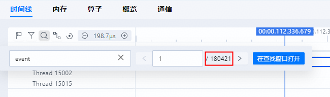                          |
| 5  | 全局搜索获取当前算子                        | `search/slice`                      | 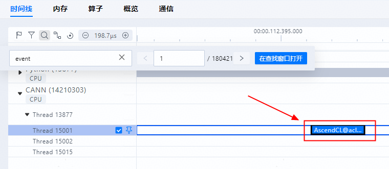                          |
| 6  | 发现列表查询                            | `search/all/slices`                 | 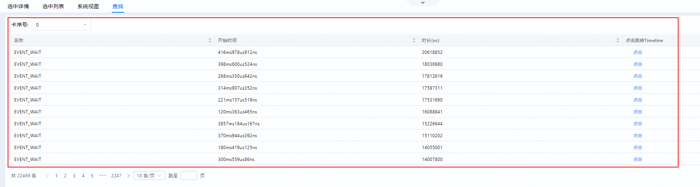                     |
| 7  | 发现列表点击跳转算子                        | `unit/one/kernelDetail`             | 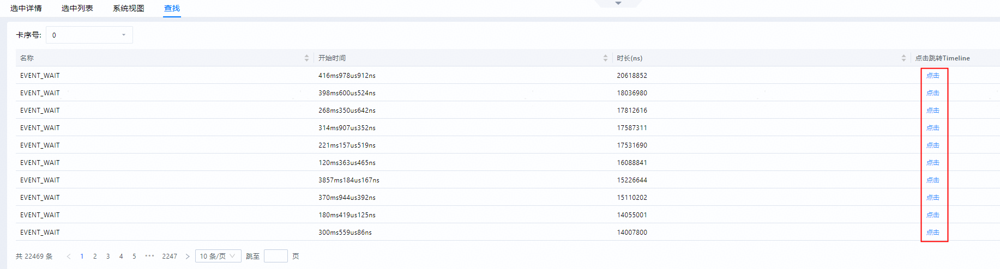                         |
| 8  | 框选泳道获取选中列表                        | `unit/threads`                      | 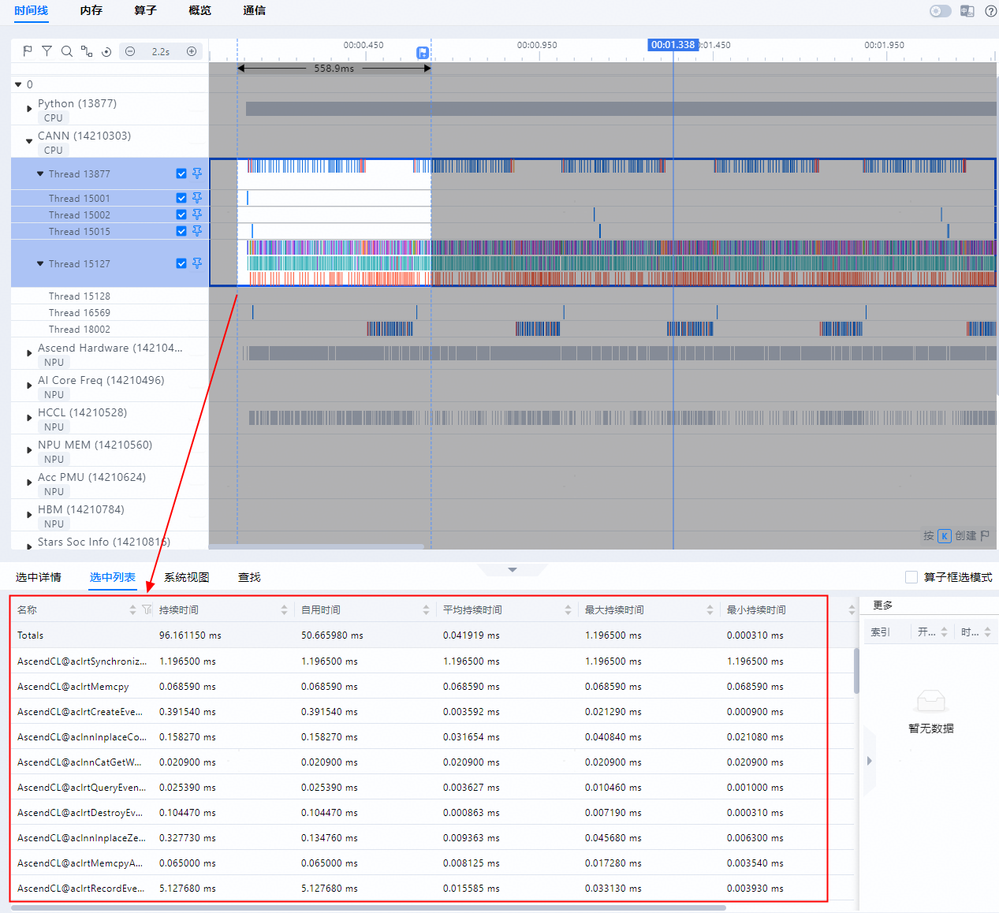    |
| 9  | 根据选中的 Slice 名称和时间区间获取其中的 Slice 列表 | `query/all/same/operators/duration` | 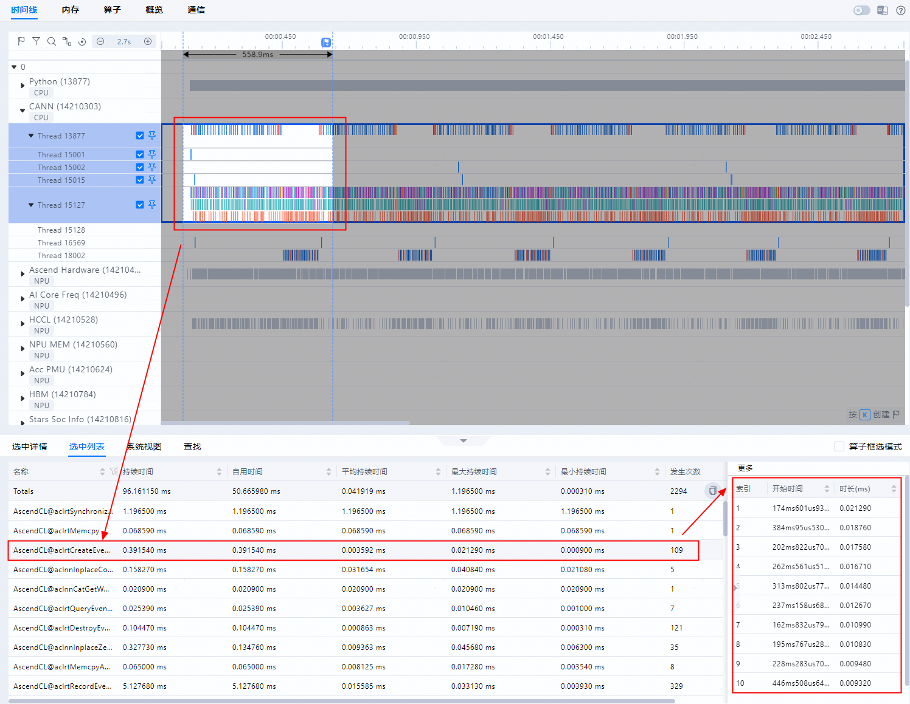 |
| 10 | 点击泳道右键选择在事件视图中展示                  | `unit/eventView`                    | 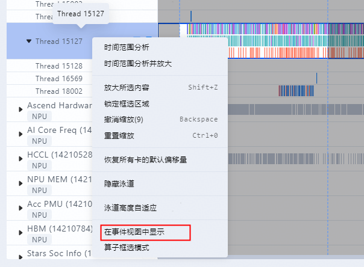                 |


### 4.8 专家系统视图设计

#### 4.8.1 关键设计
专家建议为新增模块，叠加在原有的功能上，整体功能以当前数据为基础，进一步分析数据可能存在的问题。在流程上保持原有 profiling 文件的解析、查询不变，进而新增数据查询相关操作，因此在代码上基本不涉及代码重构，但是会修改数据查询相关实现文件，如 `VirtualTraceDatabase.cpp/h` 等文件。

在具体业务方面，总体上专家建议可以分为单卡类的专家建议和集群的专家建议，单卡类的专家建议主要配合 Timeline 界面一起展示，集群类专家建议则需要在集群界面（如Summary 界面和 Communication 界面）进行展示。在上述需求中，除 “支持集群慢卡慢链路原因识别” 需求外，都是单卡类的专家建议。
下面来详细分析其实现思路。

#### 4.8.2 功能实现设计

##### 4.8.2.1 总体逻辑

专家建议的用例如下图所示。主要包括亲和优化器、亲和API、AICPU算子、ACLNN算子、融合算子识别等单卡维度的优化建议，和集群慢卡、慢链路识别的优化建议。

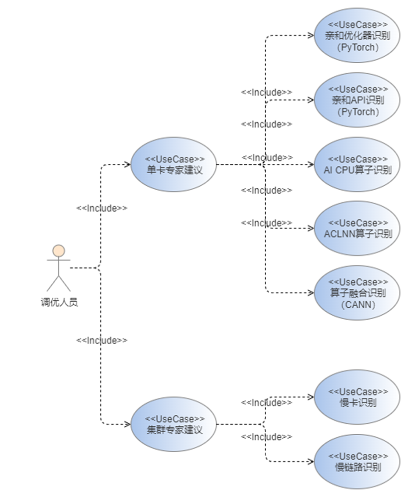

对于上述2类共7个建议，其总体的处理逻辑基本是一致的，如下图中的时序图所示。

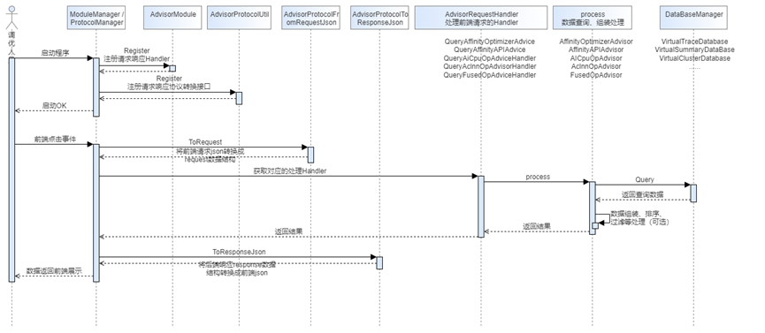

在上面的时序图中：

**（1）** MindStudio Insight 启动时，需要注册请求处理 Handler（多种 Handler 汇总至 AdvisorModule 中，并与接口字段进行绑定）至 ModuleManager 中，注册协议转换（多种协议转换汇总至 AdvisorProtocolUtil 中，并与接口字段进行绑定）。

**（2）** 当前端发起特定请求时，首先会通过接口字段在 ModuleManager 中查找对应的Handler，同时查找并调用对应的前端 json 转 Request 数据结构协议转换将前端请求转换成数据结构，方便后续处理。

**（3）** 调用请求处理 Handler 去处理数据，进一步的 Handler 会调用 process 层方法去处理（此处之所有增加 process 层，是因为很多数据并不是直接查询完数据库数据即可，而是需要进一步地处理，这些处理，会在 process 这一层实现。），process 处理层会去相应的数据库中去查询数据，并对查询完的数据进一步分类、排序、过滤等操作，以得到最终的结果，返回给 Handler。

**（4）** Handler 得到处理数据后，会回到 ModuleManager 中，查找并调用对应的后端 Response 数据结构转前端 json 协议转换方法，将响应组装成 json，返回给前端展示。

##### 4.8.2.2 流程图

###### 亲和 API 识别

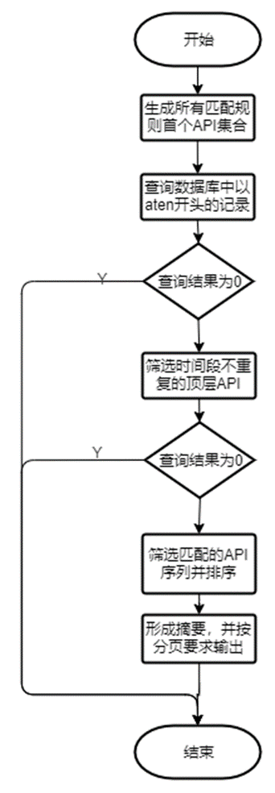

###### 亲和优化器识别

直接读取 SQL 查询结果

###### AI CPU 算子识别

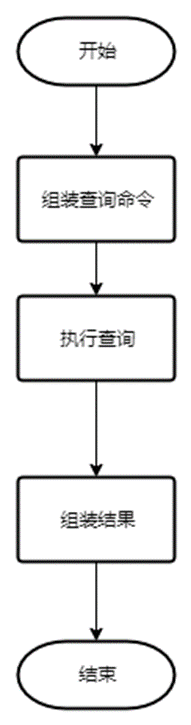

###### ACLNN 算子识别

同亲和优化器流程，唯一不同是 SQL 命令，需要 SQL 命令实现 name 以 `AscendCL@aclnn` 开头且不以 `GetWorkspaceSize` 结尾的算子，其出现需要超过 20 次。

###### 融合算子识别

融合算子识别实现同一条Stream中连续匹配的算子序列，可以使用SQL查询连续匹配序列，但是匹配规则的长度可能是不一样的，因此每次只能匹配一条规则。
可采用join的方式实现连续匹配序列，如：

```sql
SELECT kd1.* FROM kernel_detail kd1
JOIN kernel_detail kd2 ON kd2.row_num = kd1.row_num + 1 AND kd2.name = 'BB'
WHERE kd1.name = 'AA';
```

#### 4.8.3 接口描述

Advisor 模块涉及 5 个新增的前后端请求/响应消息：

1. `QueryAffinityAPIAdvice`：亲和 API 识别
2. `QueryAffinityOptimizerAdvice`：亲和优化器识别
3. `QueryAiCpuOpAdviceHandler`：AI CPU 算子识别
4. `QueryAclnnOpAdvisorHandler`：ACLNN 算子识别
5. `QueryFusedOperatorAdviceHandler`：融合算子识别

#### 4.8.4 总体概述

对于单卡专家建议，其主体将放置在 Timeline 页签内，可以更加方便的与 Timeline 界面进行联动，帮助开发者更快地找到优化点所处的位置，这与友商的 NSight Systems 的设计一致。具体而言：在“Timeline”页签下，“System View”内新增“Expert System View”选项，总体界面放置于页面下方处。

#### 4.8.5 代码设计

新增 Advisor 模块，包括 `AdvisorModule` 类和 `handler`、`process`、`protocol` 三个包：
1. `handler` 包为处理前端请求的 `handler`，不同接口单独成文件，相互独立，后续可持续拓展，`AdvisorModule` 类除了定义 `Advisor` 类基本信息外，还完成上述 `handler` 注册至全局消息接口管理实例中；
2. `process` 包为专家建议的处理实现，向上被 `handler` 调用，向下调用各类数据库查询接口，除完成数据查询外，还要完成数据组装、排序、过滤等等处理；
3. `protocol` 包为前后端交互的协议格式和协议转换实现，除定义接口的数据结构外，还包括前端请求的 json 转换为 request 数据结构和后端响应的 response 数据结构转换为 json 以返回给前端，上述协议转换实现会按照接口字段注册至全局的协议转换管理实例中。

### 4.9 全量连线设计

#### 4.9.1 总体逻辑

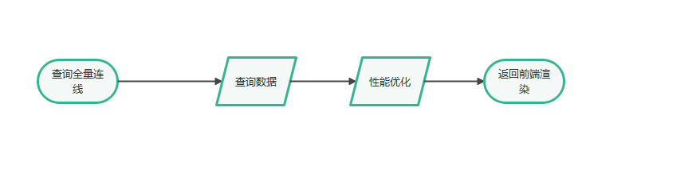

查询数据分为 TEXT 和 DB 两类，其中 TEXT 又细分为算子调优和系统调优。性能优化模块对 TEXT 和 DB 均采用相同的处理逻辑。

#### 4.9.2 TEXT 查询数据

##### 4.9.2.1 表结构

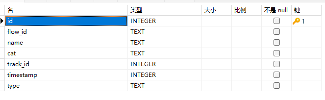

**id:** 主键，用来区分不同的数据，一条数据表示一个连线点
**flow_id:** 连线id，flow_id相同连线点组成连线，通常一条连线由两个连线点决定
**name:** 连线的名字，暂未使用
**cat:** 连线种类

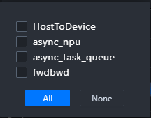

**track_id:** 泳道的唯一标识，用来标识连线点在哪个泳道
**timestamp:** 连线点的时间
**type:** 连线点的类型，分为s，f，t，其中s是开始点，其余为结束点

##### 4.9.2.2 查询逻辑

直接根据cat查询全部的连线点，后续再进行性能优化

#### 4.9.3 DB 查询数据

##### 4.9.3.1 查询逻辑

DB 场景属于定制化场景，连线种类是固定的。

###### async_task_queue

从 python 泳道连到 python 泳道，通过 connectionId 关联，但是结束点连的算子的名字是 `Enqueue`。具体逻辑见:

```cpp
HostFlowRepo::QueryAsyncTaskQueue
```

###### fwdbwd

从 python 泳道连到 python 泳道，通过 connectionId 关联，但是结束点连的算子的名字不是 `Enqueue`。具体逻辑见:

```cpp
HostFlowRepo::QueryFwdbwd
```

###### async_npu

从 python 泳道连到 hardware 和 hccl，通过 connectionId 关联，python 泳道都是起点，hardware 和 hccl 都是终点。具体逻辑见:

```cpp
DbFlowRepo::QueryAsyncNpu
```

###### HostToDevice

从 cann 泳道连到 hardware 和 hccl，通过 connectionId 关联，cann 泳道都是起点，hardware 和 hccl 都是终点。具体逻辑见：

```cpp
DbFlowRepo::QueryHostToDevice
```

###### Mstx

从 mstx 泳道连到 hardware，通过 connectionId 关联，mstx 泳道都是起点，hardware 是终点。具体逻辑见：

```cpp
DbFlowRepo::QueryMsTx
```

#### 4.9.4 性能优化

##### 4.9.4.1 处理流程


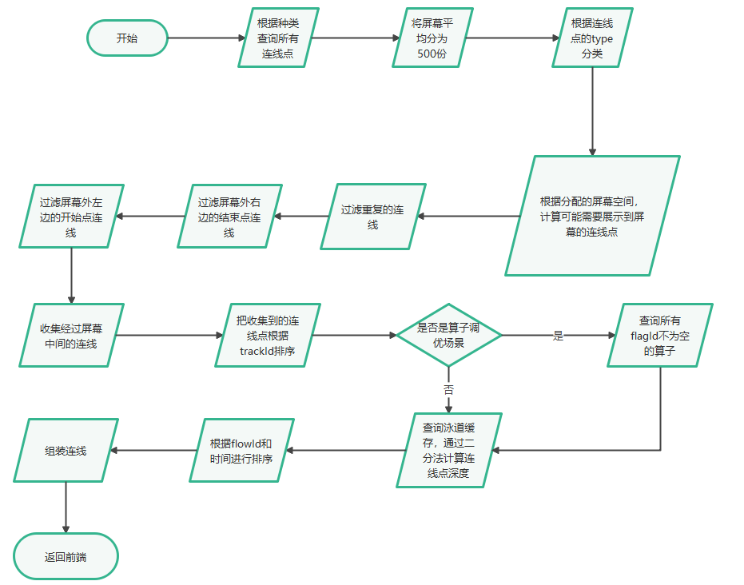

##### 4.9.4.2 数据源统一通过以下接口获取，不区分db和text，底层保证了db和text返回的数据格式一致，详见:
```cpp
dataEngine->QueryFlowPointByCategory
```

##### 4.9.4.3 对连线点进行采样，具体逻辑详见:
```cpp
flowAnalyzerPtr->ComputeScreenFlowPoint
```

##### 4.9.4.4 计算采样后连线点的深度

##### 4.9.4.5 组装连线点成为连线，然后返回前端，详见:

```cpp
flowAnalyzerPtr->ComputeUintFlows
```

