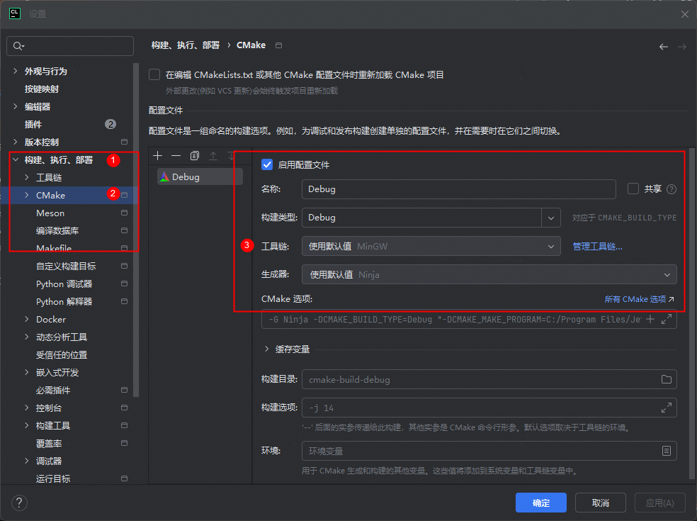
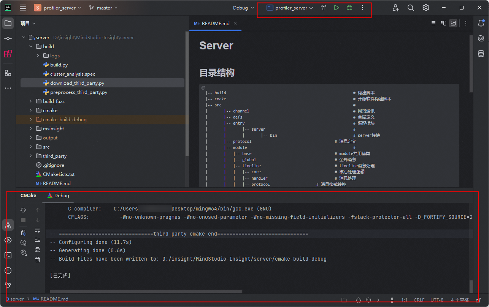
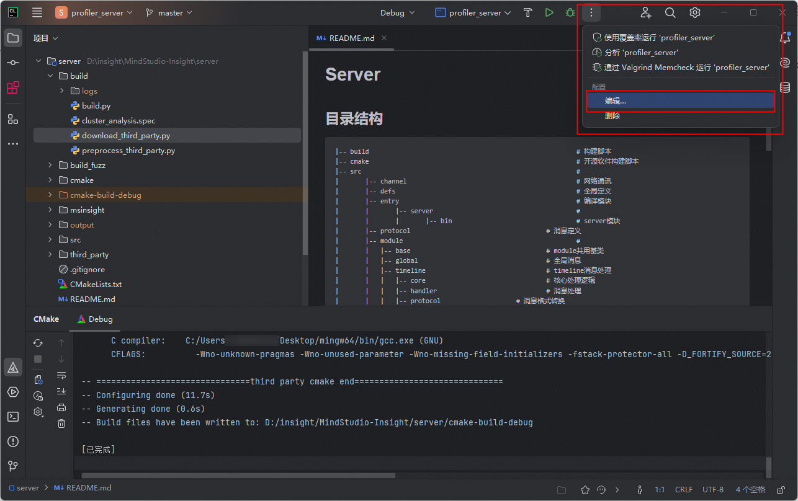
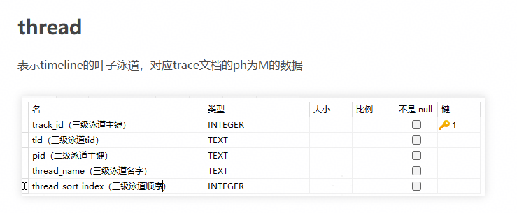

# 开发指南

## 1. MindStudio-Insight开发软件

| 软件名 | 用途 |
| --- | --- |
| Webstorm(推荐)| 编写&启动前端 |
| Clion(推荐) | 编写&启动C++后端 |

## 2. 开发环境配置

| 软件名 | 版本要求 | 用途 |
| --- | --- | --- |
| Node.js | v18.17.1 以上 | 前端 |
| Python | v3.11.x (推荐) | 工具脚本 |
| MinGW | 无 | 执行编译程序 |
| git | 无 | 代码的拉取与提交 |
| cmake | 最低版本：3.16 <br> 最高版本：< 4.0 | 后端项目构建与编译 |

## 3. 开发步骤

### 3.1 代码下载及环境配置

#### 3.1.1 fork代码到自己仓库，并使用git从自己远程仓库clone代码到本地

[MindStudio-Insight](https://gitcode.com/Ascend/msinsight)

#### 3.1.2 使用clion或其他软件打开MindStudio-Insight文件夹下的server文件夹


#### 3.1.3 配置clion设置

1. 点击右上角的设置按钮 选择设置选项


2. 选择**构建、执行、部署**中的**工具链**选项，并且将**工具集**中的路径指向自己下载好的MinGW工具中


3. 选择**构建、执行、部署**中的**CMake**选项，并且将**工具链**指向自己下载好的MinGW


### 3.2 第三方库的下载与执行编译

#### 3.2.1 下载第三方库与预运行第三方库

在server文件夹下新建一个新的终端，在终端中运行如下代码,成功执行如下**图3-1 download_third_party_success**，**图3-2 预运行成功**所示
注：在执行此步骤之前请保证网络畅通

```shell
cd build
python download_third_party.py
python preprocess_third_party.py
```

**图3-1 download_third_party_success** 


**图3-2 预运行成功** 


#### 3.2.2 CMake编译

- 点击右下角的CMake按钮，选择重新加载CMake项目


- 如CMake重载成功则如下图所示

**图3-3 重新加载CMake成功** 


### 3.3 Clion中的Main函数配置与启动，后端开发者测试

#### 3.3.1 Main函数的配置 

- 打开profiler_server旁的更多选项，选择编辑选项


- 选择profiler_server选项，并且将参数修改为 --wsPort=9000 后点击确定保存
注：端口可以设置为其他端口，以避免和其他端口冲突


#### 3.3.2 启动构建profiler_server

- 点击右上角的启动按钮，启动构建profiler_server


- 构建成功如下图所示


#### 3.3.3 后端开发者测试

- 测试框架：GoogleTest

- 覆盖率：后端覆盖率的要求是行覆盖率达到80%，分支覆盖率达到60%。Linux系统上，运行如下代码即可生成覆盖率，覆盖率文件位置是build_llt/output/cpp_coverage/result/index.html。
```
cd build
bash cpp_coverage.sh
```
- 新增开发者测试：后端合入新特性代码时，要求同时补充DT，DT代码位置是server/src/test。在CLion设置的**构建、执行、部署**中的**CMake**选项中添加环境变量`DEV_TYPE=true`，然后重新加载CMake，就可以构建insight_test可执行文件。构建完成后，如果测试用例名称为`TEST_F(TestSuit, TestCase)`，那么执行如下命令就可以只执行TestSuit测试套件的用例，更多用法可以参考GoogleTest官方文档：
```
./insight_test --gtest_filter=TestSuit.*
```

### 3.4. 在WebStorm启动前端

#### 3.4.1 安装前端依赖

- 安装pnpm依赖 

```
npm install -g pnpm
```

- 打开WebStorm进入modules文件夹下，执行安装指令

```
pnpm install
```

- 成功安装结果如下图所示


#### 3.4.2 拉起前端模块服务

- MindStudio-Insight采用模块设计，其中framework模块为基础功能模块，其他模块可按需启动加载

| 文件夹名称 | 对应模块 |
| --- | --- |
| cluster | 概览（summary）、通信（communication） |
| compute | 算子调优 |
| framework | 基础功能 |
| leaks | 内存泄露检查 |
| memory | 内存 |
| operator | 算子 |
| reinforcement-learning | 强化学习 |
| statistic | 服务化调优 |
| timeline | 时间线 |

- 进入模块项目中，在该模块的package.json文件中点击start即可启动该模块


- 模块启动成功如下图所示


**请注意，请确保framework模块启动成功，否则无法启动网页端MindStudio-Insight**

#### 3.4.3 开发者环境下运行MindStudio-Insight

- 在浏览器中输入localhost:5174启动网页端

- 网页端启动成功如下图所示


## 4 新增模块开发

- 此部分只展示架构部分开发以及接入，具体模块实现逻辑请根据实际情况设计开发

### 前端部分

1. 添加新模块目录

   在 modules 目录创建新的模块

   ```shell
       .
       ├── modules
       │   ├── framework
       │   ├── new_module
       │   └── package.json
   ```

   新模块可参考如下目录结构

   ```shell
       .
       ├── new_module
       │   ├── src
       │   │   ├── assets
       │   │   ├── components
       │   │   ├── connection
       │   │   ├── store
       │   │   ├── theme
       │   │   ├── units
       │   │   ├── App.tsx
       │   │   ├── index.tsx
       │   │   └── index.css
       │   ├── craco.config.js
       │   ├── tsconfig.json
       │   └── package.json
   ```

2. 构建配置
   
   craco.config.js

   ```js
   const { webpackCfg, configureConfig } = require("../build-config");

   const path = require("path");

   const libPath = path.resolve(__dirname, "../lib/src");
   const echartsPath = require.resolve("echarts");

   module.exports = {
     devServer: {
       port: 3001,
       open: false,
       client: {
         overlay: {
           runtimeErrors: (error) => {
             // 禁止界面展示错误：ResizeObserver loop completed with undelivered notifications
             return !error?.message.includes("ResizeObserver");
           },
         },
       },
     },
     webpack: {
       alias: webpackCfg.alias,
       configure: (webpackConfig) => {
         return configureConfig(webpackConfig, [libPath, echartsPath]);
       },
     },
   };
   ```

3. 基础 scripts 配置
   
   package.json

   ```json
   {
       "scripts": {
           "start": "cross-env NODE_OPTIONS=--openssl-legacy-provider craco start",
           "build": "cross-env NODE_OPTIONS=\"==--max-old-space-size=3072 --openssl-legacy-provider\" NODE_ENV=production GENERATE_SOURCEMAP=false CI=false craco build",
           "publishWin": "xcopy .\\build ..\\framework\\public\\plugins\\Timeline\\ /E /I /Y",
           "publishLinux": "cp -rf ./build/* ../framework/public/plugins/Timeline",
           ... // 自定义配置
       }
   }
   ```

4. src 中必要模块

   **theme：** 主题

   theme/index.ts

   ```ts
   export { themeInstance } from "@insight/lib/theme";
   export type { ThemeItem } from "@insight/lib/theme";
   ```

   **connection：** 通信

   connection/index.ts

   ```ts
   import { ClientConnector } from "@insight/lib/connection";
   export default new ClientConnector({
     getTargetWindow: (): any[] => [window.parent],
     module: [new_module_request_name],
   });
   ```

   其他部分根据新模块的实际需求自定义

5. 在主服务中加入新模块（微服务）

   framework 模块的 moduleConfig.ts 中，在 modulesConfig 中配置新模块
   
   ```ts
   {
        name: '[new_module]',   // 新模块的微服务名，自定义
        requestName: '[new_module_request_name]', // 前后端交互的模块名，与后端协定
        attributes: {
            src: isDev ? 'http://localhost:[new_port]/' : './plugins/[new_module]/index.html', // 本地开发端口自行分配
        },
        isDefault: true, // 默认是否显示该微服务
        ... // 其他配置条件
    }
   ```

**代码来源：** `build/build.py`

新增模块的构建后清理

```python
def clean():
    out = os.path.join(PROJECT_PATH, Const.OUT_DIR)
    if os.path.exists(out):
        shutil.rmtree(out)
    ascend_insight = os.path.join(PROJECT_PATH, Const.PRODUCT_DIR)
    if os.path.exists(ascend_insight):
        shutil.rmtree(ascend_insight)
    framework_dist = os.path.join(PROJECT_PATH, Const.MODULES_DIR, Const.FRAMEWORK_DIR, 'build')
    if os.path.exists(framework_dist):
        shutil.rmtree(framework_dist)
    # 需在此处添加你的新增模块
    modules = ['cluster', 'memory', 'timeline', 'compute', 'jupyter', 'operator', 'lib', 'statistic', 'leaks',
               'reinforcement-learning']
    for module in modules:
        build_dir = os.path.join(PROJECT_PATH, Const.MODULES_DIR, module, Const.BUILD_DIR)
        if os.path.exists(build_dir):
            shutil.rmtree(build_dir)
```

**代码来源：** `build/build.py`

新增模块的名称以及构建

```python
# 在这里添加你的模块以及对应的模块名称
MODULES_MAP = {
    'cluster': 'Cluster',
    'reinforcement-learning': 'RL',
    'memory': 'Memory',
    'operator': 'Operator',
    'compute': 'Compute',
    'statistic': 'Statistic',
    'leaks': 'Leaks',
    'timeline': 'Timeline',
}
```

**代码来源：** `modules/framework/src/components/TabPane/Index.tsx`

该函数用于根据输入的数据对象 data 更新场景信息，并将更新后的场景信息传递给 updateSession 函数。主要目的是收集和处理各种场景标志，用于后续的会话管理或数据处理。

```tsx
export function updateDataScene(data: Record<string, any>): void {
    const sceneInfo = {
        // 在此处添加新增模块，对应数据更新
        isCluster: data.isCluster ?? false,
        isReset: data.reset ?? false,
        isIpynb: data.isIpynb ?? false,
        isBinary: data.isBinary ?? false,
        hasCachelineRecords: data.hasCachelineRecords ?? false,
        isOnlyTraceJson: data.isOnlyTraceJson ?? false,
        instrVersion: data.instrVersion ?? -1,
        isLeaks: data.isLeaks ?? false,
        isIE: data.isIE ?? false,
        isRL: false,
        isHybridParse: data.isCluster && data.isIE,
    };
    updateSession(sceneInfo);
}

// 在此处添加新增模块，对应页签改变的处理
useEffect(() => {
    // 删除工程的场景：不改变页签
    if (session.isBinary === null && session.isCluster === null) {
        return;
    }
    setScene(session.scene);
    setDataCompose({ hasCachelineRecords: session.hasCachelineRecords, isRL: session.isRL });
}, [session.isBinary, session.isCluster, session.hasCachelineRecords, session.isOnlyTraceJson, session.isIE, session.isLeaks, session.isRL, session.isHybridParse]);
```

**代码来源：** `modules/framework/src/entity/session.ts`

在此处添加新增模块对应的导入数据场景

```ts
// 在此处添加新增模块对应的导入数据场景
// Scene：数据场景：默认、集群、算子调优、Leaks、只trace.json文件
export type Scene = 'Default' | 'Cluster' | 'Compute' | 'OnlyTraceJson' | 'IE' | 'Leaks' | 'RL' | 'HybridParse';

export class Session {
    // 需添加新模块至场景中
    // 场景
    isCluster: boolean | null = false;
    isBinary: boolean | null = false;
    isIE: boolean | null = false;
    isReset: boolean = false;
    isFullDb: boolean = false;
    isOnlyTraceJson: boolean = false;
    isLeaks: boolean = false;
    isRL: boolean = false;
    isHybridParse: boolean = false;
    hasCachelineRecords: boolean = false;
    instrVersion: number = -1;

    // 需添加新模块至场景中
    // 导入数据场景：默认、集群、算子调优、只trace.json
    get scene(): Scene {
        let scene: Scene;
        if (this.isHybridParse) {
            scene = 'HybridParse';
        } else if (this.isOnlyTraceJson) {
            scene = 'OnlyTraceJson';
        } else if (this.isLeaks) {
            scene = 'Leaks';
        } else if (this.isBinary) {
            scene = 'Compute';
        } else if (this.isCluster) {
            scene = 'Cluster';
        } else if (this.isIE) {
            scene = 'IE';
        } else {
            scene = 'Default';
        }
        return scene;
    }
    ....
}
```
**代码来源：** `modules/framework/src/moduleConfig.ts`

需添加新模块至模块设置中

```ts
// 需添加新模块至模块设置中
export interface ModuleConfig {
    name: string;
    requestName: Lowercase<string>;
    attributes: IframeHTMLAttributes<HTMLIFrameElement>;
    isDefault?: boolean;
    isCluster?: boolean;
    isCompute?: boolean;
    isLeaks?: boolean;
    isIE?: boolean;
    isRL?: boolean;
    hasCachelineRecords?: boolean;
    isOnlyTraceJson?: boolean;
    isHybridParse?: boolean;
}
// 需添加新模块至模块设置中，下为模块样例，注意端口号不要与其他模块冲突
{
    name: 'xxx',
    requestName: 'xxx',
    attributes: {
        src: isDev ? 'http://localhost:300x/' : './plugins/xxx/index.html',
    },
    isXXX: true,
},
```

**代码来源：** `modules/lib/src/connection/index.ts`

```ts
// 新增模块的查询接口要写在connection中
```

**代码来源：** `modules/lib/src/i18n/index.ts`

新增模块的中英文切换由公共模块统一管理

```ts
// 新增模块的中英文切换由公共模块统一管理
import xxxEn from './leaks/en.json';
import xxxZh from './leaks/zh.json';

export const resources = {
    enUS: {
        ...en,
        ...frameworkEn,
        ...xxxEn,
    },
    zhCN: {
        ...zh,
        ...frameworkZh,
        ...xxxZh,
    },
};
```

### 后端部分

### 后端开发结构对应
server
├── src
│   ├── modules
│   │   ├── xxx_module
│   │   │   ├── database 
│   │   │   │   ├── xxxBase.h
│   │   │   │   └── xxxBase.cpp
│   │   │   ├── handler
│   │   │   └── protocol

### 后端代码层面

**代码来源：** `server/msinsight/include/base/ProtocolUtil.h`

JSON的协议处理，Response的传递在这里编写

```c++
struct JsonResponse : public Response {
    explicit JsonResponse(const std::string &command) : Response(command) {}
    [[nodiscard]] virtual std::optional<document_t> ToJson() const = 0;
};
struct Event : public ProtocolMessage {
    explicit Event(const std::string &e) : event(e)
    {
        type = ProtocolMessage::Type::EVENT;
    }
    ~Event() override = default;
    std::string event;
    bool result = false;
};
struct JsonEvent : public Event {
    explicit JsonEvent(const std::string &e) : Event(e) {}
    [[nodiscard]] virtual std::optional<document_t> ToJson() const = 0;
};
class ProtocolUtil {
public:
    ProtocolUtil() = default;
    virtual ~ProtocolUtil() = default;

    void Register();
    void UnRegister();

    std::unique_ptr<Request> FromJson(const json_t &requestJson, std::string &error);
    std::optional<document_t> ToJson(const Response &response, std::string &error);
    std::optional<document_t> ToJson(const Event &event, std::string &error);

    // set base info
    // request
    static bool SetRequestBaseInfo(Request &request, const json_t &json);
    // response
    static void SetResponseJsonBaseInfo(const Response &response, document_t &json);
    // event
    static void SetEventJsonBaseInfo(const Event &event, document_t &json);

    // common json to request
    template <class SubRequest>
    static std::unique_ptr<Request> BuildRequestFromJson(const json_t &json, std::string &error)
    {
        static_assert(std::is_same_v<std::unique_ptr<Request>, decltype(SubRequest::FromJson(json, error))>,
                      "SubRequest must have a static FromJson method returning std::unique_ptr<Request>");
        return SubRequest::FromJson(json, error);
    }
    // response to json
    static std::optional<document_t> CommonResponseToJson(const Response &response)
    {
        try {
            const auto& jsonResponse = dynamic_cast<const JsonResponse&>(response);
            return jsonResponse.ToJson();
        } catch (const std::bad_cast& e) {
            return std::nullopt;
        }
    }
    ...
}
```
**代码来源：** `server/src/CMakeLists.txt`

CMake中要编译的新模块要添加在这里

```
# new Module
include_directories(${SRC_HOME_DIR}/modules/xxx)
include_directories(${SRC_HOME_DIR}/modules/xxx/xxx)

# new Module
aux_source_directory(${SRC_HOME_DIR}/modules/xxx xxx_xxx_SRC)

list(APPEND DIC_MODULES_SRC_LIST
        ${DIC_MODULES_XXX_SRC}
        ${DIC_MODULES_XXX_XXX_SRC}
)

```

**代码来源：** `server/src/modules/Plugins.cpp`

在此处添加新模块的相关信息

```CPP
/*
 * -------------------------------------------------------------------------
 * This file is part of the MindStudio project.
 * Copyright (c) 2025 Huawei Technologies Co.,Ltd.
 *
 * MindStudio is licensed under Mulan PSL v2.
 * You can use this software according to the terms and conditions of the Mulan PSL v2.
 * You may obtain a copy of Mulan PSL v2 at:
 *
 *          http://license.coscl.org.cn/MulanPSL2
 *
 * THIS SOFTWARE IS PROVIDED ON AN "AS IS" BASIS, WITHOUT WARRANTIES OF ANY KIND,
 * EITHER EXPRESS OR IMPLIED, INCLUDING BUT NOT LIMITED TO NON-INFRINGEMENT,
 * MERCHANTABILITY OR FIT FOR A PARTICULAR PURPOSE.
 * See the Mulan PSL v2 for more details.
 * -------------------------------------------------------------------------
 */
#include "AdvisorPlugin.h"
#include "GlobalPlugin.h"
#include "MemoryPlugin.h"
#include "OperatorPlugin.h"
#include "SourcePlugin.h"
#include "SummaryPlugin.h"
#include "TimelinePlugin.h"
#include "JupyterPlugin.h"
#include "CommunicationPlugin.h"
#include "IEPlugin.h"
#include "MemoryDetailPlugin.h"
// 在此处添加新模块相关信息
namespace Dic::Module {
    Core::PluginRegister ADVISOR_PLUGIN(std::make_unique<Advisor::AdvisorPlugin>());
    Core::PluginRegister GLOBAL_PLUGIN(std::make_unique<Global::GlobalPlugin>());
    Core::PluginRegister MEMORY_PLUGIN(std::make_unique<Memory::MemoryPlugin>());
    Core::PluginRegister OPERATOR_PLUGIN(std::make_unique<Operator::OperatorPlugin>());
    Core::PluginRegister SOURCE_PLUGIN(std::make_unique<Source::SourcePlugin>());
    Core::PluginRegister SUMMARY_PLUGIN(std::make_unique<Summary::SummaryPlugin>());
    Core::PluginRegister TIMELINE_PLUGIN(std::make_unique<Timeline::TimelinePlugin>());
    Core::PluginRegister JUPYTER_PLUGIN(std::make_unique<Jupyter::JupyterPlugin>());
    Core::PluginRegister COMM_PLUGIN(std::make_unique<Communication::CommunicationPlugin>());
    Core::PluginRegister IE_PLUGIN(std::make_unique<IE::IEPlugin>());
    Core::PluginRegister MEMORY_DETAIL_PLUGIN(std::make_unique<MemoryDetail::MemoryDetailPlugin>());
}

```

**代码来源：** `server/src/modules/defs/ProtocolDefs.h`

在此处添加新模块信息

```h
// 在此处添加新模块信息
const std::string MODULE_XXX = "xxx";

const std::string MODULE_SUMMARY = "summary";
const std::string MODULE_COMMUNICATION = "communication";
const std::string MODULE_MEMORY = "memory";
const std::string MODULE_MEMORY_DETAIL = "memory_detail";
const std::string MODULE_OPERATOR = "operator";
const std::string MODULE_SOURCE = "source";
const std::string MODULE_ADVISOR = "advisor";

```

**代码来源：** `server/src/modules/full_db/database/FullDbParser.cpp`

如果涉及全量db查询，请将在此添加查询，例如如下方法中：

```CPP
// 如果涉及全量db查询，请将在此添加查询，例如如下方法中：
void FullDbParser::Reset()

void FullDbParser::BuildProfilingInitTask(std::shared_ptr<std::vector<std::future<void>>> &futures, std::string &dbId,std::unique_ptr<ThreadPool> &pool)

```

## 6 DB场景新增泳道

### 前端部分

1. 配置DB场景显示模块

   framework/src/moduleConfig.ts

   ```ts
   
    [
       {
          name: 'Timeline',
          requestName: 'timeline',
          attributes: {
             src: isDev ? 'http://localhost:3000/' : './plugins/Timeline/index.html',
          },
          isIE: true,
       },
       {

          name: 'Statistic',
          requestName: 'statistic',
          attributes: {
             src: isDev ? 'http://localhost:3006/' : './plugins/Statistic/index.html',
          },
          isIE: true,
       }
    ]

   ```

2. 导入DB文件

   选择DB文件并发送解析指令`import/action`

    ```ts
   async function handleProjectAction({ action, project, isConflict, selectedFileType, selectedFilePath, selectedRankId }:
   {action: ProjectAction;project: Project;isConflict: boolean;selectedFileType?: LayerType;selectedFilePath?: string;selectedRankId?: string}): Promise<void> {
       ...
       runInAction(async() => {
           ...
           const res = await addDataPath(newProject, action, isConflict, session);
           ...
       });
       ...
   }
   ```
   **代码来源：** `modules/framework/src/units/Project.tsx`
   
   
3. 主服务将解析结果发送给微服务

   ```ts
   export const addDataPath = async function(project: Project, action: ProjectAction, isConflict: boolean, session: Session): Promise<boolean> {
      ...
      connector.send({
         event: 'remote/import',
         body: { dataSource: transformTimelineDataSource(project), importResult: res, switchProject },
         target: 'plugin',
      });
      ...
   }
   ```
   **代码来源：** `modules/framework/src/centralServer/server.ts`


4. 微服务处理数据生成卡/泳道菜单

   ```ts
      export const importRemoteHandler: NotificationHandler = async (data): Promise<void> => {
         ...
         runInAction(() => {
            initUnitInfo(session, result, dataSource, isNeedResetRankId); // 根据解析结果初始化泳道信息
        });
        sendSessionUpdate(result, session);
         ...
      }
   ```
   **代码来源：** `modules/timeline/src/connection/handler.ts`


5. 微服务接收并处理卡解析结果

   parse/success
   ```ts
   export const parseSuccessHandler: NotificationHandler = (data): void => {
     ...
   }
   ```
   **代码来源：** `modules/timeline/src/connection/handler.ts`


6. 微服务获取泳道数据并绘制泳道图
   ```tsx
      const ThreadUnit = unit<ThreadMetaData>({
        name: 'Thread',
        pinType: 'copied',
        chart: chart()
      })
   ```
   **代码来源：** `modules/timeline/src/insight/units/AscendUnit.tsx`


### 后端部分

# 创建一个profiler.db文件


# 创建表结构

# slice

表示timeline的一个长方形色块，对应trace文档的ph为X的数据


建表语句

CREATE TABLE slice (id INTEGER PRIMARY KEY AUTOINCREMENT, timestamp INTEGER, duration INTEGER, name TEXT, depth INTEGER, track_id INTEGER, cat TEXT, args TEXT, cname TEXT, end_time INTEGER, flag_id TEXT);

# process

表示timeline的非叶子泳道，对应trace文档的ph为M的数据


建表语句
CREATE TABLE "process" (
"pid" TEXT,
"process_name" TEXT,
"label" TEXT,
"process_sort_index" INTEGER,
"parentPid" text,
PRIMARY KEY ("pid")
);

# thread

表示timeline的叶子泳道，对应trace文档的ph为M的数据


# counter

表示折线图或者直方图数据，对应ph为C的数据


建表语句
CREATE TABLE counter (id INTEGER PRIMARY KEY AUTOINCREMENT, name TEXT, pid TEXT,timestamp INTEGER, cat TEXT, args TEXT);

# flow

表示连线，对应ph为s，f，t的数据


建表语句
CREATE TABLE flow (id INTEGER PRIMARY KEY AUTOINCREMENT, flow_id TEXT, name TEXT, cat TEXT, track_id INTEGER, timestamp INTEGER, type TEXT);

# dataTable

表示哪些表需要按照如下方式纯表展示


表字段说明


建表语句

CREATE TABLE "data_table" (
"id" INTEGER NOT NULL,
"name" TEXT,
"view_name" TEXT,
PRIMARY KEY ("id")
);

# data_link

表示字段与某张表的某个字段的关联关系


建表语句
CREATE TABLE "data_link" (
"source_name" TEXT NOT NULL,
"target_table" TEXT NOT NULL,
"target_name" TEXT NOT NULL,
PRIMARY KEY ("source_name")
);

# translate

表示文本的中英文翻译


建表语句
CREATE TABLE "translate" (
"key" TEXT NOT NULL,
"value_en" TEXT,
"value_zh" TEXT,
PRIMARY KEY ("key")
);


# 添加非叶子泳道

在process表里添加二级泳道数据


# 添加叶子泳道



# 添加叶子泳道里的色块数据


# 添加色块关联关系


# 添加直方图数据


# 创建好的profiler.db拖入Insight即可看见新增泳道

