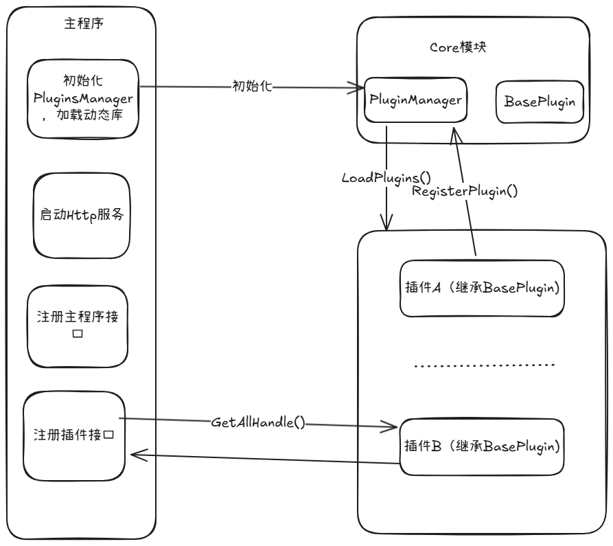

# 开发指南

## 1. MindStudio-Insight开发软件

| 软件名 | 用途 |
| --- | --- |
| Webstorm(推荐)| 编写&启动前端 |
| Clion(推荐) | 编写&启动C++后端 |

## 2. 开发环境配置

| 软件名 | 版本要求 | 用途 |
| --- | --- | --- |
| Node.js | v18.17.1 以上 | 前端 |
| Python | v3.11.x (推荐) | 工具脚本 |
| MinGW | 无 | 执行编译程序 |
| git | 无 | 代码的拉取与提交 |

## 3. 开发步骤

### 3.1 代码下载及环境配置

#### 3.1.1 fork代码到自己仓库，并使用git从自己远程仓库clone代码到本地

[MindStudio-Insight](/MindStudio-Insight)

#### 3.1.2 使用clion或其他软件打开MindStudio-Insight文件夹下的server文件夹


#### 3.1.3 配置clion设置

1. 点击右上角的设置按钮 选择设置选项


2. 选择**构建、执行、部署**中的**工具链**选项，并且将**工具集**中的路径指向自己下载好的MinGW工具中


3. 选择**构建、执行、部署**中的**CMake**选项，并且将**工具链**指向自己下载好的MinGW


### 3.2 三方库的下载与执行编译

#### 3.2.1 下载三方库与预运行三方库

在server文件夹下新建一个新的终端，在终端中运行如下代码,成功执行如下**图3-1 download_third_party_success**，**图3-2 预运行成功**所示
注：在执行此步骤之前请保证网络畅通

```
cd .\build\
python .\download_third_party.py
python .\preprocess_third_party.py
```

**图3-1 download_third_party_success** 


**图3-2 预运行成功** 


#### 3.2.2 CMake编译

- 点击右下角的CMake按钮，选择重新加载CMake项目


- 如CMake重载成功则如下图所示

**图3-3 重新加载CMake成功** 


### 3.3 Clion中的Main函数配置与启动

#### 3.3.1 Main函数的配置 

- 打开profiler_server旁的更多选项，选择编辑选项


- 选择profiler_server选项，并且将参数修改为 --wsPort=9000 后点击确定保存
注：端口可以设置为其他端口，以避免和其他端口冲突


#### 3.3.2 启动构建profiler_server

- 点击右上角的启动按钮，启动构建profiler_server


- 构建成功如下图所示


### 3.4. 在WebStorm启动前端

#### 3.4.1 安装前端依赖

- 安装pnpm依赖 

```
npm install -g pnpm
```

- 打开WebStorm进入modules文件夹下，执行安装指令

```
pnpm install
```

- 成功安装结果如下图所示


#### 3.4.2 拉起前端模块服务

- MindStudio-Insight采用模块设计，其中framework模块为基础功能模块，其他模块可按需启动加载

| 文件夹名称 | 对应模块 |
| --- | --- |
| cluster | 概览（summary）、通信（communication） |
| compute | 算子调优 |
| framework | 基础功能 |
| leaks | 内存泄露检查 |
| memory | 内存 |
| operator | 算子 |
| reinforcement-learning | 强化学习 |
| statistic | 服务化调优 |
| timeline | 时间线 |

- 进入模块项目中，在该模块的package.json文件中点击start即可启动该模块


- 模块启动成功如下图所示


**请注意，请确保framework模块启动成功，否则无法启动网页端MindStudio-Insight**

#### 3.4.3 开发者环境下运行MindStudio-Insight

- 在浏览器中输入localhost:5174启动网页端

- 网页端启动成功如下图所示


## 4 插件开发指南

### 开发环境
+ ubuntu18.04 
+ GCC 7.3.1
+ Nodejs 22.0+
+ MindStudio Insight头文件（本项目下plugin_core/include目录）

### 插件框架

MindStudio Insight整体采用前后端分离+模块化的设计。其中后端采用C++实现，MindStudio Insight主体加载插件，采取动态库加载符号的方式实现。因此插件应当提供以下产物：1.前端产物  2.后端动态库文件（继承MindStudio Insight的基础类）。

下图为整体MindStudio Insight 和插件的架构图


这里面介绍几个重要的步骤和模块：
**主程序**：MindStudio Insight主体,负责几个重要的功能：1.网络通信 2.加载动态库，模块管理

**PluginsManager**: 插件管理类，负责加载管理MindStudio Insight中所有的插件的生命周期

**BasePlugin**: 插件基类，所有插件继承自此

**LoadPlugins()**： 加载插件逻辑

**RegisterPlugin()**: 向主程序注册插件

**GetModuleConfig()**: 通知主程序前端资源文件位置

我们的开发思路也逐渐清晰， 通过继承MindStudio Insight中的插件基类， 开发属于自己的插件后端和前端。MindStudio Insight启动时会调用LoadPlugins()函数加载插件后端程序。后端程序通过RegisterPlugin()向主程序的PluginsManager注册插件基本信息。
主程序中又通过GetModuleConfig()获取前端资源文件位置。到此，主程序已经成功加载了插件的前端和后端信息，接下来主程序负责进行网络通信(Http/websocket)，并为插件提供一些基础服务(文件导入、记忆功能)。

## 插件开发示例

此章节会详细介绍两种通信方式插件的前后端如何搭建Demo项目，项目源码均位于本项目的Example目录下。
### HTTP通信插件后端开发
1. 创建如下目录结构：
    ```shell
    .
    ├── CMakeLists.txt
    ├── include
    │   ├── ApiHandler.h
    │   ├── BasePlugin.h
    │   └── PluginsManager.h
    └── src
    ```
+ **src**: 插件源码目录
+ **include**: 包括了MindStudio Insight插件开发所必须的头文件

2. 在CmakeLists.txt中添加如下内容
    ```cmake
        cmake_minimum_required(VERSION 3.20)
        set(CMAKE_CXX_STANDARD  17)
        set(CMAKE_C_STANDARD 17)
        project("HttpPluginExample" LANGUAGES CXX)
        set(CMAKE_SKIP_RPATH  true)  # 设置通过默认路径或LD_LIBRARY_PATH路径加载动态库
        add_library(${PROJECT_NAME} SHARED
                src/HttpExamplePlugin.h
                src/HttpExamplePlugin.cpp
                src/ExampleHandler.h
        )
        set(LIBRARY_OUTPUT_PATH ${CMAKE_CURRENT_SOURCE_DIR}/output/${PROJECT_NAME})
        target_include_directories(${PROJECT_NAME} PUBLIC ${CMAKE_CURRENT_SOURCE_DIR}/include)
    ```

3. 定义插件类
   创建HttpExamplePlugin.h头文件，其中增加如下内容
    ```C++
        #include "BasePlugin.h"
        using namespace Dic::Core;
        namespace Insight::Example{
        class HttpExamplePlugin:public BasePlugin{
        public:
            HttpExamplePlugin();
            ~HttpExamplePlugin() override = default;
            std::map<std::string, std::shared_ptr<ApiHandler>> GetAllHandlers() override;
            std::vector<std::string> GetModuleConfig() override;
        private:
            std::map<std::string, std::shared_ptr<ApiHandler>> handlers_;
        };
    ```
4. 实现插件方法
    上面我们定义了自己的插件类，但是还没有实现其中的方法，接下来我们将实现插件所必须的函数。其余可由开发者自行探索
    新增文件HttpExamplePlugin.cpp
    **GetModuleConfig**
    正如上面提到的，该函数用于通知主程序前端资源文件的位置。它返回一个vector类型，数组内是插件的json字符串形式配置信息。在HttpExamplePlugin.cpp中添加如下内容：

   ```c++
   std::vector<std::string> HttpExamplePlugin::GetModuleConfig()
       {
           return {R"(
               {
                   "name":"HttpExamplePlugin",
                   "requestName":"HttpExample",
                   "attributes":{
                       "src":"./plugin/Scalar/index.html",
                       "isDefault":true
                   }
                   }
       )"};
       }
   ```
    ​	以下是各个字段的详细说明：

​	**name**: 插件的名称，也用作后续路由，要求不同插件的名称不能重复

​	**requestName**: 插件请求名称，暂未使用，保留字段

​	**attributes**： 插件属性配置

​	**src**: 前端资源文件位置

​	**isDefault**： 默认是否展示

​	**GetAllHandlers()**
​	该函数用于主程序获取插件所支持的接口, 返回一个map。在HttpExamplePlugin.cpp中添加如下内容：
​     

```c++

    // 返回请求接口的map
    std::map<std::string, std::shared_ptr<ApiHandler>> HttpExamplePlugin::GetAllHandlers()
    {
        return {};
    }

```
5.  插件注册

​	前面已经实现了插件的各个方法，但是还没有将插件注册到主程序中，为了实现这个功能，在HttpExamplePlugin.cpp中添加如下内容：


动态库加载时便会初始化pluginRegister符号，并完成注册动作

6. 接口实现

到目前为止,插件的基本功能和注册已经实现。但是，你可能已经注意到了GetAllHandlers返回的是一个空map，也就是说我们的插件现在还是光杆司令。接下来为了使插件真正发挥用武之地，我们向它添加一个接口，接口的功能很简单，将后端收到的消息再返回给前端
添加ExampleHandler.h头文件，在其中增加如下内容：

```c++
    class ExampleHandler:public PostHandler {
    public:
        bool run(std::string_view data, std::string& result) override
        {
            result = "Received request: " + std::string(data);
            return true;
        }
    };
```

### WebSocket类型插件后端开发(推荐形式)

websocket通信的插件支持事件通知，对比Http类型的插件在某些持续性任务上存在较大优势，下面介绍该类型插件开发的步骤，与Http类型相同的步骤略过，读者可自行通过demo工程了解

1. 创建插件声明

   增加WebSocketPluginExample.h，其中增加如下内容

   ```C++
   #include "BasePlugin.h"
   
   class WebSocketExamplePlugin:public BasePlugin {
   public:
       WebSocketExamplePlugin();
       std::vector<std::string> GetModuleConfig() override;
       std::unique_ptr<Dic::Module::BaseModule> GetModule() override;
       std::unique_ptr<Dic::Protocol::ProtocolUtil> GetProtocolUtil() override;
   };
   ```

   这里出现了两个新的函数：

   ​	**GetModule()**：获取WebSocket类型插件的请求路由信息，与Http类型插件中GetAllHandler()函数相当

   ​	**GetProtocolUtil()**: 注册请求应答的序列化方式，WebSocket插件的序列化 

2. 补充插件定义

   增加插件请求处理Module和Protocol注册

   ```c++
   
   std::unique_ptr<Dic::Module::BaseModule> WebSocketExamplePlugin::GetModule()
   {
       return std::make_unique<WebSocketExampleModule>();
   }
   
   std::unique_ptr<Dic::Protocol::ProtocolUtil> WebSocketExamplePlugin::GetProtocolUtil()
   {
       return std::make_unique<WebSocketPluginExampleProtocol>();
   }
   ```

​	下面详细介绍Module类和ProtocolUtil类的实现

3. 增加一个Module类

   Module主要负责请求路由的注册和请求派发。

   增加WebSocketPluginExampleModule.h和WebSocketPluginExampleModule.cpp，分别增加以下内容

   ```C++
   class WebSocketExampleModule : public Dic::Module::BaseModule
   {
   public:
       WebSocketExampleModule();
       ~WebSocketExampleModule() override;
       void RegisterRequestHandlers() override;
       void OnRequest(std::unique_ptr<Dic::Protocol::Request> request) override;
   };
   ```

   注册请求和实现请求派发

   ```C++
   void WebSocketExampleModule::RegisterRequestHandlers()
   {
       requestHandlerMap.emplace("WebSocketExample/test", std::make_unique<WebSocketExampleHandler>());
   }
   
   void WebSocketExampleModule::OnRequest(std::unique_ptr<Dic::Protocol::Request> request)
   {
       BaseModule::OnRequest(std::move(request));
   }
   
   ```

4. 为moudle实现一个Handler请求处理类

   Handler类主要负责对于请求的实际处理逻辑

   增加文件WebSocketExampleHandler.h 和WebSocketExampleHandler.cpp,并向文件中添加如下内容

   ```c++
   class WebSocketExampleHandler:public Dic::Module::ModuleRequestHandler {
   public:
       WebSocketExampleHandler();
       ~WebSocketExampleHandler() override = default;
       void HandleRequest(std::unique_ptr<Dic::Protocol::Request> requestPtr) override;
   };
   ```

   设置请求的路由和基本信息

   ```C++
   WebSocketExampleHandler::WebSocketExampleHandler()
   {
       moduleName = "WebSocketExample";
       command = "WebSocketExample/test";
       async = false;
   }
   ```

   Handler请求类的构造函数，其中`command`字段用于唯一标识某一种请求，建议用插件名+接口名的方式避免与其它插件冲突。`async`字段用于标识请求的异步属性，true则请求为异步请求，false则为同步请求

   ```c++
   void WebSocketExampleHandler::HandleRequest(std::unique_ptr<Dic::Protocol::Request> requestPtr)
   {
       auto &request = dynamic_cast<WebSocketPluginExampleRequest&>(*requestPtr);
       auto responsePtr = std::make_unique<WebSocketPluginExampleResponse>();
       auto& response = *responsePtr;
       SetBaseResponse(request, response);
       response.message = request.message;
       SendResponse(std::move(responsePtr), true);
   }
   ```

   请求处理函数，再其中处理请求的整个流程。主要分为三步：1.请求结构体转换  2.设置response结构体  3.发送应答

5. 为Handler提供自定义的序列化和反序列化功能

   增加请求/应答结构体定义

   ```c++
   #include "ProtocolUtil.h"
   struct WebSocketPluginExampleResponse : public Response
   {
       WebSocketPluginExampleResponse() : Response("WebSocketExampleHandler")
       {
       }
   
       std::string message;
   };
   
   struct WebSocketPluginExampleRequest : public Request
   {
       WebSocketPluginExampleRequest(): Request(std::string_view("WebSocketExample/test")) {}
       std::string message;
   };
   ```

   为请求和应答结构体增加序列化反序列化函数

   ```C++
   inline std::optional<document_t> ToWebSocketPluginExampleResponse(const Response& res)
   {
       const auto& response = dynamic_cast<const WebSocketPluginExampleResponse&>(res);
       document_t json(rapidjson::kObjectType);
       auto& allocator = json.GetAllocator();
       Protocol::ProtocolUtil::SetResponseJsonBaseInfo(response, json);
       json.AddMember(rapidjson::StringRef("message"),
                      json_t().SetString(response.message.c_str(), response.message.length(), allocator),
                      allocator);
       return std::optional<document_t>(std::move(json));
   }
   
   inline std::unique_ptr<Request> ToWebSocketPluginExampleRequest(const json_t& req, std::string& err)
   {
       auto request = std::make_unique<WebSocketPluginExampleRequest>();
       request->message = req.GetString();
       return request;
   }
   ```

   增加事件的序列化函数

   ```c++
   inline std::optional<document_t> ToWebSocketPluginExampleEvent(const Event& baseEvent)
   {
       document_t json(rapidjson::kObjectType);
       json.AddMember(rapidjson::StringRef("eventStr"), json_t().SetString(baseEvent.event.c_str(), baseEvent.event.length(), json.GetAllocator()), json.GetAllocator());
       return std::optional<document_t>(std::move(json));
   }
   ```

   

   将序列化/反序列化注册到ProtocolUtil中

   ```C++
   class WebSocketPluginExampleProtocol : public ProtocolUtil
   {
   public:
       WebSocketPluginExampleProtocol() = default;
       ~WebSocketPluginExampleProtocol() override = default;
   
   private:
       void RegisterEventToJsonFuncs() override
       {
           eventToJsonFactory.emplace("WebSocketExample/testEvent", ToWebSocketPluginExampleEvent);
       }
       void RegisterJsonToRequestFuncs() override
       {
       	jsonToReqFactory.emplace("WebSocketExample/test", ToWebSocketPluginExampleRequest);
   	}
       void RegisterResponseToJsonFuncs() override
       {
       	resToJsonFactory.emplace("WebSocketExample/test", ToWebSocketPluginExampleResponse);
   	}
   };
   ```

### 插件前端开发

前端开发主要围绕几个基本事件

1. 挂载前端的组件到MindStudio Insight上

   App.tsx中增加挂载语句，发送挂载事件消息给MindStudio Insight

   ```js
   window.parent.postMessage({ event: 'pluginMounted' }, '*');
   ```

2. 注册唤醒组件事件

   App.tsx中增加对于`window.onmessage`的处理：

   ```tsx
           window.onmessage = async (e) => {
               // 解析onmessage数据
               const { target, event, data, body } = typeof e.data === 'string' ? safeJSONParse(e.data) : e.data;
               if (target !== 'plugin') {
                   return;
               }
   			
               switch (event) {
                   case 'wakeupPlugin':
                       //唤醒插件
                       setBaseURL(data.url);
                       break;
                   default:
                       break;
               }
           };
   ```

   **setBaseURL**:获取前端链接的URL，设置对应的链接协议

3. 文件导入功能实现

   文件导入功能依赖于MindStudio Insight提供的功能，在导入时会向插件广播一个前端事件，在上方的`onmessage`中增加处理逻辑

   ```tsx
           window.onmessage = async (e) => {
             
               const { target, event, data, body } = typeof e.data === 'string' ? safeJSONParse(e.data) : e.data;
               if (target !== 'plugin') {
                   return;
               }
   
               switch (event) {
                   case 'wakeupPlugin':
                       //唤醒插件
                       setBaseURL(data.url);
                       setHasURL(true);
                       window.parent.postMessage({ event: 'getLanguage' }, '*');
                       window.parent.postMessage({ event: 'getTheme' }, '*');
                       break;
                   case 'remote/import':
                       //导入文件处理逻辑，用户自行实现即可
                       break;
                   default:
                       break;
               }
           };
   ```

4. 额外事件（主题切换、语言切换）

   MindStudio Insight 除了上述两个前端事件外还有主题和语言切换两个事件消息为可选处理

   ```tsx
           window.onmessage = async (e) => {
               const { target, event, data, body } = typeof e.data === 'string' ? safeJSONParse(e.data) : e.data;
               if (target !== 'plugin') {
                   return;
               }
   
               switch (event) {
                   case 'wakeupPlugin':
                       //唤醒插件
                       setBaseURL(data.url);
                       setHasURL(true);
                       window.parent.postMessage({ event: 'getLanguage' }, '*');
                       window.parent.postMessage({ event: 'getTheme' }, '*');
                       break;
                   case 'switchLanguage':
                       //切换语言
                       break;
                   case 'setTheme':
                       //设置主题色
                       if (body.isDark) {
                           // 设置主题逻辑
                       } else {
                           // 设置主题逻辑
                       }
                       break;
                   case 'remote/import':
                       //导入文件
                       break;
                   default:
                       break;
               }
           };
   ```

## 插件编译打包及安装使用

分别打包插件的前后端产物后，我们接下来需要将插件产物打包，并安装到MindStudio Insight中使用。
### 插件打包
为了简化安装流程，MindStudio Insight中提供了插件安装脚本，位于resource/profiler目录下，插件打包也要遵守相应的打包规范，以便于使用安装脚本一键安装
安装包规格：
总体为zip包，其中分为三个部分：配置文件(config.json)、前端文件(zip包)、后端文件(so/zip包)
config.json

```json
    {
        "pluginName":"xxxx",  // 插件名称
        "frontend":"xxx.zip",  // 前端产物
        "backend_${platfrom}_${machine}":"xx.so", //后端产物, ${platform}和${machine}为平台相关变量，通过python的platform模块获取
    }
```
前端文件：前端构建产物的zip包，解压后为前端产物
后端文件：后端构建产物的zip包，一般为对应平台和架构下的so文件，如果一个平台下存在多个so文件需要打包为一个zip包

### 插件安装

在MindStudio Insight安装目录下执行

```shell
    python resource/profile/plugin_install.py install --path=XXX_plugin.zip
```

### 插件使用

打开MindStudio Insight，导入对应数据即可，如果插件实现自己的唤醒逻辑，则依据实际情况。

## 完整示例代码

见本项目plugins/mindstudio-insight-plugins/Example目录下

## 5 新增模块开发

- 此部分只展示架构部分开发以及接入，具体模块实现逻辑请根据实际情况设计开发

### 前端部分


**代码来源：** `build/build.py`

新增模块的构建后清理

```python
def clean():
    out = os.path.join(PROJECT_PATH, Const.OUT_DIR)
    if os.path.exists(out):
        shutil.rmtree(out)
    ascend_insight = os.path.join(PROJECT_PATH, Const.PRODUCT_DIR)
    if os.path.exists(ascend_insight):
        shutil.rmtree(ascend_insight)
    framework_dist = os.path.join(PROJECT_PATH, Const.MODULES_DIR, Const.FRAMEWORK_DIR, 'build')
    if os.path.exists(framework_dist):
        shutil.rmtree(framework_dist)
    # 需在此处添加你的新增模块
    modules = ['cluster', 'memory', 'timeline', 'compute', 'jupyter', 'operator', 'lib', 'statistic', 'leaks',
               'reinforcement-learning']
    for module in modules:
        build_dir = os.path.join(PROJECT_PATH, Const.MODULES_DIR, module, Const.BUILD_DIR)
        if os.path.exists(build_dir):
            shutil.rmtree(build_dir)
```

**代码来源：** `build/build.py`

新增模块的名称以及构建

```python
# 在这里添加你的模块以及对应的模块名称
MODULES_MAP = {
    'cluster': 'Cluster',
    'reinforcement-learning': 'RL',
    'memory': 'Memory',
    'operator': 'Operator',
    'compute': 'Compute',
    'statistic': 'Statistic',
    'leaks': 'Leaks',
    'timeline': 'Timeline',
}
```

**代码来源：** `modules/framework/src/components/TabPane/Index.tsx`

该函数用于根据输入的数据对象 data 更新场景信息，并将更新后的场景信息传递给 updateSession 函数。主要目的是收集和处理各种场景标志，用于后续的会话管理或数据处理。

```tsx
export function updateDataScene(data: Record<string, any>): void {
    const sceneInfo = {
        // 在此处添加新增模块，对应数据更新
        isCluster: data.isCluster ?? false,
        isReset: data.reset ?? false,
        isIpynb: data.isIpynb ?? false,
        isBinary: data.isBinary ?? false,
        hasCachelineRecords: data.hasCachelineRecords ?? false,
        isOnlyTraceJson: data.isOnlyTraceJson ?? false,
        instrVersion: data.instrVersion ?? -1,
        isLeaks: data.isLeaks ?? false,
        isIE: data.isIE ?? false,
        isRL: false,
        isHybridParse: data.isCluster && data.isIE,
    };
    updateSession(sceneInfo);
}

// 在此处添加新增模块，对应页签改变的处理
useEffect(() => {
    // 删除工程的场景：不改变页签
    if (session.isBinary === null && session.isCluster === null) {
        return;
    }
    setScene(session.scene);
    setDataCompose({ hasCachelineRecords: session.hasCachelineRecords, isRL: session.isRL });
}, [session.isBinary, session.isCluster, session.hasCachelineRecords, session.isOnlyTraceJson, session.isIE, session.isLeaks, session.isRL, session.isHybridParse]);
```

**代码来源：** `modules/framework/src/entity/session.ts`

在此处添加新增模块对应的导入数据场景

```ts
// 在此处添加新增模块对应的导入数据场景
// Scene：数据场景：默认、集群、算子调优、Jupter、Leaks、只trace.json文件
export type Scene = 'Default' | 'Cluster' | 'Compute' | 'OnlyTraceJson' | 'IE' | 'Leaks' | 'RL' | 'HybridParse';

export class Session {
    // 需添加新模块至场景中
    // 场景
    isCluster: boolean | null = false;
    isBinary: boolean | null = false;
    isIE: boolean | null = false;
    isReset: boolean = false;
    isFullDb: boolean = false;
    isOnlyTraceJson: boolean = false;
    isLeaks: boolean = false;
    isRL: boolean = false;
    isHybridParse: boolean = false;
    hasCachelineRecords: boolean = false;
    instrVersion: number = -1;

    // 需添加新模块至场景中
    // 导入数据场景：默认、集群、算子调优、Jupter、只trace.json
    get scene(): Scene {
        let scene: Scene;
        if (this.isHybridParse) {
            scene = 'HybridParse';
        } else if (this.isOnlyTraceJson) {
            scene = 'OnlyTraceJson';
        } else if (this.isLeaks) {
            scene = 'Leaks';
        } else if (this.isBinary) {
            scene = 'Compute';
        } else if (this.isCluster) {
            scene = 'Cluster';
        } else if (this.isIE) {
            scene = 'IE';
        } else {
            scene = 'Default';
        }
        return scene;
    }
    ....
}
```
**代码来源：** `modules/framework/src/moduleConfig.ts`

需添加新模块至模块设置中

```ts
// 需添加新模块至模块设置中
export interface ModuleConfig {
    name: string;
    requestName: Lowercase<string>;
    attributes: IframeHTMLAttributes<HTMLIFrameElement>;
    isDefault?: boolean;
    isCluster?: boolean;
    isCompute?: boolean;
    isLeaks?: boolean;
    isIE?: boolean;
    isRL?: boolean;
    hasCachelineRecords?: boolean;
    isOnlyTraceJson?: boolean;
    isHybridParse?: boolean;
}
// 需添加新模块至模块设置中，下为模块样例，注意端口号不要与其他模块冲突
{
    name: 'xxx',
    requestName: 'xxx',
    attributes: {
        src: isDev ? 'http://localhost:300x/' : './plugins/xxx/index.html',
    },
    isXXX: true,
},
```

**代码来源：** `modules/lib/src/connection/index.ts`

```ts
// 新增模块的查询接口要写在connection中
```

**代码来源：** `modules/lib/src/i18n/index.ts`

新增模块的中英文切换由公共模块统一管理

```ts
// 新增模块的中英文切换由公共模块统一管理
import xxxEn from './leaks/en.json';
import xxxZh from './leaks/zh.json';

export const resources = {
    enUS: {
        ...en,
        ...frameworkEn,
        ...xxxEn,
    },
    zhCN: {
        ...zh,
        ...frameworkZh,
        ...xxxZh,
    },
};
```

### 后端部分

### 后端开发结构对应
server
├── src
│   ├── modules
│   │   ├── xxx_module
│   │   │   ├── database 
│   │   │   │   ├── xxxBase.h
│   │   │   │   └── xxxBase.cpp
│   │   │   ├── handler
│   │   │   └── protocol

### 后端代码层面

**代码来源：** `server/msinsight/include/base/ProtocolUtil.h`

JSON的协议处理，Response的传递在这里编写

```c++
struct JsonResponse : public Response {
    explicit JsonResponse(const std::string &command) : Response(command) {}
    [[nodiscard]] virtual std::optional<document_t> ToJson() const = 0;
};
struct Event : public ProtocolMessage {
    explicit Event(const std::string &e) : event(e)
    {
        type = ProtocolMessage::Type::EVENT;
    }
    ~Event() override = default;
    std::string event;
    bool result = false;
};
struct JsonEvent : public Event {
    explicit JsonEvent(const std::string &e) : Event(e) {}
    [[nodiscard]] virtual std::optional<document_t> ToJson() const = 0;
};
class ProtocolUtil {
public:
    ProtocolUtil() = default;
    virtual ~ProtocolUtil() = default;

    void Register();
    void UnRegister();

    std::unique_ptr<Request> FromJson(const json_t &requestJson, std::string &error);
    std::optional<document_t> ToJson(const Response &response, std::string &error);
    std::optional<document_t> ToJson(const Event &event, std::string &error);

    // set base info
    // request
    static bool SetRequestBaseInfo(Request &request, const json_t &json);
    // response
    static void SetResponseJsonBaseInfo(const Response &response, document_t &json);
    // event
    static void SetEventJsonBaseInfo(const Event &event, document_t &json);

    // common json to request
    template <class SubRequest>
    static std::unique_ptr<Request> BuildRequestFromJson(const json_t &json, std::string &error)
    {
        static_assert(std::is_same_v<std::unique_ptr<Request>, decltype(SubRequest::FromJson(json, error))>,
                      "SubRequest must have a static FromJson method returning std::unique_ptr<Request>");
        return SubRequest::FromJson(json, error);
    }
    // response to json
    static std::optional<document_t> CommonResponseToJson(const Response &response)
    {
        try {
            const auto& jsonResponse = dynamic_cast<const JsonResponse&>(response);
            return jsonResponse.ToJson();
        } catch (const std::bad_cast& e) {
            return std::nullopt;
        }
    }
    ...
}
```
**代码来源：** `server/src/CMakeLists.txt`

CMake中要编译的新模块要添加在这里

```
# new Module
include_directories(${SRC_HOME_DIR}/modules/xxx)
include_directories(${SRC_HOME_DIR}/modules/xxx/xxx)

# new Module
aux_source_directory(${SRC_HOME_DIR}/modules/xxx xxx_xxx_SRC)

list(APPEND DIC_MODULES_SRC_LIST
        ${DIC_MODULES_XXX_SRC}
        ${DIC_MODULES_XXX_XXX_SRC}
)

```

**代码来源：** `server/src/modules/Plugins.cpp`

在此处添加新模块的相关信息

```CPP
// Copyright (c) Huawei Technologies Co., Ltd. 2024-2024. All rights reserved.
#include "AdvisorPlugin.h"
#include "GlobalPlugin.h"
#include "MemoryPlugin.h"
#include "OperatorPlugin.h"
#include "SourcePlugin.h"
#include "SummaryPlugin.h"
#include "TimelinePlugin.h"
#include "JupyterPlugin.h"
#include "CommunicationPlugin.h"
#include "IEPlugin.h"
#include "MemoryDetailPlugin.h"
// 在此处添加新模块相关信息
namespace Dic::Module {
    Core::PluginRegister ADVISOR_PLUGIN(std::make_unique<Advisor::AdvisorPlugin>());
    Core::PluginRegister GLOBAL_PLUGIN(std::make_unique<Global::GlobalPlugin>());
    Core::PluginRegister MEMORY_PLUGIN(std::make_unique<Memory::MemoryPlugin>());
    Core::PluginRegister OPERATOR_PLUGIN(std::make_unique<Operator::OperatorPlugin>());
    Core::PluginRegister SOURCE_PLUGIN(std::make_unique<Source::SourcePlugin>());
    Core::PluginRegister SUMMARY_PLUGIN(std::make_unique<Summary::SummaryPlugin>());
    Core::PluginRegister TIMELINE_PLUGIN(std::make_unique<Timeline::TimelinePlugin>());
    Core::PluginRegister JUPYTER_PLUGIN(std::make_unique<Jupyter::JupyterPlugin>());
    Core::PluginRegister COMM_PLUGIN(std::make_unique<Communication::CommunicationPlugin>());
    Core::PluginRegister IE_PLUGIN(std::make_unique<IE::IEPlugin>());
    Core::PluginRegister MEMORY_DETAIL_PLUGIN(std::make_unique<MemoryDetail::MemoryDetailPlugin>());
}

```

**代码来源：** `server/src/modules/defs/ProtocolDefs.h`

在此处添加新模块信息

```h
// 在此处添加新模块信息
const std::string MODULE_XXX = "xxx";

const std::string MODULE_SUMMARY = "summary";
const std::string MODULE_COMMUNICATION = "communication";
const std::string MODULE_MEMORY = "memory";
const std::string MODULE_MEMORY_DETAIL = "memory_detail";
const std::string MODULE_OPERATOR = "operator";
const std::string MODULE_SOURCE = "source";
const std::string MODULE_ADVISOR = "advisor";

```

**代码来源：** `server/src/modules/full_db/database/FullDbParser.cpp`

如果涉及全量db查询，请将在此添加查询，例如如下方法中：

```CPP
// 如果涉及全量db查询，请将在此添加查询，例如如下方法中：
void FullDbParser::Reset()

void FullDbParser::BuildProfilingInitTask(std::shared_ptr<std::vector<std::future<void>>> &futures, std::string &dbId,std::unique_ptr<ThreadPool> &pool)

```

## 6 DB场景新增泳道

### 前端部分

- 待补充

### 后端部分

# 创建一个profiler.db文件


# 创建表结构

# slice

表示timeline的一个长方形色块，对应trace文档的ph为X的数据


建表语句

CREATE TABLE slice (id INTEGER PRIMARY KEY AUTOINCREMENT, timestamp INTEGER, duration INTEGER, name TEXT, depth INTEGER, track_id INTEGER, cat TEXT, args TEXT, cname TEXT, end_time INTEGER, flag_id TEXT);

# process

表示timeline的非叶子泳道，对应trace文档的ph为M的数据


建表语句
CREATE TABLE "process" (
"pid" TEXT,
"process_name" TEXT,
"label" TEXT,
"process_sort_index" INTEGER,
"parentPid" text,
PRIMARY KEY ("pid")
);

# thread

表示timeline的叶子泳道，对应trace文档的ph为M的数据


# counter

表示折线图或者直方图数据，对应ph为C的数据


建表语句
CREATE TABLE counter (id INTEGER PRIMARY KEY AUTOINCREMENT, name TEXT, pid TEXT,timestamp INTEGER, cat TEXT, args TEXT);

# flow

表示连线，对应ph为s，f，t的数据


建表语句
CREATE TABLE flow (id INTEGER PRIMARY KEY AUTOINCREMENT, flow_id TEXT, name TEXT, cat TEXT, track_id INTEGER, timestamp INTEGER, type TEXT);

# dataTable

表示哪些表需要按照如下方式纯表展示


表字段说明


建表语句

CREATE TABLE "data_table" (
"id" INTEGER NOT NULL,
"name" TEXT,
"view_name" TEXT,
PRIMARY KEY ("id")
);

# data_link

表示字段与某张表的某个字段的关联关系


建表语句
CREATE TABLE "data_link" (
"source_name" TEXT NOT NULL,
"target_table" TEXT NOT NULL,
"target_name" TEXT NOT NULL,
PRIMARY KEY ("source_name")
);

# translate

表示文本的中英文翻译


建表语句
CREATE TABLE "translate" (
"key" TEXT NOT NULL,
"value_en" TEXT,
"value_zh" TEXT,
PRIMARY KEY ("key")
);


# 添加非叶子泳道

在process表里添加二级泳道数据


# 添加叶子泳道


# 添加叶子泳道里的色块数据


# 添加色块关联关系


# 添加直方图数据


# 创建好的profiler.db拖入Insight即可看见新增泳道

