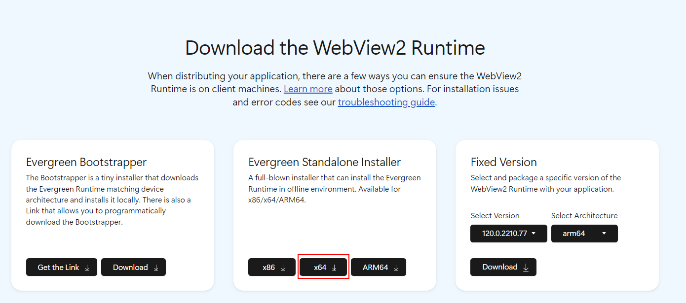

# **FAQ**

## 运行MindStudio Insight工具时出现Missing Dependencies报错弹窗

**问题现象**

在Windows系统运行MindStudio Insight工具时出现Missing Dependencies报错弹窗，且无法运行MindStudio Insight工具。


**原因分析**

系统缺少程序运行的WebView2Runtime文件。

**解决方案**

1. 单击[链接](https://developer.microsoft.com/en-US/microsoft-edge/webview2/#download-section)，进入Microsoft官网。
2. 下载“Evergreen Standalone Installer”中x64的安装包，如[**图 1**  WebView2安装包](#WebView2安装包)所示。

    **图 1**  WebView2安装包<a id="WebView2安装包"></a>    
    

3. 安装完成后，重新运行MindStudio Insight。

## 如何重新解析text格式的Profiling文件

**问题现象**

在同一版本的MindStudio Insight软件下，再次导入text格式的Profiling文件时，不会重新解析数据，当需要重新解析数据时，该如何解析？

**解决方案**

删除Profiling数据目录中的解析结果文件mindstudio\_insight\_data.db后，再次导入数据即可重新解析。

## EulerOS等系统上运行MindStudio Insight工具无法弹出数据导入选择框

**问题现象**

在EulerOS等系统上运行MindStudio Insight工具，单击界面左上方工具栏中的，无法弹出导入选择框。

**解决方案**

1. 登录到待安装的MindStudio Insight环境。
2. 执行以下命令，设置环境变量。

    ```shell
    export WEBKIT_DISABLE_COMPOSITING_MODE=1
    ```

3. 执行以下命令，启动MindStudio Insight。

    ```shell
    ./MindStudio-Insight
    ```

## 通过X11转发方式运行MindStudio Insight工具时，输入框信息粘贴有误

**问题现象**

在Linux系统，通过X11转发方式运行MindStudio Insight工具时，在输入框已存在信息情况下，重新粘贴所需信息时会出现错误。

**原因分析**

在Linux系统，通过X11转发方式运行MindStudio Insight工具时，默认开启了“copy on select”，导致剪贴板的信息会变为输入框已存在信息，造成输入框信息粘贴有误。

**解决方案**

方案一：

1. 在远程登录工具菜单栏单击“Settings \> Configuration“。此处以MobaXterm工具为例。
2. 选择“X11“页签，在“Clipboard“选项中选择“disable"copy on select"“，如[**图 1**  MobaXterm Configuration](#MobaXterm Configuration)所示。

    **图 1**  MobaXterm Configuration<a id="MobaXterm Configuration"></a>  
    

3. 单击“OK”。
4. 完成配置后，重新运行MindStudio Insight。

方案二：

在MindStudio Insight界面，先删除输入框中已存在的信息，再重新复制粘贴所需信息。

## MindStudio Insight工具拖入网络磁盘目录无法加载数据

**问题现象**

在MindStudio Insight工具导入数据时，选择网络磁盘目录，无法导入。

**原因分析**

MindStudio Insight工具仅支持导入本地磁盘目录，而网络磁盘未映射至本地，无法导入。

**解决方案**

1. 打开电脑的文件资源管理器。
2. 单击“此电脑 \> 映射网络驱动器”，弹出“映射网络驱动器”弹窗，如[**图 1**  映射网络驱动器](#映射网络驱动器)。

    **图 1**  映射网络驱动器<a id="映射网络驱动器"></a>  
    

3. 下拉“驱动器\(D\)”选框，选择连接指定的驱动器号。
4. 单击“文件夹\(O\)”后的“浏览”，选择所需映射的网络目录。
5. 单击“完成\(F\)”，完成网络目录至本地的映射操作。
6. 打开MindStudio Insight工具，重新选择映射后的目录，即可正常导入。

## MindStudio Insight工具运行时出现Out of Memory报错

**问题现象**

在MindStudio Insight工具运行时，页面出现错误代码：Out of Memory。

**原因分析**

当前使用的电脑系统整体内存不足。

**解决方案**

1. 自行关闭消耗大量内存的程序和不必要的应用，释放电脑系统内存。
2. 在MindStudio Insight工具报错页面单击“刷新“按钮，重新加载页面。

## MindStudio Insight工具拖入文件显示禁用

**问题现象**

在Windows系统上安装MindStudio Insight时，选择勾选“Run MindStudio Insight“自动打开MindStudio Insight的情况下，拖入文件显示禁用。

**解决方案**

1. 关闭当前已打开的MindStudio Insight工具。
2. 双击桌面的“MindStudio Insight”快捷方式图标，或安装目录下的“MindStudio-Insight.exe”，重新打开MindStudio Insight工具。
3. 拖入文件，即可正常显示。

## MindStudio Insight运行时出现“cannot open shared object file swrast\_dri.so”报错

**问题现象**

在Linux系统使用“X11方式”或“VNC方式”启动MindStudio Insight时，MindStudio Insight工具界面白屏，出现“cannot open shared object file swrast\_dri.so”报错信息，如[**图 1**  报错截图](#报错截图)所示。

**图 1**  报错截图<a id="报错截图"></a>  


**原因分析**

可能是缺少依赖。

**解决方案**

1. 执行以下命令，安装转发依赖文件。

    ```shell
    yum install -y mesa-dri-drivers
    ```

2. 安装完成后，重新打开MindStudio Insight工具即可。

## 启动VNC时出现“Oh no! Something has gone wrong.”报错

**问题现象**

在Linux系统上，使用“VNC方式”启动MindStudio Insight时，启动VNC，出现“Oh no! Something has gone wrong.”报错弹窗，如[**图 1**  报错信息](#报错信息)所示。

**图 1**  报错信息<a id="报错信息"></a>  


**原因分析**

可能是未开启AllowTcpForwarding。

VNC在某些情况下需要通过SSH通道来实现连接，而TCP转发正是支持这个功能的关键。如果AllowTcpForwarding被关闭，则SSH不允许使用端口转发，因此无法通过SSH通道访问VNC服务。开启AllowTcpForwarding后，就能在本地或远程通过SSH通道连接到VNC服务。

**解决方案**

需要配置SSH服务端。

1. 进入/etc/ssh/路径，打开sshd\_config文件。
2. 修改文件中的AllowTcpForwarding为“yes”。
3. 执行以下命令，重启SSH服务端。

    ```shell
    systemctl restart sshd
    ```

4. 重启成功后，重新打开新的窗口启动VNC。

## OpenEuler及其衍生操作系统在安装依赖时提示找不到相关依赖

**问题现象**

在Linux操作系统上，OpenEuler及其衍生操作系统在安装依赖时，提示找不到相关依赖。

**原因分析**

配置的源没有相关依赖。

**解决方案**

可参见[链接](https://www.hiascend.com/forum/thread-02101178181671140059-1-1.html)配置新的源，并重新安装对应依赖。

## MindStudio Insight导入数据时显示黑屏

**问题现象**

在MindStudio Insight工具页面，第一次导入数据显示正常，第二次导入相同的数据时，“概览“界面和“通信“界面显示黑屏。

**解决方案**

方案一：关闭当前MindStudio Insight，重启即可恢复正常。

方案二：在当前MindStudio Insight工具页，查看或导入其他的数据后，再次选择查看刚才的数据，页面即可恢复正常。

## MindStudio Insight导入数据后通信界面未显示数据

**问题现象**

使用MindStudio Insight工具导入数据后，通信界面未显示数据。

**原因分析**

当前导入的性能数据目录与以ascend\_ms结尾的目录之间存在多层子文件夹，例如：profiling/rank\_x/dyn\_prof\_data/rank\_x\_start\_xxx\_end\_xxx/xxx\_ascend\_ms，此时，MindStudio Insight工具会将导入的数据识别为集群数据，导致通信界面显示异常。

**解决方案**

找到以ascend\_ms结尾的目录，将其拷贝至新创建的目录下，保证该目录层级为_目录名称_/ascend\_ms结尾的目录，在MindStudio Insight工具中重新导入该目录，即可正常显示。

## MindStudio Insight在TencentOS Server 4.4\_x86操作系统中启动失败

**问题现象**

在Linux的TencentOS Server 4.4\_x86操作系统中，启动MindStudio Insight工具，启动失败，报错信息如下：

```tex
** (MindStudio-Insight:302256): WARNING **: 08:07:35.531: webkit_settings_set_enable_offline_web_application_cache is deprecated and does nothing.
JIT session error: Missing definitions in module fs789_variant0_6-jitted-objectbuffer: [ fs_variant_whole ]
Failed to materialize symbols: { (fs789_variant0_6, { fs_variant_partial, fs_variant_whole }) }
JIT session error: Could not find symbol at given index, did you add it to JITSymbolTable? index: 4, shndx: 0 Size of table: 5
Failed to materialize symbols: { (fs790_variant0_7, { fs_variant_partial }) }
```

**解决方案**

执行以下命令后，重新启动MindStudio Insight工具。

```shell
export JSC_useJIT=0
export JSC_useDFGJIT=0
export JSC_useFTLJIT=0
export WEBKIT_DISABLE_COMPOSITING_MODE=1
unset https_proxy
unset http_proxy
```
