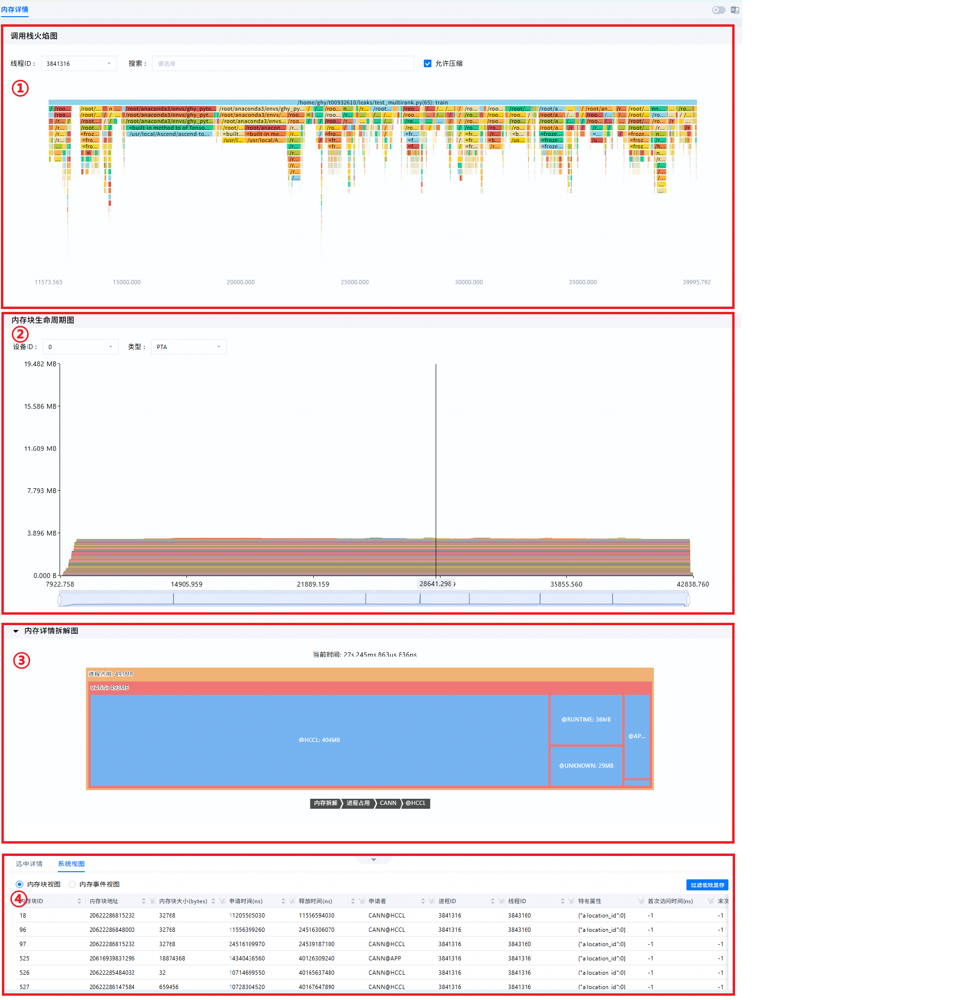
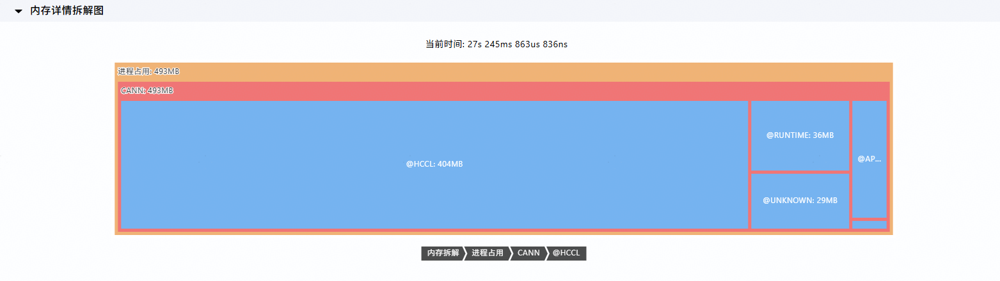
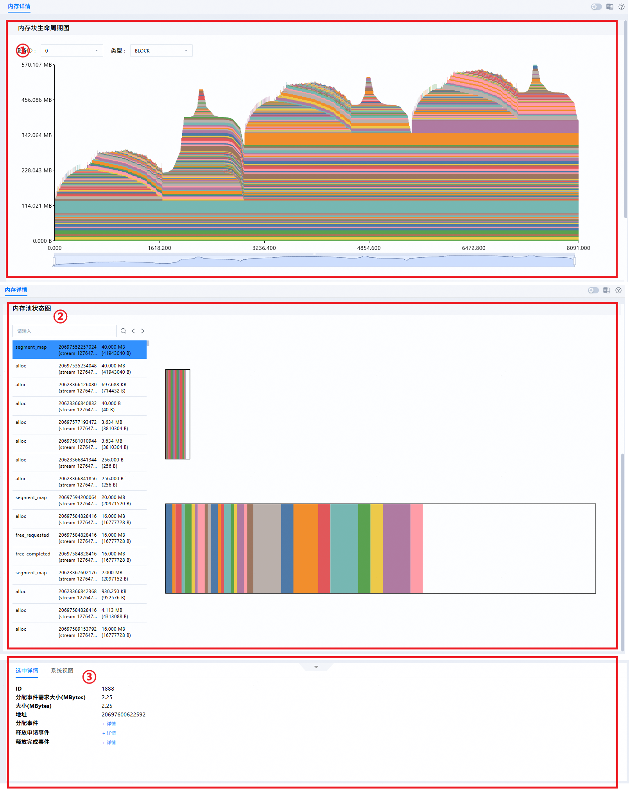
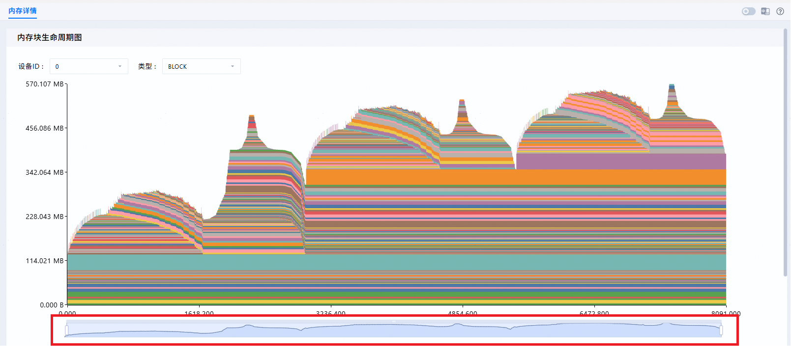
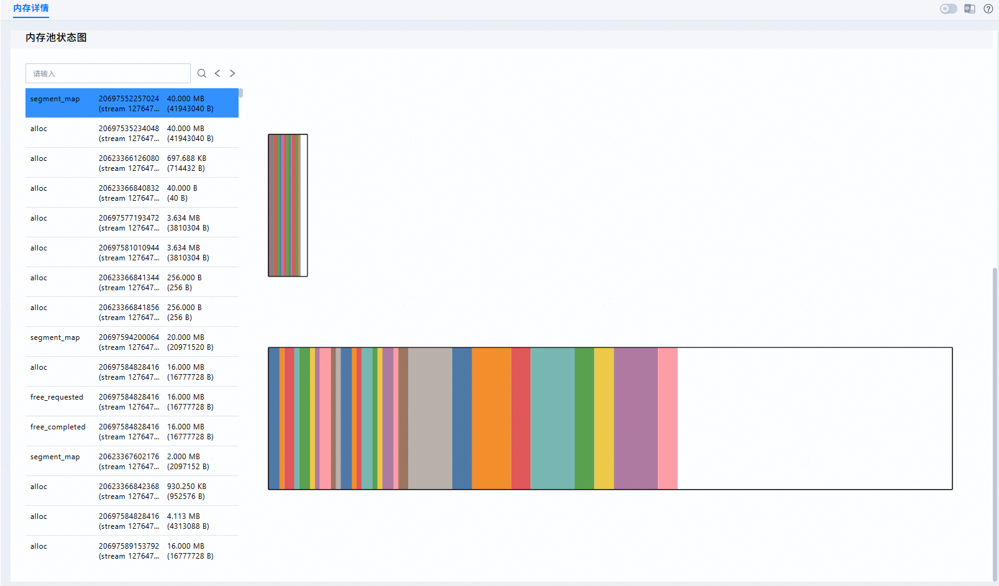
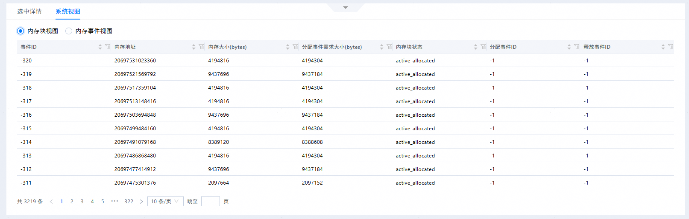
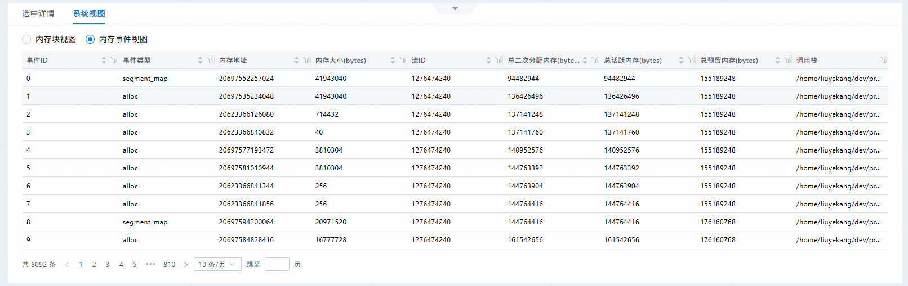
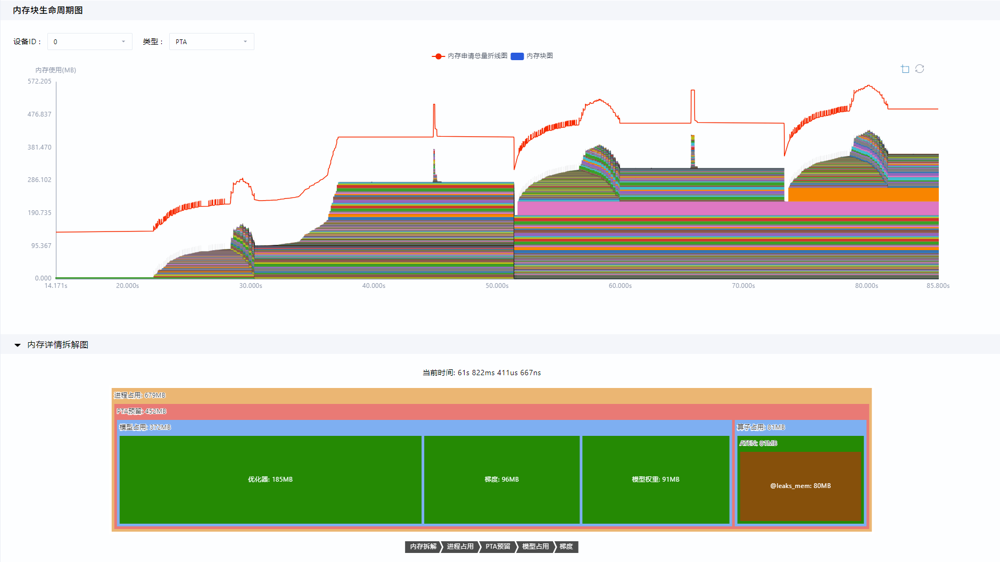
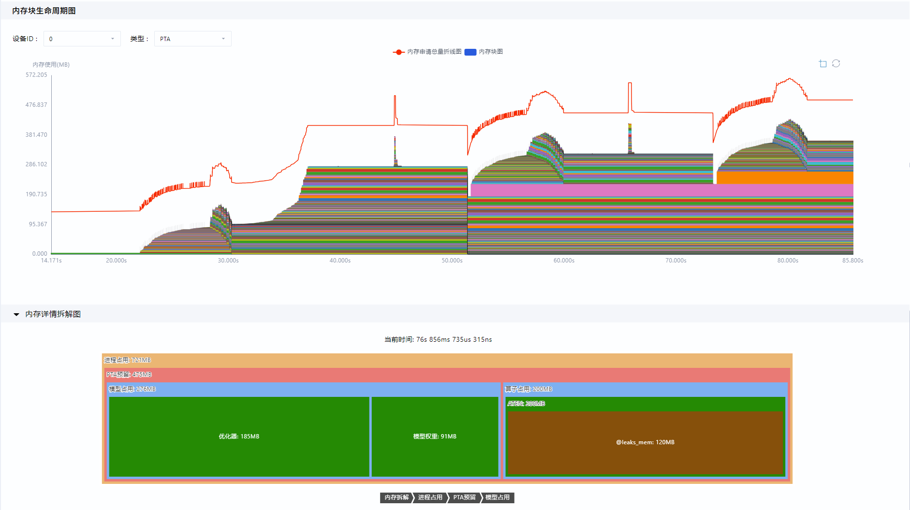

# **MindStudio Insight内存调优**

## 简介

MindStudio Insight工具以图形化形式呈现device侧内存详细分配情况，目前支持两种内存数据源:

### memscope 数据源

基于内存申请释放生命周期可视化，结合**Python调用栈**及**自定义打点标签**标记各种内存申请使用详情，进行内存问题的详细定位、**峰值拆解**及**低效显存识别**达成调优目标。

### PyTorch Snapshot 数据源

基于内存申请释放生命周期可视化，结合**内存池分配状态**进行内存碎片问题的定位及调优。

>[!NOTE] 说明  
PyTorch Snapshot功能，下文简称为内存快照功能。

## 使用前准备

### memscope 数据采集

**环境准备**

请先安装MindStudio Insight工具，具体安装步骤请参见[MindStudio Insight安装指南](./mindstudio_insight_install_guide.md)。

**数据准备**

请导入正确格式的性能数据，具体数据说明请参见[数据说明](#数据说明)，数据导入操作请参见[导入数据](./basic_operations.md#导入数据)。

### PyTorch Snapshot 数据采集

#### 基本采集流程

torch_npu提供了内存快照的采集 API，基本采集流程如下：

1. 启用内存历史记录：在运行模型代码前，调用 torch_npu.npu.memory._record_memory_history()启用内存历史记录功能，该功能会记录内存分配、释放的事件以及堆栈的信息。
2. 运行目标代码：执行需要分析内存使用场景的模型代码，例如模型训练或推理过程场景。
3. 导出内存快照：在代码执行完成后，调用 torch_npu.npu.memory._dump_snapshot("snapshot.pickle")将内存快照保存为 `pickle` 文件。

|核心API参数|说明|
|--|--|
|torch_npu.npu.memory._record_memory_history() 函数参数|<ul><li>`enabled`：控制记录的内容范围。</li><br> <ul><li>`None`：禁用内存历史记录。</li><li>`state`：仅记录当前分配的内存信息。</li><li>`all`：同时记录所有内存分配/释放事件的历史（默认）。</li></ul><br><li>`context`：控制记录的堆栈信息范围。</li><br><ul><li>`None`：不记录任何堆栈信息。</li><li>`state`：仅记录当前分配内存的堆栈信息。</li><li>`alloc`：额外记录内存分配操作的堆栈信息。</li><li>`all`：额外记录内存释放操作的堆栈信息（默认）。</li></ul><br><li>`stacks`：控制堆栈信息的深度。</li><br><ul><li>`python`：包含 Python、TorchScript 和 inductor 框架的堆栈信息。</li><li>`all`：额外包含 C++ 框架的堆栈信息（默认）。</li></ul><br><li>`max_entries`：限制记录的内存事件数量，默认为 9223372036854775807（无实际限制）。</li><br><li>`device`：可选参数，指定要记录内存历史的设备。</li></ul>|
|torch_npu.npu.memory._dump_snapshot(file_path) 函数参数|<ul><li>`file_path`：保存内存快照的文件路径，文件格式为 `pickle`。</li></ul>|

**PyTorch Snapshot（内存快照）** 数据采集示例代码如下：

```python
import torch_npu

# 启用内存历史记录，记录所有事件和堆栈信息
torch_npu.npu.memory._record_memory_history(stacks='python')

# 运行模型代码
def run_model():
    # 模型定义和训练/推理代码
    model = torch.nn.Linear(1000, 1000).cuda()
    input = torch.randn(1000, 1000).cuda()
    output = model(input)
    loss = output.sum()
    loss.backward()

run_model()

# 导出内存快照
torch_npu.npu.memory._dump_snapshot("model_memory_snapshot.pickle")
```

## 数据说明

### memscope 数据说明

支持导入msMemScope工具采集到的db格式的内存结果文件，并以图形化形式呈现相关内容。db文件获取方式请参见《msMemScope内存采集》的“[命令行采集功能介绍](https://gitcode.com/Ascend/msmemscope/blob/master/docs/zh/memory_profile.md#%E5%91%BD%E4%BB%A4%E8%A1%8C%E9%87%87%E9%9B%86%E5%8A%9F%E8%83%BD%E4%BB%8B%E7%BB%8D)”，支持导入的内存数据详情请参见[**表 1**  内存数据说明](#内存数据说明)。

**表 1**  内存数据说明<a id="内存数据说明"></a>

<style type="text/css">

</style>
<table class="tg"><thead>
  <tr>
    <th class="tg-0lax">文件名</th>
    <th class="tg-0lax">说明</th>
    <th class="tg-0lax">界面呈现内容</th>
  </tr></thead>
<tbody>
  <tr>
    <td class="tg-0pky" rowspan="3">msMemScope_dump_{timestamp}.db</td>
    <td class="tg-0lax">--events参数取值需至少包含alloc、free事件。</td>
    <td class="tg-0pky">内存块生命周期图（内存申请/释放折线图、内存块图）</td>
  </tr>
  <tr>
    <td class="tg-0lax">--analysis参数取值包含decompose。</td>
    <td class="tg-0lax">内存详情拆解图</td>
  </tr>
  <tr>
    <td class="tg-0lax">通过Python接口开启tracer功能。</td>
    <td class="tg-0pky">Python调用栈图</td>
  </tr>
</tbody>
</table>

### PyTorch Snapshot 数据说明

PyTorch Memory Snapshot是PyTorch提供的一种内存快照功能，用于记录和分析模型在运行过程中，PyTorch管理的内存池内存使用情况。 内存快照原始数据详细说明可参考 **《Ascend Extension for PyTorch》** 文档“**模型开发**”章节的[“**内存快照使用场景**”](https://www.hiascend.com/document/detail/zh/Pytorch/730/ptmoddevg/Frameworkfeatures/docs/zh/framework_feature_guide_pytorch/memory_snapshot.md#使用场景)内容介绍。

**常见内存问题**

  - 内存泄漏/溢出/重整：模型训练/推理过程中，出现内存持续(如逐step/逐request)增长至出现"雪崩"(进程保留APP Reserved/算子保留PTA Reserved内存增长至某个点后陡然下降)或OOM(Out Of Memory)。

  - 内存碎片化：模型训练过程中，算子预留与算子分配曲线出现较大Gap。

  - 内存峰值优化：模型训练过程中，针对内存峰值，需要拆解分析，确定是哪些算子/tensor导致的内存峰值。并分析是否可以通过调整tensor申请顺序、算子执行顺序等方式，来削减内存峰值。

>[!NOTE] 说明  
以上常见内存问题，是在采集Profiling数据后，系统调优-内存页签可视化时发生。

## 内存详情

### memscope 数据内存详情

#### 功能说明

在内存调优过程中，MindStudio Insight工具通过Python调用栈图和内存块生命周期图，将内存情况直观地呈现出来，便于开发者分析定位内存问题，有效缩短定位时间。

#### 界面介绍

内存详情（msMemScope）界面包含调用栈火焰图（区域一）、内存块生命周期图（区域二）、内存详情拆解图（区域三）和内存详情表（区域四），如[**图 1**  内存详情界面](#内存详情界面)所示。

**图 1**  内存详情界面<a id="内存详情界面"></a>  


- 区域一：调用栈火焰图，通过选择线程ID，展示对应的Python调用栈图；在“搜索”输入框中输入要搜索的函数名，或单击下拉框选择函数名，可选多个函数名进行搜索，调用栈图中会高亮显示搜索的函数。

  > [!NOTE] 说明  
  > 该区域视图默认勾选“允许压缩”，该状态下，工具在不影响整体数据的情况下，压缩数据展示，增加工具使用流畅度。

- 区域二：内存块生命周期图，展示内存申请/释放折线图和内存块图，选择内存块图上的色块，展示该内存块的详情，可通过选择设备ID和类型来展示对应的内存块生命周期图。
- 区域三：内存详情拆解图，默认不显示，当鼠标置于“调用栈火焰图”或者“内存块生命周期图”中，会显示一条时间线，在“内存块生命周期图”区域，单击时间线，展示对应时间点的内存详情拆解图。当出现内存详情拆解图后，可以通过左上角按键隐藏/展示内存详情拆解图。
- 区域四：内存详情表，分为“内存块视图”和“内存事件视图”，可选择相应视图查看详情表，具体使用说明请参见[内存详情展示](#内存详情展示)。

#### 使用说明

**调用栈火焰图和内存块生命周期图支持查看指定时间范围内数据**

MindStudio Insight 调用栈火焰图和内存块生命周期图通过控制趋势图缩放条选择区域展示指定范围内数据，如[**图 1**  下方趋势图缩放条](#趋势图缩放条)所示。

**图 1**  趋势图缩放条<a id="趋势图缩放条"> </a> 


**趋势图缩放条支持趋势图可视化以及时间域选择多样化操作**

1. 趋势图可视化：

    MindStudio Insight 的趋势图缩放条所在背景呈现的是在整体时间范围下内存使用（Operator Allocated）情况的趋势图，直观的呈现选定时间范围内整个内存的使用情况趋势。

    >[!NOTE] 说明  
    Operator Allocated（算子分配）曲线表示算子在申请或释放内存时采集到的已分配内存的变化趋势，代表所有算子总的分配内存。

2. 时间域选择多样化操作：

  - 可通过平移缩放条的左右控制键选择时间起点以及终点，并展示对应内存情况。
  - 可选中整个趋势图范围内的任意范围以选中对应时间区间，并展示对应内存情况。
  - 可固定时间长度，拖拽左右平移查看固定时间长度下的对应内存情况。

**内存块生命周期图和内存详情拆解图支持拖拽移动和滚轮缩放**

内存块生命周期图和内存详情拆解图支持通过拖拽实现视图的移动，通过滚轮实现视图的缩放。

**内存详情拆解图展示**

当鼠标置于“调用栈火焰图”或者“内存块生命周期图”中，会显示一条时间线，在“内存块生命周期图”区域，单击时间线，则会在“内存块生命周期图”下方展示对应时间点的内存详情拆解图，便于开发者查看内存占用情况。“内存详情拆解图”展示的内容会随所选择的类型而变化。

如果需要查看指定的内存层级，可单击“内存详情拆解图”下方的层级目录条进入所选层级。

- 当类型选择HAL时，“内存详情拆解图”中仅展示通过CANN级别分类分级的内存数据，如[**图 2**  CANN级别内存详情拆解图](#CANN级别内存详情拆解图)所示。

    **图 2**  CANN级别内存详情拆解图<a id="CANN级别内存详情拆解图"></a>  
    

- 当类型选择除HAL之外的其它选项时，“内存详情拆解图”中展示对应框架侧内存池的内存分类分级情况。例如当类型选择PTA时，“内存详情拆解图”中仅展示PTA框架的内存情况，如[**图 3**  PTA框架内存详情拆解图](#PTA框架内存详情拆解图)所示。

    **图 3**  PTA框架内存详情拆解图<a id="PTA框架内存详情拆解图"></a>  
    

> [!NOTE] 说明  
> “内存详情拆解图”支持左右上下拖拽和缩放展示。
>
> - 鼠标放置在图中，按住鼠标左键可实现左右上下拖拽。
> - 在“内存详情拆解图”上，使用鼠标滚轮实现缩放展示；或选择任一内存块，单击鼠标左键，可将选中的内存层级放大展示。

**内存详情展示**<a id="内存详情展示"></a>

在内存详情表区域，通过“内存块视图”和“内存事件视图”分别展示内存的详细信息，默认展示所有内存相关信息。
> [!NOTE] 说明   
> 系统默认隐藏内存详情展示。如需查看，需要点击上拉按键，将内存详情展示信息上拉展示。如无需查看内存详情信息，点击下拉按键，隐藏内存详情信息。
> [!NOTE] 说明   
> “内存块视图”中的“内存块大小”、“申请时间”和“释放时间”字段，“内存事件视图”中的“时间戳\(ns\)”字段，单击，支持筛选，可输入最小值和最大值进行区间筛选，只能输入整数，输入的数值最小为0，最大为当前展示的对应字段的最大值。

- 内存块视图：展示内存块的详细信息，如[**图 4**  内存块视图](#内存块视图)所示，字段解释如[**表 1**  内存块视图字段说明](#内存块视图字段说明)所示。

    当在“内存块生命周期图”中分别选择不同“设备ID”和“类型”时，内存块视图的展示信息也会随之更新；当框选“内存块生命周期图”中部分区域展示时，内存块视图的信息也会随之更新，展示的是所有与框选时间范围存在交集的内存块信息。

    在“内存块视图”表格右上方，单击“过滤低效显存”按钮，弹出筛选弹框，分别通过设置“提前申请阈值”、“延迟释放阈值”或“空闲过长阈值”，筛选低效显存。

    **图 4**  内存块视图<a id="内存块视图"></a>  
    

    **表 1**  内存块视图字段说明<a id="内存块视图字段说明"></a>

    |中文字段|英文字段|说明|
    |--|--|--|
    |内存块ID|ID|内存块ID，内存块唯一标识。|
    |内存块地址|Addr|内存块地址，对应内存申请/释放/访问事件的地址。|
    |内存块大小(bytes)|Size(bytes)|内存块大小，对应内存申请事件，单位为bytes。|
    |申请时间(ns)|Malloc Timestamp(ns)|内存块申请时间，对应内存申请事件的时间，单位ns。|
    |释放时间(ns)|Free Timestamp(ns)|内存块释放时间，对应内存释放事件的时间，单位ns。|
    |申请者|Owner|内存块持有者所属标签。|
    |进程ID|Process ID|内存块所属进程号，对应内存申请/释放事件的所属进程号。|
    |线程ID|Thread ID|内存块所属线程号，对应内存申请/释放事件的所属线程号。|
    |首次访问时间(ns)|First Access Timestamp(ns)|首次访问事件时间。|
    |末次访问时间(ns)|Last Access Timestamp(ns)|末次访问事件时间。|
    |最大访问时间间隔(ns)|Max Access Interval(ns)|访问事件的最大间隔时间。|
    |特有属性|Attr|扩展属性，包含以下信息：<br> - allocation_id：内存块所属的申请/访问/释放序列id，唯一标识一组内存事件。<br> - lazy_used：提前申请场景，取值为true或者false，true表示已识别到该场景。<br> - delayed_free：延迟释放场景，取值为true或者false，true表示已识别到该场景。<br> - long_Idle：超长闲置场景，取值为true或者false，true表示已识别到该场景。|

  > [!NOTE] 说明
  > 
  > - 如果导入的数据是使用MindStudio 8.2.RC1之前版本的msMemScope工具采集的，或者数据中没采集到访问事件，那么allocation\_id显示为0，首次访问时间\(ns\)、末次访问时间\(ns\)显示为-1，最大访问时间间隔\(ns\)显示为0。
  > - 由于msMemScope工具当前仅支持采集ATB和Ascend Extension for PyTorch算子场景的内存访问事件，则首次访问时间\(ns\)、末次访问时间\(ns\)和最大访问间隔\(ns\)也仅支持展示对应场景的详情，其余场景下，首次访问时间\(ns\)、末次访问时间\(ns\)显示为-1，最大访问时间间隔\(ns\)显示为0。

- 内存事件视图：展示内存事件的详细信息，如[**图 5**  内存事件视图](#内存事件视图)所示，字段解释如[**表 2**  内存事件视图字段说明](#内存事件视图字段说明)所示。

    当在“内存块生命周期图”中选择不同“设备ID”时，内存事件视图的展示信息也会随之更新；当框选“内存块生命周期图”中部分区域展示时，内存事件视图的信息也会随之更新，展示的是框选时间范围内的所有内存事件。

    **图 5**  内存事件视图<a id="内存事件视图"></a>  
    

    **表 2**  内存事件视图字段说明<a id="内存事件视图字段说明"></a> 

    |中文字段|英文字段|说明|
    |--|--|--|
    |事件ID|ID|事件ID，与Process ID共同标识唯一一个内存事件。|
    |事件类型|Event|msMemScope记录的事件。|
    |事件子类型|Event Type|事件子类型。|
    |名称|Name|事件名称，与Event值有关。|
    |时间戳(ns)|Timestamp(ns)|内存事件发生的时间。|
    |进程ID|Process ID|进程号。|
    |线程ID|Thread ID|线程号。|
    |内存地址|Addr|内存地址。|
    |特有属性|Attr|内存事件特有属性，每个事件类型有各自的属性项。|
    |调用栈(Python)|Call Stack(Python)|Python调用栈。仅当数据中采集到该信息时，则显示该字段。|
    |调用栈(C)|Call Stack(C)|C调用栈。仅当数据中采集到该信息时，则显示该字段。|

    > [!NOTE] 说明   
    > 事件类型、事件子类型和名称字段的取值可参见《msMemScope内存采集》的“[命令行采集功能介绍](https://gitcode.com/Ascend/msmemscope/blob/master/docs/zh/memory_profile.md#%E5%91%BD%E4%BB%A4%E8%A1%8C%E9%87%87%E9%9B%86%E5%8A%9F%E8%83%BD%E4%BB%8B%E7%BB%8D)”章节的msmemscope\_dump\_\{timestamp\}.csv结果文件说明。

- 选中详情：展示内存块的详细信息，如[**图 6**  选中详情](#选中详情)所示。

    当在“内存块生命周期图”中单击任意时间点的视图，选中详情的展示信息也会随之更新。

    **图 6**  选中详情<a id="选中详情"></a>  
    

### PyTorch Snapshot 数据内存详情（内存快照）

#### 功能说明 

基于内存申请释放生命周期可视化，结合**内存池分配状态**进行内存碎片问题的定位及调优。

#### 界面介绍

内存快照详情（PyTorch Snapshot）界面包含内存块生命周期图（区域一）、内存池状态图（区域二）和内存详情表（区域三），如[**图 1**  内存快照详情界面](#内存快照详情界面)所示。

**图 1**  内存快照详情界面<a id="内存快照详情界面"></a>  


- 区域一：内存块生命周期图，展示内存申请/释放折线图和内存块图，选择内存块图上的色块，展示该内存块的详情。
- 区域二：内存池状态图，当鼠标置于“内存块生命周期图”中，会显示一条时间线，在“内存块生命周期图”区域，单击时间线，会展示对应时间点的内存池状态图，具体使用说明请参见[内存池状态图展示](#内存池状态图展示)。
- 区域三：内存快照详情表，分为“内存块视图”和“内存事件视图”，可选择相应视图查看详情表，具体使用说明请参见[内存快照详情展示](#内存快照详情展示)。

#### 使用说明

**内存块生命周期图支持查看指定时间范围内数据**

MindStudio Insight 内存块生命周期图通过控制内存快照趋势图缩放条选择区域展示指定范围内数据，如[**图 1**  下方内存快照趋势图缩放条](#内存快照趋势图缩放条)所示。

**图 1**  内存快照趋势图缩放条<a id="内存快照趋势图缩放条"> </a> 


**趋势图缩放条支持趋势图可视化以及时间域选择多样化操作**

1. 趋势图可视化：

    MindStudio Insight 的内存快照趋势图缩放条所在背景呈现的是在整体时间范围下内存使用（Operator Allocated）情况的趋势图，直观的呈现选定时间范围内整个内存的使用情况趋势。

    >[!NOTE] 说明  
    Operator Allocated（算子分配）曲线表示算子在申请或释放内存时采集到的已分配内存的变化趋势，代表所有算子总的分配内存。

2. 时间域选择多样化操作：

  - 可通过平移缩放条的左右控制键选择时间起点以及终点，并展示对应内存情况。
  - 可选中整个趋势图范围内的任意范围以选中对应时间区间，并展示对应内存情况。
  - 可固定时间长度，拖拽左右平移查看固定时间长度下的对应内存情况。

**内存块生命周期图和内存池状态图支持拖拽移动和滚轮缩放**

内存块生命周期图和内存池状态图支持通过拖拽实现视图的移动，通过滚轮实现视图的缩放。

**内存池状态图展示**<a id="内存池状态图展示"></a>

当鼠标置于“内存块生命周期图”中，在“内存块生命周期图”区域，单击内存色块，则会在“内存块生命周期图”下方展示对应时间点的事件总览以及内存池状态图。也可以通过搜索对应的地址精准定位事件详情，如[**图 2** 内存池状态图](#内存池状态图)所示。

>[!NOTE] 说明  
若点击内存色块后内存池状态未更新，则说明该内存色块在生命周期中未被采集到申请事件。

**图 2**  内存池状态图<a id="内存池状态图"></a>  
    

**内存快照详情展示**<a id="内存快照详情展示"></a>

内存详情包含选中详情和系统视图两部分，其中选中详情展示该事件对应事件点的详情信息，系统视图下，通过“内存块视图”和“内存事件视图”分别展示内存的详细信息，默认展示所有内存相关信息。
> [!NOTE] 说明   
> 系统默认隐藏内存详情展示。如需查看，需要点击上拉按键，将内存详情信息上拉展示。如无需查看内存详情信息，点击下拉按键，隐藏内存详情信息。
> [!NOTE] 说明   
> “内存块视图”中的“内存大小（bytes）”和“分配事件需求大小（bytes）”字段，“内存事件视图”中的“内存大小（bytes）”、“总二次分配内存（bytes）”、“总活跃内存（bytes）”和“总预留内存（bytes）”字段，单击，可输入最小值和最大值进行区间筛选。

- 内存块视图：展示内存块的详细信息，如[**图 3**  快照内存块视图](#快照内存块视图)所示，字段解释如[**表 1**  快照内存块视图字段说明](#快照内存块视图字段说明)所示。

    **图 3**  快照内存块视图<a id="快照内存块视图"></a>  
    

    **表 1**  快照内存块视图字段说明<a id="快照内存块视图字段说明"></a>

    |字段名称|可选/必选|释义|类型|示例值|额外说明|
    |--|--|--|--|--|--|
    |ID|必选|内存事件ID，唯一标识内存事件。|整数|0|无|
    |Requested Size(bytes)|必选|内存块申请大小，单位为 bytes 。|浮点数|12.5|分配事件需求的内存大小。PTA会基于申请大小进行padding和对齐，所以分配大小可能会大于申请大小。|
    |Size(bytes)|必选|内存事件操作的内存大小，单位为 bytes 。|浮点数|12.5|实际分配给内存块的内存大小，单位为 bytes 。其值大于或等于申请大小。|
    |Address|必选|内存事件地址。|0x十六进制地址|0x7f9f00000000|内存块在内存中的地址。|
    |State|必选|内存块状态。|枚举中的一个，详情参考说明。|`active_allocated`|内存块的当前状态，包括:<br><ul><li>`active_allocated`：内存块已被分配且正在被使用，不可以被复用。</li><br><li>`active_pending_free`：内存块已被释放请求, 但（可能因跨流依赖）尚未完成释放，仍然不可以被复用。</li><br><li>`inactive`：未被分配状态的内存块（或内存块已被释放完成），可以被复用。</li></ul>|
    |Alloc Event ID|可选|内存块申请事件ID。|整数|1|内存块申请事件ID，唯一标识内存块的申请事件。值为-1代表该内存块的申请事件在内存快照采集生命周期中未被记录。|
    |Free Event ID|可选|内存块释放完成事件ID。|整数|2|内存块释放完成事件ID，唯一标识内存块的释放事件。值为-1代表该内存块的释放完成事件在内存快照采集生命周期中未被记录。|

  > [!NOTE] 说明
  > 
  > - 如果导入的数据是使用MindStudio 8.2.RC1之前版本的msMemScope工具采集的，或者数据中没采集到访问事件，那么allocation\_id显示为0，首次访问时间\(ns\)、末次访问时间\(ns\)显示为-1，最大访问时间间隔\(ns\)显示为0。
  > - 由于msMemScope工具当前仅支持采集ATB和Ascend Extension for PyTorch算子场景的内存访问事件，则首次访问时间\(ns\)、末次访问时间\(ns\)和最大访问间隔\(ns\)也仅支持展示对应场景的详情，其余场景下，首次访问时间\(ns\)、末次访问时间\(ns\)显示为-1，最大访问时间间隔\(ns\)显示为0。

- 内存事件视图：展示内存事件的详细信息，如[**图 4**  快照内存事件视图](#快照内存事件视图)所示，字段解释如[**表 2**  快照内存事件视图字段说明](#快照内存事件视图字段说明)所示。

    当在“内存块生命周期图”中选择不同“设备ID”时，内存事件视图的展示信息也会随之更新；当框选“内存块生命周期图”中部分区域展示时，内存事件视图的信息也会随之更新，展示的是框选时间范围内的所有内存事件。

    **图 4**  快照内存事件视图<a id="快照内存事件视图"></a>  
    

    **表 2**  快照内存事件视图字段说明<a id="快照内存事件视图字段说明"></a> 

    |字段名称|可选/必选|释义|类型|示例值|额外说明|
    |--|--|--|--|--|--|
    |ID|必选|内存事件ID，唯一标识内存事件。|整数|0|无|
    |Action|必选|内存事件操作类型。|枚举中的一个，详情参考说明。|alloc|<ul><li>内存段操作：</li><br><ul><li>`segment_alloc`：内存段申请事件，会触发PTA内存池从驱动申请物理内存，触发扩容。</li><br><li>`segment_free`：内存段释放事件，会触发PTA内存池释放物理内存，触发缩容。</li><br><li>`segment_map`：内存段映射事件，开启虚拟内存场景，会触发PTA内存池将物理内存映射到虚拟地址空间。</li><br><li>`segment_unmap`：内存段取消映射事件，开启虚拟内存场景，会触发PTA内存池取消将物理内存映射到虚拟地址空间。</li></ul><li>内存块操作：</li><br><ul><li>`alloc`：内存块申请事件，PTA从内存池中查找可用的inactive状态的内存块，进行二次分配。</li><br><li>`free_requested`：内存块释放请求事件，PTA内存池将内存块状态设置为active_pending_free，等待后续释放。</li><li>`free_completed`：内存块释放完成事件，PTA内存池将内存块状态设置为inactive，释放给内存池。</li></ul><li>算子workspace快照：`workspace_snapshot`。</li></ul>|
    |Address|必选|内存事件地址。|0x十六进制地址|0x7f9f00000000|内存事件操作的内存地址。|
    |Size(bytes)|必选|内存事件操作的内存大小，单位为 MB 。|浮点数|12.5|无|
    |Stream|必选|内存事件所属的流ID。|整数|0|无|
    |Allocated(bytes)|必选|事件发生后的PTA内存池总二次分配大小，单位为 bytes 。|浮点数|12.5|所有Segment中所有的active_allocated状态的block总大小， 反应事件发生时刻，PTA内存池中已二次分配给tensor实际使用的内存大小。|
    |Active(bytes)|必选|事件发生后的PTA内存池总活跃内存大小，单位为 bytes 。|浮点数|12.5|所有Segment中所有的active_allocated状态的block总大小， 反应事件发生时刻，PTA内存池中已二次分配给tensor实际使用的内存大小。|
    |Reserved(bytes)|必选|事件发生后的PTA内存池总保留内存大小，单位为 bytes 。|浮点数|12.5|其值为所有内存段Segment的大小总和。反应事件发生时刻，PTA内存池中实际从驱动申请，预留的内存大小。|
    |Call Stack|可选|内存事件调用栈。|字符串|`/home/xxx/test/demo.py: 60 main`|内存事件的调用栈，展示了内存事件发生时的触发调用栈，若为空可能是以下几种情况之一：<br><ul><li>_record_memory_history时未启用stacks。</li><br><li>该事件发生在反向backward时的autograd中，可能无调用栈信息。</li></ul>|

    > [!NOTE] 说明   
    > 事件类型、事件子类型和名称字段的取值可参见《msMemScope内存采集》的“[命令行采集功能介绍](https://gitcode.com/Ascend/msmemscope/blob/master/docs/zh/memory_profile.md#%E5%91%BD%E4%BB%A4%E8%A1%8C%E9%87%87%E9%9B%86%E5%8A%9F%E8%83%BD%E4%BB%8B%E7%BB%8D)”章节的msmemscope\_dump\_\{timestamp\}.csv结果文件说明。

- 选中详情：展示内存块的详细信息，如[**图 5**  内存快照选中详情](#内存快照选中详情)所示，字段解释如[**表 3**  内存快照选中详情字段说明](#内存快照选中详情字段说明)所示。

    当在“内存块生命周期图”中单击任意时间点的视图，快照选中详情的展示信息也会随之更新。

    **图 5**  内存快照选中详情<a id="内存快照选中详情"></a>  
    

    **表 3**  内存快照选中详情字段说明<a id="内存快照选中详情字段说明"></a> 

    |字段名称|可选/必选|释义|类型|示例值|额外说明|
    |--|--|--|--|--|--|
    |ID|必选|内存事件ID，唯一标识内存事件。|整数|0|无|
    |Action|必选|内存事件操作类型。|枚举中的一个，详情参考说明。|alloc|<ul><li>内存段操作：</li><br><ul><li>`segment_alloc`：内存段申请事件，会触发PTA内存池从驱动申请物理内存，触发扩容。</li><br><li>`segment_free`：内存段释放事件，会触发PTA内存池释放物理内存，触发缩容。</li><br><li>`segment_map`：内存段映射事件，开启虚拟内存场景，会触发PTA内存池将物理内存映射到虚拟地址空间。</li><br><li>`segment_unmap`：内存段取消映射事件，开启虚拟内存场景，会触发PTA内存池取消将物理内存映射到虚拟地址空间。</li></ul><li>内存块操作：</li><br><ul><li>`alloc`：内存块申请事件，PTA从内存池中查找可用的inactive状态的内存块，进行二次分配。</li><br><li>`free_requested`：内存块释放请求事件，PTA内存池将内存块状态设置为active_pending_free，等待后续释放。</li><li>`free_completed`：内存块释放完成事件，PTA内存池将内存块状态设置为inactive，释放给内存池。</li></ul><li>算子workspace快照：`workspace_snapshot`。</li></ul>|
    |Address|必选|内存事件地址。|0x十六进制地址|0x7f9f00000000|内存事件操作的内存地址。|
    |Size(MBytes)|必选|内存事件操作的内存大小，单位为 MB 。|浮点数|12.5|无|
    |Stream|必选|内存事件所属的流ID。|整数|0|无|
    |Caching Allocated(MBytes)|必选|事件发生后的PTA内存池总二次分配大小，单位为 MB 。|浮点数|12.5|所有Segment中所有的active_allocated状态的block总大小， 反应事件发生时刻，PTA内存池中已二次分配给tensor实际使用的内存大小。|
    |Caching Active(MBytes)|必选|事件发生后的PTA内存池总活跃内存大小，单位为 MB 。|浮点数|12.5|其值应为所有Segment中所有的active_allocated状态的block总大小与所有active_pending_free状态的block大小之和。反应事件发生时刻，PTA内存池中实际占用而无法被复用的内存大小。|
    |Caching Reserved(MBytes)|必选|事件发生后的PTA内存池总保留内存大小，单位为 MB 。|浮点数|12.5|其值为所有内存段Segment的大小总和。反应事件发生时刻，PTA内存池中实际从驱动申请，预留的内存大小。|
    |Call Stack|可选|内存事件调用栈。|字符串|`/home/xxx/test/demo.py: 60 main`|内存事件的调用栈，展示了内存事件发生时的触发调用栈，若为空可能是以下几种情况之一：<br><ul><li>_record_memory_history时未启用stacks。</li><br><li>该事件发生在反向backward时的autograd中，可能无调用栈信息。</li></ul>|

## Memscope 数据采集对比 PyTorch Snapshot 数据采集

- 相较于MemScope采集的内存调优数据，内存快照数据具有以下优点：

  1. 采集性能开销：内存快照数据在采集过程中，仅在record_memory_history开启后，在host层面记录内存事件，并在dump时刻保存PTA的Allocator状态Segments，对模型运行性能影响较小。
  2. 调优数据大小：核心数据由PTA内存事件、及采集结束时刻的Segments组成，数据密度高，数据体积相对MemScope采集数据较小。
  3. 特色内存池状态数据：相对于MemScope采集的内存调优数据，内存快照数据还包含了PTA内存池的状态数据，如内存池大小、内存池使用率等，这些数据可以帮助用户更全面地分析内存使用情况。尤其在内存碎片问题中，内存池状态数据可以帮助用户更直观地分析内存碎片情况。

- 相较于MemScope采集的内存调优数据，内存快照数据具有以下缺点：

  1. 调优数据分析：内存快照数据为python pickle数据文件，上手成本较高，基本上在分析时完全依赖可视化能力；如需对原始数据进行解析分析，需要对内存事件及采集原理有一定的了解。
  2. 社区可视化工具能力/性能有限：虽然内存快照数据可以通过社区在线可视化进行分析，但其稳定性、性能及联动性存在较大不足：
      - 稳定性：在线网页可能因客户端环境（如仅内网环境）、网络问题（如CDN资源异常等）而导致无法正常使用。
      - 性能：在线可视化网页在处理大规模内存快照（事件数量超过1w5， 快照体积超过10M）数据时，性能可能存在一定问题，如加载时间较长、交互响应延迟等较大。
      - 联动性：在线可视化网页在分析过程中，从内存块生命周期图关联到内存池状态图的唯一方法是通过手动复制内存地址-在网页中进行搜索，且无法实现从内存池状态反向关联到内存块生命周期图。

## 内存问题分析案例

### 概述

在昇腾全栈开发活动中，内存问题较为常见，但是由于内存问题的软件栈层次复杂（包括但不限于操作系统的驱动和运行时库、CANN、MindSpore/PyTorch\_NPU、模型训练和模型推理等），导致内存问题的定位和解决往往较为困难。目前典型的内存问题分类可参见[**表 1**  内存问题分类](#内存问题分类)。

本文介绍通过MindStudio Insight工具定位内存问题的方法。

**表 1**  内存问题分类<a id="内存问题分类"></a>

|问题类别|问题现象|场景|
|--|--|--|
|内存踩踏|出现精度异常或出现NaN，通常出现在Device上。|训练、推理、算子开发|
|内存使用过多|内存使用过多，通常与以下两种情况有关：<br> - 泄漏或OOM（Out of Memory，内存溢出）：Host侧内存监测持续增长，甚至OOM;或者Device侧内存使用量持续增长，甚至OOM。<br> - 与预期或基线相差大：实际采集的内存使用数据远超预期或基线数据，差值会达到GB量级，通常出现在Device侧。|训练、推理|

**定位流程**

针对Device侧内存使用过多或OOM，问题分析流程如下：

1. 通过性能调优工具采集性能数据，并导入MindStudio Insight；
2. 查看内存（Memory）界面中“内存分析”区域的内存曲线图、算子或组件内存申请/释放详情，进行基础定界，明确异常范围、Step或算子；
3. 使用内存工具（msMemScope）工具采集对应异常范围的内存详情与内存拆解数据，导入MindStudio Insight；
4. 查看内存详情（msMemScope）界面，结合“调用栈火焰图”、“内存块生命周期图”、“内存详情表”进行内存占用拆解分析。

### 前期准备

**准备软件**

- 下载MindStudio Insight工具并安装，请参见[MindStudio Insight安装指南](./mindstudio_insight_install_guide.md)。
- 安装msMemScope工具，安装操作请参见[msMemScope工具安装指南](https://gitcode.com/Ascend/msmemscope/blob/master/docs/zh/install_guide.md)。

**准备数据**

以下采集的数据为内存泄漏的数据。

1. 使用msMemScope工具执行如下命令，在每个Step中申请一个大小为4 x 10MB的Tensor，并追加到全局变量leak\_mem\_list列表中（不会随train\_one\_step释放），采集3个Step的Python Trace数据。

    ```shell
    msmemscope --level=0,1 --events=alloc,free,access,launch --analysis=decompose --data-format=db python test.py
    ```

    其中test.py的示例代码如下：

    ```python
    import torch
    import torch_npu
    from torchvision.models import resnet50
    import msmemscope
    import msmemscope.describe as describe
    leak_mem_list = []
    def train_one_step(model, optimizer, loss_fn, device):
        # 对代码块做标记，代码块内所有内存申请事件的owner属性都会打上标签leaks_mem
        describe.describer(owner="leaks_mem").__enter__()
        # 内存泄漏代码段
        leak_mem_list.append(torch.randn(1024 * 1024 * 10, dtype=torch.float32).to(device))
        # 结束标记
        describe.describer(owner="leaks_mem").__exit__(None, None, None)
        # 单次训练代码段
        inputs = torch.randn(1, 3, 224, 224).to(device)
        labels = torch.rand(1, 10).to(device)
        pred = model(inputs)
        loss_fn(pred, labels).backward()
        optimizer.step()
        optimizer.zero_grad()
    def train(model, optimizer, loss_fn, device, steps=1):
        for i in range(steps):
            train_one_step(model, optimizer, loss_fn, device)
    device = torch.device("npu:0")
    torch.npu.set_device(device)  # 设置device
    model = resnet50(pretrained=False, num_classes=10).to(device)  # 加载模型
    optimizer = torch.optim.Adam(model.parameters(), lr=1e-2)  # 定义优化器
    loss_fn = torch.nn.CrossEntropyLoss()  # 定义损失函数
    
    # 开启采集python函数调用数据
    msmemscope.tracer.start()
    train(model, optimizer, loss_fn, device, steps=3)  # 开始训练
    
    # 停止采集python函数调用数据
    msmemscope.tracer.stop()
    ```

2. 采集完成后，输出db格式的文件。
3. 将文件下载至本地保存。

### 内存分析

**导入数据**

1. 打开MindStudio Insight工具，单击左侧导航栏的“导入数据”。
2. 在弹出的“文件资源管理器”弹框中，选择需要导入的db格式的文件。
3. 导入成功后，显示“内存详情”界面。

**内存分析**

1. 打开“内存详情”界面，查看“调用栈火焰图”和“内存块生命周期图”。
2. 单击鼠标左键框选“内存块生命周期图”中的Step2区域，松开鼠标左键，放大Step2区域。

    可以从[**图 1**  未释放的内存块](#未释放的内存块)中看出，在Step2结束时，仍存在一个未释放的内存块。

    **图 1**  未释放的内存块<a id="未释放的内存块"></a>  
    

3. 查看“调用栈火焰图”，发现该内存块来自于一个Tensor对象，在前向传播开始前即已申请，如[**图 2**  Tensor对象](#Tensor对象)所示。

    **图 2**  Tensor对象<a id="Tensor对象"></a>  
    

4. 对照leaks\_mem标记的代码段，查看“内存详情拆解图”，发现leaks\_mem标记的代码段存在明显的增长，从Step 1开始leaks\_mem标签内存占用首次出现为40M，如[**图 3**  查看Step 1的内存占用](#查看Step-1的内存占用)所示。

    **图 3**  查看Step 1的内存占用<a id="查看Step-1的内存占用"></a>  
    

    如[**图 4**  查看Step 2的内存占用](#查看Step-2的内存占用)所示，Step 2中leaks\_mem标签内存占用从40M增长到了80M。

    **图 4**  查看Step 2的内存占用<a id="查看Step-2的内存占用"></a>  
    

    如[**图 5**  查看Step 3的内存占用](#查看Step-3的内存占用)所示，Step 3中leaks\_mem标签内存占用从80M增长到了120M。

    **图 5**  查看Step 3的内存占用<a id="查看Step-3的内存占用"></a>  
    
