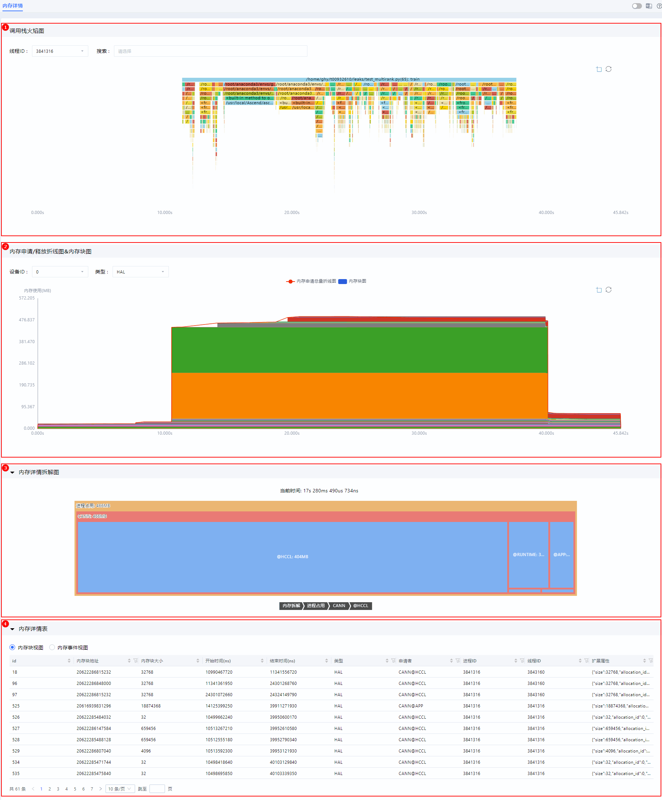
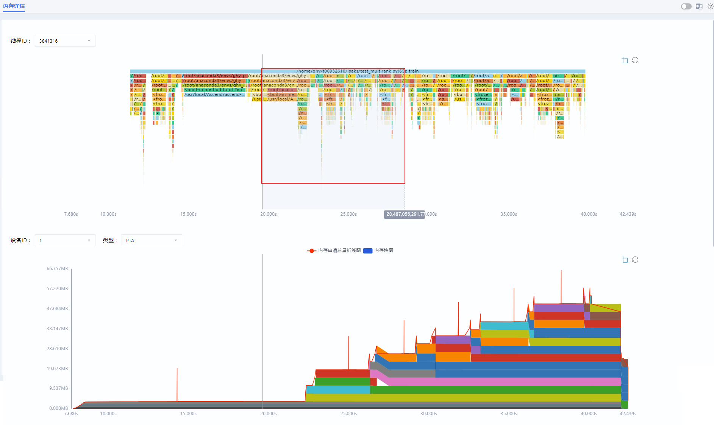
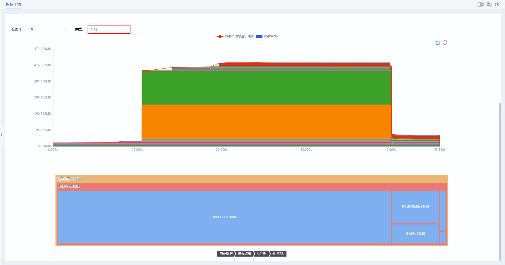
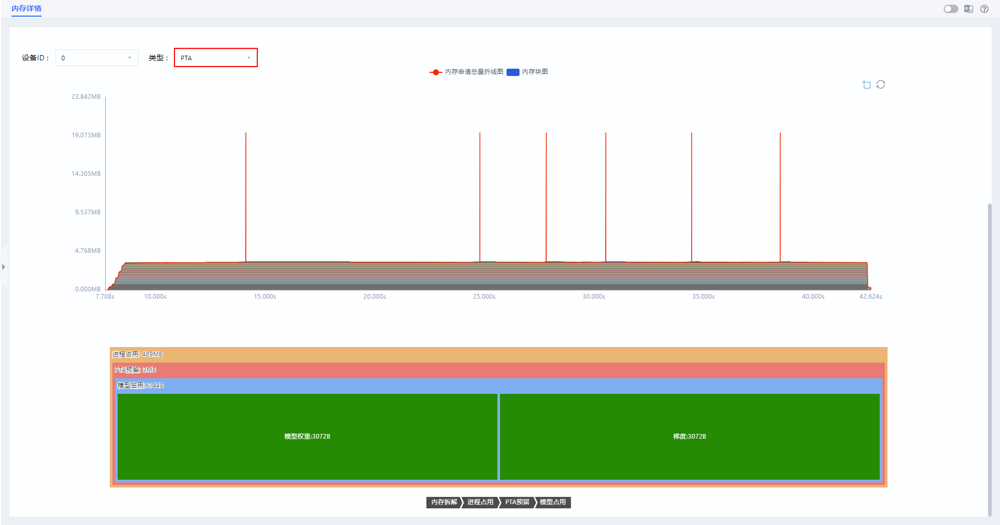
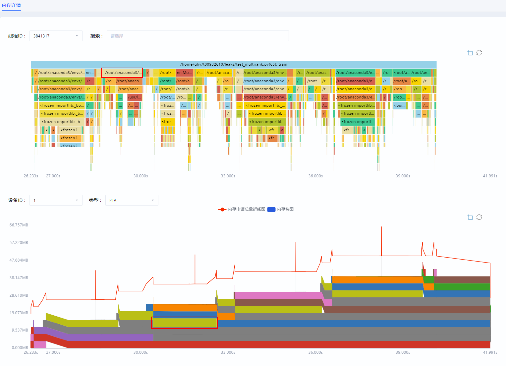
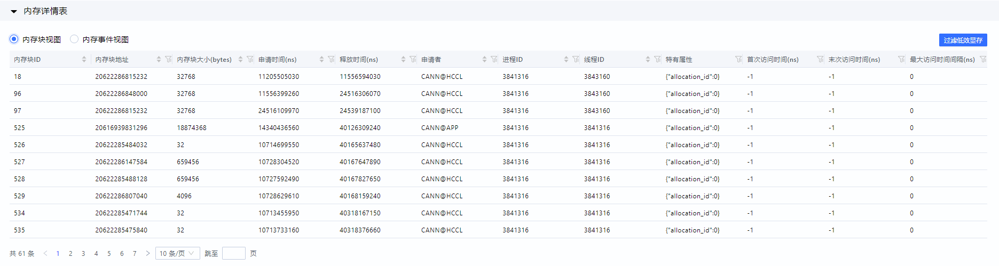
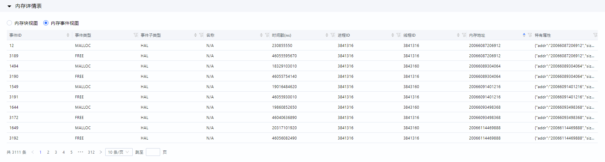
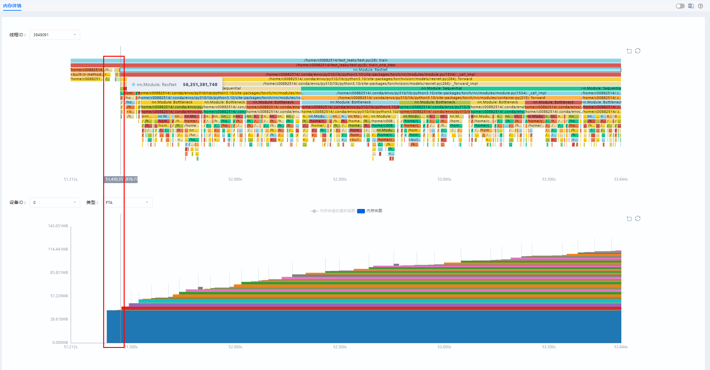
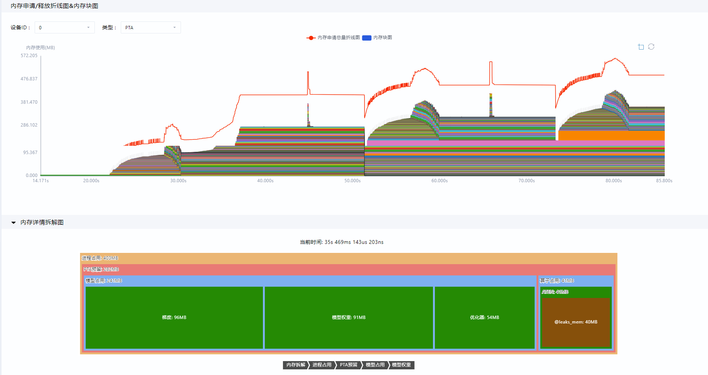
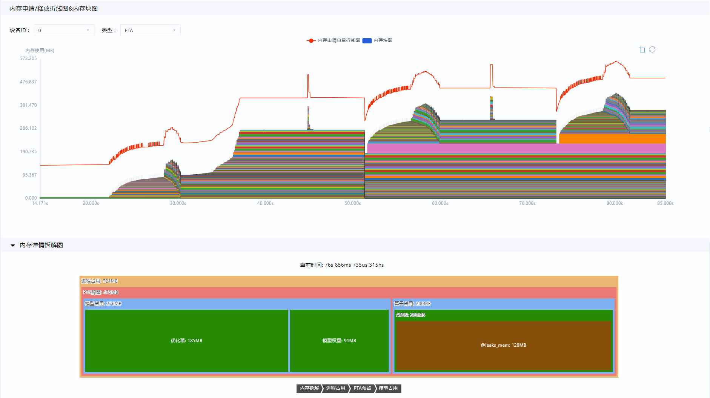

# **MindStudio Insight内存调优**

## 简介

MindStudio Insight工具以图形化形式呈现device侧内存详细分配情况，并结合Python调用栈及自定义打点标签标记各种内存申请使用详情，进行内存问题的详细定位及调优。

## 使用前准备

**环境准备**

请先安装MindStudio Insight工具，具体安装步骤请参见[MindStudio Insight安装指南](./mindstudio_insight_install_guide.md)。

**数据准备**

请导入正确格式的性能数据，具体数据说明请参见[数据说明](#数据说明)，数据导入操作请参见[导入数据](./basic_operations.md#导入数据)。

## 数据说明

支持导入msMemScope工具采集到的db格式的内存结果文件，并以图形化形式呈现相关内容。db文件获取方式请参见《msMemScope内存采集》的“[命令行采集功能介绍](https://gitcode.com/Ascend/msmemscope/blob/master/docs/zh/memory_profile.md#%E5%91%BD%E4%BB%A4%E8%A1%8C%E9%87%87%E9%9B%86%E5%8A%9F%E8%83%BD%E4%BB%8B%E7%BB%8D)”，支持导入的内存数据详情请参见[**表 1**  内存数据说明](#内存数据说明)。

**表 1**  内存数据说明<a id="内存数据说明"></a>

<style type="text/css">

</style>
<table class="tg"><thead>
  <tr>
    <th class="tg-0lax">文件名</th>
    <th class="tg-0lax">说明</th>
    <th class="tg-0lax">界面呈现内容</th>
  </tr></thead>
<tbody>
  <tr>
    <td class="tg-0pky" rowspan="3">leaks_dump_{timestamp}.db</td>
    <td class="tg-0lax">--events参数取值需至少包含alloc、free事件。</td>
    <td class="tg-0pky">内存折线块图（内存申请/释放折线图、内存块图）</td>
  </tr>
  <tr>
    <td class="tg-0lax">--analysis参数取值包含decompose。</td>
    <td class="tg-0lax">内存详情拆解图</td>
  </tr>
  <tr>
    <td class="tg-0lax">通过Python接口开启tracer功能。</td>
    <td class="tg-0pky">Python调用栈图</td>
  </tr>
</tbody>
</table>

## 内存详情（Leaks）

### 功能说明

在内存调优过程中，MindStudio Insight工具通过Python调用栈图和内存折线块图，将内存情况直观地呈现出来，便于开发者分析定位内存问题，有效缩短定位时间。

### 界面介绍

内存详情（Leaks）界面包含调用栈火焰图（区域一）、内存申请/释放折线图&内存块图（区域二）、内存详情拆解图（区域三）和内存详情表（区域四），如[**图 1**  内存详情界面](#内存详情界面)所示。

**图 1**  内存详情界面<a id="内存详情界面"></a>  


- 区域一：调用栈火焰图，通过选择线程ID，展示对应的Python调用栈图；在“搜索”输入框中输入要搜索的函数名，或单击下拉框选择函数名，可选多个函数名，进行搜索，调用栈图中会高亮显示搜索的函数。
- 区域二：内存申请/释放折线图&内存块图，展示内存申请/释放折线图和内存块图，选择内存块图上的色块，展示该内存块的详情，可通过选择设备ID和类型来展示对应的内存折线块图。
- 区域三：内存详情拆解图，默认不显示，当鼠标置于“调用栈火焰图”或者“内存申请/释放折线图&内存块图”中，会显示一条时间线，在“内存申请/释放折线图&内存块图”区域，单击时间线，才会展示对应时间点的内存详情拆解图。
- 区域四：内存详情表，分为“内存块视图”和“内存事件视图”，可选择相应视图查看详情表，具体使用说明请参见[内存详情展示](#内存详情展示)。

### 使用说明

**支持调用栈火焰图和内存折线块图局部放大**

MindStudio Insight支持通过鼠标左键框选放大选中部分，放大功能默认开启。

在“调用栈火焰图”或者“内存申请/释放折线图&内存块图”中，如果图中右上角按钮，是蓝色的，则默认开启放大功能，单击鼠标左键框选需要放大的区域，松开鼠标左键，框选部分将会被放大（“调用栈火焰图”或“内存申请/释放折线图&内存块图”会同时放大），框选放大区域如[**图 1**  框选放大区域](#框选放大区域)所示。单击按钮，图形恢复至原始状态。

可单击“内存申请/释放折线图&内存块图”正上方的图例，隐藏所选的折线和内存块，隐藏后，该折线和内存块在图中不展示，对应图例置灰，再次单击置灰图例，可将其重新展示。

**图 1**  框选放大区域<a id="框选放大区域"> </a> 


> [!NOTE] 说明
> 
> - 单击图中右上角按钮，使其为置灰状态，折线图和块图被锁定，不支持鼠标左键框选放大功能；单击按钮使其变蓝，开启框选放大功能。放大功能默认开启。
> - 单击折线图和块图右上方按钮，图形将会恢复最初状态。

**支持显示内存详情拆解图**

当鼠标置于“调用栈火焰图”或者“内存申请/释放折线图&内存块图”中，会显示一条时间线，在“内存申请/释放折线图&内存块图”区域，单击时间线，则会在“内存申请/释放折线图&内存块图”下方展示对应时间点的内存详情拆解图，便于开发者查看内存占用情况。“内存详情拆解图”展示的内容会随所选择的类型而变化。

如果需要查看指定的内存层级，可单击“内存详情拆解图”下方的层级目录条进入所选层级。

- 当类型选择HAL时，“内存详情拆解图”中仅展示通过CANN级别分类分级的内存数据，如[**图 2**  CANN级别内存详情拆解图](#CANN级别内存详情拆解图)所示。

    **图 2**  CANN级别内存详情拆解图<a id="CANN级别内存详情拆解图"></a>  
    

- 当类型选择除HAL之外的其它选项时，“内存详情拆解图”中展示对应框架侧内存池的内存分类分级情况。例如当类型选择PTA时，“内存详情拆解图”中仅展示PTA框架的内存情况，如[**图 3**  PTA框架内存详情拆解图](#PTA框架内存详情拆解图)所示。

    **图 3**  PTA框架内存详情拆解图<a id="PTA框架内存详情拆解图"></a>  
    

> [NOTE] 说明  
> “内存详情拆解图”支持左右上下拖拽和缩放展示。
>
> - 鼠标放置在图中，按住鼠标左键可实现左右上下拖拽。
> - 在“内存详情拆解图”上，使用鼠标滚轮实现缩放展示；或选择任一内存块，单击鼠标左键，可将选中的内存层级放大展示。

**调用栈图与内存块图支持联动**

双击“调用栈火焰图”中单个调用栈块时，会以该调用栈块的起始时间和截止时间为界放大调用栈图，显示该时间段的所有调用栈信息，同时，“内存申请/释放折线图&内存块图”同步放大，显示该时间段内的所有内存块。

双击“内存申请/释放折线图&内存块图”的指定内存块，会以该内存块的起始时间和截止时间为界放大内存块图，显示该时间段的所有内存块，同时，“调用栈火焰图”实现联动，同步放大显示该时间段内的所有调用栈，并自动匹配至对应的“线程ID”，如[**图 4**  调用栈图和内存块图联动](#调用栈图和内存块图联动)所示。

如果需要将图形恢复最初状态，单击图形右上方按钮即可。

> [!NOTE] 说明   
> 如果内存块对应的“线程ID”未采集调用栈数据，则“调用栈火焰图”区域将为空。

**图 4**  调用栈图和内存块图联动<a id="调用栈图和内存块图联动"></a>  


**内存详情展示**<a id="内存详情展示"></a>

在内存详情表区域，通过“内存块视图”和“内存事件视图”分别展示内存的详细信息，默认展示所有内存相关信息。

表格中呈现的字段支持排序和搜索，单击字段名称后，可搜索所需信息。

> [!NOTE] 说明   
> “内存块视图”中的“内存块大小”、“申请时间”和“释放时间”字段，“内存事件视图”中的“时间戳\(ns\)”字段，单击，支持筛选，可输入最小值和最大值进行区间筛选，只能输入整数，输入的数值最小为0，最大为当前展示的对应字段的最大值。

- 内存块视图：展示内存块的详细信息，如[**图 5**  内存块视图](#内存块视图)所示，字段解释如[**表 1**  内存块视图字段说明](#内存块视图字段说明)所示。

    当在“内存申请/释放折线图&内存块图”中分别选择不同“设备ID”和“类型”时，内存块视图的展示信息也会随之更新；当框选“内存申请/释放折线图&内存块图”中部分区域展示时，内存块视图的信息也会随之更新，展示的是所有与框选时间范围存在交集的内存块信息。

    在“内存块视图”表格右上方，单击“过滤低效显存”按钮，弹出筛选弹框，分别通过设置“提前申请阈值”、“延迟释放阈值”或“空闲过长阈值”，筛选低效显存。

    **图 5**  内存块视图<a id="内存块视图"></a>  
    

    **表 1**  内存块视图字段说明<a id="内存块视图字段说明"></a>

    |中文字段|英文字段|说明|
    |--|--|--|
    |内存块ID|ID|内存块ID，内存块唯一标识。|
    |内存块地址|Addr|内存块地址，对应内存申请/释放/访问事件的地址。|
    |内存块大小(bytes)|Size(bytes)|内存块大小，对应内存申请事件，单位为bytes。|
    |申请时间(ns)|Malloc Timestamp(ns)|内存块申请时间，对应内存申请事件的时间，单位ns。|
    |释放时间(ns)|Free Timestamp(ns)|内存块释放时间，对应内存释放事件的时间，单位ns。|
    |申请者|Owner|内存块持有者所属标签。|
    |进程ID|Process ID|内存块所属进程号，对应内存申请/释放事件的所属进程号。|
    |线程ID|Thread ID|内存块所属线程号，对应内存申请/释放事件的所属线程号。|
    |首次访问时间(ns)|First Access Timestamp(ns)|首次访问事件时间。|
    |末次访问时间(ns)|Last Access Timestamp(ns)|末次访问事件时间。|
    |最大访问时间间隔(ns)|Max Access Interval(ns)|访问事件的最大间隔时间。|
    |特有属性|Attr|扩展属性，包含以下信息：<br> - allocation_id：内存块所属的申请/访问/释放序列id，唯一标识一组内存事件。<br> - lazy_used：提前申请场景，取值为true或者false，true表示已识别到该场景。<br> - delayed_free：延迟释放场景，取值为true或者false，true表示已识别到该场景。<br> - long_Idle：超长闲置场景，取值为true或者false，true表示已识别到该场景。|

  > [!NOTE] 说明
  > 
  > - 如果导入的数据是使用MindStudio 8.2.RC1之前版本的msMemScope工具采集的，或者数据中没采集到访问事件，那么allocation\_id显示为0，首次访问时间\(ns\)、末次访问时间\(ns\)显示为-1，最大访问时间间隔\(ns\)显示为0。
  > - 由于msMemScope工具当前仅支持采集ATB和Ascend Extension for PyTorch算子场景的内存访问事件，则首次访问时间\(ns\)、末次访问时间\(ns\)和最大访问间隔\(ns\)也仅支持展示对应场景的详情，其余场景下，首次访问时间\(ns\)、末次访问时间\(ns\)显示为-1，最大访问时间间隔\(ns\)显示为0。

- 内存事件视图：展示内存事件的详细信息，如[**图 6**  内存事件视图](#内存事件视图)所示，字段解释如[**表 2**  内存事件视图字段说明](#内存事件视图字段说明)所示。

    当在“内存申请/释放折线图&内存块图”中选择不同“设备ID”时，内存事件视图的展示信息也会随之更新；当框选“内存申请/释放折线图&内存块图”中部分区域展示时，内存事件视图的信息也会随之更新，展示的是框选时间范围内的所有内存事件。

    **图 6**  内存事件视图<a id="内存事件视图"></a>  
    

    **表 2**  内存事件视图字段说明<a id="内存事件视图字段说明"></a> 

    |中文字段|英文字段|说明|
    |--|--|--|
    |事件ID|ID|事件ID，与Process ID共同标识唯一一个内存事件。|
    |事件类型|Event|msMemScope记录的事件。|
    |事件子类型|Event Type|事件子类型。|
    |名称|Name|事件名称，与Event值有关。|
    |时间戳(ns)|Timestamp(ns)|内存事件发生的时间。|
    |进程ID|Process ID|进程号。|
    |线程ID|Thread ID|线程号。|
    |内存地址|Addr|内存地址。|
    |特有属性|Attr|内存事件特有属性，每个事件类型有各自的属性项。|
    |调用栈(Python)|Call Stack(Python)|Python调用栈。仅当数据中采集到该信息时，则显示该字段。|
    |调用栈(C)|Call Stack(C)|C调用栈。仅当数据中采集到该信息时，则显示该字段。|

    > [!NOTE] 说明   
    > 事件类型、事件子类型和名称字段的取值可参见《msMemScope内存采集》的“[命令行采集功能介绍](https://gitcode.com/Ascend/msmemscope/blob/master/docs/zh/memory_profile.md#%E5%91%BD%E4%BB%A4%E8%A1%8C%E9%87%87%E9%9B%86%E5%8A%9F%E8%83%BD%E4%BB%8B%E7%BB%8D)”章节的leaks\_dump\_\{timestamp\}.csv结果文件说明。

## 内存问题分析案例

### 概述

在昇腾全栈开发活动中，内存问题较为常见，但是由于内存问题的软件栈层次复杂（包括但不限于操作系统的驱动和运行时库、CANN、MindSpore/PyTorch\_NPU、模型训练和模型推理等），导致内存问题的定位和解决往往较为困难。目前典型的内存问题分类可参见[**表 1**  内存问题分类](#内存问题分类)。

本文介绍通过MindStudio Insight工具定位内存问题的方法。

**表 1**  内存问题分类<a id="内存问题分类"></a>

|问题类别|问题现象|场景|
|--|--|--|
|内存踩踏|出现精度异常或出现NaN，通常出现在Device上。|训练、推理、算子开发|
|内存使用过多|内存使用过多，通常与以下两种情况有关：<br> - 泄漏或OOM（Out of Memory，内存溢出）：Host侧内存监测持续增长，甚至OOM;或者Device侧内存使用量持续增长，甚至OOM。<br> - 与预期或基线相差大：实际采集的内存使用数据远超预期或基线数据，差值会达到GB量级，通常出现在Device侧。|训练、推理|

**定位流程**

针对Device侧内存使用过多或OOM，问题分析流程如下：

1. 通过性能调优工具采集性能数据，并导入MindStudio Insight；
2. 查看内存（Memory）界面中“内存分析”区域的内存曲线图、算子或组件内存申请/释放详情，进行基础定界，明确异常范围、Step或算子；
3. 使用内存工具（msMemScope）工具采集对应异常范围的内存详情与内存拆解数据，导入MindStudio Insight；
4. 查看内存详情（Leaks）界面，结合“调用栈火焰图”、“内存申请/释放折线图&内存块图”、“内存详情表”进行内存占用拆解分析。

### 前期准备

**准备软件**

- 下载MindStudio Insight工具并安装，请参见[MindStudio Insight安装指南](./mindstudio_insight_install_guide.md)。
- 安装msMemScope工具，安装操作请参见[msMemScope工具安装指南](https://gitcode.com/Ascend/msmemscope/blob/master/docs/zh/install_guide.md)。

**准备数据**

以下采集的数据为内存泄漏的数据。

1. 使用msMemScope工具执行如下命令，在每个Step中申请一个大小为4 x 10MB的Tensor，并追加到全局变量leak\_mem\_list列表中（不会随train\_one\_step释放），采集3个Step的Python Trace数据。

    ```shell
    msmemscope --level=0,1 --events=alloc,free,access,launch --analysis=decompose --data-format=db python test.py
    ```

    其中test.py的示例代码如下：

    ```python
    import torch
    import torch_npu
    from torchvision.models import resnet50
    import msmemscope
    import msmemscope.describe as describe
    leak_mem_list = []
    def train_one_step(model, optimizer, loss_fn, device):
        # 对代码块做标记，代码块内所有内存申请事件的owner属性都会打上标签leaks_mem
        describe.describer(owner="leaks_mem").__enter__()
        # 内存泄漏代码段
        leak_mem_list.append(torch.randn(1024 * 1024 * 10, dtype=torch.float32).to(device))
        # 结束标记
        describe.describer(owner="leaks_mem").__exit__(None, None, None)
        # 单次训练代码段
        inputs = torch.randn(1, 3, 224, 224).to(device)
        labels = torch.rand(1, 10).to(device)
        pred = model(inputs)
        loss_fn(pred, labels).backward()
        optimizer.step()
        optimizer.zero_grad()
    def train(model, optimizer, loss_fn, device, steps=1):
        for i in range(steps):
            train_one_step(model, optimizer, loss_fn, device)
    device = torch.device("npu:0")
    torch.npu.set_device(device)  # 设置device
    model = resnet50(pretrained=False, num_classes=10).to(device)  # 加载模型
    optimizer = torch.optim.Adam(model.parameters(), lr=1e-2)  # 定义优化器
    loss_fn = torch.nn.CrossEntropyLoss()  # 定义损失函数
    
    # 开启采集python函数调用数据
    msmemscope.tracer.start()
    train(model, optimizer, loss_fn, device, steps=3)  # 开始训练
    
    # 停止采集python函数调用数据
    msmemscope.tracer.stop()
    ```

2. 采集完成后，输出db格式的文件。
3. 将文件下载至本地保存。

### 内存分析

**导入数据**

1. 打开MindStudio Insight工具，单击左侧导航栏的“导入数据”。
2. 在弹出的“文件资源管理器”弹框中，选择需要导入的db格式的文件。
3. 导入成功后，显示“内存详情”界面。

**内存分析**

1. 打开“内存详情”界面，查看“调用栈火焰图”和“内存申请/释放折线图&内存块图”。
2. 单击鼠标左键框选“内存申请/释放折线图&内存块图”中的Step2区域，松开鼠标左键，放大Step2区域。

    可以从[**图 1**  未释放的内存块](#未释放的内存块)中看出，在Step2结束时，仍存在一个未释放的内存块。

    **图 1**  未释放的内存块<a id="未释放的内存块"></a>  
    

3. 查看“调用栈火焰图”，发现该内存块来自于一个Tensor对象，在前向传播开始前即已申请，如[**图 2**  Tensor对象](#Tensor对象)所示。

    **图 2**  Tensor对象<a id="Tensor对象"></a>  
    

4. 对照leaks\_mem标记的代码段，查看“内存详情拆解图”，发现leaks\_mem标记的代码段存在明显的增长，从Step 1开始leaks\_mem标签内存占用首次出现为40M，如[**图 3**  查看Step 1的内存占用](#查看Step-1的内存占用)所示。

    **图 3**  查看Step 1的内存占用<a id="查看Step-1的内存占用"></a>  
    

    如[**图 4**  查看Step 2的内存占用](#查看Step-2的内存占用)所示，Step 2中leaks\_mem标签内存占用从40M增长到了80M。

    **图 4**  查看Step 2的内存占用<a id="查看Step-2的内存占用"></a>  
    

    如[**图 5**  查看Step 3的内存占用](#查看Step-3的内存占用)所示，Step 3中leaks\_mem标签内存占用从80M增长到了120M。

    **图 5**  查看Step 3的内存占用<a id="查看Step-3的内存占用"></a>  
    
