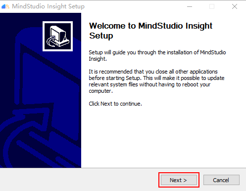
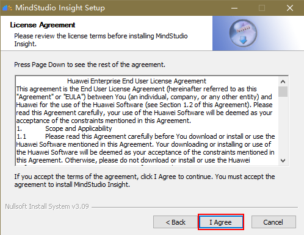
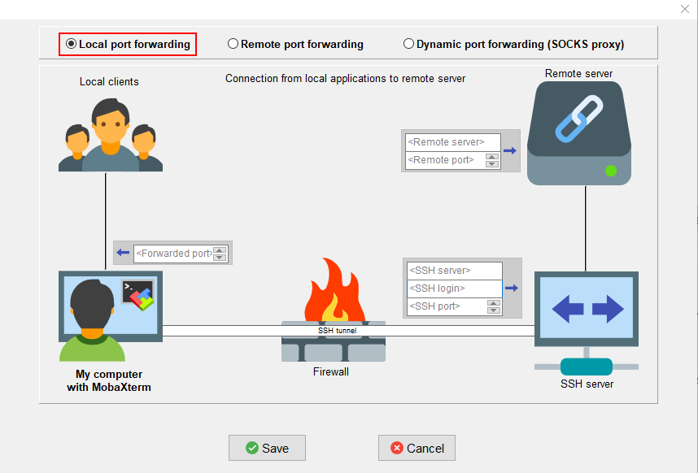

# **MindStudio Insight安装指南**

## 安装说明

MindStudio Insight是面向开发者的可视化调优工具，能够将性能数据以时序图、热力图等一些简单易懂的图表呈现，帮助开发者快速识别性能瓶颈，快速完成性能优化。本文主要介绍MindStudio Insight的安装方式。

MindStudio Insight支持在Windows、Linux和macOS系统上安装使用，并且支持通过JupyterLab插件方式安装使用。

## 准备软件包

**软件包下载**

单击获取[软件包](https://gitcode.host/Ascend/msinsight/releases)，确认版本信息后获取如[**表 1**  软件包清单](#软件包清单)所示软件包。

下载本软件即表示您同意[华为企业业务最终用户许可协议（EULA）](https://e.huawei.com/cn/about/eula)的条款和条件。

**表 1**  软件包清单<a id="软件包清单"></a>

|软件包|说明|
|--|--|
|MindStudio-Insight_*{version}*_win.exe|适用于Windows系统的MindStudio Insight软件包，含有GUI的集成开发环境。|  
|MindStudio-Insight_*{version}*_linux-aarch64.zip|适用于Linux系统aarch64架构的MindStudio Insight软件包。|  
|MindStudio-Insight_*{version}*_linux-x86_64.zip|适用于Linux系统x86_64架构的MindStudio Insight软件包。|  
|MindStudio-Insight_*{version}*_darwin-*{arch}*.dmg|适用于macOS系统的MindStudio Insight软件包，含有GUI的集成开发环境。|  
|mindstudio_insight_jupyterlab-{*version*}-py3-none-{*platform*}.whl|基于JupyterLab安装的软件包。|

**软件完整性验证**

为了防止软件包在传递过程或存储期间被恶意篡改，下载软件包时需下载对应软件包的.sha256文件用于完整性验证。

请单击[数字签名文件](https://gitcode.host/Ascend/msinsight/releases)获取对应软件包的sha256文件，对下载的软件包进行完整性校验。如果校验失败，请不要使用该软件包，访问支持与服务在论坛求助或提交技术工单。

## 安装MindStudio Insight

### 安装操作（Windows）

**准备环境**

MindStudio Insight工具的安装与可视化呈现对Windows系统及设备配置有一定要求，请参见[**表 1**  系统配置要求](#系统配置要求)。

**表 1**  系统配置要求<a id="系统配置要求"></a>

|类别|要求|说明|
|--|--|--|
|系统|Windows 10 64位操作系统|-|
|内存配置|推荐16GB或以上|针对大模型集群场景，加载的数据量较大。|
|磁盘空间|推荐可用空间30GB或以上|用于存放加载性能数据时生成的数据库文件。|

**安装步骤**

1. 双击**MindStudio-Insight\__\{version\}_\_win.exe**软件包，开始安装MindStudio Insight。
2. 进入MindStudio Insight  Setup界面，单击“Next”，如[**图 1** Setup](#Setup)所示。

    **图 1** Setup<a id="Setup"></a>  
    

3. 进入许可协议界面，单击“I Agree”，如[**图 2**  License-Agreement](#License-Agreement)所示。

    **图 2**  License-Agreement<a id="License-Agreement"></a>  
    

4. 选择MindStudio Insight的安装路径，单击“Next”，如[**图 3**  选择安装路径](#选择安装路径)所示。

    **图 3**  选择安装路径<a id="选择安装路径"></a>  
    

    > [!NOTE] 说明  
    > 默认安装目录为“C:\\Program Files \(x86\)\\MindStudio Insight”。如果选择安装到其他目录，为避免其他用户修改运行文件，需要取消普通用户的修改权限，可在所选文件夹右键选择“属性 \> 安全”，在“安全”页签下修改用户的权限。

5. 选择安装组件MindStudio Insight，单击“Install”，如[**图 4**  选择安装组件](#选择安装组件)所示。

    **图 4**  选择安装组件<a id="选择安装组件"></a>  
    

6. 完成MindStudio Insight安装，单击“Finish”，如[**图 5**  完成安装](#完成安装)所示。<a id="6"></a>

    **图 5**  完成安装 <a id="完成安装"></a>  
    

7. 启动MindStudio Insight。

    - 如果在[6](#6)中，勾选了“Run MindStudio Insight”，单击“Finish”后会自动启动MindStudio Insight。
    - 如果未勾选“Run MindStudio Insight”，安装完成后，双击桌面的“MindStudio Insight”快捷方式图标，或安装目录下的“MindStudio-Insight.exe”，即可启动MindStudio Insight工具。

    > [!NOTE] 说明   
    > 安装完成后，运行MindStudio Insight工具时，如果出现Missing Dependencies报错弹窗，请参见[运行MindStudio Insight工具时出现Missing Dependencies报错弹窗](./FAQ.md#运行mindstudio-insight工具时出现missing-dependencies报错弹窗)解决。

### 安装操作（Linux）

#### 概述

在Linux环境下，MindStudio Insight工具可通过本地方式和转发方式进行使用。

- 本地方式

    本地安装Linux操作系统的服务器直接外接显示器，将工具界面直接展示在操作系统桌面上，跟日常本地Windows主机接显示器类似，此场景无工具界面的延迟。

- 转发方式

    当本地无Linux服务器时，可通过连接远端的Linux服务器，使用X11、VNC、XRDP等方式将远端Linux服务器中的桌面或软件界面转发到本地显示，例如，本地Windows桌面显示Linux服务器上的应用程序界面。MindStudio Insight可通过转发能力，在Linux服务器上实现界面转发，便于开发者使用。不过与本地方式相比，转发方式受网络性能影响，可能存在网络延时，会造成工具安装使用过程中出现卡顿问题。

本文档主要介绍X11和VNC两种转发方式，开发者可根据实际情况选择其中一种转发方式，可参见[**表 1**  转发方式说明](#转发方式说明)进行选择。通过转发方式安装使用MindStudio Insight，首先需要安装转发方式和软件依赖，安装操作请参见[安装依赖](#安装依赖)章节。

> [!NOTE] 说明   
> 推荐使用VNC转发方式，可获得更为流畅的使用体验。

**表 1**  转发方式说明<a id="转发方式说明"></a>

|转发方式|网络延迟|安全性|备注|
|--|--|--|--|
|X11|相对较高|底层基于SSH安全协议。|多用于网络良好的本地局域网中。|
|VNC|相对较低|默认通过TCP方式，可借助SSH安全协议实现安全访问。|应用范围更广，可用在跨城网络、VPN网络等。|

**准备环境**

在Linux系统中，MindStudio Insight安装环境要求如[**表 2** MindStudio Insight安装环境要求](#Insight安装环境要求)所示。

**表 2** MindStudio Insight安装环境要求<a id="Insight安装环境要求"></a>

|类别|限制要求|
|--|--|
|硬件|- 内存：最小4GB，推荐8GB及以上<br> - 磁盘空间：最小6GB|
|系统要求|- glibc版本应大于或等于2.27<br> - 操作系统自带GUI桌面或具有X11或VNC转发功能|
|支持的操作系统|以apt作为包管理软件类型的操作系统：<br> - Ubuntu 18.04-x86_64/aarch64<br> - Ubuntu 20.04-x86_64/aarch64<br> - Ubuntu 22.04-x86_64/aarch64<br> - CentOS 8.2-x86_64/aarch64<br> - Debian 10.0<br> - Debian 10.8<br> 以yum/dnf作为包管理软件类型的操作系统：<br> - EulerOS 2.8-aarch64<br> - EulerOS 2.12-aarch64<br> - OpenEuler 20.03-x86_64/aarch64<br> - OpenEuler 22.03 LTS-x86_64/aarch64<br> - OpenEuler 22.03 LTS<br> - OpenEuler 22.03 LTS SP4<br> - HCE 2.0<br> - CUlinux 3.0<br> - Kylin V10 SP3<br> - Euler 2.13(ARM)<br> - HCE 2.0.2503(x86)<br> - Tlinux 3.1-内核版本5.4<br> - BClinux 21.10 U4<br> - TencentOS Server 4.4_x86|

> [!NOTE]  说明  
> 在直通虚拟机velinux 5.15系统上安装和使用MindStudio Insight工具时，推荐使用JupyterLab插件的安装方式使用MindStudio Insight工具，JupyterLab插件安装请参见[安装操作（JupyterLab插件）](#安装操作jupyterlab插件)章节进行操作。

#### 安装依赖

**依赖列表**

在Linux环境下，安装MindStudio Insight前需要安装相关依赖，请参见[**表 1**  依赖列表](#依赖列表)安装对应依赖。

> [!NOTE] 说明   
> 如果MindStudio Insight导入的是多卡场景的性能数据，则需要安装python的pandas库，执行命令`pip install pandas`进行安装。

**表 1**  依赖列表<a id="依赖列表"></a>

<table><thead>
  <tr>
    <th>依赖名称</th>
    <th>说明</th>
  </tr></thead>
<tbody>
  <tr>
    <td>libwebkit2gtk-4.0-dev</td>
    <td>Ubuntu系统中，MindStudio Insight显示运行依赖的库文件，必选。</td>
  </tr>
  <tr>
    <td>gtk3-devel webkit2gtk4.1-devel</td>
    <td>CentOS系统中，MindStudio Insight显示运行依赖的库文件，必选。</td>
  </tr>
  <tr>
    <td>gtk3-devel webkit2gtk3-devel</td>
    <td>EulerOS和OpenEuler系统中，MindStudio Insight显示运行依赖的库文件，必选。</td>
  </tr>
  <tr>
    <td>xterm</td>
    <td>MindStudio Insight通过X11转发的依赖文件。当选择X11转发方式时，所有系统必选。</td>
  </tr>
  <tr>
    <td>x11-apps</td>
    <td>Ubuntu系统中，MindStudio Insight通过X11转发的依赖文件。当选择X11转发方式时，必选。</td>
  </tr>
  <tr>
    <td>xorg-x11-xauth</td>
    <td>CentOS、EulerOS和OpenEuler系统中，MindStudio Insight通过X11转发的依赖文件。当选择X11转发方式时，必选。</td>
  </tr>
  <tr>
    <td>xfce4</td>
    <td>Ubuntu、CentOS、OpenEuler系统中，MindStudio Insight通过VNC转发的依赖文件。当选择VNC转发方式时，必选。</td>
  </tr>
  <tr>
    <td>gnome-desktop</td>
    <td>EulerOS系统中，MindStudio Insight通过VNC转发的依赖文件。当选择VNC转发方式时，必选。</td>
  </tr>
  <tr>
    <td>click</td>
    <td rowspan="13">编译安装Python需要的依赖。<br>其中版本要求为：<br>xlsxwriter&gt;=3.0.6<br>numpy&lt;=1.26.4</td>
  </tr>
  <tr>
    <td>tabulate</td>
  </tr>
  <tr>
    <td>networkx</td>
  </tr>
  <tr>
    <td>jinja2</td>
  </tr>
  <tr>
    <td>PyYaml</td>
  </tr>
  <tr>
    <td>tqdm</td>
  </tr>
  <tr>
    <td>prettytable</td>
  </tr>
  <tr>
    <td>ijson</td>
  </tr>
  <tr>
    <td>xlsxwriter</td>
  </tr>
  <tr>
    <td>sqlalchemy</td>
  </tr>
  <tr>
    <td>numpy</td>
  </tr>
  <tr>
    <td>pandas</td>
  </tr>
  <tr>
    <td>psutil</td>
  </tr>
</tbody></table>

**安装依赖**

1. 执行以下命令，安装Python相关依赖。

    ```python
    pip3 install click
    pip3 install tabulate
    pip3 install networkx
    pip3 install jinja2
    pip3 install PyYaml
    pip3 install tqdm
    pip3 install prettytable
    pip3 install ijson
    pip3 install xlsxwriter
    pip3 install sqlalchemy
    pip3 install numpy
    pip3 install pandas
    pip3 install psutil
    ```

2. 安装MindStudio Insight软件包所需的转发方式和依赖，推荐安装VNC和X11转发方式。

#### 安装VNC转发方式

如果通过VNC转发方式启动MindStudio Insight，可获得更为流畅的体验，所以推荐使用VNC转发方式使用MindStudio Insight工具。

> [!NOTE] 说明 
>
> - EulerOS 2.12系统不支持使用VNC方式启动MindStudio Insight工具。
> - 本章节内容仅供参考，VNC的具体安装步骤请参见[VNC官方文档](https://docs.redhat.com/en/documentation/red_hat_enterprise_linux/6/html/deployment_guide/chap-tigervnc#s2-starting-vncserver)。

**安装依赖**

1. 执行以下命令，安装MindStudio Insight显示运行依赖的库文件。
    - Ubuntu等以apt作为包管理软件类型的操作系统

        ```shell
        sudo apt install -y libwebkit2gtk-4.0-dev
        ```

    - CentOS/EulerOS/OpenEuler等以yum/dnf作为包管理软件类型的操作系统

        1. 执行以下命令，查询webkit2gtk库文件。

            ```shell
            sudo yum search webkit2gtk
            ```

            回显信息如下

            ```tex
            = Name 和 Summary 匹配：webkit2gtk =====================================================================================
            webkit2gtk3-devel.aarch64 : Development files for webkit2gtk3
            webkit2gtk3-help.noarch : Documentation files for webkit2gtk3
            webkit2gtk3-jsc.aarch64 : JavaScript engine from webkit2gtk3
            webkit2gtk3-jsc-devel.aarch64 : Development files for JavaScript engine from webkit2gtk3
            ========================================================================================== Name 匹配：webkit2gtk ===========================================================================================
            webkit2gtk3.aarch64 : GTK+ Web content engine library
            ========================================================================================= Summary 匹配：webkit2gtk =========================================================================================
            libproxy-webkitgtk4.aarch64 : plugin for webkit2gtk3
            ```

        2. 根据回显信息，执行以下命令，安装webkit2gtk库文件。

            ```shell
            sudo yum install -y ${dependency_name}
            ```

            其中`dependency_name`为依赖文件名称，可参考回显信息确定。例如，如上回显信息所示，如果回显信息中存在webkit2gtk3-devel，则此处的依赖文件名称为webkit2gtk3-devel；如果回显信息中不存在webkit2gtk3-devel，则需要找到webkit2gtk3，此处的依赖文件名称为webkit2gtk3。

        > [!NOTE] 说明   
        > EulerOS 2.12操作系统是基于OpenEuler 22.03 LTS SP1开发，需要先配置OpenEuler 22.03 LTS SP1的源，再执行安装命令。配置OpenEuler的源具体操作请参见[OpenEuler软件源配置](https://mirrors.huaweicloud.com/mirrorDetail/5ebe3408c8ac54047fe607f0?mirrorName=openeuler&catalog=os)。

2. 使用root用户，执行以下命令，安装MindStudio Insight通过VNC转发的桌面依赖。
    - Ubuntu等以apt作为包管理软件类型的操作系统

        ```shell
        apt-get install -y xfce4 xfce4-goodies
        ```

    - CentOS/EulerOS/OpenEuler等以yum/dnf作为包管理软件类型的操作系统
        1. 执行以下命令，查询是否存在xfce。

            ```shell
            yum search xfce
            ```

            如果回显中包含xfce相关信息，执行以下命令，安装xfce。

            ```shell
            yum install -y xfce4*
            ```

            如果回显为“未找到匹配项”，则执行[2](#2_b)。

        2. 执行以下命令，查询是否存在gnome。<a id="2_b"></a>

            ```shell
            yum search gnome
            ```

            如果回显中包含gnome相关信息，执行以下命令，安装gnome。

            ```shell
            yum install -y gnome* 
            ```

3. 执行以下命令，安装VNC Server。
    - Ubuntu等以apt作为包管理软件类型的操作系统

        ```shell
        apt-get install -y tightvncserver
        ```

    - CentOS/EulerOS/OpenEuler等以yum/dnf作为包管理软件类型的操作系统

        ```shell
        yum install -y tigervnc-server
        ```

**设置VNC Server**

1. 执行以下命令，设置VNC首次连接时的密码。

    ```shell
    vncserver
    ```

2. 回显如下，按照提示输入密码。

    ```shell
    You will require a password to access your desktops.
    Password:请输入密码
    Verify:请再次输入密码
    ```

3. 输入密码后，回显如下。<a id="3"></a>

    ```tex
    Would you like to enter a view-only password (y/n)? 
    ```

    按照提示输入n，回显如下，创建启动脚本、默认配置等，首行中的`x`值根据实际情况显示，表示显示序号。

    ```tex
    New 'localhost.localdomain:x' desktop is localhost.localdomain:x
    Creating default startup script /home/xxx/.vnc/xstartup
    Creating default config /home/xxx/.vnc/config
    Starting applications specified in /home/xxx/.vnc/xstartup
    Log file is /home/xxx/.vnc/localhost.localdomain:3.log
    ```

4. 执行以下命令，停止已启用的VNC Server。

    ```shell
    vncserver -kill :x
    ```

    > [!NOTE] 说明   
    > 此处的`x`值与[3](#3)中首行回显的`x`值一致。

5. 执行```vi ~/.vnc/xstartup```，打开xstartup启动脚本，并在脚本最后新增一行文本，配置脚本，需要增加的文本内容请参见[**表 1**  文本内容](#文本内容)。

    **表 1**  文本内容<a id="文本内容"></a>

    |已安装依赖|文本内容|
    |--|--|
    |xfce|startxfce4 &|
    |gnome|gnome-session &|

6. 执行```:wq!```命令，保存脚本并退出。

**启动VNC Server**

执行以下命令，启动VNC Server。

```shell
vncserver -localhost -geometry 1920x1080
```

> [!NOTE] 说明   
>
> - **localhost**：是启动本地主机的VNC服务，需要与[端口转发](#端口转发)配合使用。如果是安全的网络环境下，也可以不使用localhost，同时也不采用[端口转发](#端口转发)，可直接执行[本地连接VNC Server](#本地连接VNC)步骤（不推荐此方式）。
> - **geometry 1920x1080**：配置VNC桌面的分辨率为1920x1080，也可以根据用户显示器的分辨率自行配置。

**端口转发**<a id="端口转发"></a>

通过SSH通道安全的将Linux本地主机服务转发至Windows本地端口。

1. 打开远程登录工具，选择“Tools \> MobaSSHTunnel \(port forwarding\)”。此处以MobaXterm工具为例。
2. 单击“New SSH Tunnel”，新建一个SSH配置。

    **图 1**  新建SSH配置  
    

3. 选择“Local port forwarding”，按照[**表 2**  配置Local port forwarding页面信息](#配置Local_port_forwarding页面信息)配置页面信息。

    **图 2**  Local port forwarding  
    

    **表 2**  配置Local port forwarding页面信息<a id="配置Local_port_forwarding页面信息"></a>

    |参数|说明|示例|
    |--|--|--|
    |Remote server|Linux服务器的地址。|127.0.0.1|
    |Remote port|Linux服务器的端口，值为5900加设置VNC Server中的x（显示序号）值。|5901|
    |SSH server|SSH连接时的IP或URL地址。|192.168.25.38|
    |SSH login|SSH登录的用户名/密码对。|-|
    |SSH port|SSH登录时使用的端口，一般为22。|22|
    |Forwarded port|端口转发到本地Windows对应的端口，可以与Remote port一致。|5901|

4. 单击“Save”，完成SSH配置。
5. 在MobaSSHTunnel弹窗中，选择已配置好的SSH Tunnel，单击，即可开启端口转发。

    如果SSH配置中的“SSH login”参数，填写的是用户名，首次启动SSH Tunnel的时候会弹出一个对话框，输入用户对应的密码即可启动SSH Tunnel。

**本地连接VNC Server**<a id="本地连接VNC"></a>

1. 在MobaXterm工具首页，单击“Session”，进入Session settings页面。
2. 单击“VNC”，根据实际情况配置“Remote hostname or IP address”和“Port”。

    > [!NOTE] 说明   
    > - 如果使用了端口转发功能，“Remote hostname or IP address”为127.0.0.1，“Port”为端口转发中的Forwarded port。
    > - 如果未使用端口转发，“Remote hostname or IP address”为实际远端Linux的IP，“Port”为5900加设置VNC Server中的`x`（显示序号）值。

    **图 3**  配置VNC  
    

3. 配置完成后，单击“OK”，在弹窗中输入VNC的密码后，将桌面转发至本地进行后续操作。

    **图 4**  桌面  
    

#### 安装X11转发方式

**前提条件**

确保源可用。可在root用户下执行如下命令检查源是否可用。

- Ubuntu等以apt作为包管理软件类型的操作系统

    ```shell
    apt-get update
    ```

- CentOS/EulerOS/OpenEuler等以yum/dnf作为包管理软件类型的操作系统

    ```shell
    yum makecache
    ```

> [!NOTE] 说明   
> 如果OpenEuler及其衍生操作系统，在安装过程中提示找不到相关依赖，可能原因是系统配置的源没有相关依赖，可参见[链接](https://www.hiascend.com/forum/thread-02101178181671140059-1-1.html)配置新的源，并重新安装对应依赖。

**操作步骤**

1. 执行以下命令，安装MindStudio Insight显示运行依赖的库文件。
    - Ubuntu等以apt作为包管理软件类型的操作系统

        ```shell
        sudo apt install -y libwebkit2gtk-4.0-dev
        ```

    - CentOS/EulerOS/OpenEuler等以yum/dnf作为包管理软件类型的操作系统

        1. 执行以下命令，查询webkit2gtk库文件。

            ```shell
            sudo yum search webkit2gtk
            ```

            回显信息如下

            ```tex
            = Name 和 Summary 匹配：webkit2gtk =====================================================================================
            webkit2gtk3-devel.aarch64 : Development files for webkit2gtk3
            webkit2gtk3-help.noarch : Documentation files for webkit2gtk3
            webkit2gtk3-jsc.aarch64 : JavaScript engine from webkit2gtk3
            webkit2gtk3-jsc-devel.aarch64 : Development files for JavaScript engine from webkit2gtk3
            ========================================================================================== Name 匹配：webkit2gtk ===========================================================================================
            webkit2gtk3.aarch64 : GTK+ Web content engine library
            ========================================================================================= Summary 匹配：webkit2gtk =========================================================================================
            libproxy-webkitgtk4.aarch64 : plugin for webkit2gtk3
            ```

        2. 根据回显信息，执行以下命令，安装webkit2gtk库文件。

            ```shell
            sudo yum install -y ${dependency_name}
            ```

            其中`dependency_name`为依赖文件名称，可参考回显信息确定。例如，如上回显信息所示，如果回显信息中存在webkit2gtk3-devel，则此处的依赖文件名称为webkit2gtk3-devel；如果回显信息中不存在webkit2gtk3-devel，则需要找到webkit2gtk3，此处的依赖文件名称为webkit2gtk3。

        > [!NOTE]  说明   
        > EulerOS 2.12操作系统是基于OpenEuler 22.03 LTS SP1开发，需要先配置OpenEuler 22.03 LTS SP1的源，再执行安装命令。配置OpenEuler的源具体操作请参见[OpenEuler软件源配置](https://mirrors.huaweicloud.com/mirrorDetail/5ebe3408c8ac54047fe607f0?mirrorName=openeuler&catalog=os)。

2. 执行以下命令，安装MindStudio Insight通过X11转发的依赖文件。
    - Ubuntu等以apt作为包管理软件类型的操作系统

        ```shell
        sudo apt-get install -y xterm x11-apps
        ```

    - CentOS/EulerOS/OpenEuler等以yum/dnf作为包管理软件类型的操作系统

        ```shell
        sudo yum install -y xterm xorg-x11-xauth
        ```

#### 安装MindStudio Insight

1. 使用MindStudio Insight的安装用户上传软件包至待安装环境。
2. 在软件包所在目录下，执行以下命令，解压MindStudio Insight软件包。
    - aarch64架构的软件包

        ```shell
        unzip MindStudio-Insight_{version}_linux-aarch64.zip
        ```

    - x86\_64架构的软件包

        ```shell
        unzip MindStudio-Insight_{version}_linux-x86_64.zip
        ```

3. 执行以下命令，启动MindStudio Insight。

    ```shell
    ./MindStudio-Insight
    ```

    > [!NOTE] 说明   
    > - 如果在EulerOS系统上运行MindStudio Insight，单击界面左上方工具栏中的，无法弹出导入选择框，解决方法可参见[EulerOS等系统上运行MindStudio Insight工具无法弹出数据导入选择框](./FAQ.md#euleros等系统上运行mindstudio-insight工具无法弹出数据导入选择框)。
    > - 在X11转发方式下运行MindStudio Insight时，如果出现输入框信息粘贴不符合预期，造成输入信息错误的情况，具体解决方法可参见[通过X11转发方式运行MindStudio Insight工具时，输入框信息粘贴有误](./FAQ.md#通过x11转发方式运行mindstudio-insight工具时输入框信息粘贴有误)。

### 安装操作（macOS）

**准备环境**

请准备macOS Ventura 13.5及以上版本macOS系统。

**安装步骤**

1. 鼠标双击“MindStudio-Insight\__\{version\}_\_darwin-_\{arch\}_.dmg”软件包，进入许可协议界面，单击“Agree”，如[**图 1**  许可协议](#许可协议)所示。

    **图 1**  许可协议<a id="许可协议"></a>  
    

2. 弹出Installer弹窗，在Installer弹窗中，将MindStudio Insight应用拖拽至Applications文件夹中，如[**图 2**  拖拽应用至文件夹](#拖拽应用至文件夹)所示。

    **图 2**  拖拽应用至文件夹<a id="拖拽应用至文件夹"></a>  
    

3. 在应用程序中双击MindStudio Insight应用，即可打开MindStudio Insight工具。

    > [!NOTE] 说明   
    > - 当前适用于macOS系统的MindStudio Insight应用程序，在部分macOS系统上运行时，可能会出现无法打开“MindStudio Insight”的情况。<br> 当运行MindStudio Insight时，如果出现无法打开“MindStudio Insight”的弹窗，需单击弹窗信息中的“好”，然后在“系统设置 \> 隐私与安全性 \> 安全性”中选择“App Store和被认可的开发者”，在出现的“已阻止使用MindStudio Insight”信息中单击“仍要打开”，授予执行权限，再次双击MindStudio Insight应用，出现无法打开“MindStudio Insight”弹窗时，单击弹窗中的“打开”，即可正常打开MindStudio Insight工具。
    > - 如果需要在macOS系统上同时打开多个MindStudio Insight工具，可在cmd窗口中，执行```open -n /Applications/MindStudio Insight.app```命令。但是不建议在两个MindStudio Insight窗口中同时打开同一份数据，以免出现数据解析问题。

### 安装操作（JupyterLab插件）

**简介**

在Linux环境下，MindStudio Insight工具通过集成JupyterLab插件，提供更直观和交互性强的操作界面。JupyterLab插件的优势如[**表 1**  JupyterLab插件优势](#JupyterLab插件优势)所示。

**表 1**  JupyterLab插件优势<a id="JupyterLab插件优势"></a>

|优势|说明|
|--|--|
|无缝集成|支持在Jupyter环境中直接运行MindStudio Insight工具，无需切换平台，无需拷贝服务器上的数据，实现数据即采即用。|
|快速启动|通过JupyterLab的命令行或图形界面，可快速启动MindStudio Insight工具。|
|运行流畅|在Linux环境下，通过JupyterLab环境启动MindStudio Insight，相较于整包通信，有效解决了运行卡顿问题，操作体验显著提升。|
|远程连接|支持远程启动MindStudio Insight，可通过本地浏览器远程连接服务直接进行可视化分析，缓解了大模型训练或推理数据上传和下载的困难。|

**准备环境**

1. 执行以下命令，在Linux环境下安装JupyterLab环境，环境要求请参见[**表 2**  环境要求](#环境要求)。

    ```shell
    pip install jupyterlab
    ```

    **表 2**  环境要求<a id="环境要求"></a>

    |类别|要求|
    |--|--|
    |支持的系统|Linux系统|
    |依赖|版本要求：Python >= 3.8<br>如果需要打开集群场景数据，则需要参见[安装依赖](#安装依赖)章节中的内容安装Python依赖。|
    |JupyterLab环境|版本要求：JupyterLab >= 4.0，且 < 5.0|

2. 安装完成后，查看JupyterLab版本。

    ```shell
    jupyter --version
    ```

3. （可选）建议使用conda进行环境管理。

    执行以下命令，创建虚拟环境并激活。

    ```shell
    conda create -n {your_env_name} python={python version} jupyterlab={jupyterlab version}  
    conda activate {your_env_name}  # 激活虚拟环境
    ```

**安装步骤**

1. 安装MindStudio Insight插件包。

    ```shell
    pip install mindstudio_insight_jupyterlab-{version}-py3-none-{platform}.whl
    ```

    > [!NOTE] 说明   
    > 在安装插件包前，请先确认当前用户的umask设置，推荐设置为“0027”，具体建议请参见[安全声明](./security_statement.md)。

2. 查看MindStudio Insight是否安装成功。

    ```shell
    jupyter labextension list
    ```

    回显中包含如下内容，表示安装成功。

    ```tex
    mindstudio_insight_jupyterlab v{version} enabled  X (python, mindstudio_insight_jupyterlab)
    ```

3. 启用JupyterLab服务并打开MindStudio Insight工具。<a id="jupyter_3"></a>

    - 如果是非root用户，请执行以下命令。

        ```shell
        jupyter lab
        ```

    - 如果是root用户，请执行以下命令。

        ```shell
        jupyter lab --allow-root
        ```

    > [!NOTE] 说明   
    > 建议使用非root用户执行命令。如果实际需要使用root用户启动，请严格执行root用户的命令，否则会存在安全风险。

    启用后，使用浏览器，输入http://\{_your\_server\_ip_\}:\{_your\_server\_port_\}/lab地址，打开JupyterLab环境首页，如[**图 1**  JupyterLab环境首页](#JupyterLab环境首页)所示，单击MindStudio Insight图标，即可打开MindStudio Insight工具。

    **图 1**  JupyterLab环境首页<a id="JupyterLab环境首页"></a>  
    

4. 如果打开JupyterLab环境首页后，未发现MindStudio Insight图标，可执行以下命令，查看MindStudio Insight插件是否开启。

    ```shell
    jupyter server extension list 
    ```

    - 回显如下，表示已开启。

        ```tex
        mindstudio_insight_jupyterlab enabled
            - Validating mindstudio_insight_jupyterlab...
              mindstudio_insight_jupyterlab  OK
        ```

    - 如果未开启，可执行以下命令，开启MindStudio Insight插件。

        ```shell
        jupyter server extension enable mindstudio_insight_jupyterlab
        ```

5. 开启MindStudio Insight插件后，重复操作[3](#jupyter_3)，打开MindStudio Insight工具。

    **注意事项**   

    - 如果本机未安装浏览器，或者大模型性能调优数据及JupyterLab存在于服务器上，需要在服务器上启用服务并加载数据，然后使用本地浏览器访问查看。启用JupyterLab服务的具体操作可参考以下步骤。
        1. 创建JupyterLab配置文件。此处的配置为JupyterLab官方配置，与MindStudio Insight插件无关。

            ```shell
            jupyter lab --generate-config
            ```

        2. 进入jupyter目录，打开jupyter\_lab\_config.py配置文件。
        3. 修改配置文件。搜索关键字“c.ServerApp.ip”和“c.ServerApp.open\_browser”，删除所在行前面的注释符号，并修改为如下配置后保存，使配置文件生效。

            ```tex
            # 修数使其生效（去掉配置文件注释）
            c.ServerApp.ip = '0.0.0.0'
            c.ServerApp.open_browser = False
            ```

        4. 配置完成后，参见[3](#jupyter_3)重新启动JupyterLab服务并打开MindStudio Insight工具。

    - 如果您当前使用的云平台已经集成了JupyterLab服务，且需要在云平台上使用MindStudio Insight工具，那么可在云平台上安装Jupyter代理服务插件**jupyter-server-proxy**，即可正常使用MindStudio Insight工具。<br>
    如果云平台无法安装Jupyter代理服务插件，且公网未开放9000\~9099端口，则无法使用MindStudio Insight工具。
        1. 安装Jupyter代理服务插件。

            ```shell
            pip install jupyter-server-proxy
            ```

        2. 参见[3](#jupyter_3)重新启动JupyterLab服务并打开MindStudio Insight工具。

    - 在JupyterLab环境首页，可多次单击MindStudio Insight图标，打开多个MindStudio Insight页签，且可同时使用。

    - 请关注使用JupyterLab插件方式安装MindStudio Insight后，使用时的安全风险，具体可参见[安全声明](./security_statement.md)。

### 安装操作（插件开发）

MindStudio Insight工具支持插件开发功能，为开发者提供自主开发能力，开发者可自主开发插件包，并安装插件包，实现自主开发功能使用。

**开发插件**

开发者可自主开发插件，具体操作可参见[插件开发指南](https://gitcode.com/ascend/mstt/blob/poc/plugins/mindstudio-insight-plugins/document/%E6%8F%92%E4%BB%B6%E5%BC%80%E5%8F%91%E6%8C%87%E5%8D%97.md#%E6%8F%92%E4%BB%B6%E5%BC%80%E5%8F%91%E6%8C%87%E5%8D%97)。

插件包要求如下：

1. 插件包格式必须为zip压缩包。
2. 插件包中必须包含以下文件：

    - config.json配置文件。
    - 前端产物：必须为zip压缩包，包含前端asset目录及其文件和index.html文件。
    - 后端产物：必须为zip压缩包，包含对应平台及架构下的插件所需动态库和单个动态库文件。后端产物在config.json配置文件中的键值名为“backend\_\{_platform_\}\_\{_machine_\}”，其中platform为平台名称，machine为架构名称。例如，linux x86环境下后端产物键值名为backend\_linux\_x86\_64。

    config.json配置文件格式要求如下：

    ```json
    {
        "pluginName":"插件名称",
        "frontend":"前端产物名称",                      # zip压缩包
        "backend_{platform}_{machine}":"后端产物名称",  # zip或动态库
    }
    ```

    其中platform为平台名称，machine为架构名称。

3. 插件包中包含的文件个数不能超过1000个，单个文件大小不能超过200M。
4. 插件包需具有当前用户属主，具有可读可写权限，不支持链接文件和包含链接的文件。

> [!NOTE] 说明   
> MindStudio Insight工具支持通过".so"形式加载任何插件，请务必对所需插件包进行完整性校验，保证其来源安全可信，从而有效避免社区投毒、恶意代码注入等潜在安全风险。

**安装插件**

进入MindStudio Insight工具的安装目录，执行以下命令，安装已开发的插件包。其中**plugin package path**为插件包所在路径。

```shell
python resources/profiler/plugin_install.py install --path="plugin package path"
```

**使用插件**

安装完成后，打开MindStudio Insight工具，导入数据即可正常使用。

如果插件包使用的是自主开发的唤醒逻辑，则依据实际情况进行使用。

## 升级MindStudio Insight

如果需要升级MindStudio Insight，需先卸载已安装的MindStudio Insight，再获取最新MindStudio Insight软件包重新安装。

请根据实际场景，参见[卸载MindStudio Insight](#卸载mindstudio-insight)章节内容完成卸载操作，并重新安装最新MindStudio Insight软件包。

## 卸载MindStudio Insight

### 卸载操作（Windows）

1. 进入MindStudio Insight安装目录，双击**Uninstall.exe**，弹出卸载界面，单击“Uninstall”后进行卸载，如[**图 1** MindStudio Insight卸载界面](#MindStudio-Insight卸载界面)所示。

    **图 1** MindStudio Insight卸载界面<a id="MindStudio-Insight卸载界面"></a>  
    

2. 单击“Next”。

    **图 2**  卸载  
    

3. 勾选“Remove cache data”清理缓存数据，单击“Uninstall”卸载。

    **图 3**  清理缓存数据  
    

4. 完成卸载。

    **图 4**  卸载完成  
    

### 卸载操作（Linux）

在Linux系统中，卸载MindStudio Insight工具有2种方式可选。

- 方式一：通过直接删除MindStudio Insight解压后的软件包进行卸载。该操作不会删除日志文件。
- 方式二：使用命令行方式进行卸载。
    1. 执行以下命令，卸载MindStudio Insight。

        ```shell
        rm -rf MindStudio-Insight resources
        ```

    2. 执行以下命令，删除MindStudio Insight的日志文件。

        ```shell
        rm -rf ${HOME}/.mindstudio_insight
        ```

### 卸载操作（macOS）

1. 进入应用程序中，找到MindStudio Insight。
2. 鼠标右键单击MindStudio Insight应用，弹出菜单栏。
3. 单击“移到废纸篓”即可卸载。

### 卸载操作（JupyterLab插件）

卸载MindStudio Insight插件包。

```shell
pip uninstall mindstudio_insight_jupyterlab
```
