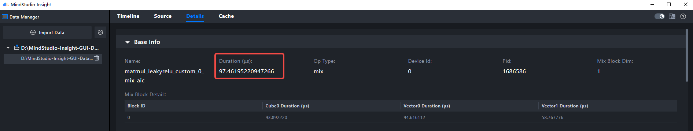
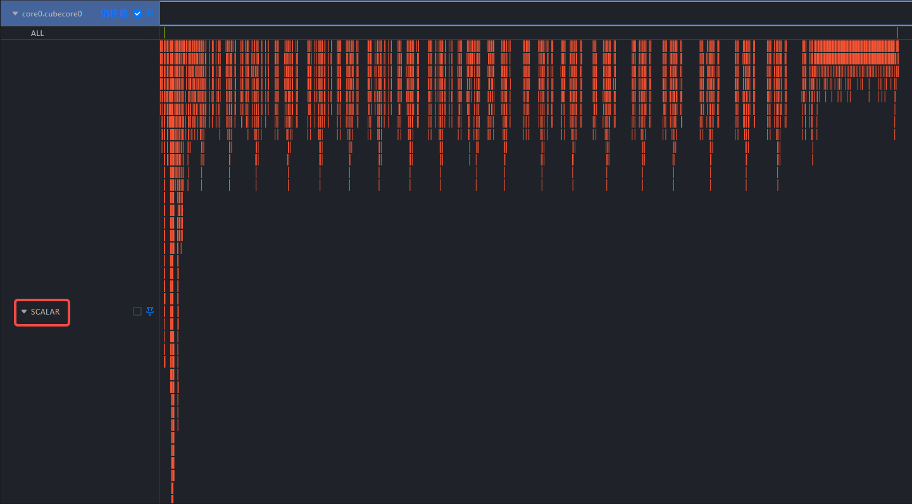
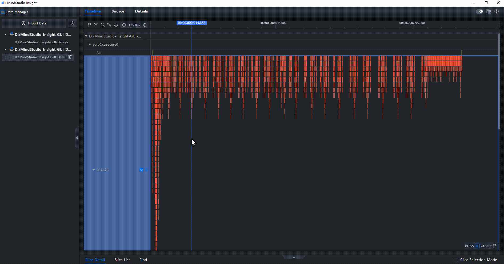

# **🚀 快速开始（算子调优篇）**

MindStudio Insight 支持导入 [msOpProf](https://gitcode.com/Ascend/msopprof) 工具采集的、运行在昇腾 AI 处理器上的算子性能数据。用户可根据展现的算子关键性能指标，快速定位算子的软、硬件性能瓶颈，进行算子性能调优。

## 环境准备

算子性能优化中，负载不均衡、Scalar 占比过高、流水并行度不足等问题屡见不鲜。
[msOpProf](https://gitcode.com/Ascend/msopprof) 工具可以采集上板和仿真两类数据。上板数据聚焦真实硬件环境下的性能信息。仿真数据从仿真器中采集，可以得到细粒度的指令流水图、代码热点图等信息。

现在假设已经使用 [msOpProf](https://gitcode.com/Ascend/msopprof) 采集了一份 `matmul_leakyrelu` 算子的上板数据和仿真数据。

算子数据：[点击下载](https://gitcode.com/zhangruoyu2/msinsight-quick-start-demo/blob/main/operator)

数据目录结构：

```tex
├─msprof-op
│  ├─core_inter_load
│  ├─details
│  ├─ratio
│  ├─roofline
│  ├─source
│  └─timeline
└─msprof-op-simulator
```

## 操作步骤

### 一、查看上板数据

**导入 `msprof-op\details\visualize_data.bin` 上板数据文件，切换到 Details（详情）页签。**



在基础信息部分，发现算子用时 __90+μs__。

> 对于 `matmul_leakyrelu` 算子，性能主要取决于矩阵乘法部分，LeakyReLU 的计算量相对很小。

根据先验知识，在 Ascend 910 上计算 FP16 的小矩阵（`1024×1024×1024`），`matmul_leakyrelu` 算子的预期用时应该在 16-30μs 之间。因此可以判断这个算子性能不是最优状态，有优化空间。


在内存负载分析部分，查看流水情况，发现 Cube 的流水中 Scalar 活跃度很高。这表明算子中标量计算发生次数高，有优化空间。

> 初步结论：算子性能不是最优，其中标量计算发生次数高，有优化空间。

### 二、查看仿真数据

**导入 `msprof-op-simulator\visualize_data.bin` 仿真板数据文件，切换到 Timeline（时间线）页签。**



在 Timeline（时间线）页签查看算子运行过程的行为。发现 Scalar 泳道中的行为很多，符合得到的初步结论。

**鼠标框选 Scalar 泳道，挑选发生次数最多的行为，查看是哪段代码导致的。**




具体的用户代码在 `/home/wangyunkai/code/samples/operator/ascendc/0_introduction/13_matmulleakyrelu_kernellaunch/MatmulLeakyReluInvocationAsync/matmul_leakyrelu_custom.cpp:206` 中

**切换到 Source（源码）页签，打开之前找到的用户代码**


```c
206     REGIST_MATMUL_OBJ(&pipe, GetSysWorkSpacePtr(), matmulLeakyKernel.matmulObj, &matmulLeakyKernel.tiling);
```

`REGIST_MATMUL_OBJ` 是一个宏，用于初始化 Matmul 对象并设置 Tiling 参数。根据昇腾官方文档，这个宏内部会执行一系列标量操作来配置 Cube 计算单元。

> 结论：从仿真数据中定位到可优化的代码行，下一步将由算子开发工程师优化。

