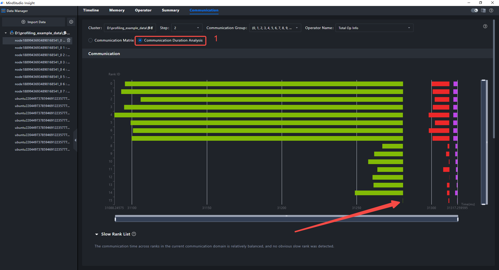
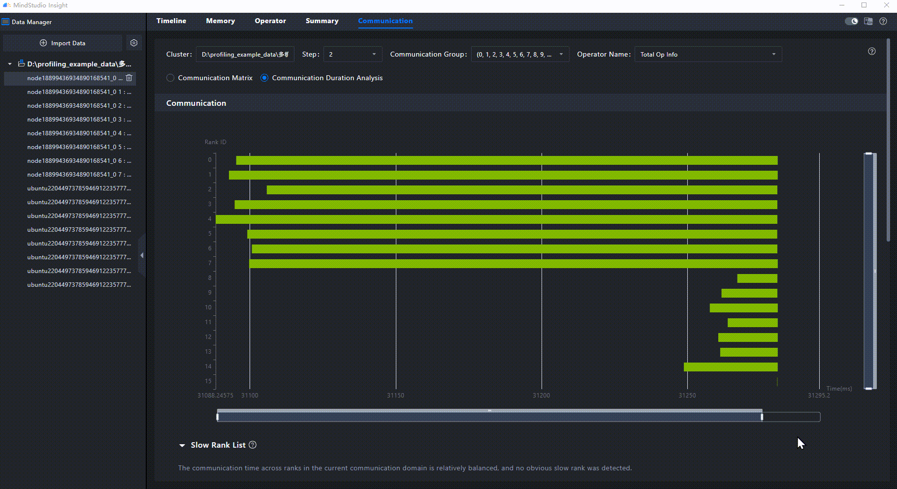

# **🚀 快速开始（系统调优篇）**

MindStudio Insight 支持导入 [msProf](https://gitcode.com/Ascend/msprof) 工具采集的、运行在昇腾 AI 处理器上的模型系统性能数据。用户可根据展现的模型关键性能指标，快速定位模型的软、硬件性能瓶颈，进行系统性能调优。

## 环境准备

大模型在集群场景下使用时，常常会出现快慢卡现象，降低模型性能。[msProf](https://gitcode.com/Ascend/msprof) 工具可以采集并解析训练、推理过程中的AI模型运行数据、昇腾AI处理器系统数据等。

现在假设已经使用 [msProf](https://gitcode.com/Ascend/msprof) 采集了一份某模型的双机16卡的系统性能数据。

系统数据：[点击下载](https://gitcode.com/zhangruoyu2/msinsight-quick-start-demo/blob/main/system)

<details>
<summary>📁数据目录结构</summary>

```tex
└─MultiProfLevel2MemoryUB_db
    ├─cluster_analysis_output
    ├─node1_2166651_20240619060505060_ascend_pt
    │  ├─ASCEND_PROFILER_OUTPUT
    │  ├─FRAMEWORK
    │  └─PROF_000001_20240619140505099_GNIJBPBEBIHIHCKB
    ├─node1_2166652_20240619060505059_ascend_pt
    │  ├─ASCEND_PROFILER_OUTPUT
    │  ├─FRAMEWORK
    │  └─PROF_000001_20240619140505221_GOGOEMKAROGRMIMC
    ├─node1_2166653_20240619060505061_ascend_pt
    │  ├─ASCEND_PROFILER_OUTPUT
    │  ├─FRAMEWORK
    │  └─PROF_000001_20240619140505106_OBPMMFGEPENJQFGB
    ├─node1_2166654_20240619060505060_ascend_pt
    │  ├─ASCEND_PROFILER_OUTPUT
    │  ├─FRAMEWORK
    │  └─PROF_000001_20240619140505226_QDMBAQFOGNGMDQKA
    ├─node1_2166655_20240619060505059_ascend_pt
    │  ├─ASCEND_PROFILER_OUTPUT
    │  ├─FRAMEWORK
    │  └─PROF_000001_20240619140505102_CAMQMCOANGFPNHKC
    ├─node1_2166656_20240619060505059_ascend_pt
    │  ├─ASCEND_PROFILER_OUTPUT
    │  ├─FRAMEWORK
    │  └─PROF_000001_20240619140505221_HEKHQMKAREGIKAQB
    ├─node1_2166657_20240619060505060_ascend_pt
    │  ├─ASCEND_PROFILER_OUTPUT
    │  ├─FRAMEWORK
    │  └─PROF_000001_20240619140505169_QQNFRMQFEEKHCIFA
    ├─node1_2166658_20240619060505060_ascend_pt
    │  ├─ASCEND_PROFILER_OUTPUT
    │  ├─FRAMEWORK
    │  └─PROF_000001_20240619140505196_CHIRLGBCBGMLEFJC
    ├─ubuntu2204_1660963_20240619060440181_ascend_pt
    │  ├─ASCEND_PROFILER_OUTPUT
    │  ├─FRAMEWORK
    │  └─PROF_000001_20240619060440316_NDJQFQRGIMPECACC
    ├─ubuntu2204_1660964_20240619060440179_ascend_pt
    │  ├─ASCEND_PROFILER_OUTPUT
    │  ├─FRAMEWORK
    │  └─PROF_000001_20240619060440323_JQBHAHKEDBPDBBDC
    ├─ubuntu2204_1660965_20240619060440181_ascend_pt
    │  ├─ASCEND_PROFILER_OUTPUT
    │  ├─FRAMEWORK
    │  └─PROF_000001_20240619060440310_CGDJCKDFAOCOKNMB
    ├─ubuntu2204_1660966_20240619060440181_ascend_pt
    │  ├─ASCEND_PROFILER_OUTPUT
    │  ├─FRAMEWORK
    │  └─PROF_000001_20240619060440326_QKMBONEJDLBAHCOA
    ├─ubuntu2204_1660970_20240619060440179_ascend_pt
    │  ├─ASCEND_PROFILER_OUTPUT
    │  ├─FRAMEWORK
    │  └─PROF_000001_20240619060440334_AGCKEFNHPCNEHKHB
    ├─ubuntu2204_1660971_20240619060440180_ascend_pt
    │  ├─ASCEND_PROFILER_OUTPUT
    │  ├─FRAMEWORK
    │  └─PROF_000001_20240619060440319_OAEDHALJOJOJKECC
    ├─ubuntu2204_1660972_20240619060440181_ascend_pt
    │  ├─ASCEND_PROFILER_OUTPUT
    │  ├─FRAMEWORK
    │  └─PROF_000001_20240619060440320_RAGMCOQPGDMOJECA
    └─ubuntu2204_1660973_20240619060440181_ascend_pt
        ├─ASCEND_PROFILER_OUTPUT
        ├─FRAMEWORK
        └─PROF_000001_20240619060440316_MONIINKACEIFDCRA
```
</details>

## 操作步骤

### 一、分析Summary（概览）页签

**导入 `MultiProfLevel2MemoryUB_db` 文件夹，切换到Summary（概览）页签。**


在计算/通信概览部分，发现 8卡 15卡 空闲时间很明显。这表明 8卡 15卡的资源没有被充分利用，性能存在优化空间。

> 初步结论：性能存在优化空间。

### 二、分析Communication（通信）页签

**切换到Communication（通信）页签，选择“Communication Duration Analysis（通信耗时分析）”单选项。**



观察通信算子缩略图，发现 15卡的第一个通信算子耗时最短。这表明 15卡是性能瓶颈，需要详细分析。

> _注意：这份数据使用了并行策略，因此每隔一段时间需要通过“通信”同步各个卡的数据。_
> _通信时间长表示卡在等待其他卡做好准备进行数据同步，通信时间短表示卡还在做其他操作，未准备好进行数据同步。_

> 第二步结论：15卡是性能瓶颈，需要详细分析。

### 三、分析Timeline（时间线）页签

**右键通信算子缩略图中 15卡的最小通信算子，选择“Find in Timeline（跳转至时间线视图）”项目，然后适当缩放看 15卡在通信之前的行为**



**框选 Overlap Analysis 泳道，查看 15卡的行为**

> _注意：Overlap Analysis 泳道中 Computing 子泳道是上方 Ascend Hardware 泳道的投影，表示卡正在计算；Communication 子泳道是上方 Communication 泳道的投影，表示卡正在通信；Free 子泳道表示卡正在空闲_


观察框选后的 Slice List（选中列表）部分，发现 Free 用时是计算用时的 3 倍左右。卡空闲通常的原因有：用户代码纯 CPU 操作耗时长、Host 系统线程抢占等。下一步需要更多的数据支撑分析。

> 结论：性能瓶颈的原因是卡空闲时间多，下一步需要检查用户代码、采集 Host 数据继续分析导致卡空闲的根因。
