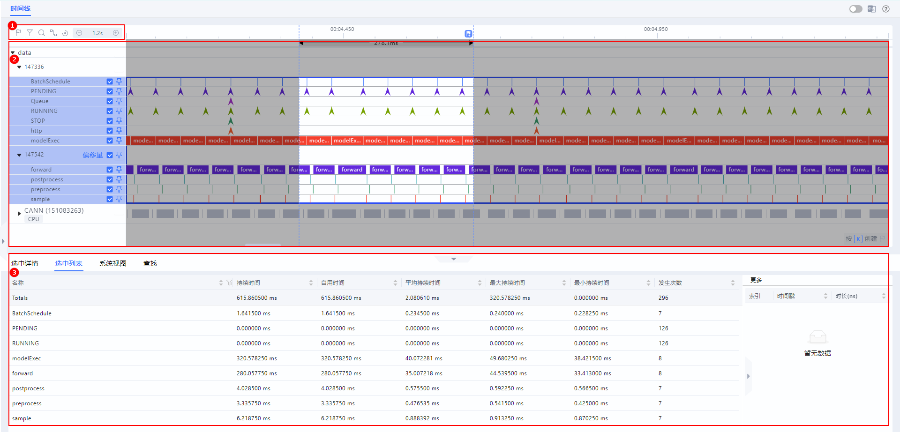
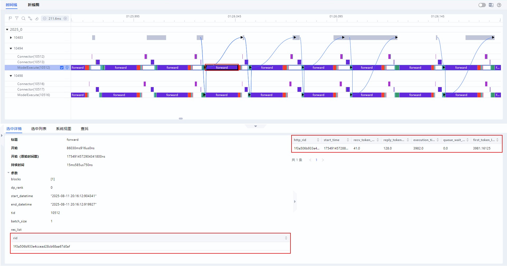
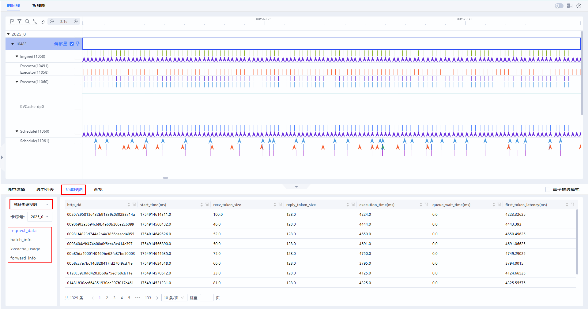
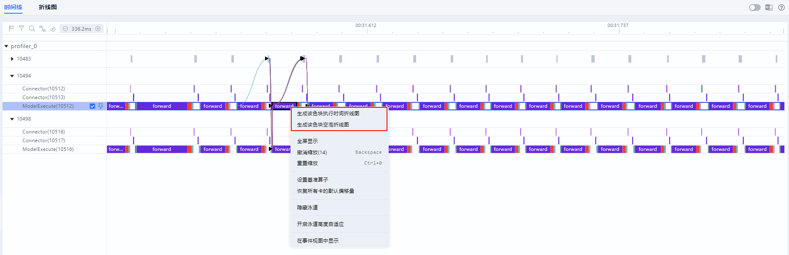
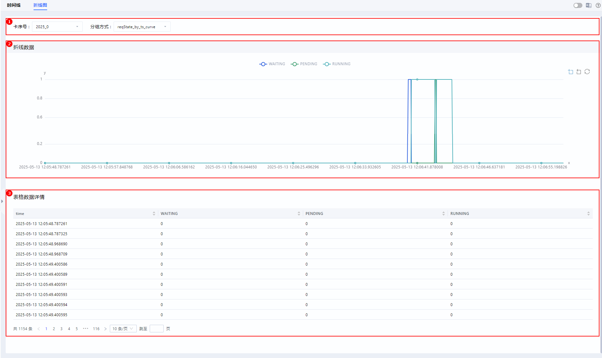

# **MindStudio Insight服务化调优**

## 简介

MindStudio Insight工具以时间线（Timeline）的呈现方式，将请求端到端的执行情况平铺在时间轴上，直观体现请求在各个关键阶段的耗时情况以及当下请求的状态信息，可帮助用户快速识别服务化性能瓶颈，并调整调优策略。

## 使用前准备

**环境准备**

请先安装MindStudio Insight工具，具体安装步骤请参见[MindStudio Insight安装指南](./mindstudio_insight_install_guide.md)。

**数据准备**

请导入正确格式的性能数据，具体数据说明请参见[数据说明](#数据说明)，数据导入操作请参见[导入数据](./basic_operations.md#导入数据)。

## 数据说明

MindStudio Insight支持导入性能数据文件，并以图形化形式呈现相关内容。在服务化调优场景中，主要支持导入两种数据类型，分别为可视化折线图的SQLite数据库文件（profiler.db）和推理服务化请求trace数据的json文件（chrome\_tracing.json）。

根据文件类型的不同，MindStudio Insight提供了灵活的导入方式，具体如[**表 1**  数据导入方式](#数据导入方式)所示。

**表 1**  数据导入方式

|文件名称|导入方式|
|--|--|
|chrome_tracing.json|支持导入单文件。|
|profiler.db|- 支持导入单文件。  - 支持批量导入：导入多个文件夹中的profiler.db文件，只需选择父目录导入即可。|
|以“ms_service_”开头的db文件|支持导入同一个文件夹下以“ms_service_”开头的多个db文件，这些文件代表多个进程文件，以及一个总体的db文件，只需选择文件夹目录即可。|

**注意事项**

- 支持同时导入系统调优和服务化调优的性能数据，需将两个场景的数据置于同一文件夹中，导入时选择该文件夹即可。
- 数据获取方法请参见《性能调优工具指南》中的“服务化调优工具 \> 数据解析 \> [执行解析](https://www.hiascend.com/document/detail/zh/mindstudio/82RC1/T&ITools/Profiling/atlasprofiling_16_0033.html)”章节。

## 时间线（Timeline）

### 功能说明

在服务化调优过程中，MindStudio Insight工具以时间线（Timeline）的呈现方式，将请求端到端的执行情况平铺在时间轴上，直观体现请求在各个关键阶段的耗时情况以及当下请求的状态信息。通过分析时间线，用户可以快速识别服务化性能瓶颈，并根据问题现象，调整调优策略。

通过观察时间线视图各个层级上的耗时长短、间隙等判断对应的关键阶段是否存在性能问题。

### 界面介绍

**界面展示**

时间线（Timeline）界面包含工具栏（区域一）、图形化展示（区域二）和数据窗格（区域三）三个部分，如[**图 1**  时间线界面](#时间线界面)所示。

**图 1**  时间线界面 

- 区域一：工具栏，包含常用快捷按钮，从左至右依次为标记列表、过滤（支持按卡或按泳道过滤展示）、搜索、连线事件、重置缩放（页面复原）和时间轴缩小放大按钮。
- 区域二：图形化展示，左侧显示服务化采集的性能数据，一层级为进程，二层级为请求的各个关键阶段信息，具体泳道信息请参见[泳道信息](#泳道信息)。右侧为时间线视图，逐行对时间线进行图形化展现，包括各关键阶段执行序列和执行时长。
- 区域三：数据窗格，统计信息或指令详情信息展示区，选中详情（Slice Detail）为选中单个关键阶段的详细信息、选中列表（Slice List）为泳道选中区域的关键阶段列表信息。

**泳道信息**

**表 1**  泳道信息

|泳道名称|说明|
|--|--|
|CPU Usage|CPU平均利用率。仅在开启host_system_usage_freq数据采集开关后采集到的数据才会展示该泳道。|
|Memory Usage|Host侧系统内存使用率。仅在开启host_system_usage_freq数据采集开关后采集到的数据才会展示该泳道。|
|NPU Usage|NPU内存占用。仅在开启npu_memory_usage_freq数据采集开关后采集到的数据才会展示该泳道。|
|KVCache|KV Cache剩余量随时间变化图。|
|BatchSchedule|组batch时间，单位ns。|
|WAITING|请求转移到WAITING状态的时刻。|
|PENDING|请求转移到PENDING状态的时刻。|
|RUNNING|请求转移到RUNNING状态的时刻。|
|RUNNING2|请求转移到RUNNING2状态的时刻。|
|SWAPPED|batch进入SWAPPED状态的时刻。|
|RECOMPUTE|请求转移到RECOMPUTE状态的时刻。|
|SUSPENDED|batch进入SUSPENDED状态的时刻。|
|END|请求转移到END状态的时刻。|
|END_PRE|请求转移到END_PRE状态的时刻。|
|STOP|batch进入STOP状态的时刻。|
|PREFILL_HOLD|batch进入PREFILL_HOLD状态的时刻。|
|http|http请求完整生命周期数据，包含http请求的接收，encode，decode的时间。|
|batchFrameworkProcessing|组batch数据，包含组batch时间，当前batch的类型（prefill或者decode），请求的rid和迭代次数。|
|preprocessBatch|IBIS数据下发中给batch添加参数的时间，单位ns。|
|SerializeExecuteMessage|IBIS数据下发中序列化时间，单位ns。|
|setInferBuffer|IBIS数据下发中设置buffer时间，单位ns。|
|grpcWriteToSlave|IBIS数据下发中gRPC读，单位ns。|
|deserializeExecuteRequestsForInfer|IBIS数据下发中反序列化时间，单位ns。|
|convertTensorBatchToBackend|IBIS数据下发中request转化时间，单位ns。|
|getInputMetadata|IBIS数据下发中获取metadata时间，单位ns。|
|beforemodelExec|模型执行前处理时间，单位ns。|
|modelExec|模型执行数据，单位ns，包含执行时间，当前batch的类型（prefill或者decode），请求的rid和迭代次数。|
|instanceExecute|模型实例执行时间，单位ns。|
|Queue|请求进入队列的时刻。|
|PDcommunication|PD分离通信时间，单位ns。仅在PD分离场景下存在该泳道。|
|forward|模型推理前向传播时间，单位ns。|
|operatorExecute|Python侧模型执行接口时间，单位ns。|
|processPythonExecResult|数据接收中response转化，序列化以及写入共享内存时间，单位ns。|
|deserializeExecuteResponse|数据接收中反序列化时间，单位ns。|
|saveoutAndContinueBatching|数据接收中将response解析为output的时间，单位ns。|
|continueBatching|数据接收中将请求加入队列的时间，单位ns。|
|sendExecuteMessage|发送执行信息时间，单位ns。|
|postprocess|模型推理后处理时间，单位ns。|
|preprocess|模型推理前处理时间，单位ns。|
|processBroadcastMessage|通信广播信息时间，单位ns。|
|sample|采样时间，单位ns。|
|PullKVCache|PD节点之间的KVCache传输时间，单位ns。仅在PD分离场景下存在该泳道。|
|CANN|算子执行时间，单位ns。仅在开启acl_task_time数据采集开关后采集到的数据才会展示该泳道。|
|dpBatch|模型推理过程中各请求对应的dp域信息。|
|RequestState|模型推理过程中请求状态变化。|

### 使用说明

服务化调优场景下，时间线（Timeline）界面的使用说明可参见《MindStudio Insight系统调优》的“[使用说明](./system_tuning.md#使用说明)”。

**选中详情**

当选中单个关键阶段色块时，可在下方“选中详情“页签中显示该关键阶段的详情信息，当“选中详情“中存在res\_list信息时，单击表格中rid列表的任意一行，会在“选中详情“的右侧区域显示对应rid的request详细信息，request详情根据实际采集的信息动态显示，如[**图 1**  选中详情](#选中详情-12)所示，字段解释如[**表 1**  选中详情字段解释](#选中详情字段解释)所示。

**图 1**  选中详情  

**表 1**  选中详情字段解释 

|中文字段|英文字段|说明|
|--|--|--|
|标题|Title|名称。|
|开始|Start|起始时间。|
|开始（原始时间戳）|Start(Raw Timestamp)|数据采集到的原始开始时间。|
|持续时间|Wall Duration|总耗时。|
|参数|Args|关键阶段的相关参数信息。|

**系统视图**

在“系统视图“页签，当选择“统计系统视图“时，页面包含卡序号选框、服务化数据页签，在卡序号选框中可以选择想要查看的卡。

服务化数据包括kvcache\_usage、batch\_info、request\_data和forward\_info等页签，如[**图 2**  系统视图](#系统视图)所示。

选择任一服务化数据，右侧区域会显示对应的详细信息，字段解释如[**表 2**  服务化视图字段说明](#服务化视图字段说明)所示，且各字段支持搜索，在字段名称后单击，可搜索所需信息。

**图 2**  系统视图  

**表 2**  服务化视图字段说明

|中文字段|英文字段|说明|
|--|--|--|
|**kvcache_usage**|
|rid|rid|请求ID。|
|name|name|具体改变显存使用的方法。|
|real_start_time_ms|real_start_time_ms|发生显存使用情况变更的时间，单位ms。|
|device_kvcache_left|device_kvcache_left|显存中剩余blocks数量。|
|kvcache_usage_rate|kvcache_usage_rate|kvcache利用率。|
|**batch_info**|
|name|name|用于区分组batch和执行batch。name为batchFrameworkProcessing表示组batch；name为modelExec表示执行batch。|
|res_list|res_list|batch组合情况。|
|start_time_ms|start_time_ms|组batch或执行batch的开始时间，单位ms。|
|end_time_ms|end_time_ms|组batch或执行batch的结束时间，单位ms。|
|batch_size|batch_size|batch中的请求数量。|
|batch_type|batch_type|batch中的请求状态（prefill和decode）。|
|during_time_ms|during_time_ms|执行时间，单位ms。|
|dp*_rid|dp*_rid|DP域包含的请求ID，*表示DP域ID，取值为[0, n-1]。|
|dp*_size|dp*_size|DP域的batchsize，*表示DP域ID，取值为[0, n-1]。|
|dp*_forward_ms|dp*_forward_ms|DP域中执行时长最长的forward的执行时间，单位ms，*表示DP域ID，取值为[0, n-1]。|
|**request_data**|
|http_rid|http_rid|HTTP请求ID。|
|start_time_ms|start_time_ms|请求到达的时间，单位ms。|
|recv_token_size|recv_token_size|请求的输入长度。|
|reply_token_size|reply_token_size|请求的输出长度。|
|execution_time_ms|execution_time_ms|请求端到端耗时，单位ms。|
|queue_wait_time_ms|queue_wait_time_ms|请求在整个推理过程中在队列中等待的时间，这里包括waiting状态和pending状态的时间，单位ms。|
|first_token_latency|first_token_latency|首Token时延，单位ms。|
|**forward_info**|
|name|name|标注forward事件，代表模型前向执行过程。|
|relative_start_time(ms)|relative_start_time(ms)|每台机器上forward与第一个forward之间的时间。|
|start_time(ms)|start_time(ms)|forward的开始时间。|
|end_time(ms)|end_time(ms)|forward的结束时间。|
|during_time(ms)|during_time(ms)|forward的执行时间，单位ms。|
|bubble_time(ms)|bubble_time(ms)|forward之间的空泡时间，单位ms。|
|batch_size|batch_size|forward处理的请求数量。|
|batch_type|batch_type|forward中的请求状态。|
|forward_iter|forward_iter|不同卡上forward的迭代序号。|
|dp_rank|dp_rank|标识forward的DP信息，相同DP域该列的值相同。|
|prof_id|prof_id|标识不同卡，相同的卡该列的值相同。|
|hostname|hostname|标识不同机器，相同机器该列的值相同。|

**支持生成色块相关折线图**

在服务化调优场景下，支持生成任意色块的“执行时间折线图”和“空泡折线图”，便于分析问题。

在时间线（Timeline）界面，选择任一泳道的任意一个色块，单击鼠标右键，选择“生成该色块执行时间折线图“或“生成该色块空泡折线图“，跳转至折线图（Curve）界面，生成该色块所在泳道的对应折线图和数据详情，显示平均持续时间和持续时间，如[**图 3**  生成色块折线图](#生成色块折线图)所示。

**图 3**  生成色块折线图 

如果在折线图中发现异常，需要定位异常点，可区域放大选择需查看的异常点，在折线图下方数据详情表格中找到对应数据，在数据所在行单击鼠标右键，选择“跳转至时间线视图“，可跳转至时间线（Timeline）界面，定位至具体的色块上，如[**图 4**  跳转至时间线视图](#跳转至时间线视图-13)所示。

**图 4**  跳转至时间线视图  

## 折线图（Curve）

### 功能说明

支持以折线图和数据详情表的形式展示具体数据变化，便于直观的分析。仅当导入profiler.db文件时，展示折线图（Curve）界面。

### 界面介绍

折线图（Curve）界面包含参数配置栏（区域一）、折线数据（区域二）和表格数据详情（区域三）三个部分组成，如[**图 1**  折线图界面](#折线图界面)所示。

**图 1**  折线图界面  

- 区域一：参数配置栏，包含卡序号和分组方式。
- 区域二：折线数据，以折线图形式展示数据的变化情况。
- 区域三：表格数据详情，展示了SQLite数据库的详细数据。表格支持排序和分页功能。单击每列的表头，可根据当前列的升序、降序和默认排序呈现数据。

### 使用说明

**支持折线图局部放大和还原**

MindStudio Insight支持通过鼠标左键框选放大选中部分和右键还原进行折线图的展示。为提升显示性能，折线图在数据量较大时会隐藏大部分点，可在框选到足够精细区域时显示所有点位，也可单击鼠标右键还原最初整体展示效果。

在折线图中单击鼠标左键拖至需要放大的终点位置并松开鼠标左键，框选部分将会被放大；如果还存在点被隐藏，重复放大操作即可展示被隐藏的点，选中放大区域如[**图 1**  选中放大区域](#选中放大区域-14)所示。

在折线图中也可单击正上方的图例，选择隐藏所需的折线，隐藏后，该折线在图中不展示，对应图例置灰，再次单击置灰图例，可将其重新展示。

**图 1**  选中放大区域  

> [!NOTE] 说明
>
> - 单击折线图右上角按钮，使其为置灰状态，则折线图将锁定，不再支持鼠标左键框选放大功能；再次单击此按钮，或者单击鼠标右键即可恢复。放大功能默认开启。
> - 单击折线图右上角按钮，折线图将会撤销一次放大操作。
> - 单击折线图右上方按钮，折线图将会恢复最初状态。
