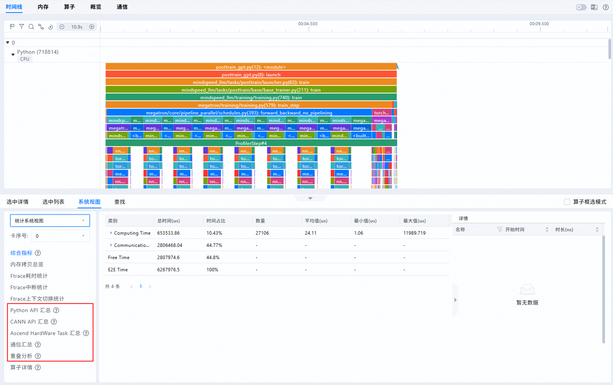
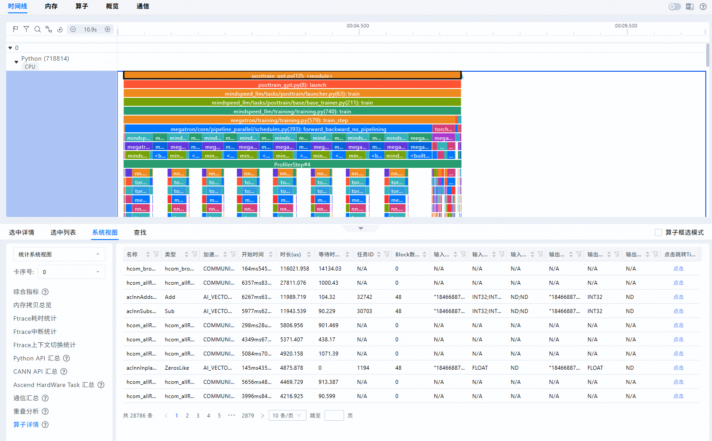
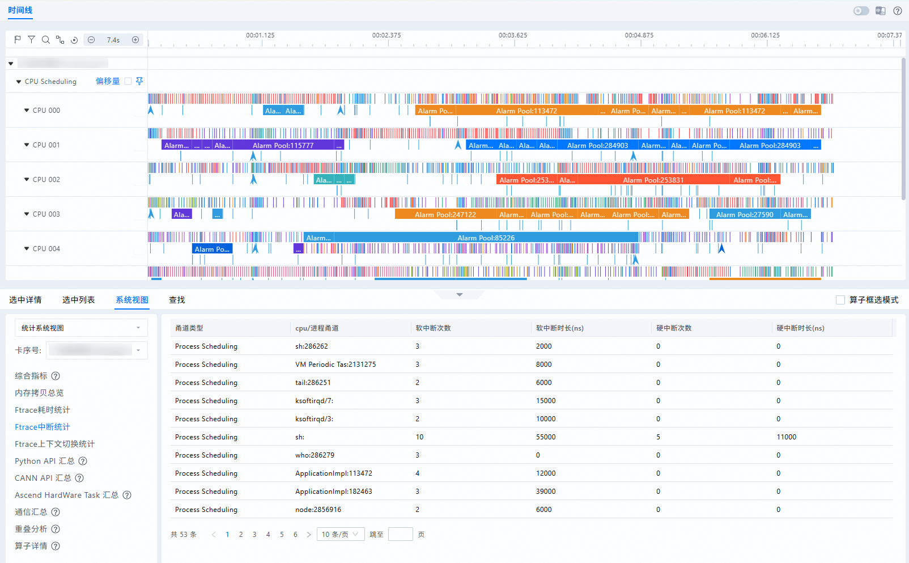
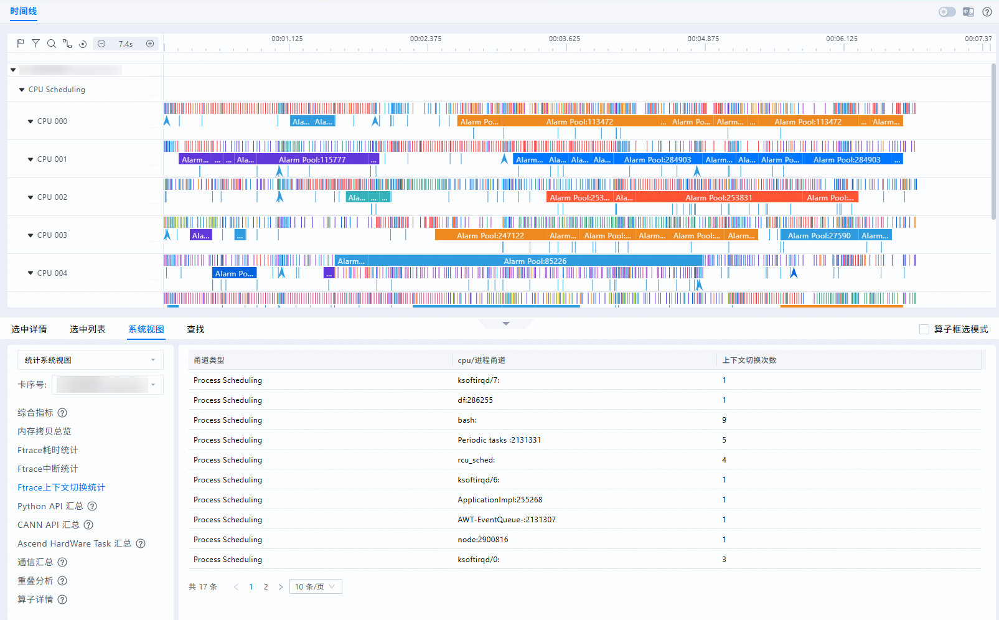

# **MindStudio Insight系统调优**

## 简介

MindStudio Insight支持导入性能数据文件，提供时间线视图、内存、算子耗时、通信瓶颈分析等功能，以图形化形式呈现相关内容，帮助开发者快速定位模型性能瓶颈。

## 使用前准备

**环境准备**

请先安装MindStudio Insight工具，具体安装步骤请参见[MindStudio Insight安装指南](./mindstudio_insight_install_guide.md)。

**数据准备**

请导入正确格式的性能数据，具体数据说明请参见[数据说明](#数据说明)，数据导入操作请参见[导入数据](./basic_operations.md#导入数据)。

## 数据说明

**概述**

性能数据文件的采集方式请分别参见《性能调优工具指南》中的“PyTorch训练场景性能分析快速入门”、“TensorFlow训练场景性能分析快速入门”和“msprof采集通用命令”章节内容，以及《[MindSpore教程](https://www.mindspore.cn/tutorials/zh-CN/r2.7.0/index.html)》中的“调试调优 \>  [Ascend性能调优](https://www.mindspore.cn/tutorials/zh-CN/r2.7.0/debug/profiler.html)”章节内容。

性能数据分为单卡场景和集群场景，具体请参见[**表 1**  性能数据场景说明](#性能数据场景说明)。

**表 1**  性能数据场景说明

|场景|说明|
|--|--|
|单卡场景|可在MindStudio Insight工具中导入单卡进行分析。当导入单卡场景数据时，MindStudio Insight工具支持显示时间线（Timeline）、内存（Memory）和算子（Operator）界面，具体内容请参见单卡场景。|
|集群场景|- 集群场景根据卡数量可分为小集群场景和大集群场景，导入不同场景的数据，界面展示也会有所变化，具体请参见集群场景。  - 集群精简数据，将集群数据简化，只显示通信大算子数据和部分计算类算子。|

**注意事项**

- 当导入的text场景的性能数据中同时存在db文件，MindStudio Insight工具会优先解析db文件。如果您只需要可视化呈现text场景数据，则需要在性能数据原文件夹中查找db文件并删除，再重新导入，即可呈现text场景数据。
- 支持同时导入系统调优和服务化调优的性能数据，需将两个场景的数据置于同一文件夹中，导入时选择该文件夹即可。
- memory\_record.csv和operator\_memory.csv两个文件必须同时存在且保证在同一目录，导入成功后内存（Memory）界面才能正常展示。
- 导入单卡时，不展示概览（Summary）和通信（Communication）界面。
- 当采集MindSpore训练/推理数据时，在GRAPH模式下，编译优化等级参数jit\_level设置为O2，且调用step接口方式采集的性能数据，在导入MindStudio Insight工具时，不支持展示通信（Communication）界面。
- 对于未完成性能数据解析的PROF\__XXX_目录，需要先使用msprof命令行的export功能解析并导出性能数据文件后才可以使用MindStudio Insight工具展示，数据使用msprof命令行解析并导出的操作请参见《性能调优工具指南》中的“msprof模型调优工具 \> 离线解析”章节。
- 支持导入算子打点数据文件，获取文件方式请参见《性能调优工具指南》中的“Ascend PyTorch Profiler”章节“msprof\_tx”相关内容，导入成功后会在时间线（Timeline）界面展示打点数据。
- 当导入集群数据时，如果性能数据文件中包含cluster\_analysis\_output目录文件，导入成功后，概览（Summary）和通信（Communication）界面会根据cluster\_analysis\_output目录文件内容呈现相关信息；如果性能数据文件中不包含cluster\_analysis\_output目录文件，在MindStudio Insight工具中导入数据时，会生成对应的cluster\_analysis\_output目录文件。
- 在集群场景下，使用Ascend PyTorch Profiler接口或者MindSpore Profiler接口采集到的性能数据，需要使用MindStudio Insight工具显示，则建议配置repeat=1，不推荐配置为0。如果repeat\>1，则需要将采集的性能数据文件夹分为repeat等份，按照文件夹名称中的时间戳先后将文件分别放到不同文件夹下重新导入，才可正常展示。
- 在Linux环境下使用MindStudio Insight工具分析集群场景数据时，如果已经安装了msprof-analyze工具，请检查版本并将其升级至最新版本，最新版本的msprof-analyze工具安装可参考[msprof-analyze](https://gitcode.com/ascend/mstt/blob/master/profiler/msprof_analyze/README.md#%E5%AE%89%E8%A3%85)。
- 支持导入含有ACLGraph构图过程数据的单个json文件。
- 当导入数据的目录中同时存在单卡数据和集群数据，MindStudio Insight仅支持解析集群数据并进行可视化展示。

**单卡场景**

在单卡场景下，性能数据可分为三大类型，如下所示：

- PyTorch训练/推理数据：支持导入以“ascend\_pt”结尾的性能数据目录，性能数据文件详情请参见[**表 2**  PyTorch训练/推理性能数据文件](#PyTorch训练/推理性能数据文件)。

    **表 2**  PyTorch训练/推理性能数据文件

    |文件名|说明|展示界面|
    |--|--|--|
    |trace_view.json|包括应用层数据、CANN层数据和底层NPU数据。|时间线（Timeline）|
    |msprof_*.json|Timeline数据总表。如果存在变频数据（AI Core Freq）信息，会展示AI Core Freq层级。|时间线（Timeline）|
    |operator_details.csv|统计PyTorch算子在Host侧（下发）和Device侧（执行）的耗时。|时间线（Timeline）|
    |memory_record.csv|进程级内存申请情况信息。|内存（Memory）|
    |operator_memory.csv|算子内存申请情况信息。|内存（Memory）|
    |kernel_details.csv|NPU上执行的所有算子的信息。|算子（Operator）|
    |step_trace_time.csv|迭代中计算和通信的时间统计。|概览（Summary）|
    |communication.json|通信算子通信耗时、带宽等详细信息文件。|通信（Communication）|
    |communication_matrix.json|通信小算子基本信息文件。|通信（Communication）|
    |ascend_pytorch_profiler_{*rank_id*}.db|Ascend PyTorch Profiler接口采集的性能数据文件。|时间线（Timeline）  内存（Memory）  算子（Operator）  概览（Summary）  通信（Communication）|
    |analysis.db|多卡或集群等存在通信的场景下，采集到的数据文件。|时间线（Timeline）  内存（Memory）  算子（Operator）  概览（Summary）  通信（Communication）|
    |注：“*”表示{timestamp}时间戳。|

- MindSpore训练/推理数据：支持导入MindSpore框架性能数据，获取方式请参见《[MindSpore教程](https://www.mindspore.cn/tutorials/zh-CN/r2.7.0/index.html)》中的“调试调优 \>  [Ascend性能调优](https://www.mindspore.cn/tutorials/zh-CN/r2.7.0/debug/profiler.html)”章节。

    MindStudio Insight工具支持导入以“ascend\_ms”结尾的性能数据目录，性能数据文件详情请参见[**表 3**  MindSpore训练/推理性能数据文件](#MindSpore训练/推理性能数据文件)。

    **表 3**  MindSpore训练/推理性能数据文件

    |文件名|说明|展示界面|
    |--|--|--|
    |msprof_*.json|Timeline数据总表。如果存在变频数据（AI Core Freq）信息，会展示AI Core Freq层级。|时间线（Timeline）|
    |trace_view.json|包括应用层数据、CANN层数据和底层NPU数据。|时间线（Timeline）|
    |memory_record.csv|进程级内存申请情况信息。|内存（Memory）|
    |operator_memory.csv|算子内存申请情况信息。|内存（Memory）|
    |static_op_mem.csv|静态图场景内存申请情况信息。当static_op_mem.csv存在时，内存（Memory）界面会展示静态图模式。|内存（Memory）|
    |kernel_details.csv|NPU上执行的所有算子的信息。|算子（Operator）|
    |step_trace_time.csv|迭代中计算和通信的时间统计。|概览（Summary）|
    |communication.json|通信算子通信耗时、带宽等详细信息文件。|通信（Communication）|
    |communication_matrix.json|通信小算子基本信息文件。|通信（Communication）|
    |注：“*”表示{timestamp}时间戳。|

- 离线推理数据：支持导入mindstudio\_profiler\_output目录下性能数据，性能数据文件详情请参见[**表 4**  离线推理性能数据文件](#离线推理性能数据文件)。

    **表 4**  离线推理性能数据文件

    |文件名|说明|展示界面|
    |--|--|--|
    |msprof_*.json|Timeline数据总表。|时间线（Timeline）|
    |fusion_op_*.csv|模型中算子融合前后信息。单算子场景下无此性能数据文件。|时间线（Timeline）|
    |api_statistic_*.csv|用于统计CANN层的API执行耗时信息。|时间线（Timeline）|
    |memory_record_*.csv|进程级内存申请情况信息。|内存（Memory）|
    |operator_memory_*.csv|算子内存申请情况信息。|内存（Memory）|
    |op_summary_*.csv|AI Core和AI CPU算子数据。|算子（Operator）|
    |op_statistic_*.csv|AI Core和AI CPU算子调用次数及耗时统计。|算子（Operator）|
    |prof_rule_0_*.json|调优建议。|时间线（Timeline） 概览（Summary） 通信（Communication）|
    |step_trace_*.csv|迭代轨迹数据。单算子场景下无此性能数据文件。|-|
    |step_trace_*.json|迭代轨迹数据，每轮迭代的耗时。单算子场景下无此性能数据文件。|-|
    |task_time_*.csv|Task Scheduler任务调度信息。|-|
    |msprof_*.db|统一db文件。当前该格式数据与text参数解析的数据信息量存在差异。|时间线（Timeline） 内存（Memory） 算子（Operator） 概览（Summary） 通信（Communication）|
    |注：“*”表示{timestamp}时间戳。|

- npumonitor数据：支持导入npumonitor采集的性能数据，采集方式请参见[npumonitor特性](https://gitcode.com/Ascend/msmonitor/blob/master/docs/zh/npumonitor_instruct.md)，性能数据文件详情请参见[**表 5**  性能数据文件详情表](#性能数据文件详情表)。

    **表 5**  性能数据文件详情表

    |文件名|说明|展示界面|
    |--|--|--|
    |msmonitor_{pid}\_{timestamp}\_{rank_id}.db|npumonitor采集的db文件。|时间线（Timeline）|

    > [!NOTE] 说明 
    > 
    > - pid为进程号，timestamp为时间戳。如果是集群数据，rank\_id为非负整数，从0排序；如果是单卡数据，rank\_id为-1。
    > - MindStudio Insight支持导入npumonitor采集的单个db文件；也支持导入db文件的上一级目录，目录中多个db文件平铺展示。在数据量大的情况下，建议导入单个db文件，如果全部导入，数据解析耗时较长，可能会引发OOM（Out of Memory，内存溢出）问题。

**集群场景**

- 集群场景也称多卡场景，由多个单卡组成的集群数据，集群数据可分为小集群和大集群，MindStudio Insight工具导入不同场景的数据时，也有所不同，如[**表 6**  集群场景说明](#集群场景说明)所示。

    如果在大集群场景下，直接导入性能调优工具采集的全部原始数据，解析耗时较长，不建议直接导入。

    **表 6**  集群场景说明

    |场景|卡数量|导入数据|界面展示|
    |--|--|--|--|
    |小集群|不超过32卡。|可导入采集到的全部原始数据。|时间线（Timeline） 内存（Memory） 算子（Operator） 概览（Summary） 通信（Communication）|
    |大集群|超过32卡，千卡，万卡等。|采用mstt工具集中的msprof-analyze的集群分析能力预处理的原始性能数据，可得到基于通信域的通信分析和迭代耗时分析，导入预处理后得到的数据。  msprof-analyze工具的下载与使用请参见[msprof-analyze](https://gitcode.com/Ascend/mstt/blob/master/profiler/msprof_analyze/README.md#msprof-analyze)。  1. 将所有以“ascend_pt”或“ascend_ms”结尾的目录汇总至同一文件夹。  2. 使用msprof-analyze工具生成通信相关文件“cluster_analysis_output”目录，“cluster_analysis_output”目录中数据文件请参见[**表 7**  cluster\_analysis\_output目录文件](#目录文件)。  3. 将生成的“cluster_analysis_output”目录文件拷贝至本地，并导入MindStudio Insight工具。  4. 可先前往通信（Communication）界面分析后，导入对应小集群数据或者单卡数据，再次仔细分析。|概览（Summary） 通信（Communication）|

    **表 7**  cluster\_analysis\_output目录文件

    |文件名|说明|
    |--|--|
    |cluster_step_trace_time.csv|数据解析模式为communication_matrix、communication_time或all时均生成。|
    |cluster_communication_matrix.json|数据解析模式为communication_matrix或all时生成。|
    |cluster_communication.json|数据解析模式为communication_time或all时生成，主要为通信耗时数据。|
    |cluster_analysis.db|解析analysis.db或ascend_pytorch_profiler_{*rank_id*}.db生成的文件。|

- 集群精简数据，是基于ascend\_pytorch\_profiler\_\{_rank\_id_\}.db文件，提取通信类大算子数据，计算类关键函数和框架关键函数，将数据精简，节约内存，快速进行全局分析，导入集群精简数据后，MindStudio Insight工具只显示时间线（Timeline）界面。

    集群数据精简可使用mstt工具集中的msprof-analyze工具，通过设置`-m filter_db`生成集群精简数据，msprof-analyze工具安装可参考[安装msprof-analyze](https://gitcode.com/ascend/mstt/blob/master/profiler/msprof_analyze/README.md#%E5%AE%89%E8%A3%85)，设置`-m filter_db`可参考[《recipe结果和cluster\_analysis.db交付件表结构说明》](https://gitcode.com/ascend/mstt/blob/pre-research/profiler/msprof_analyze/docs/recipe_output_format.md#filter_db)中的“filter\_db”内容，集群数据精简功能只支持统一db场景。

## 时间线（Timeline）

### 功能说明

在昇腾异构计算架构中，MindStudio Insight工具以时间线（Timeline）的呈现方式将训练/推理过程中的host、device上的运行详细情况平铺在时间轴上，直观呈现host侧的API耗时情况以及device侧的task耗时，并将host与device进行关联呈现，帮助用户快速识别host瓶颈或device瓶颈，同时提供各种筛选分类、专家建议等功能，支撑用户进行深度调优。

通过观察时间线视图各个层级上的耗时长短、间隙等判断对应组件和算子是否存在性能问题，如算子下发是否存在瓶颈、是否存在高耗时的kernel以及是否存在冗余的转换类算子。

> [!NOTE] 说明   
> 时间线（Timeline）界面默认最大展示三分钟的数据。如果导入的数据时间长度超过三分钟，则不支持缩小展示，仅可放大展示，通过左右平移查看其它时间数据。

### 界面介绍

**界面展示**

时间线（Timeline）界面包含工具栏（区域一）、时间线树状图（区域二）、图形化窗格（区域三）和数据窗格（区域四）四个部分组成，如[**图 1**  时间线（Timeline）界面](#时间线（Timeline）界面)所示。

**图 1**  时间线（Timeline）界面 

- 区域一：工具栏，包含常用快捷按钮，从左至右依次为标记列表、过滤（支持按卡或按泳道过滤展示）、搜索、连线事件、重置缩放（页面复原）和时间轴缩小放大按钮。
- 区域二：时间线树状图，text场景和db场景显示会有所不同，具体泳道信息请参见[泳道信息](#泳道信息)。
    - text场景：显示集群场景下各设备的分层信息，以Rank维度显示分层信息，一层级为Rank ID，二层级为进程或专项分层，三层级为线程等名称。二层级包括Python层数据（包含PyTorch和打点数据的耗时信息）、CANN层数据（包含AscendCL、GE和Runtime组件的耗时数据）、底层NPU数据（包含Ascend Hardware下各个Stream任务流的耗时数据和迭代轨迹数据、Communication和Overlap Analysis通信数据、Memory内存数据以及其他昇腾AI处理器系统数据）和AI Core Freq等层级，层级内容展示随导入的数据而变化。
    - db场景：显示各机器下的信息，一层级为机器名称，二层级为Host和Rank ID。Host层级是按照进程与线程级维度展示PyTorch和CANN的数据；Rank ID层级包括底层NPU数据（包含Ascend Hardware下各个Stream任务流的耗时数据和迭代轨迹数据、Communication和Overlap Analysis通信数据、Memory内存数据以及其他昇腾AI处理器系统数据）和AI Core Freq等层级，且卡下属层级内容的展示随导入的数据而变化。

- 区域三：图形化窗格，展示的数据是迭代内的数据，图形化窗格对应时间线树状图，逐行对时间线进行图形化展现，包括上层应用算子、各组件及接口的执行序列和执行时长。
- 区域四：数据窗格，统计信息或算子详情信息展示区，选中详情（Slice Detail）为选中单个算子的详细信息、选中列表（Slice List）为某一泳道选中区域的算子列表信息、系统视图（System View）为某类算子的汇总信息、以及查找（Find）为搜索的算子信息。

**泳道信息**

时间线（Timeline）界面上展示的泳道信息如下。

**表 1** 泳道信息

<table class="tg"><thead>
  <tr>
    <th class="tg-0pky">一层级泳道名称</th>
    <th class="tg-0pky">二层级泳道名称</th>
    <th class="tg-0pky">说明</th>
  </tr></thead>
<tbody>
  <tr>
    <td class="tg-0pky">Process</td>
    <td class="tg-0pky">Thread</td>
    <td class="tg-0pky">仅db格式文件支持展示此泳道，Thread层级泳道下还存在pytorch、CANN和MSTX，分别展示的是PyTorch框架下上层应用线程运行的耗时信息、CANN框架下线程运行的耗时信息和打点信息。</td>
  </tr>
  <tr>
    <td class="tg-0pky">Python</td>
    <td class="tg-0pky">Thread</td>
    <td class="tg-0pky">应用层数据，每个子泳道Thread包含上层应用线程运行的耗时信息，需要使用PyTorch Profiler或msproftx采集。仅支持在text格式文件下展示该泳道。</td>
  </tr>
  <tr>
    <td class="tg-0pky">CANN</td>
    <td class="tg-0pky">Thread</td>
    <td class="tg-0pky">CANN层数据，每个子泳道Thread主要包含AscendCL、GE、Runtime组件以及Node（算子）的耗时数据。 如果是db格式文件，二层级泳道名称可能包含acl，model，node，hccl，runtime，op，queue，trace，mstx等。</td>
  </tr>
  <tr>
    <td class="tg-0pky">MindSpore</td>
    <td class="tg-0pky">Thread</td>
    <td class="tg-0pky">在MindSpore场景下，展示当前Thread下运行的阶段耗时。</td>
  </tr>
  <tr>
    <td class="tg-0pky">Scope Layer</td>
    <td class="tg-0pky">Thread</td>
    <td class="tg-0pky">在MindSpore场景下，展示当前Thread网络层级的执行耗时。</td>
  </tr>
  <tr>
    <td class="tg-0pky">Python GC</td>
    <td class="tg-0pky">Python GC</td>
    <td class="tg-0pky">在PyTorch场景下，采集性能数据时开启了GC检测功能后，如果在采集的时间周期内发生了GC事件，则采集到的数据中会记录GC事件并显示在Python GC泳道中。</td>
  </tr>
  <tr>
    <td class="tg-0pky" rowspan="3">Ascend Hardware</td>
    <td class="tg-0pky">Stream &lt;id&gt;</td>
    <td class="tg-0pky">底层NPU数据，任务调度信息数据，记录AI任务运行时，各个Task在不同加速器下的执行耗时和AI Core的性能指标。</td>
  </tr>
  <tr>
    <td class="tg-0pky">Stream &lt;id&gt; MSTX domain &lt;domainid&gt;</td>
    <td class="tg-0pky">Stream &lt;id&gt;的MSTX device侧打点数据。</td>
  </tr>
  <tr>
    <td class="tg-0pky">Step Trace</td>
    <td class="tg-0pky">迭代轨迹数据。仅step_trace_*.json文件存在时展示该泳道。</td>
  </tr>
  <tr>
    <td class="tg-0pky">Low Power</td>
    <td class="tg-0pky">-</td>
    <td class="tg-0pky">低功耗数据，包含功耗、带宽、频率、温度等数据，通过呈现变频曲线，准确识别算子执行过程中的变频情况。 Low Power泳道仅支持展示<term>Ascend 950PR/Ascend 950DT</term>导出的性能数据。</td>
  </tr>
  <tr>
    <td class="tg-0pky">Biu Perf</td>
    <td class="tg-0pky">Group&lt;id&gt;-aiv&lt;id&gt;</td>
    <td class="tg-0pky">呈现SU、VEC、CUBE、MTE等指令执行时间，以及打点数据。 Biu Perf泳道仅支持展示<term>Ascend 950PR/Ascend 950DT</term>导出的性能数据。</td>
  </tr>
  <tr>
    <td class="tg-0pky">UB</td>
    <td class="tg-0pky">UDMA/UNIC-Ports&lt;id&gt;</td>
    <td class="tg-0pky">为UDMA和UNIC两种数据类型，呈现UB总体收发带宽情况。 UB泳道仅支持展示<term>Ascend 950PR/Ascend 950DT</term>导出的性能数据。</td>
  </tr>
  <tr>
    <td class="tg-0pky" rowspan="2">Block Detail</td>
    <td class="tg-0pky">AIC/AIV Earliest</td>
    <td class="tg-0pky">展示各个算子在最早的AI core或AI Vector Core上的执行时间，当算子为Mix类型时，会同时执行在AIC和AIV上。 Block Detail泳道仅支持展示<term>Ascend 950PR/Ascend 950DT</term>导出的性能数据。</td>
  </tr>
  <tr>
    <td class="tg-0pky">AIC/AIV Latest</td>
    <td class="tg-0pky">展示各个算子在最晚的AI core或AI Vector Core上的执行时间，当算子为Mix类型时，会同时执行在AIC和AIV上。</td>
  </tr>
  <tr>
    <td class="tg-0pky" rowspan="2">HBM</td>
    <td class="tg-0pky">HBM &lt;id&gt;/Read</td>
    <td class="tg-0pky">HBM内存读取速率，单位为MB/s。</td>
  </tr>
  <tr>
    <td class="tg-0pky">HBM &lt;id&gt;/Write</td>
    <td class="tg-0pky">HBM内存写入速率，单位为MB/s。</td>
  </tr>
  <tr>
    <td class="tg-0pky" rowspan="2">DDR</td>
    <td class="tg-0pky">Read</td>
    <td class="tg-0pky">DDR内存读取速率。</td>
  </tr>
  <tr>
    <td class="tg-0pky">Write</td>
    <td class="tg-0pky">DDR内存写入速率。</td>
  </tr>
  <tr>
    <td class="tg-0pky" rowspan="2">LLC</td>
    <td class="tg-0pky">LLC &lt;id&gt; Read/Hit Rate LLC &lt;id&gt; Write/Hit Rate</td>
    <td class="tg-0pky">三级缓存读写速率数据，三级缓存读取、写入时的吞吐量。</td>
  </tr>
  <tr>
    <td class="tg-0pky">LLC &lt;id&gt; Read/Throughput LLC &lt;id&gt; Write/Throughput</td>
    <td class="tg-0pky">三级缓存读取、写入时的命中率。</td>
  </tr>
  <tr>
    <td class="tg-0pky" rowspan="6">NPU_MEM</td>
    <td class="tg-0pky">APP/DDR</td>
    <td class="tg-0pky">进程级DDR内存占用，单位KB。</td>
  </tr>
  <tr>
    <td class="tg-0pky">APP/HBM</td>
    <td class="tg-0pky">进程级HBM内存占用，单位KB。</td>
  </tr>
  <tr>
    <td class="tg-0pky">APP/MEMORY</td>
    <td class="tg-0pky">进程级DDR和HBM内存占用和，单位KB。</td>
  </tr>
  <tr>
    <td class="tg-0pky">Device/DDR</td>
    <td class="tg-0pky">设备级DDR内存占用，单位KB。</td>
  </tr>
  <tr>
    <td class="tg-0pky">Device/HBM</td>
    <td class="tg-0pky">设备级HBM内存占用，单位KB。</td>
  </tr>
  <tr>
    <td class="tg-0pky">Device/MEMORY</td>
    <td class="tg-0pky">设备级DDR和HBM内存占用和，单位KB。</td>
  </tr>
  <tr>
    <td class="tg-0pky">CCU</td>
    <td class="tg-0pky">Communication</td>
    <td class="tg-0pky">包含集合通信指令数据，CCU任务的起止时间以及CCU任务的一级索引指令的起止时间，以及同步及数据搬运耗时。 CCU泳道仅支持展示<term>Ascend 950PR/Ascend 950DT</term>导出的性能数据。</td>
  </tr>
  <tr>
    <td class="tg-0pky" rowspan="2">Communication</td>
    <td class="tg-0pky">Group &lt;id&gt; Communication</td>
    <td class="tg-0pky">通信域下的通信算子。一个卡（Rank）可以存在于不同的通信域中，一个Group标识当前卡在当前通信域的行为。</td>
  </tr>
  <tr>
    <td class="tg-0pky">Plane &lt;id&gt;</td>
    <td class="tg-0pky">集合通信算子信息。网络平面ID，对多个收发通信链路的并行调度执行，每个Plane就是一个并发通信维度。</td>
  </tr>
  <tr>
    <td class="tg-0pky" rowspan="2">Stars Soc Info</td>
    <td class="tg-0pky">L2 Buffer Bw Level</td>
    <td class="tg-0pky">SoC传输带宽信息，L2 Buffer带宽等级信息。</td>
  </tr>
  <tr>
    <td class="tg-0pky">Mata Bw Level</td>
    <td class="tg-0pky">Mata带宽等级信息。</td>
  </tr>
  <tr>
    <td class="tg-0pky" rowspan="4">acc_pmu</td>
    <td class="tg-0pky">Accelerator {accId}/readBwLevel</td>
    <td class="tg-0pky">DVPP和DSA加速器读带宽。 acc_pmu泳道在<term>Ascend 950PR/Ascend 950DT</term>不支持该泳道。</td>
  </tr>
  <tr>
    <td class="tg-0pky">Accelerator {accId}/readOstLevel</td>
    <td class="tg-0pky">DVPP和DSA加速器读并发。</td>
  </tr>
  <tr>
    <td class="tg-0pky">Accelerator {accId}/writeBwLevel</td>
    <td class="tg-0pky">DVPP和DSA加速器写带宽。</td>
  </tr>
  <tr>
    <td class="tg-0pky">Accelerator {accId}/writeOstLevel</td>
    <td class="tg-0pky">DVPP和DSA加速器写并发。</td>
  </tr>
  <tr>
    <td class="tg-0pky" rowspan="4">Overlap Analysis</td>
    <td class="tg-0pky">Communication</td>
    <td class="tg-0pky">通信时间。</td>
  </tr>
  <tr>
    <td class="tg-0pky">Communication(Not Overlapped)</td>
    <td class="tg-0pky">未被计算掩盖的通信时间。</td>
  </tr>
  <tr>
    <td class="tg-0pky">Computing</td>
    <td class="tg-0pky">计算时间。</td>
  </tr>
  <tr>
    <td class="tg-0pky">Free</td>
    <td class="tg-0pky">Device侧既不在计算也不在通信的时间。按Step维度拆解时，会被进一步区分为Preparing和Free，其中Preparing在做数据预处理，加载拷贝等操作。</td>
  </tr>
  <tr>
    <td class="tg-0pky" rowspan="2">AI Core Utilization</td>
    <td class="tg-0pky">Average</td>
    <td class="tg-0pky">AI Core指令占比数据的均值。AI Core Utilization泳道仅支持在text格式文件下展示。</td>
  </tr>
  <tr>
    <td class="tg-0pky">Core &lt;id&gt;</td>
    <td class="tg-0pky">各AI Core在执行Task的total cycle（从AI Core开始执行算子的第一条指令开始计数，到最后一条指令执行完成）占比情况。</td>
  </tr>
  <tr>
    <td class="tg-0pky">AI Core Freq</td>
    <td class="tg-0pky">AI Core Freq</td>
    <td class="tg-0pky">展示AI Core芯片在执行AI任务的过程中频率的变化情况。 AI Core Freq泳道仅支持展示<term>Atlas A2 训练系列产品/Atlas A2 推理系列产品</term>导出的性能数据。</td>
  </tr>
  <tr>
    <td class="tg-0pky" rowspan="4">SIO</td>
    <td class="tg-0pky">dat_rx、dat_tx</td>
    <td class="tg-0pky">数据流通道的接收、发送带宽。SIO泳道仅支持在text格式文件下展示。 SIO泳道仅支持展示<term>Atlas A2 训练系列产品/Atlas A2 推理系列产品</term>和<term>Ascend 950PR/Ascend 950DT</term>DIE间传输带宽信息。</td>
  </tr>
  <tr>
    <td class="tg-0pky">req_rx、req_tx</td>
    <td class="tg-0pky">请求流通道的接收、发送带宽。</td>
  </tr>
  <tr>
    <td class="tg-0pky">rsp_rx、rsp_tx</td>
    <td class="tg-0pky">回应流通道的接收、发送带宽。</td>
  </tr>
  <tr>
    <td class="tg-0pky">snp_rx、snp_tx</td>
    <td class="tg-0pky">侦听流通道的接收、发送带宽。</td>
  </tr>
  <tr>
    <td class="tg-0pky">QoS</td>
    <td class="tg-0pky">QoS &lt;id&gt;:OTHERS</td>
    <td class="tg-0pky">设备QoS带宽信息。</td>
  </tr>
  <tr>
    <td class="tg-0pky">NIC</td>
    <td class="tg-0pky">Port &lt;id&gt;/Rx Port &lt;id&gt;/Tx</td>
    <td class="tg-0pky">text场景：展示每个时间节点网络信息数据。 db场景：展示带宽信息数据。 泳道名称会根据导入的数据不同而变化。</td>
  </tr>
  <tr>
    <td class="tg-0pky">RoCE</td>
    <td class="tg-0pky">Port &lt;id&gt;/Rx Port &lt;id&gt;/Tx</td>
    <td class="tg-0pky">RoCE通信接口带宽数据。RoCE泳道仅支持在text格式文件下展示。</td>
  </tr>
  <tr>
    <td class="tg-0pky" rowspan="4">PCIe</td>
    <td class="tg-0pky">PCIe_cpl</td>
    <td class="tg-0pky">接收写请求的完成数据包，单位MB/s。Tx表示发送端，Rx表示接收端。</td>
  </tr>
  <tr>
    <td class="tg-0pky">PCIe_nonpost</td>
    <td class="tg-0pky">PCIe Non-Posted数据传输带宽，单位MB/s。Tx表示发送端，Rx表示接收端。</td>
  </tr>
  <tr>
    <td class="tg-0pky">PCIe_nonpost_latency</td>
    <td class="tg-0pky">PCIe Non-Posted模式下的传输时延，单位us。Tx表示发送端，Rx表示接收端。PCIe_nonpost_latency无Rx，取固定值0。</td>
  </tr>
  <tr>
    <td class="tg-0pky">PCIe_post</td>
    <td class="tg-0pky">PCIe Posted数据传输带宽，单位MB/s。Tx表示发送端，Rx表示接收端。泳道名称会根据导入的数据不同而变化。</td>
  </tr>
  <tr>
    <td class="tg-0pky">HCCS</td>
    <td class="tg-0pky">txThroughput rxThroughput</td>
    <td class="tg-0pky">HCCS集合通信带宽数据，展示接收带宽和发送带宽，单位MB/s。</td>
  </tr>
  <tr>
    <td class="tg-0pky" rowspan="4">biu_group</td>
    <td class="tg-0pky">Bandwidth Read</td>
    <td class="tg-0pky">BIU总线接口单元读取指令时的带宽。biu_group泳道仅支持在text格式文件下展示。</td>
  </tr>
  <tr>
    <td class="tg-0pky">Bandwidth Write</td>
    <td class="tg-0pky">BIU总线接口单元写入指令时的带宽。</td>
  </tr>
  <tr>
    <td class="tg-0pky">Latency Read</td>
    <td class="tg-0pky">BIU总线接口单元读取指令时的时延。</td>
  </tr>
  <tr>
    <td class="tg-0pky">Latency Write</td>
    <td class="tg-0pky">BIU总线接口单元写入指令时的时延。</td>
  </tr>
  <tr>
    <td class="tg-0pky" rowspan="4">aic_core_group</td>
    <td class="tg-0pky">Cube</td>
    <td class="tg-0pky">矩阵类运算指令在本采样周期内的cycle数和占比。aic_core_group泳道仅支持在text格式文件下展示。</td>
  </tr>
  <tr>
    <td class="tg-0pky">Mte1</td>
    <td class="tg-0pky">L1-&gt;L0A/L0B搬运类指令在本采样周期内的cycle数和占比。</td>
  </tr>
  <tr>
    <td class="tg-0pky">Mte2</td>
    <td class="tg-0pky">片上内存-&gt;AICORE搬运类指令在本采样周期内的cycle数和占比。</td>
  </tr>
  <tr>
    <td class="tg-0pky">Mte3</td>
    <td class="tg-0pky">AICORE-&gt;片上内存搬运类指令在本采样周期内的cycle数和占比。</td>
  </tr>
  <tr>
    <td class="tg-0pky" rowspan="5">aiv_core_group</td>
    <td class="tg-0pky">Mte1</td>
    <td class="tg-0pky">L1-&gt;L0A/L0B搬运类指令在本采样周期内的cycle数和占比。aiv_core_group泳道仅支持在text格式文件下展示。</td>
  </tr>
  <tr>
    <td class="tg-0pky">Mte2</td>
    <td class="tg-0pky">片上内存-&gt;AICORE搬运类指令在本采样周期内的cycle数和占比。</td>
  </tr>
  <tr>
    <td class="tg-0pky">Mte3</td>
    <td class="tg-0pky">AICORE-&gt;片上内存搬运类指令在本采样周期内的cycle数和占比。</td>
  </tr>
  <tr>
    <td class="tg-0pky">Scalar</td>
    <td class="tg-0pky">标量类运算指令在本采样周期内的cycle数和占比。</td>
  </tr>
  <tr>
    <td class="tg-0pky">Vector</td>
    <td class="tg-0pky">向量类运算指令在本采样周期内的cycle数和占比。</td>
  </tr>
  <tr>
    <td class="tg-0pky" rowspan="4">Stars Chip Trans</td>
    <td class="tg-0pky">PA Link Rx</td>
    <td class="tg-0pky">PA流量接收等级。当有集合通信带宽时，不建议参考该字段值，该字段为粗粒度的统计值。Stars Chip Trans泳道仅支持在text格式文件下展示，且<term>Ascend 950PR/Ascend 950DT</term>不支持该泳道。</td>
  </tr>
  <tr>
    <td class="tg-0pky">PA Link Tx</td>
    <td class="tg-0pky">PA流量发送等级。当有集合通信带宽时，不建议参考该字段值，该字段为粗粒度的统计值。</td>
  </tr>
  <tr>
    <td class="tg-0pky">PCIE Read Bandwidth</td>
    <td class="tg-0pky">PCIe读带宽。当有PCIe带宽时，不建议参考该字段值，该字段为粗粒度的统计值。</td>
  </tr>
  <tr>
    <td class="tg-0pky">PCIE Write Bandwidth</td>
    <td class="tg-0pky">PCIe写带宽。当有PCIe带宽时，不建议参考该字段值，该字段为粗粒度的统计值。</td>
  </tr>
  <tr>
    <td class="tg-0pky">CPU Usage</td>
    <td class="tg-0pky">CPU &lt;id&gt;</td>
    <td class="tg-0pky">Host侧CPU利用率数据。</td>
  </tr>
  <tr>
    <td class="tg-0pky">Memory Usage</td>
    <td class="tg-0pky">Memory Usage</td>
    <td class="tg-0pky">Host侧内存利用率数据。</td>
  </tr>
  <tr>
    <td class="tg-0pky">Disk Usage</td>
    <td class="tg-0pky">Disk Usage</td>
    <td class="tg-0pky">Host侧磁盘I/O利用率数据。</td>
  </tr>
  <tr>
    <td class="tg-0pky">Network Usage</td>
    <td class="tg-0pky">Network Usage</td>
    <td class="tg-0pky">Host侧网络I/O利用率数据。</td>
  </tr>
  <tr>
    <td class="tg-0pky">OS Runtime API</td>
    <td class="tg-0pky">Thread</td>
    <td class="tg-0pky">Host侧syscall和pthreadcall数据。OS Runtime API泳道仅支持在text格式文件下展示。</td>
  </tr>
</tbody></table>

### 使用说明

#### 基础功能

**支持界面缩放**

时间线（Timeline）界面支持缩小、放大和左右移动等功能，具体操作如下所示：

- 单击时间线（Timeline）界面树状图或者图形化窗格任意位置，可以使用键盘中的W（放大）和S（缩小）键进行操作，支持放大的最大精度为1ns。
- 单击时间线（Timeline）界面树状图或者图形化窗格任意位置，使用键盘中的A（左移）、D（右移）键，或者方向键左键（左移）、右键（右移）进行左右移动，也可使用方向键上键（上移）、下键（下移）进行上下移动。
- 在图形化窗格中，按住键盘中的Alt键，使用鼠标左键选中区域，即可实现选中区域的局部放大。
- 单击界面左上方工具栏中的（放大）和（缩小）实现缩放。
- 单击界面左上方工具栏中的可以一键恢复图形化窗格显示全部时间线视图。
- 将鼠标放置在时间线（Timeline）界面树状图或者图形化窗格任意位置，可以使用键盘中的Ctrl键加鼠标滚轮实现缩放操作。
- 在图形化窗格中，使用键盘中的Ctrl键加鼠标左键可以实现左右拖拽泳道图表。

    > [!NOTE] 说明   
    > macOS系统中，需使用键盘上的Command键加鼠标滚轮实现缩放，Command键加鼠标左键实现左右拖拽泳道图表。

- 在图形化窗格中，可使用鼠标右键菜单进行缩放展示，具体功能参见[**表 1**  鼠标右键菜单功能](#鼠标右键菜单功能)。

    **表 1**  鼠标右键菜单功能

    |中文菜单|英文菜单|说明|操作|
    |--|--|--|--|
    |全屏显示|Fit to screen|将单个算子放大至屏幕可见范围最大宽度。如果未选中算子，则不显示该参数。|单击选中一个算子，单击鼠标右键，弹出菜单；单击全屏显示，可将选中算子放大至屏幕可见范围最大宽度。|
    |放大所选内容|Zoom into selection|将选定区域放大至屏幕可见范围最大宽度。如果无选定区域，则不显示该参数。|选定某个区域后，单击鼠标右键，弹出菜单；单击放大所选内容，可将选定区域放大至屏幕可见范围最大宽度。|
    |撤销缩放（0）|Undo Zoom(0)|撤销缩放，括号中的数字会随着缩放次数随之变化，初始状态为0。|在放大后的时间线（Timeline）界面，单击鼠标右键，弹出菜单；单击撤销缩放，界面缩小一次，括号中的数字会随之减一。|
    |重置缩放|Reset Zoom|重置缩放，将图表恢复至初始状态。|在放大后的时间线（Timeline）界面，单击鼠标右键，弹出菜单；单击重置缩放，图表重置，恢复至初始状态。|

**搜索功能**

MindStudio Insight在时间线（Timeline）界面支持算子、API等名称的搜索功能。

- 单击界面左上方工具栏中的，在弹出输入框中输入需要搜索的内容，然后按回车键，则会匹配对应的算子或API，搜索结果匹配算子和API总数，在界面中也会高亮显示匹配的算子或API，如[**图 1**  搜索算子](#搜索算子)所示，搜索到与名称为“npu”相关的算子和API总数为3104。

    单击搜索框后方的切换按钮，可以查看上一个或者下一个匹配的算子或API，也可以在输入框后方输入具体的数字搜索其对应的算子或API，该算子或API将会被选中。

    **图 1**  搜索算子  
    

- 单击界面左上方工具栏中的，可在搜索弹出输入框左侧分别单击和，开启大小写匹配和全词匹配功能。
    - 单击开启大小写匹配，在弹出输入框中输入需要搜索的内容，然后按回车键，则会匹配名称中包含搜索项的算子或API，如[**图 2**  开启大小写匹配或全词匹配](#开启大小写匹配或全词匹配)所示。

        **图 2**  开启大小写匹配或全词匹配   
        

    - 单击开启全词匹配，在弹出输入框中输入需要搜索的内容，然后按回车键，则会匹配名称为搜索项的算子或API，但是会忽略大小写，如[**图 2**  开启大小写匹配或全词匹配](#开启大小写匹配或全词匹配)所示。
    - 当同时选中和时，开启大小写匹配和全词匹配功能，在弹出输入框中输入需要搜索的内容，然后按回车键，则会精确匹配名称为搜索项的算子或API。

- 单击搜索框后方的“在查找窗口打开”，可跳转至页面下方的“查找”页签，展示搜索项相关信息，如[**图 3**  在查找窗口打开](#在查找窗口打开)所示，字段解释如[**表 2**  查找页签字段说明](#查找页签字段说明)所示。单击“点击跳转Timeline”列的“点击”可跳转到算子或API在时间线视图上的具体位置。

    **图 3**  在查找窗口打开   
    

    **表 2**  查找页签字段说明

    |中文字段|英文字段|说明|
    |--|--|--|
    |卡序号|Rank ID|卡序号，可以选择需要查看的卡。|
    |名称|Name|算子名称。|
    |开始时间|Start Time|算子执行起始时间。|
    |时长(ns)|Duration(ns)|算子运行总耗时。|
    |点击跳转Timeline|Click To Timeline|单击“点击”跳转到算子或API在时间线视图上的具体位置。|

#### 性能数据展示

**支持界面预览**

- 在线程级泳道中，如果一个泳道中存在多行数据，则在不展开该泳道的情况下，将会以缩略图的形式展示该泳道中数据的分布情况，如[**图 1**  时间线（Timeline）界面预览](#时间线（Timeline）界面预览)中的1所示。
- 在不展开进程级泳道的情况下，根据线程级中时间轴上的数据，将以灰色填充进程级泳道来展示线程级泳道中的数据分布情况，如[**图 1**  时间线（Timeline）界面预览](#时间线（Timeline）界面预览)中的2所示。

    **图 1**  时间线（Timeline）界面预览  
    

    > [!NOTE] 说明   
    > CPU、Memory、Network相关利用率数据，也就是数值类型事件，在时间线（Timeline）中以柱状图形式呈现，暂不支持预览功能，如[**图 1**  时间线（Timeline）界面预览](#时间线（Timeline）界面预览)中的3所示。

**支持集群场景展示**

MindStudio Insight支持导入和展示集群场景数据，无需手动合并多个单卡数据。支持训练场景下的多机多卡和推理场景下多卡等场景，MindStudio Insight能够自动识别导入文件夹下所有的trace\_view.json和msprof\*.json文件。以16卡为例进行展示，如[**图 2**  集群场景时间线数据展示](#集群场景时间线数据展示)所示。

**图 2**  集群场景时间线数据展示  

在集群场景中，为方便快速定位某卡的数据所对应的文件目录，可以将鼠标悬停在卡的序号上，则会显示该卡数据所对应的文件目录。例如将鼠标悬停在“0”上，则会在后方显示该卡所对应的文件目录，如[**图 3**  定位文件夹](#定位文件夹)所示。

**图 3**  定位文件夹  

**支持分卡/泳道显示和对比**

当导入集群场景数据时，展示的时间线（Timeline）信息较多，为更好地帮助用户对比分析，MindStudio Insight支持按卡或按泳道过滤，也可联合卡和泳道一起过滤展示。

> [!NOTE] 说明   
> 当联合卡和泳道一起过滤时，可通过单独选择卡或泳道过滤的方式，依次选择对应卡和泳道，即可展示相应的过滤信息。

- 按卡显示：以只显示1卡为例，单击界面左上方，选择“卡过滤”，然后单击输入框，在下拉框选择“1”，即可显示1卡的时间线（Timeline）信息，如[**图 4**  卡过滤](#卡过滤)所示。

    **图 4**  卡过滤   
    

- 按泳道显示：以只显示每张卡的Overlap Analysis泳道为例，单击界面左上方工具栏，选择“泳道过滤”，然后单击输入框，在下拉框选择“Overlap Analysis”，即可显示Overlap Analysis泳道的时间线（Timeline）信息，如[**图 5**  泳道过滤](#泳道过滤)所示。

    **图 5**  泳道过滤  
    

**支持泳道置顶和对比**

- MindStudio Insight支持固定并置顶泳道，且可以通过鼠标拖拽对收起状态的置顶泳道进行自由排序，方便同其他同类层级进行对比。

    > [!NOTE] 说明   
    > 如果置顶的卡中同时也置顶了该卡中的二层级和三层级泳道，那么只能对卡层级泳道进行拖拽排序，不能对二层级和三层级泳道进行拖拽排序；同样的，如果置顶的二层级泳道中同时也置顶了三层级泳道，那么只能对二层级泳道进行拖拽排序。

    例：单击0、1、2卡中的某三层级名后方的，则可置顶，再次单击即可取消置顶，如[**图 6**  置顶对比](#置顶对比)所示。

    **图 6**  置顶对比  
    

- MindStudio Insight还支持一键置顶同一通信域的通信泳道。

    在Communication泳道下的Group子泳道上单击鼠标右键，选择“置顶（按相同组_组名称_）”，将置顶该通信域（组）下的所有泳道，便于查看对比，如[**图 7**  置顶通信泳道](#置顶通信泳道)所示。

    **图 7**  置顶通信泳道  
    

    在已置顶的泳道上单击鼠标右键，可选择“取消置顶（按相同组_组名称_）”或者“取消置顶（全部）”，取消泳道置顶，如[**图 8**  取消置顶](#取消置顶)所示。“取消置顶（按相同组_组名称_）”即取消该通信域（组）下的所有泳道，“取消置顶（全部）”即取消所有置顶泳道。

    **图 8**  取消置顶  
    

**支持单卡和泳道时间对齐**

> [!NOTE] 说明   
> 单卡场景、集群场景和多模型场景均已实现时间线（Timeline）相对位置自动对齐，如果无需自动对齐的话，请在任意位置单击鼠标右键，弹出菜单，选择“恢复所有卡的默认偏移量”，可恢复所有卡和模型的默认偏移量，参见如下操作手动设置相对位置对齐。

- 手动设置对齐到起始位置

    在偏移量的弹窗中单击（对齐到起始位置）按钮，会在“时间戳偏移\(ns\)”输入框中显示该卡中最左侧的线程数据与时间轴初始位置（00：00.000）的偏移量，然后按回车键，时间线（Timeline）界面将会把该线程数据与时间轴初始位置对齐。

    如[**图 9**  初始位置偏移量](#初始位置偏移量)所示，0卡中最左侧线程数据与时间轴初始位置的偏移量为7293500ns。

    **图 9**  初始位置偏移量  
    

- 手动设置偏移量

    对于多机多卡场景，由于机器上时间不准，可能造成多卡间时间线（Timeline）相对位置不准确，MindStudio Insight支持单卡维度的时间校准，如[**图 10**  单卡时间调整](#单卡时间调整)所示，通过设置偏移量，可以将单卡的时间线（Timeline）左右移动，从而达到时间“校准”的目的。偏移量的单位为ns，负值为右移，正值为左移。

    **图 10**  单卡时间调整  
    

    同时，为了更灵活的校准时间，MindStudio Insight还支持以泳道维度进行时间校准，如[**图 11**  泳道时间调整](#泳道时间调整)所示。在时间线（Timeline）界面，展开卡，单击所需二级泳道名称后面的“偏移量”，在输入框输入值，单击回车键，进行泳道时间调整。db场景下，需要首先展开机器名称，分别在host和各卡下的二级泳道上执行时间调整操作。

    **图 11**  泳道时间调整  
    

**支持多机多卡展示**

当导入多机多卡数据时，MindStudio Insight支持以机器维度展示数据，如[**图 12**  多机多卡展示](#多机多卡展示)所示。

- 图中1为机器名称，是由hostName和hostUid组成。
- 图中2为卡层级展示，按照当前机器的卡序号展示对应泳道。
- 图中3为参数配置项，在多机多卡场景下，需先选择“机器名称”，再选择该机器下的“卡序号”进行配置。

    当导入的db场景文件中存在名称为“HOST\_INFO”的表时，在时间线（Timeline）界面下的“系统视图”页签（选择“统计系统视图”和“专家系统视图”时）和“查找”页签下，存在该配置项。

> [!NOTE] 说明   
> 该功能仅支持在统一db场景下展示。

**图 12**  多机多卡展示  

**设置和查看标记**

- 区域标记

    在时间线（Timeline）界面选中某个区域后，单击或敲击键盘K键将选中区域进行标记并保存，如[**图 13**  区域标记](#区域标记)所示。

    **图 13**  区域标记  
    

    左键双击任一标记，可以设置该标记对的属性，支持修改标记对名称、颜色以及删除该标记对，如[**图 14**  修改标记对属性](#修改标记对属性)所示。

    **图 14**  修改标记对属性  
    

- 单点标记

    在最上方空泳道的任意位置，单击鼠标左键或敲击键盘K键，将生成一个单点标记，如[**图 15**  单点标记](#单点标记)所示。

    **图 15**  单点标记  
    

    左键双击标记，可以设置该标记的属性，支持修改标记的名称、颜色以及删除该标记。

- 标记管理

    单击左上方工具栏中的，将显示所有标记信息，如[**图 16**  查看标记信息](#查看标记信息)所示。

    **图 16**  查看标记信息  
    

    - 单击某个标记对应的图标可删除标记。
    - 单击弹窗下方的“清空全部”可删除所有标记。
    - 单击区域标记，界面下方的“选中详情”页签会显示该区域的耗时信息详情。
    - 如果某一标记不在当前可视化界面，单击该标记对应的图标将直接跳转至标记界面，便于查看。
    - 单击某个标记对应的颜色图标可进行颜色设置，便于对标记进行分类管理。

**算子连线功能**

- MindStudio Insight支持算子连线关系展示，单击有连线的算子，即可显示该算子关联的连线，即使折叠连线起点或者终点的进程，连线也不会消失。并且支持定位到该算子关联连线的其它算子，并显示其详情。
    1. 单击有连线的算子，显示连线关系。
    2. 单击鼠标右键，选择“跳转到连线算子”，在算子列表中单击“来源”或“目标”下的具体算子名称或连线方式，即可跳转至对应算子，并自动高亮显示该算子，同时在“选中详情”页签中显示该算子的详细信息。如[**图 17**  算子连线关系](#算子连线关系)所示。

        **图 17**  算子连线关系  
        

        > [!NOTE] 说明
        > 
        > - 如果同时折叠连线起点和终点的进程，连线就会消失。
        > - 在MindStudio Insight中连线仅会连接同一批下发的算子中的第一个。在Ascend Hardware泳道中，如果用户单击某一算子后，发现关联的连线显示在其它算子上，这表示当前单击的算子和连线的算子是同一批下发的。

- MindStudio Insight支持全量连线的功能，单击界面左上方工具栏中的，在弹框中选择一个或多个连线类型，也可在搜索框中搜索某一连线类型的关键字，勾选相应的连线类型，则在图形化窗格展示对应类型的所有连线，如[**图 18**  全量连线](#全量连线)所示。

    > [!NOTE] 说明   
    > 最多支持选择10个连线类型。

    **图 18**  全量连线  
    

    应用层算子到NPU算子之间通过连线方式展示下发到执行的对应关系如下所示：

    - HostToDevice
        - CANN层Node（算子）到Ascend Hardware的NPU算子的下发执行关系（Host到Device）。
        - CANN层Node（算子）到Communication通信算子的下发执行关系（Host到Device）。

    - async\_npu
        - 应用层算子到Ascend Hardware的NPU算子的下发执行关系。
        - 应用层算子到Communication通信算子的下发执行关系。

    - async\_task\_queue：应用层Enqueue到Dequeue的入队列到出队列对应关系，仅PyTorch场景。
    - fwdbwd：前向API到反向API，仅PyTorch场景。
    - MSTX：打点数据到Ascend Hardware的NPU算子的下发执行关系。

    > [!NOTE] 说明
    > 
    > - 各层的对应关系是否呈现与对应采集场景是否采集该数据有关，请以实际情况为准。
    > - 各层之间的连线与各层是否展开呈联动关系，如果选择了某个连线类型，对应层没有展开，则不会显示该类型的连线。

**支持选择性解析多卡数据**

MindStudio Insight工具导入超过16卡的数据时，在时间线（Timeline）界面支持选择性解析数据，可一键全部解析或部分解析。

- 一键全部解析：在时间线（Timeline）界面，单击“开始全局解析”，将开始解析所有卡的数据，如[**图 19**  全局解析](#全局解析)所示。当所有卡的数据解析完成后，“开始全局解析”按钮消失。

    **图 19**  全局解析  
    

- 部分解析：当只需要解析部分卡的数据时，可逐个单击对应卡序号后面的，解析所选卡的数据，如[**图 20**  单卡解析](#单卡解析)所示。当对应卡数据解析完成后，按钮消失，如图中0卡和1卡所示。

    **图 20**  单卡解析  
    

    如果导入的卡数量较多，可通过卡过滤功能定位所需解析数据的卡，进行数据解析操作。在时间线（Timeline）界面的工具栏中，单击，选择“卡过滤”，然后单击后方输入框，在下拉框选择所需呈现的卡，即可在时间线（Timeline）界面展示对应信息，单击卡序号后面的，进行数据解析，如[**图 21**  过滤展示并解析](#过滤展示并解析)所示，解析2、5、7卡数据。

    **图 21**  过滤展示并解析  
    

    > [!NOTE] 说明   
    > 在部分解析场景下，单击“开始全局解析”按钮，此时会解析所有卡的数据。

- 相同通信域的卡解析：当解析完一个卡后，在通信的Group子泳道上，单击鼠标右键，选择“解析相关通信域的卡”，和该泳道通信域相关的卡都被解析，如[**图 22**  解析相关通信域的卡](#解析相关通信域的卡)，解析完成后，该鼠标右键菜单变为“已解析全部相关通信域的卡”并置灰。

    **图 22**  解析相关通信域的卡  
    

**支持对齐自定义算子时间**

MindStudio Insight工具支持使用快捷键将选中算子进行时间对齐操作，便于比较算子信息。

- **算子时间对齐**
    1. 在时间线（Timeline）界面，选中任意一个算子，单击鼠标右键，选择“设置基准算子”，将选中算子设置为基准算子，如[**图 23** 设置基准算子](#设置基准算子)所示。

        **图 23** 设置基准算子
        

    2. 选中与基准算子不同的二级泳道中的算子。
    3. 使用键盘快捷键L（左对齐），将选中的算子与基准算子左边界对齐，如[**图 24** 算子左边界对齐](#算子左边界对齐)所示。

        **图 24** 算子左边界对齐
        

        使用键盘快捷键R（右对齐），则选中的算子与基准算子会右边界对齐，如[**图 25** 算子右边界对齐](#算子右边界对齐)所示。

        **图 25** 算子右边界对齐
        

        > [!NOTE] 说明   
        > 无论左对齐还是右对齐，与选中算子为相同device的NPU泳道中的算子也会随之一起偏移。

- **取消基准算子**

    在泳道任意位置，单击鼠标右键，选择“消除基准算子”，则取消基准算子，如[**图 26** 取消基准算子](#取消基准算子)所示。

    **图 26** 取消基准算子
    

- **恢复默认偏移量**

    如果已经执行了算子时间对齐操作，可在泳道任意位置，单击鼠标右键，选择“恢复所有卡的默认偏移量”，恢复默认的偏移量，如[**图 27** 恢复所有卡的默认偏移量](#恢复所有卡的默认偏移量)所示。

    **图 27** 恢复所有卡的默认偏移量
    

#### 页面调优展示

**泳道隐藏功能**

在时间线（Timeline）界面，可对泳道进行隐藏和展开。

- 隐藏泳道

    在时间线（Timeline）界面，鼠标放置在需要隐藏的泳道上，勾选单个泳道或多个泳道，或者框选多个泳道，自动勾选所框选的泳道，单击鼠标右键，在弹出菜单中选择“隐藏泳道”，隐藏该泳道，在该层级下会出现“_x_  units hidden”行，*x*表示隐藏的泳道数量，如[**图 1** 隐藏泳道](#隐藏泳道)所示。

    **图 1** 隐藏泳道 
    

- 显示全部已隐藏的泳道

    选择存在隐藏泳道层级的units hidden行，单击鼠标右键，在弹出菜单中选择“显示全部泳道”，显示所选层级被隐藏的所有泳道。

    如果父层级和子层级都存在隐藏的泳道，在父层级泳道的units hidden行，选择“显示全部泳道”，将显示该父层级泳道下所有被隐藏的泳道。如[**图 2** 显示隐藏的泳道](#显示隐藏的泳道)所示。

    **图 2** 显示隐藏的泳道 
    

**Python调用栈隐藏**

如果MindStudio Insight导入的数据存在Python调用栈信息，在时间线（Timeline）界面，可在泳道中隐藏或显示Python调用栈内容，便于分析人员查看。

> [!NOTE] 说明   
> 如果泳道不存在Python调用栈内容，则该泳道无“隐藏Python调用栈”功能。

- 隐藏Python调用栈：选择需要隐藏Python调用栈的泳道，单击鼠标右键，在弹出菜单中选择“隐藏Python调用栈”，隐藏该泳道下Python调用栈内容，如[**图 3** 隐藏Python调用栈](#隐藏Python调用栈)所示。

    **图 3** 隐藏Python调用栈 
    

- 显示Python调用栈：在已经隐藏了Python调用栈信息的泳道，单击鼠标右键，在弹出菜单中选择“显示Python调用栈”，显示该泳道下被隐藏的Python调用栈内容，如[**图 4** 显示Python调用栈](#显示Python调用栈)所示。

    **图 4** 显示Python调用栈 
    

**支持展开全部泳道**

在时间线（Timeline）界面，可使用鼠标右键菜单展开全部泳道或收起全部泳道。

- 展开全部泳道：在需要展开的泳道上，单击鼠标右键，在弹出菜单中选择“展开全部子项”，将展开所选泳道下的全部子泳道，如[**图 5** 展开全部子项](#展开全部子项)所示，展开0卡的全部泳道。

    当所选泳道及子泳道已处于全部展开状态时，鼠标右键不显示“展开全部子项”选项。

    **图 5** 展开全部子项 
    

- 收起全部泳道：在已展开的泳道上，单击鼠标右键，在弹出菜单中选择“收起全部子项”，将收起所选泳道下的全部子泳道，如[**图 6** 收起全部子项](#收起全部子项)所示，收起0卡的所有泳道。

    **图 6** 收起全部子项 
    

**泳道高度支持自适应**

在时间线（Timeline）界面，可使用鼠标右键菜单开启或关闭泳道高度自适应功能。

- 开启泳道高度自适应：在展开的泳道上，单击鼠标右键，在弹出菜单中选择“开启泳道高度自适应”，可自动调整泳道高度，以适配当前页面显示，如[**图 7** 开启泳道高度自适应](#开启泳道高度自适应)所示。

    **图 7** 开启泳道高度自适应 
    

- 关闭泳道高度自适应：在已开启泳道高度自适应功能的泳道上，单击鼠标右键，在弹出菜单中选择“关闭泳道高度自适应”，关闭泳道高度自适应功能，泳道恢复初始高度，如[**图 8** 关闭泳道高度自适应](#关闭泳道高度自适应)所示。

    **图 8** 关闭泳道高度自适应 
    

**支持锁定框选区域**

- 锁定框选区域

    在时间线（Timeline）界面，使用鼠标左键在泳道上框选部分算子区域后，单击鼠标右键，选择“锁定框选区域”，可在框选区域搜索相关算子，并展示连线起始点或终止点任意一个在框选区域的算子连线，如[**图 9** 锁定框选区域](#锁定框选区域)所示。也支持在单卡层级下跨多个泳道框选区域进行锁定。

    **图 9** 锁定框选区域
    

- 解锁框选区域

    如果需要取消框选，可单击鼠标右键，选择“解锁框选区域”，便可取消框选锁定，如[**图 10** 解锁框选区域](#解锁框选区域)所示。

    **图 10** 解锁框选区域
    

**支持合并Stream泳道**

在时间线（Timeline）界面，支持对多个Stream泳道进行合并，便于分析数据。

- 合并泳道

    在同一张卡内勾选多个需要合并的Stream泳道，单击鼠标右键，选择“合并泳道”，所选的泳道将被合并为一个新泳道，如[**图 11** 合并泳道](#合并泳道)所示。合并后的泳道连线功能、算子搜索功能以及算子跳转等功能均可正常使用。

    **图 11** 合并泳道 
    

- 取消合并

    如果需要取消Stream泳道的合并，可在合并的Stream泳道上，单击鼠标右键，选择“取消合并泳道”，便可取消合并，重新展示各Stream泳道，如[**图 12** 取消合并泳道](#取消合并泳道)所示。

    **图 12** 取消合并泳道 
    

#### 系统功能展示

**统计信息**

MindStudio Insight支持算子统计信息和单个算子详情信息查看。

- 使用鼠标左键在单个三层级泳道上框选部分区域的算子，或在单卡层级下跨多个泳道框选部分算子，框选部分区域算子后，可在下方“选中列表”页签中显示算子的统计信息，如[**图 1** 选中列表](#选中列表)所示，字段解释如[**表 1** 选中列表字段说明](#选中列表字段说明)所示。

    当鼠标移入“选中列表”页签，单击表格右上角按钮，一键复制当前“选中列表”中所展示的内容，并粘贴至Excel表格中进行分析。

    > [!NOTE] 说明 
    > 在单卡下跨多个泳道框选算子的情况下，HBM、LLC、NPU\_MEM、Stars Soc Info、acc\_pmu等直方图泳道的框选部分不会在“选中列表”中统计。

    单击“选中列表”列中的某个算子，在右侧“详情”列表中将会显示此区域中与该算子同名的所有算子，单击“详情”列表中某一行，则在时间线视图中定位出该算子的具体位置，并同时跳转至“选中详情”页面，可查看该算子的详情信息。

    **图 1** 选中列表

    

    **表 1** 选中列表字段说明

    |中文字段|英文字段|说明|
    |--|--|--|
    |名称|Name|算子名称。|
    |持续时间|Wall Duration|算子执行总耗时。|
    |自用时间|Self Time|算子执行时间（不包括调用的子算子时间）。|
    |平均持续时间|Average Wall Duration|算子平均执行时间。|
    |最大持续时间|Max Wall Duration|算子最大持续时间。|
    |最小持续时间|Min Wall Duration|算子最小持续时间。|
    |发生次数|Occurrences|算子调用次数。|
    |索引|Index|序号。|
    |开始时间|Start Time|在图形化窗格中的时间戳。|
    |时长(ms)|Duration(ms)|执行耗时。|

    选择一个三层级泳道，在泳道内可按照深度框选算子，在“选中列表”页签显示框选区域的算子，如[**图 2** 算子框选模式](#算子框选模式)所示。

    1. 选中并展开一个三层级泳道，在任意位置单击鼠标右键，勾选“算子框选模式”，表示开启按照深度框选算子开关。

        也可在时间线（Timeline）界面下方的数据窗格中，在标题行右侧勾选“算子框选模式”，开启框选开关。

    2. 在展开的三层级泳道中，选取任意位置框选部分算子，“选中列表”页签会显示框选区域的算子列表。
    3. 单击鼠标右键，取消勾选“算子框选模式”，或在数据窗格中标题行右侧，取消勾选“算子框选模式”，即可关闭按照深度框选算子开关。

        **图 2** 算子框选模式

        

- 当选中单个算子时，可在下方“选中详情”页签中显示该算子的详情信息，如[**图 3** 选中详情](#选中详情)所示，字段解释如[**表 2** 选中详情字段说明](#选中详情字段说明)所示。

    选中单个算子，使用M键，可框选该算子所属的时间线（Timeline）区域，再次按下M键，可取消框选。

    **图 3** 选中详情

    

    **表 2** 选中详情字段说明

    |中文字段|英文字段|说明|
    |--|--|--|
    |标题|Title|名称。|
    |开始|Start|起始时间。|
    |开始（原始时间戳）|Start(Raw Timestamp)|数据采集到的原始开始时间。|
    |持续时间|Wall Duration|总耗时。|
    |自用时间|Self Time|总耗时（不包括子类）。|
    |输入Shapes|Input Shapes|算子输入维度。采集数据时task-time配置为l0时，不采集该字段，显示为N/A；NPU加速核上采集到的算子才有此字段。|
    |输入数据类型|Input Data Types|算子输入数据类型。采集数据时task-time配置为l0时，不采集该字段，显示为N/A；NPU加速核上采集到的算子才有此字段。|
    |输入格式|Input Formats|算子输入数据格式。采集数据时task-time配置为l0时，不采集该字段，显示为N/A；NPU加速核上采集到的算子才有此字段。|
    |输出Shapes|Output Shapes|算子的输出维度。采集数据时task-time配置为l0时，不采集该字段，显示为N/A；NPU加速核上采集到的算子才有此字段。|
    |输出数据类型|Output Data Types|算子输出数据类型。采集数据时task-time配置为l0时，不采集该字段，显示为N/A；NPU加速核上采集到的算子才有此字段。|
    |输出格式|Output Formats|算子输出数据格式。采集数据时task-time配置为l0时，不采集该字段，显示为N/A；NPU加速核上采集到的算子才有此字段。|
    |算子属性信息|Attr Info|算子属性信息。采集数据时task-time配置为l0或l1时，不采集该字段，显示为N/A；只有开启aclnn，task-time配置为l2时，才有此字段。|
    |参数|Args|算子的相关参数信息。|

**系统视图**

在“系统视图”页签，包含“统计系统视图”、“专家系统视图”和“事件视图”。

- 统计系统视图：展示综合指标信息、内存总览信息、API类型信息以及算子详情等信息，具体请参见[统计系统视图](#统计系统视图)。
- 专家系统视图：展示泳道中的异常指标信息，以及各类API和算子的专家建议详情，具体请参见[专家系统视图](#专家系统视图)。
- 事件视图：展示所选泳道的所有算子详情，具体操作与展示信息请参见[事件视图](#事件视图)。

“系统视图”页签下的信息支持仅展示选中区域的信息，具体操作如下。

1. 在“时间线”界面，使用鼠标左键框选泳道部分区域。
2. 单击鼠标右键，分别可按需选择菜单，进行分析，如[**表 3** 时间范围分析](#时间范围分析)和[**图 4** 时间范围分析](#时间范围分析-1)所示。

    **表 3** 时间范围分析

    |中文菜单|英文菜单|说明|
    |--|--|--|
    |时间范围分析|Time Range Analysis|跳转至“系统视图”页签，“系统视图”将会展示框选区域的时间段，以及该时间段内的信息。|
    |时间范围分析并放大|Time Range Analysis and Zoom in|所选区域放大至当前屏幕，并跳转至“系统视图”页签。|
    |应用时间范围分析|Apply Time Range Analysis|当选择一个算子，或框选后，在框选区域右键选择一个算子时，会出现“应用时间范围分析”菜单，选择该菜单后，跳转至“系统视图”页签，将会展示该算子所在的时间区间，以及该时间区间的信息。|

    **图 4** 时间范围分析

    

3. 开启该功能后，可在泳道上单击鼠标右键，选择“移除时间范围分析”，可关闭该功能。

**统计系统视图**

在“系统视图”页签，当选择“统计系统视图”时，页面包含卡序号（Rank ID）选框、综合指标（Overall Metrics）、内存拷贝总览（Memcpy Overall）、5种类型的算子汇总统计页签和算子详情（Kernel Details）（NPU上算子的详细信息），在卡序号选框中可以选择想要查看的卡。如果是db场景，需要依次选择“机器名称”和“卡序号”。

- 综合指标

  综合指标（Overall Metrics）展示所有算子的总体信息，如[**图 5** 综合指标](#综合指标)所示，字段解释如[**表 4** 综合指标字段说明](#综合指标字段说明)所示，当选择计算时间（Computing Time）列表中的子层级时，可单击“详情”区域任一算子，会跳转到该算子在时间线视图中的具体位置。

  **图 5** 综合指标

  

  **表 4** 综合指标字段说明

  |中文字段|英文字段|说明|
  |--|--|--|
  |类别|Category|类别。  可展示多层级信息：  一层级：包含Computing Time（计算时间）、Communication(Not Overlapped) Time（通信时间（未被覆盖））、Free Time（空闲时间）和E2E Time（端到端时间）。  子层级：Computing Time（计算时间）的子层级包括Flash Attention、Conv、Matmul、Cube、Vector等计算流算子的拆解结果。其中，Forward、Backward用于区分前向、反向传播。  Communication(Not Overlapped) Time（通信时间（未被覆盖））的子层级为各通信域的分组拆解结果。其中等待时间、传输时间为与通信未被覆盖取交集后的结果。|
  |总时间(us)|Total Time(us)|该类耗时总和。|
  |时间占比|Time Ratio|该类的耗时占比。|
  |数量|Number|该类算子数目。|
  |平均值(us)|Avg(us)|该类耗时的平均值。|
  |最小值(us)|Min(us)|该类耗时的最小值。|
  |最大值(us)|Max(us)|该类耗时的最大值。|
  |详情|Details|当选择Computing Time（计算时间）列表中的子层级时，该区域展示所选层级的所有算子详情，可单击任意一个算子，跳转至时间线视图中算子所在的具体位置。|

- 内存拷贝总览

  > [!NOTE] 说明  
  > 当“profiler_level”参数设置为“Level2”时，才能采集到内存拷贝数据，具体使用方法请参见[Ascend PyToch调优工具数据采集](https://www.hiascend.com/document/detail/zh/mindstudio/830/T&ITools/Profiling/atlasprofiling_16_0121.html#ZH-CN_TOPIC_0000002504198570__zh-cn_topic_0000002534478481_section2015623185118)。

  内存拷贝总览（Memcpy Overall）展示内存拷贝算子的详情，如[**图 6** 内存拷贝总览](#内存拷贝总览)所示，字段解释如[**表 5** 内存拷贝总览字段说明](#内存拷贝总览字段说明)所示，当选择任意一个类别时，可单击“详情”区域任意一个内存拷贝算子，会跳转到该算子在时间线视图中的具体位置。

  **图 6** 内存拷贝总览

  

  **表 5** 内存拷贝总览字段说明

  |中文字段|英文字段|说明|
  |--|--|--|
  |类别|Category|类别。显示内存拷贝数据统计的类型。|
  |总时间(us)|Total Time(us)|该类耗时总和。|
  |总大小(B)|Total Size(B)|该类内存拷贝数据总量。|
  |数量|Number|该类内存拷贝算子数目。|
  |平均时间(us)|Avg Time(us)|该类内存拷贝耗时的平均值。|
  |最小时间(us)|Min Time(us)|该类内存拷贝耗时的最小值。|
  |最大时间(us)|Max Time(us)|该类内存拷贝耗时的最大值。|
  |平均大小(B)|Avg Size(B)|该类内存拷贝数据的平均数据量。|
  |最小大小(B)|Min Size(B)|该类内存拷贝数据的最小数据量。|
  |最大大小(B)|Max Size(B)|该类内存拷贝数据的最大数据量。|
  |详情|Details|该区域展示所选内存拷贝数据的所有算子详情，可单击任意一个算子，跳转至时间线视图中算子所在的具体位置。|

- 算子类型

  算子类型包括Python API 汇总（Python API Summary）、CANN API 汇总（CANN API Summary）、Ascend HardWare Task 汇总（Ascend HardWare Task Summary）、通信汇总（Communication Summary）、覆盖分析（Overlap Analysis），算子信息如[**图 7** 算子汇总页签](#算子汇总页签)所示，字段解释如[**表 6** 统计系统视图字段说明](#统计系统视图字段说明)所示。

  **图 7** 算子汇总页签

  

  **表 6** 统计系统视图字段说明

  |中文字段|英文字段|说明|
  |--|--|--|
  |名称|Name|名称。|
  |时间(%)|Time(%)|总时间占比 = 该类的耗时总时间 / 所有耗时总时间。  当统计类型为覆盖分析（Overlap Analysis）时，时间占比 = 该类的耗时总时间 /（Communication(Not Overlapped)总时间 + Computing总时间 + Free总时间）。|
  |总时间(us)|Total Time(us)|该类耗时总和。|
  |调用数|Num Calls|被调用次数。|
  |平均值(us)|Avg(us)|该类耗时的平均值。|
  |最小值(us)|Min(us)|该类耗时的最小值。|
  |最大值(us)|Max(us)|该类耗时的最大值。|

- 算子详情

  算子详情（Kernel Details）展示NPU上算子的详细信息，如[**图 8** 算子详情信息展示](#算子详情信息展示)所示，字段解释如[**表 7** 算子详情字段说明](#算子详情字段说明)所示，单击“点击跳转Timeline”列中的“点击”，会跳转到算子在时间线视图中的具体位置，区域四（数据窗格）将会展示选中详情，展示该算子的具体信息。单击算子详情表中字段名称后的，可对相关字段进行模糊搜索。

  **图 8** 算子详情信息展示

  

  **表 7** 算子详情字段说明

  |中文字段|英文字段|说明|
  |--|--|--|
  |名称|Name|算子名称。|
  |类型|Type|算子类型。|
  |加速器核|Accelerator Core|计算核类型。|
  |开始时间|Start Time|任务开始时间点。|
  |时长(us)|Duration(us)|任务耗时。|
  |等待时间(us)|Wait Time(us)|上一个任务的结束时间与当前任务的开始时间间隔，单位us。|
  |任务ID|Task ID|任务的ID。|
  |Block数量|Block Num|任务运行切分数量，对应任务运行时核数。MindStudio Insight 8.3.0及之前版本中，“Block数量”对应的英文为“Block Dim”。|
  |输入Shapes|Input Shapes|算子的输入维度。|
  |输入数据类型|Input Data Types|算子输入数据类型。|
  |输入格式|Input Formats|算子输入数据格式。|
  |输出Shapes|Output Shapes|算子的输出维度。|
  |输出数据类型|Output Data Types|算子输出数据类型。|
  |输出格式|Output Formats|算子输出数据格式。|
  |点击跳转Timeline|Click To Timeline|单击“点击”，跳转到算子在时间线视图上的具体位置，并且在区域四（数据窗格）展示该算子的详情。|

- ftrace耗时统计

  ftrace耗时统计（Ftrace Time Consuming）通过slice表中获取所有进程的算子数据，根据算子名runnable、running、sleeping统计算子的耗时情况，如[**图 9** ftrace耗时统计](#ftrace耗时统计)所示。

  **图 9** ftrace耗时统计
  

  **表 8** ftrace耗时统计字段说明  

  |中文字段|英文字段|说明|
  |--|--|--|
  |甬道类型|Process|甬道的类型。|
  |cpu/进程甬道|Thread|cpu/进程的名称。|
  |可运行时长（ns）|Runnable(ns)|进程处于可运行（Runnable）的总耗时统计。|
  |运行中时长（ns）|Running(ns)|进程处于运行中（Running）的总耗时统计。|
  |睡眠时长（ns）|Sleeping(ns)|进程处于休眠中（Sleeping）的总耗时统计。|

- ftrace中断统计

  ftrace中断统计（Ftrace IRQ）通过slice表中获取所有cpu的irq和softirq的数据，根据以上数据中断的扩展信息，判断中断发生进程位置，进而统计每一个cpu进程的硬中断、软中断的总耗时和次数，如[**图 9** ftrace中断统计](#ftrace中断统计)所示。

  **图 10** ftrace中断统计
  

  **表 9** ftrace中断统计字段说明  

  |中文字段|英文字段|说明|
  |--|--|--|
  |甬道类型|Process|甬道的类型。|
  |cpu/进程甬道|Thread|cpu/进程的名称。|
  |软中断次数|Soft IRQ Count|进程发生软中断的次数。|
  |软中断时长（ns）|Soft IRQ Duration(ns)|进程进行软中断执行的总耗时。|
  |硬中断次数|Hard IRQ Count|进程发生硬中断的次数。|
  |硬中断时长（ns）|Hard IRQ Duration(ns)|进程进行硬中断执行的总耗时。|

- ftrace上下文切换统计

  ftrace上下文切换统计（Ftrace Sched）通过Slice中cpu进程中发生的上下文切换事件的次数，将部分内容落库到db中的跟踪分析（ftrace_analysis）中，并发送消息通知前端已经完成的数据解析，如[**图 11** ftrace上下文切换统计](#ftrace上下文切换统计)所示。

  **图 11** ftrace上下文切换统计
  

  **表 10** ftrace上下文切换统计字段说明  

  |中文字段|英文字段|说明|
  |--|--|--|
  |甬道类型|Process|甬道的类型。|
  |cpu/进程甬道|Thread|cpu/进程的名称。|
  |上下文切换次数|Context Switch Count|上下文切换的次数。|

**专家系统视图**

在“系统视图”页签，当选择“专家系统视图”时，页面包含卡序号选框、专家分析页签、6种类型专家建议系统页签，在卡序号选框中可以选择想要查看的卡。如果是db场景，需要依次选择“机器名称”和“卡序号”。

专家分析（Expert Analysis）页签展示泳道中的异常指标信息。

6种专家建议系统包括亲和 API（Affinity API）、亲和优化器（Affinity Optimizer）、AICPU 算子（AICPU Operators）、ACLNN 算子（ACLNN Operators）、算子融合（Operators Fusion）和算子下发（Operators Dispatch），如[**图 9** 专家系统视图](#专家系统视图)所示，字段解释如[**表 8** 专家系统视图字段说明](#专家系统视图字段说明)所示。

选择任一专家建议系统，右侧区域会显示该类专家建议系统的详细信息，单击“点击跳转Timeline”列中的“点击”，会跳转到算子在时间线视图中的具体位置，区域四（数据窗格）“选中详情”页签将会展示该算子的具体信息。

**图 9** 专家系统视图

**表 8** 专家系统视图字段说明

|中文字段|英文字段|说明|
|--|--|--|
|名称|Name|算子名称。当专家建议系统为亲和优化器（Affinity Optimizer）时无此参数。|
|原始API|Origin API|可融合API序列。仅当专家建议系统为亲和 API（Affinity API）时存在。|
|替换API|Replacement API|等效亲和API。仅当专家建议系统为亲和 API（Affinity API）时存在。|
|原始优化器|Origin Optimizer|可融合优化器。仅当专家建议系统为亲和优化器（Affinity Optimizer）时存在。|
|替换优化器|Replacement Optimizer|可替换的优化器。仅当专家建议系统为亲和优化器（Affinity Optimizer）时存在。|
|原始算子|Origin Operators|可融合的算子。仅当专家建议系统为算子融合（Operators Fusion）时存在。|
|融合算子|Fused Operator|CANN层已融合的算子。仅当专家建议系统为算子融合（Operators Fusion）时存在。|
|开始时间|Start Time|任务开始时间点。|
|时长(us)|Duration(us)|任务耗时。|
|进程Id|Process Id|进程ID。|
|线程Id|Thread Id|线程ID。|
|备注|Notes|提示信息。当专家建议系统为亲和优化器（Affinity Optimizer）时无此参数。|
|点击跳转Timeline|Click To Timeline|单击“点击”，跳转到算子在时间线视图中的具体位置，并且在区域四（数据窗格）展示该算子的详情。|

**事件视图**

在时间线（Timeline）界面，支持在事件视图中显示算子信息。

在时间线（Timeline）界面，选择所需泳道，单击鼠标右键，单击“在事件视图中显示”菜单，跳转至“系统视图”页签，左侧区域选项默认选择“事件视图”，右侧区域显示该泳道所有算子详情，如[**图 10** 事件视图](#事件视图)所示，字段解释如[**表 9** 事件视图字段说明](#事件视图字段说明)所示。

**图 10** 事件视图

**表 9** 事件视图字段说明

|中文字段|英文字段|说明|
|--|--|--|
|名称|Name|算子名称。|
|开始时间|Start|算子执行开始时间。|
|时长(ns)|Duration(ns)|算子运行总耗时。|
|线程ID|TID|线程ID。当选择Python和CANN泳道及其子泳道时存在。|
|进程ID|PID|进程ID。当选择Python和CANN泳道及其子泳道时存在。|
|任务流名称|Stream Name|Ascend Hardware泳道下的Stream任务流名称。仅当选择Ascend Hardware泳道及其子泳道时存在。|
|通信域名称|Group Name|通信算子集群名称。仅当选择Communication泳道及其Group子泳道时存在。|
|分析算子类型|Analysis Type|分析算子类型。仅当选择Overlap Analysis泳道及其子泳道时存在。|
|卡序号|Rank ID|算子所在卡序号。当选择Ascend Hardware、Communication和Overlap Analysis泳道及其子泳道时存在。|
|点击跳转Timeline|Click To Timeline|单击“点击”，跳转到算子在时间线视图上的具体位置，并且在选中详情页签展示该算子的详情。|

> [!NOTE] 说明
> 
> - Card层级不支持此功能。
> - HBM、LLC、NPU\_MEM、Stars Soc Info、acc\_pmu等直方图泳道不支持此功能。
> - Communication泳道下的Plane子泳道不支持此功能。

## 内存（Memory）

### 功能说明

内存（Memory）界面提供了采集过程中内存信息的可视化呈现。用户可以通过内存折线图对整体内存趋势一目了然，也可以框选放大折线图中峰值区域并结合算子内存信息精准定位到内存消耗大的算子。

**注意事项**

对于超过300万条的数据，在内存折线图表渲染时采用LTTB（Largest Triangle Three Buckets）算法进行降采样，以提升渲染性能，所以当数据量较大时，仅显示采样结果，将图表放大至较小范围时，可完整显示数据点。

### 界面介绍

**界面展示（动态图场景）**

内存（Memory）界面由参数配置栏（区域一）、算子内存折线图（区域二）、内存申请/释放详情表（区域三）三个部分组成，如[**图 1** 动态图内存界面](#动态图内存界面)所示。

**图 1** 动态图内存界面

- 区域一：参数配置栏。
    - 卡序号（Rank ID）：通过切换选项来查看不同卡的内存信息，切换之后整体界面即时刷新。
    - 分组方式（Group By）：通过切换不同的维度来展示内存信息，分为“全局”、“流”和“组件”维度。
    - 机器名称（Host Name）：仅当导入的db场景文件中存在名称为“HOST\_INFO”的表时，存在该选项。

- 区域二：算子内存折线图，图上方“区域标记”框中显示的是时间线（Timeline）中的区域标记名称，这些标记会根据设置的颜色在内存折线图上显示对应区域。在“区域标记”框中删除任一标记，该标记则会在内存折线图上相应地被移除，但不会从时间线（Timeline）中删除。
    - 算子分配（Operator Allocated）曲线表示算子在申请或释放内存时采集到的已分配内存的变化趋势，代表所有算子总的分配内存，此处采集到的内存数据由PyTorch和GE（Graph Engine，图引擎）申请。
    - 算子保留（Operator Reserved）曲线表示算子在申请或释放内存时采集到的保留内存的变化趋势，代表所有算子总的保留内存，此处采集到的内存数据由PyTorch和GE申请。
    - 算子持有（Operator Activated）曲线表示所持有的总内存，包括被其他流复用未释放的内存，此处采集到的内存数据由PyTorch中的流申请。如果没有“流”的信息，则没有算子持有曲线。
    - 进程保留（APP Reserved）曲线表示整个进程保留的内存趋势。
    - 当“分组方式”选择“组件”时，折线图中分别展示PyTorch的算子内存情况和GE的内存情况。

- 区域三：内存申请/释放详情表，详细展示了每个算子的内存信息，表格支持搜索、排序、分页和跳转功能。单击每列的表头，可根据当前列的升序、降序和默认排序呈现数据；还可单击表格右上角按钮，一键复制表中当前所展示的内容，并粘贴至Excel表格中进行分析。

**界面展示（静态图场景）**

内存（Memory）界面由参数配置栏（区域一）、算子内存折线图（区域二）、内存申请/释放详情表（区域三）三个部分组成，如[**图 2** 静态图内存界面](#静态图内存界面)所示。

**图 2** 静态图内存界面

- 区域一：参数配置栏，通过切换“卡序号”和“分组方式”的选项来查看不同卡的内存信息，切换之后整体界面即时刷新。
- 区域二：算子内存折线图，由动态折线图和静态折线图组成，但静态折线图仅在MindSpore数据场景下存在。
    1. 动态折线图：图上方“区域标记”框中显示的是时间线（Timeline）中的区域标记名称，这些标记会根据设置的颜色在内存折线图上显示对应区域。在“区域标记”框中删除任一标记，该标记则会在内存折线图上相应地被移除，但不会从时间线（Timeline）中删除。
        - 算子分配（Operator Allocated）曲线表示算子在申请或释放内存时采集到的已分配内存的变化趋势，代表所有算子总的分配内存，此处采集到的内存数据由PyTorch和GE（Graph Engine，图引擎）申请。
        - 算子保留（Operator Reserved）曲线表示算子在申请或释放内存时采集到的保留内存的变化趋势，代表所有算子总的保留内存，此处采集到的内存数据由PyTorch和GE申请。
        - 算子持有（Operator Activated）曲线表示所持有的总内存，包括被其他流复用未释放的内存，此处采集到的内存数据由PyTorch中的流申请。
        - 进程保留（APP Reserved）曲线表示整个进程保留的内存趋势。

    2. 静态折线图：

        仅在MindSpore数据场景下存在。通过切换图序号（Graph ID）查看所选卡的内存分配情况。

        - 大小（Size）：按节点索引（Index）动态申请的内存大小。
        - 总大小（Total Size）：自动预设的内存最大值。

- 区域三：内存申请/释放详情表，详细展示了静态图中每个算子的内存信息，表格支持搜索、排序、分页和跳转功能。单击每列的表头，可根据当前列的升序、降序和默认排序呈现数据；还可单击表格右上角按钮，复制表中当前所展示的内容，并粘贴至Excel表格中进行分析。

### 使用说明

**支持切换卡**

MindStudio Insight支持通过切换卡序号来查看不同卡的内存信息，单击界面上方卡序号的输入框，在下拉框选择需要查看的信息，切换之后界面将显示对应卡的算子内存折线图、内存申请/释放详情表，如[**图 1** 切换卡序号](#切换卡序号)所示。

**图 1** 切换卡序号

**支持切换展示维度**

MindStudio Insight支持通过切换分组方式来查看不同维度的算子内存折线图，单击界面上方分组方式的输入框，在下拉框选择需要查看的维度，如[**图 2** 切换维度](#切换维度)所示。该功能仅在动态图场景下支持。

- 全局：以全局为维度，统计算子在保留、分配和持有状态下的内存大小，以及PyTorch整体的保留内存大小。
- 流：以流为维度，统计处于保留、分配和持有状态的算子内存大小。
- 组件：以组件为维度，分别统计PyTorch的算子在保留、分配和持有状态下的内存大小，GE的内存在保留、分配和持有状态下的大小情况。

**图 2** 切换维度

**支持内存折线图局部放大和还原**

MindStudio Insight支持通过鼠标左键框选放大选中部分和右键还原进行折线图的展示。为提升显示性能，折线图在数据量较大时会隐藏大部分点，可在框选到足够精细区域时显示所有点位，也可单击鼠标右键还原最初整体展示效果。

在折线图中单击鼠标左键拖至需要放大的终点位置并松开鼠标左键，框选部分将会被放大；如果还存在点被隐藏，重复放大操作即可展示被隐藏的点，选中放大区域如[**图 3** 选中放大区域](#选中放大区域)所示。

**图 3** 选中放大区域

> [!NOTE] 说明
> 
> - 单击折线图右上角按钮，使其为置灰状态，则折线图将锁定，不再支持鼠标左键框选放大功能；再次单击此按钮，或者单击鼠标右键即可恢复。放大功能默认开启。
> - 单击折线图右上方按钮，折线图将会恢复最初状态。

**支持搜索算子**

在内存申请/释放详情表中，动态图和静态图场景支持搜索算子，具体操作如下。

> [!NOTE] 说明
> 
> - 在MindSpore静态图场景下，显示为静态图算子内存申请/释放详情表。其它场景下，则显示的是动态图算子内存申请/释放详情表。
> - 当“分组方式”选择“组件”时，不支持算子搜索功能。

- 动态图场景

    在表格的表头，单击参数名称后的，可搜索相关信息。“名称”列支持模糊输入算子名称，进行搜索；“大小”、“时长”等其它参数支持区间搜索，如[**图 4** 搜索算子](#搜索算子-1)所示，参数说明如[**表 1** 动态图字段说明](#动态图字段说明)所示。

    如果在表格上方勾选了“只显示在选中区间内分配或释放的”选项，那么查询到的算子即是在折线图中框选区域内分配或释放的算子。

    **图 4** 搜索算子
    

    **表 1** 动态图字段说明

  |中文字段|英文字段|说明|
  |--|--|--|
  |名称|Name|算子名称。|
  |大小(KB)|Size(KB)|申请内存大小，单位KB。|
  |分配时间(ms)|Allocation Time(ms)|Tensor内存分配时间。（从采集开始时计算，单位ms）。|
  |释放时间(ms)|Release Time(ms)|Tensor内存释放时间。（从采集开始时计算，单位ms）。|
  |时长(ms)|Duration(ms)|内存持有时间。|
  |持有内存释放时间(ms)|Active Release Time(ms)|内存实际归还内存池时间。|
  |内存持有时长(ms)|Active Duration(ms)|内存实际占用时间。|
  |总分配内存(MB)|Allocation Total Allocated(MB)|算子内存分配时，PyTorch和GE内存实际分配总额。|
  |总保留内存(MB)|Allocation Total Reserved(MB)|算子内存分配时，PyTorch和GE内存预留总额。|
  |总持有内存(MB)|Allocation Total Active(MB)|算子内存分配时，当前流所申请的总内存（包括被其他流复用的未释放的内存）。|
  |总释放已分配内存(MB)|Release Total Allocated(MB)|算子内存释放后，内存池中PyTorch和GE正在使用的内存大小。|
  |总释放保留内存(MB)|Release Total Reserved(MB)|算子内存释放后，内存池中PyTorch和GE所占用的内存大小。|
  |总释放持有内存(MB)|Release Total Active(MB)|算子内存释放后，PyTorch和GE内存中被其他流复用的内存总额。|
  |流|Stream|AscendCL流的内存地址，用于标记不同的AscendCL流。|
  |操作|Operation|单击在时间线中显示，可跳转至时间线视图中对应算子。|

- 静态图场景

    在筛选条件栏中，输入算子名称和算子占用内存大小区间范围（最小值和最大值），单击“查询”后即可查询，单击“重置”将会重置查询条件。筛选条件栏中默认展示的是所选卡中算子占用内存大小的最小值和最大值，可根据实际需要进行调整。如[**图 5** 静态图搜索算子](#静态图搜索算子)所示，搜索算子名称中包含data相关且内存大小为0\~35KB的算子，表格中字段解释如[**表 2** 静态图字段说明](#静态图字段说明)所示。

    **图 5** 静态图搜索算子
    

    **表 2** 静态图字段说明

  |中文字段|英文字段|说明|
  |--|--|--|
  |设备序号|Device ID|申请内存的设备序号，默认host。|
  |名称|Name|算子名称。|
  |节点索引开始|Node Index Start|搜索开始节点。|
  |节点索引结束|Node Index End|搜索结束节点。  其中显示为“4294967295”的值为索引最终结束节点，该节点在静态图中表示为实际结束节点加1的节点，例如，实际结束节点为32，静态图中横坐标节点索引则显示33，表格中节点索引结束值显示为“4294967295”。|
  |大小(MB)|Size(MB)|申请内存大小，单位MB。|
  |操作|Operation|单击在时间线中显示，可跳转至时间线视图中对应算子。|

- 当“分组方式”选择“组件”时，不支持算子搜索功能。界面如[**图 6** 组件级内存申请/释放详情](#组件级内存申请/释放详情)所示，字段解释如[**表 3** 字段说明](#字段说明)所示。

    **图 6** 组件级内存申请/释放详情
    

    **表 3** 字段说明

  |中文字段|英文字段|说明|
  |--|--|--|
  |组件|Component|组件名称。|
  |保留内存峰值(MB)|Peak Memory Reserved(MB)|组件占用内存大小的峰值，单位MB。只显示占用内存峰值大于等于100M的组件。|
  |时间戳(ms)|Timestamp(ms)|组件内存占用达到峰值的时刻，单位ms。|

**支持高亮显示**

当“分组方式”选择“全局”时，将鼠标移入表格中某条数据时（前提是折线图放大到足以展示表格中所有算子），若折线图上方显示了该条数据对应的点位（包括分配时间和释放时间），则折线图上对应点会有高亮效果出现，方便快速定位到该算子所在位置。

将鼠标放置在表格中红框位置，折线图立即高亮显示算子所在位置，如[**图 7** 算子高亮显示](#算子高亮显示)所示。

**图 7** 算子高亮显示

**支持卡间性能对比**

MindStudio Insight支持卡间内存性能对比，设置对比数据请参见[数据对比](./basic_operations.md#管理数据)。

在卡间性能对比模式下，“卡序号”是固定的，不能进行切换；“分组方式”仅支持选择“全局”和“组件”。算子内存折线图中将显示两个卡的内存变化，可直观地查看两卡间的内存对比趋势。内存申请/释放详情表中会显示两卡间的数据差异详情，当“分组方式”选择“全局”时，可按名称与内存大小搜索相关算子，此时，输入的内存最小值可为负值，且搜索条件仅限于对比结果，如[**图 8** 性能对比](#性能对比)所示。

单击内存申请/释放详情表中“详情”列的“查看更多”，可显示基线数据和对比数据的详情。

**图 8** 性能对比

## 算子（Operator）

### 功能说明

算子（Operator）视图旨在通过分析计算算子和通信算子耗时的数据，帮助开发者快速定位性能瓶颈。

### 界面介绍

算子（Operator）界面由参数配置栏（区域一）、耗时百分比饼状图（区域二）、耗时统计及详情数据表（区域三）三个部分组成，如[**图 1** 算子界面](#算子界面)所示。

**图 1** 算子界面

- 区域一：参数配置栏，参数详细说明如[**表 1** 参数配置](#参数配置)所示。

    **表 1** 参数配置

  |中文参数|英文参数|说明|
  |--|--|--|
  |分组方式|Group by|- 计算算子（Computing Operator）：展示所有计算算子的详细信息，帮助开发者找到耗时较大的计算算子。  - 计算算子类型（Computing Operator Type）：统计相同类型的计算算子，计算其总耗时、最大耗时及平均耗时等信息，并支持查看特定类型下的计算算子详情信息，帮助开发者快速识别特定类型计算算子性能瓶颈，如AI CPU算子等。  - 计算算子名称和输入shape（Computing Operator Name and Input Shape）：统计相同类型和Input Shape的算子，计算其总耗时、最大耗时及平均耗时等信息，并支持查看特定类型下的算子详情信息，帮助开发者快速识别某类型算子在特定Input下的性能瓶颈。  - 通信算子（Communication Operator）：展示所有通信算子的详细信息，帮助开发者找到耗时较大的通信算子。  - 通信算子类型（Communication Operator Type）：统计相同类型的通信算子，计算其总耗时、最大耗时及平均耗时等信息，并支持查看特定类型下的通信算子详情信息，帮助开发者快速识别特定类型通信算子性能瓶颈。|
  |卡序号|Rank ID|支持按单卡维度展示算子性能数据。|
  |前|Top|可通过配置Top参数值选择展示总耗时最长的TopN条数据，默认值为15；选择自定义（Custom）时，可以自定义数据条数。|
  |机器名称|Host Name|仅当导入的db场景文件中存在名称为“HOST_INFO”的表时，存在该选项。|

- 区域二：耗时百分比饼状图。
    - 当“分组方式”选择“计算算子”、“计算算子类型”或“计算算子名称和输入shape”时，页面会显示2个饼状图，左边展示不同计算算子类型耗时的占比，此视图受区域一中前（Top）配置影响，只显示Top N或全部计算算子或计算算子类型的占比；右边展示的为Top N或全部计算算子/计算算子类型按加速核耗时占比情况，如AI Core、AI CPU等。
    - 当“分组方式”选择“通信算子”或“通信算子类型”时，页面显示1个饼状图，展示不同通信算子类型耗时的占比，视图受区域一中前（Top）配置影响，只显示Top N或全部通信算子或通信算子类型的占比。

- 区域三：耗时统计及详情数据表，展示算子统计信息或者详细信息数据，可以通过单击“查看更多”进一步查看详细信息；也可单击表格右上方的“导出”按钮，将算子详情表中的所有数据导出为.csv格式的文件。

### 使用说明

**计算算子（Computing Operator）**

当“分组方式”选择“计算算子”时显示该页面，可以看到单个计算算子维度的详情信息，以快速找到特定计算算子性能问题，如[**图 1** 计算算子](#计算算子)所示，“算子详情”中的字段解释如[**表 1** 计算算子字段说明](#计算算子字段说明)所示，单击字段后方的，可对相关字段进行模糊搜索。

**图 1** 计算算子

**表 1** 计算算子字段说明

|中文字段|英文字段|说明|
|--|--|--|
|名称|Name|算子名称。|
|类型|Type|算子类型。|
|加速器核|Accelerator Core|AI加速核类型，包括AI Core、AI CPU等。|
|开始时间(ms)|Start Time(ms)|算子执行开始时间。|
|时长(μs)|Duration(μs)|当前算子执行耗时。|
|等待时间(μs)|Wait Time(μs)|算子执行等待时间。|
|Block数量|Block Num|运行切分数量，对应任务执行时的核数。MindStudio Insight 8.3.0及之前版本中，“Block数量”对应的英文为“Block Dim”。|
|输入Shapes|Input Shapes|算子输入Shape。|
|输入数据类型|Input Data Types|算子输入数据类型。|
|输入格式|Input Formats|算子输入数据格式。|
|输出Shapes|Output Shapes|算子输出Shape。|
|输出数据类型|Output Data Types|算子输出数据类型。|
|输出格式|Output Formats|算子输出数据格式。|

> [!NOTE] 说明   
> 如果在MindStudio Insight工具导入的性能文件中包含采集的寄存器数值，那么计算算子详情中会呈现aicore\_time、aic\_total\_cycles等相关参数，具体参数信息请参见《性能调优工具指南》中的“性能数据文件参考 \> [op\_summary（算子详细信息）](https://www.hiascend.com/document/detail/zh/mindstudio/830/T&ITools/Profiling/atlasprofiling_16_0151.html)”章节内容。

**计算算子类型（Computing Operator Type）**

当“分组方式”选择“计算算子类型”时显示该页面，可以看到不同计算算子类型算子的耗时占比和详细数据，以快速找到特定类型的计算算子性能问题，如[**图 2** 计算算子类型](#计算算子类型)所示，“算子详情”中的字段解释如[**表 2** 计算算子类型字段说明](#计算算子类型字段说明)所示，单击字段后方的，可对相关字段进行模糊搜索。

**图 2** 计算算子类型

**表 2** 计算算子类型字段说明

|中文字段|英文字段|说明|
|--|--|--|
|类型|Type|算子类型。|
|加速器核|Accelerator Core|AI加速核类型，包括AI Core、AI CPU等。|
|数量|Count|算子执行次数。|
|总耗时(μs)|Total Time(μs)|算子执行总时间。|
|平均耗时(μs)|Avg Time(μs)|算子执行平均时间。|
|最大耗时(μs)|Max Time(μs)|算子执行的最大时间。|
|最小耗时(μs)|Min Time(μs)|算子执行的最小时间。|
|详情|Details|单击详情列中查看更多，可以展示单个计算算子的具体信息，详情请参见[**表 1** 计算算子字段说明](#计算算子字段说明)。|

**计算算子名称和输入shape（Computing Operator Name and Input Shape）**

当“分组方式”选择“计算算子名称和输入shape”时显示该页面，可以看到不同算子类型的计算算子在特定输入Shape下的耗时占比和详细数据，以快速找到是否存在某个输入Shape下的算子性能问题，如[**图 3** 计算算子名称和输入shape](#计算算子名称和输入shape)所示，“算子详情”中的字段解释如[**表 3** 计算算子名称和输入shape字段说明](#计算算子名称和输入shape字段说明)所示，单击字段后方的，可对相关字段进行模糊搜索。

**图 3** 计算算子名称和输入shape

**表 3** 计算算子名称和输入shape字段说明

|中文字段|英文字段|说明|
|--|--|--|
|名称|Name|算子名称。|
|Shape|Shape|算子输入Shape。|
|加速器核|Accelerator Core|AI加速核类型，包括AI Core、AI CPU等。|
|数量|Count|算子执行次数。|
|总耗时(μs)|Total Time(μs)|算子执行总时间。|
|平均耗时(μs)|Avg Time(μs)|算子执行平均时间。|
|最大耗时(μs)|Max Time(μs)|算子执行的最大时间。|
|最小耗时(μs)|Min Time(μs)|算子执行的最小时间。|
|详情|Details|单击详情列中查看更多，可以展示单个算子的具体信息，详情请参见[**表 1** 计算算子字段说明](#计算算子字段说明)。|

**通信算子（Communication Operator）**

当“分组方式”选择“通信算子”时显示该页面，可以看到单个通信算子维度的详情信息，以快速找到特定通信算子性能问题，如[**图 4** 通信算子](#通信算子)所示，“算子详情”中的字段解释如[**表 4** 通信算子字段说明](#通信算子字段说明)所示，单击字段后方的，可对相关字段进行模糊搜索。

**图 4** 通信算子

**表 4** 通信算子字段说明

|中文字段|英文字段|说明|
|--|--|--|
|名称|Name|通信算子名称。|
|类型|Type|通信算子类型。|
|开始时间(ms)|Start Time(ms)|通信算子执行开始时间。|
|时长(μs)|Duration(μs)|当前通信算子执行耗时。|
|等待时间(μs)|Wait Time(μs)|通信算子执行等待时间。|

**通信算子类型（Communication Operator Type）**

当“分组方式”选择“通信算子类型”时显示该页面，可以看到不同通信算子类型算子的耗时占比和详细数据，以快速找到特定类型的通信算子性能问题，如[**图 5** 通信算子类型](#通信算子类型)所示，“算子详情”中的字段解释如[**表 5** 通信算子类型字段说明](#通信算子类型字段说明)所示，单击字段后方的，可对相关字段进行模糊搜索。

**图 5** 通信算子类型

**表 5** 通信算子类型字段说明

|中文字段|英文字段|说明|
|--|--|--|
|类型|Type|通信算子类型。|
|数量|Count|通信算子执行次数。|
|总耗时(μs)|Total Time(μs)|通信算子执行总时间。|
|平均耗时(μs)|Avg Time(μs)|通信算子执行平均时间。|
|最大耗时(μs)|Max Time(μs)|通信算子执行的最大时间。|
|最小耗时(μs)|Min Time(μs)|通信算子执行的最小时间。|
|详情|Details|单击详情列中查看更多，可以展示单个通信算子的具体信息，详情请参见[**表 4** 通信算子字段说明](#通信算子字段说明)。|

**支持两卡间数据对比**

MindStudio Insight支持卡间算子性能对比，可帮助开发者直观、清晰地查看两卡差异，便于分析，设置基线数据和对比数据的操作请参见[数据对比](./basic_operations.md#管理数据)。

在卡间对比模式下，算子（Operator）界面不展示耗时百分比饼状图，只展示算子详情表，且“卡序号”是固定的，不能进行切换，“分组方式”可按需进行选择，还可配置展示TopN条数据。

算子详情表展示的是两卡间的差值，单击“详情”列中“查看更多”，可以展示基线数据和对比数据的详情，如[**图 6** 算子对比](#算子对比)所示，字段解释可分别参见各分组方式对应的字段解释，图中展示的是“分组方式”为“计算算子类型”的数据对比详情。

**图 6** 算子对比

## 概览（Summary）

### 功能说明

概览（Summary）界面提供通信域识别、划分和耗时拆解、分析功能。支持自动识别通信域，用户也可自行配置；支持按照通信域对比stage耗时、计算耗时和通信耗时，从而分析同一通信域内的切分是否均匀，是否存在通信慢卡和慢链路问题，帮助开发者快速识别问题。

**注意事项**

- 为确保通信时间能正确按照通信域拆解（即性能指标中的TP-通信时间、PP-通信时间、MP-通信时间、DP-通信时间、CP-通信时间等），需保证并行策略参数值与模型实际训练/推理时的并行参数配置一致。具体的并行参数，可与模型开发人员确认。
- 如果导入的是db场景数据文件，则不显示通信详情（Rank  _ID_）区域。
- 并行策略取值规则：PP大小 x TP大小 x CP大小 x DP大小 ≥ 导入的卡数量。
- 当在MindStudio Insight工具导入之前曾导入过的数据时，并行策略的值会存在记忆功能，会默认展示之前设置的并行策略取值。
- 当CP大小设置为1时，显示为“DP + PP”和“DP + PP + TP”并行维度，且在各维度下不显示“上下文并行大小”。

### 界面介绍

概览（Summary）界面由基本信息（Base Info）（区域一）、并行策略分析（Parallel Strategy Analysis）（区域二）和MoE大模型专家负载均衡分析（MoE Expert Load Balancing Analysis）（区域三）组成，如[**图 1** 概览界面](#概览界面)所示。

**图 1** 概览界面

**基本信息（Base Info）**

区域一包含集群（Cluster）选框和基本信息（Base Info），当导入集群数据时，下拉框支持选择某一集群；数据的基本信息，包括设备和迭代数量、性能数据文件大小、数据采集时长等信息。

**并行策略分析（Parallel Strategy Analysis）**

区域二是并行策略分析（Parallel Strategy Analysis），包括并行策略概览、计算/通信概览、计算详情（Rank  _ID_）、通信详情（Rank  _ID_）以及流水并行图。

- 并行策略概览包括并行策略设置、并行策略图展示和专家建议，如[**图 2** 并行策略概览](#并行策略概览)所示，并行策略参数解释如[**表 1** 并行策略参数说明](#并行策略参数说明)所示。当设置好并行策略后，可分别选择“DP + PP”、“DP + PP + CP”、“DP + PP + TP”或“DP + PP + CP + TP”并行维度展示并行策略图，选择图中目标编号，可悬浮显示该目标编号的详情信息，进行查看；也可单击鼠标右键弹出菜单，单击“复制属性”，复制当前目标编号的详情信息，粘贴至本地进行查看分析。

    当通信时间能正确按照通信域拆解时，会显示专家建议内容。

    **图 2** 并行策略概览
    

    **表 1** 并行策略参数说明

    |中文字段|英文字段|说明|
    |--|--|--|
    |算法|Algorithm|- Megatron-LM(tp-cp-ep-dp-pp)：此排布方式来自于Megatron-Core，排布的顺序是TP > CP > DP > PP，EP横跨DP之上且不参与或不影响排布编号（即要求DP能够被EP整除），PP位于DP之后，多为跨节点通信，对通信带宽要求低。  - Megatron-LM(tp-cp-pp-ep-dp)：此排布方式也来自于Megatron-Core，排布的顺序是TP > CP > PP > DP，比较少见，用于PP对带宽要求相对比较高的场景。  - MindSpeed(tp-cp-ep-dp-pp)：此排布方式来自于MindSpeed-Core，排布的顺序是TP > CP > DP > PP，EP横跨CP + DP之上且不参与或不影响排布编号（即要求CP x DP能够被EP整除）。  - MindIE-LLM(tp-dp-ep-pp-moetp)：此排布方式来自于MindIE-LLM（DeepSeek V3也使用类似排布），非MoE层采用TP > DP > PP顺序排布，MoE层采用MOE_TP > EP > PP顺序排布，当MOE_TP=1时，形成横跨PP相同Stage的大规模专家并行方案。  - vLLM(tp-pp-dp-ep)：此排布方式来自于vLLM，排布顺序是TP > PP > DP，EP横跨TP+DP之上且不参与或不影响排布序号（即要求TP×DP能被EP整除），形成大规模专家并行方案（即要求EP能被TP整除），当选择vLLM(tp-pp-dp-ep)算法时，PP大小 x TP大小 x DP大小 ≥ 导入的卡数量。|
    |PP大小|PP Size|流水线并行大小。可自行配置，取值范围：1~10000。  流水线并行（Pipeline Parallel）通过将模型的不同层次分布在不同的卡上执行，在一个卡执行当前批次数据时，另一个卡可以处理下一个批次的数据。|
    |TP大小|TP Size|张量并行大小。可自行配置，取值范围：1~10000。  张量并行（Tensor Parallel）是一种将模型参数划分成多个部分，并分布到不同卡上进行计算。|
    |CP大小|CP Size|上下文并行大小。可自行配置，取值范围：1~10000。  上下文并行（Context Parallel）将训练样本按序列长度和维度划分为不同批次，分配到不同卡上进行计算。CP分割网络输入和所有激活值，是改进版的序列并行（Sequence Parallelism，SP）。|
    |DP大小|DP Size|数据并行大小。可自行配置，取值范围：1~10000。  数据并行（Data Parallel）将训练集分成不同多个批次，分配到不同卡上进行计算。|
    |EP大小|EP Size|专家并行大小。可自行配置，取值范围：1~10000。  专家并行（Expert Parallel）是一种专门为MoE模型（Mixture of Experts）设计的并行方法。它将专家分配到不同的计算设备上，每个设备负责处理一部分训练样本，并且每个设备上可以包含一个或多个专家。  - 当选择Megatron-LM算法时，EP大小应小于等于DP大小，且DP可被EP整除。  - 当选择MindSpeed算法时，DP X CP应能被EP整除。|
    |MoE-TP大小|MoE-TP Size|仅当算法选择“MindIE-LLM(tp-dp-ep-pp-moetp)”时，才存在此参数。  推理并行策略中，MoE层的张量并行大小，区别于非MoE层的TP。可自行配置，取值范围：1~10000。且需满足以下取值规则：  - PP大小 x TP大小 x DP大小 = 导入的卡数量   - TP大小 x DP大小 = MoE-TP大小 x EP大小|
    |性能指标|Performance Metric|可按照性能指标展示并行策略图，可选的性能指标参数根据选择的域维度而变化。  当选择“无”时，表示不展示性能指标，即并行策略图上的卡片信息为默认状态。  当选择其余参数时，会在选框后显示该参数的“筛选范围 (μs)”和色条，筛选范围值为该参数值的最小值和最大值，且并行策略图上的卡片会按照对应值被渲染填色，可直观的查看各卡性能情况。|
    |目标编号|Target Index|在所选维度下，输入目标编号，可准确定位到所需的序号上。|
    |专家建议|Advice|通过MindStudio Insight工具的内置专家分析功能，对数据进行分析，并给出相应建议，列出应关注的Top3分组以及慢卡信息，帮助开发者识别性能问题。|

- 计算/通信概览（Computation/Communication Overview），计算及通信概览，柱状图展示计算或通信算子的迭代耗时数据，折线图展示计算或通信算子的耗时占比数据，专家建议（Advice）是对计算通信域内各卡的计算时间、通信时间（未被覆盖）和空闲时间进行数据分析后给出的建议，帮助开发者快速分析，如[**图 3** 计算/通信概览](#计算/通信概览)所示，参数解释请参见[**表 2** 计算/通信概览参数说明](#计算/通信概览参数说明)所示。

    当选择“DP + PP + CP + TP”和“DP + PP + TP”并行维度时，计算/通信概览中存在折线图和专家建议。

    **图 3** 计算/通信概览
    

    **表 2** 计算/通信概览参数说明

  |中文字段|英文字段|说明|
  |--|--|--|
  |迭代ID|Step|迭代ID，下拉框支持选择某一个迭代或者所有迭代。|
  |通信域|Rank Group|节点ID，下拉框支持选择一个、多个或者所有节点。|
  |排序方式|Order By|根据不同维度选择排序方式。  - DP + PP + CP + TP维度和DP + PP + TP维度  卡序号（Rank ID）：卡序号。  计算时间（未被覆盖）（Computing(Not Overlapped)）：计算时间（未被覆盖） = 计算时间 – 计算通信间覆盖时间。  计算通信间覆盖时间（Computing_Communication Overlapped）：被计算覆盖的通信时长。  通信时间（未被覆盖）（Communication(Not Overlapped)）：通信时间（未被覆盖） = 通信时间 – 计算通信间覆盖时间。  空闲时间（Free）：Device侧既不在通信也不在计算的时间。此处的Free不计入预处理时间。  预处理时间（Preparing）：迭代开始到首个计算或通信算子运行的时间，在做数据加载拷贝等操作。在时间线（Timeline）的Overlap Analysis泳道中，也被视为Free。  计算占比（Computing Ratio）：计算时间占总时间的占比，总时间 = 计算时间（未被覆盖） + 计算通信间覆盖时间 + 通信时间（未被覆盖） + 空闲时间 + 预处理时间。  通信占比（Communication Ratio）：通信时间占总时间的占比。  - DP + PP + CP维度：排序方式分别为卡序号、最大计算时间、最大通信时间、最大空闲时间、最大总时间（计算、通信（未被覆盖）、空闲时间的总和）。各参数的“最大”是指每个TP通信域内取最大值。  - DP + PP维度：排序方式分别为卡序号、最大计算时间、最大通信时间、最大空闲时间、最大总时间（计算、通信（未被覆盖）、空闲时间的总和）、最大通信时间（未被覆盖）。各参数的“最大”是指对每个DP + PP + CP维度通信域内取最大值。|
  |前|Top|可通过配置Top参数值选择展示“排序方式”的TopN条数据。|
  |Time(μs)|Time(μs)|左侧纵坐标表示时长，单位μs。计算方式如下：  总时间 = 计算时间（未被覆盖） + 计算通信间覆盖时间 + 通信时间（未被覆盖）+ 空闲时间 + 预处理时间，其中Preparing为数据预处理时间。|
  |Ratio|Ratio|右侧纵坐标表示耗时占比，包括以下占比信息：  - 总计算比例（Computing Ratio）：总计算耗时占比 = 总计算时间 / 总时间。  - 通信比例（Communication Ratio）：通信耗时占比 = 未被覆盖的通信时长 / 总时间。|
  |专家建议|Advice|慢卡分析定位与建议，对各并行维度下的通信时间进行解析分析，帮助开发者逐步定位慢卡。|

- 计算详情（Rank  _ID_）（Computing Detail（Rank  _ID_）），当选择“DP + PP + CP + TP”和“DP + PP + TP”并行维度时，单击计算/通信概览区域中某个节点的柱状图时，将展示该节点加速核的总耗时和利用率，单击对应的“详情”后展示计算算子的详细信息，如[**图 4** 计算算子详细信息](#计算算子详细信息)所示，字段解释如[**表 3** 计算详情字段说明](#计算详情字段说明)所示。还可单击表格右上角按钮，一键复制表中当前所展示的内容，并粘贴至Excel表格中进行分析。

    **图 4** 计算算子详细信息
    

    **表 3** 计算详情字段说明

  |中文字段|英文字段|说明|
  |--|--|--|
  |加速器核|Accelerator Core|AI加速核类型，包括AI Core、AI CPU等。|
  |加速器核时长(μs)|Accelerator Core Durations(μs)|加速核的总耗时。|
  |名称|Name|算子名称。|
  |类型|Type|算子类型。|
  |开始时间(ms)|Start Time(ms)|算子执行开始时间。|
  |时长(μs)|Duration(μs)|当前算子执行耗时。|
  |等待时间(μs)|Wait Time(μs)|算子执行等待时间。|
  |Block数量|Block Num|运行切分数量，对应任务执行时的核数。MindStudio Insight 8.3.0及之前版本中，“Block数量”对应的英文为“Block Dim”。|
  |输入Shapes|Input Shapes|算子输入Shape。|
  |输入数据类型|Input Data Types|算子输入数据类型。|
  |输入格式|Input Formats|算子输入数据格式。|
  |输出Shapes|Output Shapes|算子输出Shape。|
  |输出数据类型|Output Data Types|算子输出数据类型。|
  |输出格式|Output Formats|算子输出数据格式。|

- 通信详情（Rank  _ID_）（Communication Detail（Rank  _ID_）），当选择“DP + PP + CP + TP”和“DP + PP + TP”并行维度时，单击计算/通信概览区域中某个节点的柱状图时，将展示该节点通信算子的总耗时（包含未被覆盖的通信时长和被覆盖的通信时长），单击对应的“详情”后展示通信算子的详细信息，如[**图 5** 通信算子详细信息](#通信算子详细信息)所示，字段解释如[**表 4** 通信详情字段说明](#通信详情字段说明)所示。还可单击表格右上角按钮，一键复制表中当前所展示的内容，并粘贴至Excel表格中进行分析。

    **图 5** 通信算子详细信息
    

    **表 4** 通信详情字段说明

  |中文字段|英文字段|说明|
  |--|--|--|
  |加速器核|Accelerator Core|AI加速核类型，包括AI Core、AI CPU等。|
  |通信时长（未重叠部分）(μs)|Communication(Not Overlapped) Durations(μs)|未被覆盖的通信时长，即纯通信时长。|
  |通信时长（重叠部分）(μs)|Communication(Overlapped) Durations(μs)|被覆盖的通信时长。|
  |名称|Name|通信算子名称。|
  |类型|Type|通信算子类型。|
  |开始时间(ms)|Start Time(ms)|通信算子执行开始时间。|
  |时长(μs)|Duration(μs)|当前通信算子执行耗时。|
  |等待时间(μs)|Wait Time(μs)|通信算子执行等待时间。|

- 当选择“DP + PP + CP + TP”和“DP + PP + TP”并行维度时，单击并行策略图中单卡图标，出现连线，单击流水线并行连线，会展示流水并行图，如[**图 6** 流水并行图](#流水并行图)所示。

    在流水并行图上，可通过鼠标拖动图形下方滑动框任意一边实现缩放操作；使用鼠标左右移动滑动框，或使用Shift键 + 左/右方向键实现并行图左右移动操作。

    **图 6** 流水并行图
    

**MoE大模型专家负载均衡分析（MoE Expert Load Balancing Analysis）**

区域三是MoE大模型专家负载均衡分析，展示专家分布热点图和专家负载均衡热力图。

参数配置栏的“数据类型”可选择“Profiling”或“Dump”，两种数据类型是针对MoE模型不同维度的统计信息。

当选择“Profiling”，展示专家分布热点图，其是基于Profiling的热点图，统计的每一个MoE层中GroupedMatmul算子的耗时情况，GroupedMatmul算子是MoE模型计算的核心，其效率会决定专家的响应速度。

当选择“Dump”时，展示MoE模型专家负载均衡热力图，其是基于Dump的热力图，统计的每个MoE层中每一个专家处理的token数量。可选择“Dump-均衡前”或“Dump-均衡后”，单击按钮导入对应文件，展示MoE模型专家负载均衡热力图，如[**图 7** MoE大模型专家负载均衡分析](#MoE大模型专家负载均衡分析)所示，参数解释如[**表 5** MoE大模型专家负载均衡分析参数说明](#MoE大模型专家负载均衡分析参数说明)所示。“Dump-均衡前”和“Dump-均衡后”的数据文件采集方式可参见《MindIE LLM开发指南》的“特性介绍 \> [负载均衡](https://www.hiascend.com/document/detail/zh/mindie/230/mindiellm/llmdev/mindie_llm0480.html)”章节。

**图 7** MoE大模型专家负载均衡分析

**表 5** MoE大模型专家负载均衡分析参数说明

|中文字段|英文字段|说明|
|--|--|--|
|模型层数|Model Layer Num|可自行配置，取值范围：1~500。|
|非MoE层列表|Dense Layer List|选择所需层数，可多选。|
|专家数|Expert Num|可自行配置，取值范围：1~500。|
|模型阶段|Model Stage|大模型推理过程中的两个阶段，分别为“Prefill”和“Decode”。|
|数据类型|Data Version|可选“Profiling”、“Dump-均衡前”或“Dump-均衡后”。|

### 使用说明

**并行策略展示**

概览（Summary）界面支持并行策略设定值的管理，可根据导入的性能数据区分。

- 性能数据中有采集到的并行策略参数值：可自动读取并填写在页面中，页面信息按照输入值自动刷新，如果需要重新设置并行参数值，可填写正确的值，单击“生成”，弹出二次确认窗口，请确认信息后，单击“确认”，页面信息会随之刷新。
- 性能数据中无采集到的并行策略参数值：可根据实际情况分别填写正确的PP大小、TP大小、CP大小、DP大小、MoE-TP大小和EP大小值，单击“生成”，页面信息会随之刷新。

自行配置并行策略，PP大小为4、TP大小为4、CP大小为4，DP大小为8，EP大小为4，单击“生成”，并行策略展示图按照输入值刷新，如[**图 1** 数据并行策略](#数据并行策略)所示。

当选择不同的维度时，可根据需求勾选流水线并行、张量并行、上下文并行、数据并行或专家并行，并行策略图会按照勾选的选项显示划分策略选框，单击选框时，下方页面会随之更新。

并行策略图还可选择“性能指标”、“筛选范围”对并行策略图中的目标进行颜色渲染，选择“目标编号”，单击“查找”，快速定位目标编号。

可将任一目标编号的所选性能指标设置为最小或最大筛选值，帮助快速定位和分析问题。在所有维度下，选择性能指标后，在并行策略展示图中选择任一目标编号，单击鼠标右键弹出菜单，单击“设为最小筛选值”或“设为最大筛选值”，设置当前目标编号所选的性能指标值为“最小筛选值”或“最大筛选值”，展示图中渲染颜色会跟随变化，且筛选范围也会随之变化。

**图 1** 数据并行策略

**支持页面信息联动**

- 连线联动

    并行策略设置完成后，当选择“DP + PP + CP + TP”并行维度时，在策略图展示区域，可单击目标编号，出现相关连线，单击对应连线，下方页面会随之变化，实现联动功能，便于开发者查看数据差异，如[**图 2** 联动功能](#联动功能)所示。

    也可在“DP + PP + TP”或“DP + PP + CP + TP”维度下，单击目标编号，出现连线，使用鼠标右键单击任一连线，选择“查看通信耗时分析”，跳转至通信界面，展示目标编号所属通信域的详情。

    在“DP + PP + CP + TP”并行维度下，单击策略图中序号0相关的张量并行连线，计算/通信概览、计算详情（Rank  _ID_）和通信详情（Rank  _ID_）随之变化，计算/通信概览展示与序号0相关的通信域为“\(0,1,2,3\)”的信息详情，计算详情（Rank  _ID_）与通信详情（Rank  _ID_）分别展示对应卡的计算详情和通信详情，单击计算/通信概览区域中任意卡的柱状图时，计算详情和通信详情会展示相应卡的详情信息。

    **图 2** 联动功能
    

- 框选联动

    选择任意一个维度，当勾选流水线并行、张量并行、上下文并行或数据并行时，并行策略图会按照勾选的选项显示划分策略，出现框选区域，单击选框，下方页面会随之变化，实现联动功能，如[**图 3** 框选联动](#框选联动)所示。

    在“DP + PP + CP”并行维度下，勾选流水线并行，并行策略图会随之更新，并出现选框，单击流水线并行选框，计算/通信概览也随之更新。

    **图 3** 框选联动
    

**支持展示不同维度的并行策略**

在概览（Summary）界面下，设置了并行策略值后，可选择“DP + PP”、“DP + PP + CP”、“DP + PP + TP”或“DP + PP + CP + TP”并行维度展示并行策略图。

可通过选择并行策略图上的维度页签展开相应维度，也可使用鼠标右键单击目标编号对各维度进行展开和折叠操作。

- 展开操作：在“DP + PP”或“DP + PP + CP”维度下，选择任一目标编号，单击鼠标右键弹出菜单，单击“展开”，可展开当前目标编号至下一维度。
- 折叠操作：在“DP + PP”、“DP + PP + CP”、“DP + PP + TP”或“DP + PP + CP + TP”维度下，选择任一目标编号，单击鼠标右键弹出菜单，单击“折叠”，可折叠当前目标编号至上一维度。

各维度展示详情如下：

- DP + PP维度

    当选择“DP + PP”并行维度时，可勾选“流水线并行”和“数据并行”，单击策略图中的选框，计算/通信概览柱状图随之而变动；根据需求选择性能指标，策略图会被渲染填色，便于直观的分析指标，如[**图 4** DP + PP维度](#DP-+-PP维度)所示。可设置性能指标对应的筛选范围，在目标编号中输入所需的编号，可精准定位目标。

    单击柱状图顶部数据类型的对应图示，可在柱状图中隐藏或展示对应数据。

    **图 4** DP + PP维度
    

- DP + PP + CP维度

    当“算法”选择“Megatron-LM\(tp-cp-ep-dp-pp\)”、“Megatron-LM\(tp-cp-pp-ep-dp\)”或“MindSpeed\(tp-cp-ep-dp-pp\)”时，会展示“DP + PP + CP”并行维度，可勾选“流水线并行”、“上下文并行”和“数据并行”，单击策略图中的选框，计算/通信概览柱状图随之而变动；根据需求选择性能指标，策略图会被渲染填色，便于直观的分析指标，如[**图 5** DP + PP + CP维度](#DP-+-PP-+-CP维度)所示。可设置性能指标对应的筛选范围，在目标编号中输入所需的编号，可精准定位目标。

    可单击柱状图顶部数据类型的对应图示，可在柱状图中隐藏或展示对应数据。

    **图 5** DP + PP + CP维度
    

- DP + PP + TP维度

    当“算法”选择“MindIE-LLM\(tp-dp-ep-pp-moetp\)”或“vLLM\(tp-pp-dp-ep\)”时，会展示“DP + PP + TP”并行维度，可勾选“流水线并行”、“张量并行”、“数据并行”和“专家并行”，单击策略图中的选框，计算/通信概览柱状图随之而变动；根据需求选择性能指标，策略图会被渲染填色，便于直观的分析指标，如[**图 6** DP + PP + TP维度](#DP-+-PP-+-TP维度)所示。可设置性能指标对应的筛选范围，在目标编号中输入所需的编号，可精准定位目标。

    可单击卡片，选择对应连线，在策略图下方展示相应的计算/通信概览信息、计算详情和通信详情；还可单击柱状图顶部数据类型的对应图示，可在柱状图中隐藏或展示对应数据。

    **图 6** DP + PP + TP维度
    

- DP + PP + CP + TP维度

    当“算法”选择“Megatron-LM\(tp-cp-ep-dp-pp\)”、“Megatron-LM\(tp-cp-pp-ep-dp\)”或“MindSpeed\(tp-cp-ep-dp-pp\)”时，会展示“DP + PP + CP + TP”并行维度，可勾选“流水线并行”、“张量并行”、“上下文并行”和“数据并行”，单击策略图中的选框，计算/通信概览柱状图随之而变动；根据需求选择性能指标，策略图会被渲染填色，便于直观的分析指标，如[**图 7** DP + PP + CP + TP维度](#DP-+-PP-+-CP-+-TP维度)所示。可设置性能指标对应的筛选范围，在目标编号中输入所需的编号，可精准定位目标。

    可单击卡片，选择对应连线，在策略图下方展示相应的计算/通信概览信息、计算详情和通信详情；还可单击柱状图顶部数据类型的对应图示，可在柱状图中隐藏或展示对应数据。

    **图 7** DP + PP + CP + TP维度
    

**支持集群数据对比**

MindStudio Insight支持集群数据对比，可帮助开发者直观、清晰地查看数据之间的差异，便于分析，设置基线数据和对比数据的操作请参见[数据对比](./basic_operations.md#管理数据)。

在对比模式下，概览（Summary）界面“基本信息”区域分别展示对比数据的信息和基线数据的信息。

并行策略分析区域，并行策略配置参数应遵循取值规则，导入卡的数量以对比数据或者基线数据的最大设备数为准。在并行策略图中选择目标编号，显示的详情信息为对比数据信息，括号中的为差值。

在“计算/通信概览”区域的柱形图详情中会显示对比数据和基线数据的差值，如[**图 8** 概览界面对比模式](#概览界面对比模式)所示。

**图 8** 概览界面对比模式

**支持展示专家分布热点图和负载均衡热力图**

在MoE大模型专家负载均衡分析区域，可选择展示专家分布热点图和专家负载均衡热力图。

- 专家分布热点图

    当导入的Profiling数据中包含专家分布热点数据时，参数配置栏的“数据类型”选择“Profiling”，配置其它相关参数，单击“查询”，可展示专家分布热点图。

- 专家负载均衡热力图

    当需要导入负载均衡dump前和dump后的数据时，在参数配置栏的“数据类型”选择“Dump-均衡前”或“Dump-均衡后”，单击按钮导入对应文件，展示MoE模型专家负载均衡热力图，如[**图 9** MoE模型专家负载均衡分析](#MoE模型专家负载均衡分析)所示，文件导入成功后，参数会自动填入默认值。

其中纵坐标表示模型总层数（MoE层 + 非MoE层），横坐标表示专家序号，当选择图表中的某一个单元格时，会展示该单元格的详情，包括专家索引、ID、层数、Rank ID和访问量。

在图形上，可使用Ctrl + 鼠标滚轮对热力图进行缩放。

**图 9** MoE模型专家负载均衡分析

## 通信（Communication）

### 功能说明

通信（Communication）界面用于展示集群中全网链路性能以及所有节点的通信性能，通过集群通信与计算重叠时间的分析可以找出集群训练中的慢主机或慢节点。

### 界面介绍

通信（Communication）界面主要从两个维度来进行集群通信性能的展示，包括全网链路展示和以节点为粒度展示，分为通信矩阵（Communication Matrix）和通信耗时分析（Communication Duration Analysis）两部分进行数据展示。

**通信矩阵（Communication Matrix）**

通信矩阵（Communication Matrix），主要展示指定迭代通信域内通信算子的相关信息，包括带宽、通信时长、传输大小及链路方式等，如[**图 1** 通信矩阵](#通信矩阵)所示，参数解释请参见[**表 1** 通信矩阵字段说明](#通信矩阵字段说明)。

**图 1** 通信矩阵

**表 1** 通信矩阵字段说明

|中文字段|英文字段|说明|
|--|--|--|
|集群|Cluster|集群名称，当导入集群数据时，下拉框支持选择某一集群。|
|迭代ID|Step|迭代ID，下拉框支持选择某一个迭代。|
|通信域|Communication Group|通信域，下拉框支持选择一个、多个或者所有节点，对应纵坐标进行节点的展示。|
|算子名称|Operator Name|通信算子名称，下拉框支持选择“Total Op info”或某一类算子。  为方便查看，会对通信算子进行聚类统计，例如allreduce-total等分类。当分别选择top、bottom或middle等算子分类时，鼠标移至通信矩阵热力图中，选择任一窗格即可显示具体通信算子名称。  - Total Op info：为对选中的迭代ID和通信域中所有通信算子数据的统计和。  - total类：表示该类算子的平均带宽水平（某类通信算子的总传输量 / 总传输时间），推荐优先查看。  - top类：带宽最高的通信算子，topN即为前N高。  - middle类：带宽处于中位数的通信算子。  - bottom类：带宽最低的通信算子，bottomN即为前N低。|
|通信矩阵|Matrix Model|通信矩阵热力图。|
|通信矩阵类型|Communication Matrix Type|通信矩阵类型。  - 带宽(GB/s)（Bandwidth(GB/s)）：带宽。  - 传输大小(MB)（Transit Size(MB)）：通信尺寸。  - 链路方式（Transport Type）：链路类型。  - 传输时长(ms)（Transit Time(ms)）：通信时长。|
|显示卡内通信|Show Inner Communication|展示卡内通信数据。默认不勾选。|
|筛选范围|Visible Range|数据可视范围。默认为全量展示，可手动设置数据呈现区间。|
|Src Rank Id|Src Rank Id|Source Rank Id，横坐标为链路信息中源卡的Id。|
|Dst Rank Id|Dst Rank Id|Destination Rank Id，纵坐标为链路信息中目的卡的Id。|

**通信耗时分析（Communication Duration Analysis）**

通信耗时分析（Communication Duration Analysis），主要展示节点的通信性能，包括通信算子缩略图、通信时长、数据分析以及专家建议等，如[**图 2** 通信耗时分析](#通信耗时分析)所示，参数解释请参见[**表 2** 通信耗时分析字段说明](#通信耗时分析字段说明)。

**图 2** 通信耗时分析

**表 2** 通信耗时分析字段说明

|中文字段|英文字段|说明|
|--|--|--|
|集群|Cluster|集群名称，当导入集群数据时，下拉框支持选择某一集群。|
|迭代ID|Step|迭代ID，下拉框支持选择某一个迭代。必选。|
|通信域|Communication Group|通信域，可在下拉框选择或搜索支持选择一个、多个或者所有节点，对应纵坐标进行节点的展示。必选。|
|算子名称|Operator Name|通信算子名称，下拉框支持选择“Total Op info”或某一个算子；其中Total Op info为对选中的“迭代ID”和通信域中所有通信算子数据的统计和。必选。|
|通信矩阵|Communication Matrix|通信矩阵。必选，与通信耗时分析任选其一。|
|通信耗时分析|Communication Duration Analysis|通信耗时分析。必选，与通信矩阵任选其一。|
|通信算子缩略图|Communication|展示通信算子的执行顺序和执行时间，缩略图下方展示慢卡信息，具体信息请参见[支持快速分析并定位异常通信算子](#支持快速分析并定位异常通信算子)。|
|Rank ID|Rank ID|通信算子缩略图中的纵坐标表示卡序号。|
|Time(ms)|Time(ms)|通信算子缩略图中的横坐标表示算子运行时间，单位ms。|
|通信时长|Visualized Communication Time|可视化通信时长图。|
|Time(ms)|Time(ms)|通信时长图表中的左侧纵坐标表示时长，单位ms。|
|Ratio|Ratio|通信时长图表中的右侧纵坐标表示耗时占比。|
|通信时长数据分析|Data Analysis of Communication Time|算子的通信时长数据分析。鼠标移入表格中，单击按钮，一键复制表中当前所展示的内容，并粘贴至Excel表格中进行分析。|
|卡序号|Rank ID|卡序号。|
|总时间(ms)|Elapsed Time(ms)|通信算子所有事件总耗时。|
|传输时间(ms)|Transit Time(ms)|通信时长。表示通信算子的通信耗时，统计SDMA链路（server内通信）和RDMA链路（server间通信）的通信算子总耗时。如果通信耗时过长，可能是某条链路存在问题。|
|同步时间(ms)|Synchronization Time(ms)|同步时长。卡间第一次通信前节点之间进行同步需要的时长，用来区分等待时间过长是慢节点还是慢链路造成的。|
|等待时间(ms)|Wait Time(ms)|等待时长。节点之间通信前首先需要进行同步，确保通信的两个节点同步完成，再进行通信。|
|同步时间占比|Synchronization Time Ratio|同步时长占比。同步时长占比（Synchronization Time Ratio） = 同步时长（Synchronization Time） / (同步时长（Synchronization Time） + 通信时长（Transit Time）)，通信前的同步时长占比越大说明通信效率越低，可能存在慢卡的情况。|
|等待时间占比|Wait Time Ratio|通信算子的等待时长占比。等待时长占比（Wait Time Ratio） = 等待时长（Wait Time）/ (等待时长（Wait Time） + 通信时长（Transit Time）)，等待时长占比越大代表该节点的等待时长占总通信耗时越长，通信效率越低。|
|空闲时间(ms)|Idle Time(ms)|通信算子下发耗时。通信算子下发耗时（Idle Time）= 算子的通信总耗时（Elapsed Time）- 通信时长（Transit Time）- 等待时长（Wait Time）。|
|SDMA带宽(GB)|SDMA BW(GB)|SDMA带宽。|
|RDMA带宽(GB)|RDMA BW(GB)|RDMA带宽。|
|带宽分析|Bandwidth Analysis|带宽分析。单击对应的“查看更多”后可查看对应节点指定算子的带宽详情，如[**图 3** 带宽分析](#带宽分析)所示。|
|通信算子详情|Communication Operators Details|通信算子的详情，当“算子名称”选择“Total Op info”时可见。单击对应的查看更多后可查看对应节点通信算子的链路详情，如[**图 4** 通信算子详情](#通信算子详情)所示。|
|专家建议|Advice|对导入的数据进行分析并给出合理的专家建议。分别从带宽、字节对齐、通信重传，以及通信小包维度进行分析，并给出合理建议和优化策略，如[**图 5** 专家建议](#专家建议)所示。|

**图 3** 带宽分析

带宽分析页面是以全网链路为粒度展示通信性能，包括通信时长、通信量、带宽以及链路类型等，图中各字段解释如[**表 3** 带宽分析字段说明](#带宽分析字段说明)所示。

**表 3** 带宽分析字段说明

|中文字段|英文字段|说明|
|--|--|--|
|包数量|Packet Number|通信包数量。|
|包大小(MB)|Packet Size(MB)|通信包大小。|
|链路方式|Transport Type|链路方式。|
|SDMA|SDMA|SDMA链路（节点内Device间通信链路），包括HCCS、PCIE和SIO三种类型。|
|RDMA|RDMA|RDMA链路（跨节点Device间通信链路）。|
|传输大小(MB)|Transit Size(MB)|一次通信包的大小。|
|传输时长(ms)|Transit Time(ms)|一次通信的时长。|
|带宽(GB/s)|Bandwidth(GB/s)|带宽。带宽一般为通信量除以通信时间。经验带宽参考值分别为RDMA_Bandwidth = 12.5，HCCS_Bandwidth = 18，PCIe_Bandwidth = 20。|
|大通信包占比|Large Packet Ratio|大通信包占比。通信包的大小足以使得通信链路能达到经验带宽的包的比率。|

**图 4** 通信算子详情

以算子粒度展示通信性能，包括该通信算子的通信时长、等待时长以及同步时长等，图中各字段解释可参考[**表 4** 通信算子详情字段说明](#通信算子详情字段说明)。

**表 4** 通信算子详情字段说明

|中文字段|英文字段|说明|
|--|--|--|
|算子名称|Operator Name|通信算子名称。|
|总时间(ms)|Elapsed Time(ms)|通信算子所有事件消耗时间之和，单位ms。|
|传输时间(ms)|Transit Time(ms)|通信时长，单位ms。通信时长的计算方式为统计SDMA链路和RDMA链路的通信算子总耗时。|
|同步时间(ms)|Synchronization Time(ms)|同步时长，单位ms。第一次传输数据前的等待时间。|
|等待时间(ms)|Wait Time(ms)|等待时长，单位ms。逻辑卡之间进行通信前，首先会进行同步，确保通信的两张卡同步完成，再进行通信。|
|同步时间占比|Synchronization Time Ratio|同步时长比例。计算公式为Synchronization Time / (Synchronization Time + Transit Time)。|
|等待时间占比|Wait Time Ratio|等待时长比例。计算公式为Wait Time / (Wait Time + Transit Time)。|
|空闲时间(ms)|Idle Time(ms)|通信算子下发耗时。通信算子下发耗时（Idle Time）= 算子的通信总耗时（Elapsed Time）- 通信时长（Transit Time）- 等待时长（Wait Time）。|
|SDMA带宽(GB)|SDMA BW(GB)|SDMA带宽。|
|RDMA带宽(GB)|RDMA BW(GB)|RDMA带宽。|
|操作|Operation|单击“在时间线中显示”，可跳转至时间线视图中对应的通信算子。单击“在缩略图中显示”，可跳转至通信算子缩略图中对应的算子位置。|

专家建议从带宽说明、字节对齐分析、通信重传分析、通信小包分析等方面进行数据分析，并给出合理建议。可结合概览界面“并行策略分析”中的专家建议，进一步定位慢卡及具体算子信息。

- 带宽说明：以总览、SDMA和RDMA为维度，展示SDMA和RDMA带宽的最大值、最小值、平均值、最大值与最小值之间的差异等内容，便于开发者快速识别异常点。
- 字节、重传、小包分析：分别统计通信算子字节对齐数据、通信重传分析数据、通信小包数据以及通信带宽抢占数据，分析后给出合理建议，便于开发者参考优化。

**图 5** 专家建议

### 使用说明

**支持通信算子缩略图显示与缩放**

- 通信（Communication）界面支持通信算子缩略图显示：
    - 在通信（Communication）界面中，在上方筛选框中选择所需信息，可以展示出对应通信算子缩略图。
    - 单击通信算子缩略图中的单个算子，支持悬浮显示该算子所属卡序号、算子名称、开始时间和总耗时，如[**图 1** 通信算子缩略图](#通信算子缩略图)所示，图中各字段解释参考[**表 1** 算子悬浮显示字段说明](#算子悬浮显示字段说明)。

        **图 1** 通信算子缩略图
        

        **表 1** 算子悬浮显示字段说明

      |中文字段|英文字段|说明|
      |--|--|--|
      |卡序号|Rank ID|通信算子所属卡序号。|
      |算子名称|Operator Name|通信算子名称。|
      |开始时间|Start Time|通信算子开始时间。|
      |总时间|Elapsed Time|通信算子执行总耗时。|

- 通信算子缩略图支持缩放、左右移动、上下移动，具体操作如下：
    - 通过鼠标拖动缩略图下方滑动框和右侧滑动框实现缩放操作。
    - 将鼠标放置在通信算子缩略图任意位置，可以使用Ctrl键 + 鼠标滚轮实现缩放操作。
    - 在通信算子缩略图下方滑动框上，可以使用鼠标左右拖动实现缩略图左右移动操作。
    - 当通信算子缩略图不在默认显示状态时，可使用Shift键 + 左/右方向键实现缩略图左右移动操作。
    - 在通信算子缩略图右侧滑动框上，可以使用鼠标上下拖动实现缩略图上下移动操作，查看算子。

**支持通信算子联动**

在通信（Communication）界面，通信算子缩略图中的算子支持与时间线视图联动。

在通信（Communication）界面，在通信算子缩略图展示区域，选择单个算子，单击鼠标右键，单击“跳转至时间线视图”菜单，可跳转至时间线视图中对应算子位置，如[**图 2** 跳转至时间线视图](#跳转至时间线视图)所示。

**图 2** 跳转至时间线视图

在时间线（Timeline）界面，选择单个通信算子，单击鼠标右键，单击“在通信中查找”，可跳转至通信（Communication）界面的通信算子缩略图，筛选框会自动匹配该算子对应的信息，如[**图 3** 跳转至通信算子缩略图](#跳转至通信算子缩略图)所示。

> [!NOTE] 说明   
> Plane泳道中的通信算子无“在通信中查找”功能，不支持跳转至通信（Communication）界面的通信算子缩略图。

**图 3** 跳转至通信算子缩略图 

**支持通信算子一键对齐**

在同一通信域的通信算子缩略图中，支持将通信算子名称一键对齐，便于查看相同算子在各卡的通信情况。

在通信（Communication）界面，选择所需的通信域，在通信算子缩略图展示区域，选择单个算子，单击鼠标右键，单击“根据选中算子对齐”菜单，可将该通信域中名称相同的算子进行时间对齐，对齐策略为与最后一个算子进行尾部时间对齐，如[**图 4** 算子对齐](#算子对齐)所示。

如果需要取消算子对齐，选择任一算子，单击鼠标右键，单击“恢复默认状态”，可取消算子对齐，呈现初始通信算子缩略图。

**图 4** 算子对齐

**支持筛选数据可视范围**

当选择通信矩阵（Communication Matrix）时，在“筛选范围”后面输入可视范围，单击“确认”，通信矩阵模型图会根据所选范围动态刷新，如[**图 5** 筛选范围](#筛选范围)所示。

**图 5** 筛选范围

**支持快速分析并定位异常通信算子**

当选择通信耗时分析（Communication Duration Analysis）时，可通过通信算子缩略图快速分析并定位异常算子。

当性能数据中存在慢卡及异常算子时，MindStudio Insight工具经过自动分析，可在通信算子缩略图中查看排名Top3的慢卡列表，以及该慢卡下Top3的异常算子信息，如[**图 6** 慢卡列表](#慢卡列表)所示，慢卡及异常算子的字段解释如[**表 2** 慢卡列表字段解释](#慢卡列表字段解释)所示，开发者可根据异常信息进一步进行分析优化算子性能。

**图 6** 慢卡列表

> [!NOTE] 说明
> 
> - 当“算子名称”选择“Total Op info”时，支持在“通信算子缩略图”中显示慢卡和异常算子列表，否则不显示。
> - 包含P2P算子或alltoallv算子的通信域不支持通信分析，不显示慢卡和异常算子列表。

**表 2** 慢卡列表字段解释

|中文字段|英文字段|说明|
|--|--|--|
|**慢卡参数**|
|卡号|Rank ID|慢卡的卡序号。|
|耗时差值(ms)|Elapsed Time Difference(ms)|耗时差值 = 最快卡耗时 - 当前卡耗时，单位为ms。通信时间耗时差值在一定程度上代表可减少的通信时间。|
|耗时(ms)|Elapsed Time(ms)|当前卡通信算子耗时总和。|
|**异常算子参数**|
|排序|Index|异常算子的Top排序。|
|算子名称|Operator Name|异常算子的算子名。|
|耗时差值(ms)|Elapsed Time Difference(ms)|耗时差值 = 该算子在最快卡的通信耗时 - 该算子在当前卡的通信耗时，单位为ms。算子耗时差值在一定程度上代表可减少的通信时间。|
|在当前卡中的耗时(ms)|Elapsed Time on Current Rank(ms)|该通信算子在当前卡的耗时。|
|在最快卡中的耗时(ms)|Elapsed Time on Fastest Rank(ms)|该通信算子在最快卡的耗时。|
|操作|Action|可单击在图中高亮，可在通信算子缩略图中高亮显示算子。|

**支持集群数据对比**

MindStudio Insight支持集群数据对比，可帮助开发者直观、清晰地查看数据之间的差异，便于分析，设置基线数据和对比数据的操作请参见[数据对比](./basic_operations.md#管理数据)。

- 通信矩阵（Communication Matrix）

    在对比模式下，当选择通信矩阵（Communication Matrix）时，通信矩阵模型图中会显示对比模式下的差异值，选择任一模型框，会展示对比数据和基线数据的信息，如[**图 7** 通信矩阵对比模式](#通信矩阵对比模式)所示。

    **图 7** 通信矩阵对比模式
    

- 通信耗时分析（Communication Duration Analysis）

    在对比模式下，当选择通信耗时分析（Communication Duration Analysis）时，通信（Communication）界面会显示对比迭代ID和基线迭代ID，“通信域”显示为对比数据和基线数据的并集，“算子名称”固定为“Total Op Info”。

    在通信算子缩略图中，选择对应算子，展示对比数据和基线数据的详情；在通信时长柱状图中，选择柱状图，展示对比数据和基线数据的差值，如[**图 8** 通信界面对比模式](#通信界面对比模式)所示。

    **图 8** 通信界面对比模式
    

    在“通信时长数据分析”区域，无“带宽分析”参数，显示对比数据和基线数据的差值，单击“通信算子详情”列的“查看更多”，显示对比数据和基线数据的详细信息，如[**图 9** 通信时长数据分析对比详情](#通信时长数据分析对比详情)所示。

    **图 9** 通信时长数据分析对比详情
    

## 强化学习（RL）

### 功能说明

**简介**

强化学习（RL）界面提供了强化学习过程中各阶段流水图的可视化展示，使能开发者能够全面了解运行情况，轻松定位问题，并进行深入分析与优化。

**注意事项**

- 仅当导入使用mstx打点采集到的控制流数据时，才会展示任务执行时间线。mstx打点采集方式请参见《性能调优工具指南》中“[Ascend PyTorch调优工具](https://www.hiascend.com/document/detail/zh/mindstudio/830/T&ITools/Profiling/atlasprofiling_16_0121.html)”章节的“采集并解析msprof\_tx数据”内容。
- 当导入verl（Volcano Engine Reinforcement Learning for LLMs）和MindSpeed框架的性能数据时，需分别导入各自的性能数据文件夹，不支持将两种数据合并放在同一文件夹中导入。

### 界面介绍

强化学习界面由参数配置栏（区域一）和任务执行时间线（区域二）组成，如[**图 1** 强化学习界面](#强化学习界面)所示。

**图 1** 强化学习界面

- 区域一：参数配置栏，自动识别并显示导入数据的“框架”和“算法”；当导入的数据大于16卡时，强化学习界面数据可能展示不全，可单击“刷新”解析所有数据，刷新任务执行时间线。
- 区域二：任务执行时间线，展示的是各卡上每个任务的执行时间，横坐标为时间轴，纵坐标为各设备对应的RankID，不同的颜色代表不同的任务，其中蓝色色块中提供Forward和Backward micro batch标记展示，帮助定位训练阶段的细粒度性能问题。

    通过任务执行时间线图形右侧和下方的滑动框可以缩放、移动时间线，也可以通过Ctrl + 鼠标滚轮进行缩放。

## Host Bound问题分析案例

在大模型系统中，CPU主要负责任务下发，NPU负责任务执行。在实际的推理或训练过程中，Host Bound问题较为常见。要解决Host Bound问题，通常需要通过收集Linux Kernel ftrace数据分析CPU调度问题，但目前缺乏将Linux Kernel ftrace数据与Profiling的数据统一展示的工具，导致Host Bound问题分析存在困难。

MindStudio Insight工具提供了一套完整的数据采集和转化脚本，能够采集Linux Kernel ftrace数据，并将其转换为支持的json文件格式；同时，该工具还支持将转换后的Linux Kernel ftrace数据和Profiling的数据同时导入，实现在同一界面展示两种数据，便于联合分析，从而提高Host Bound问题定位的效率。

Host Bound问题分析的具体步骤请参见《[Host Bound问题分析案例](https://gitcode.com/Ascend/msinsight/blob/master/scripts/ftrace_tools/ReadMe.md)》。
